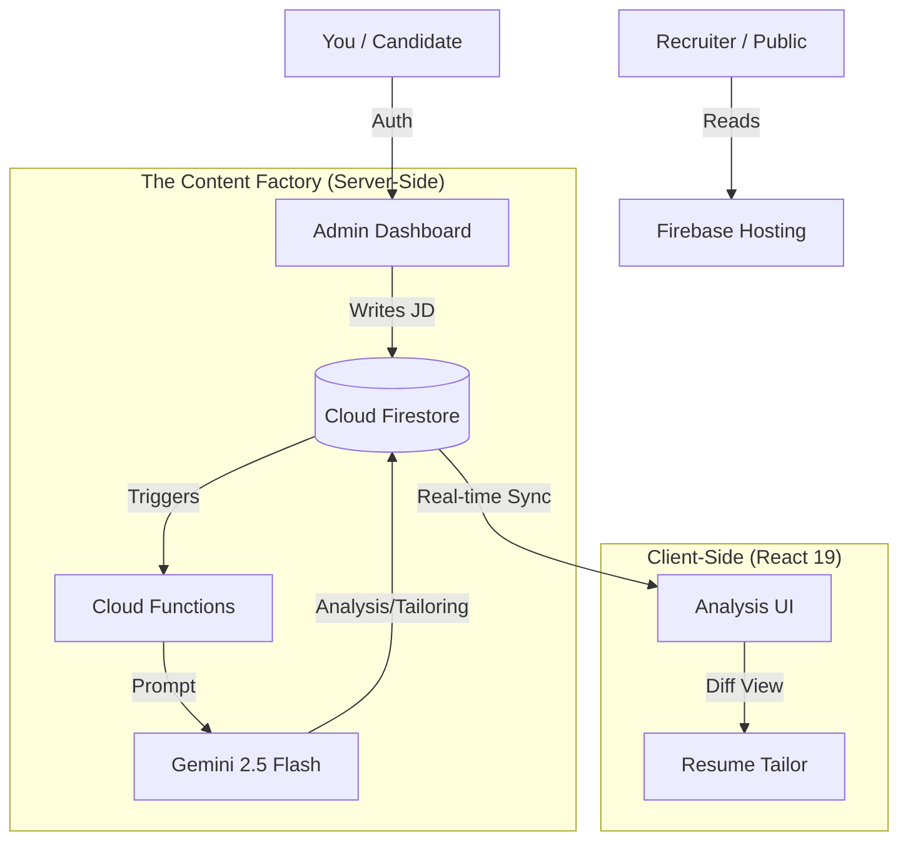

# 🦅 The Job Whisperer

> **The AI Agent that tailored this resume gets the interview.**


**The Job Whisperer** is not just a portfolio—it is a self-curating **Career Management System (CMS)**. It uses Google's Gemini 2.5 Flash to analyze Job Descriptions (JDs), identify gaps, rewrite bullet points, and draft cover letters in real-time.

## 🏗️ System Architecture



## 🚀 Key Features

### 1. 🧠 The Analysis Engine
* **Vector Matching:** Instantly scores your profile against a JD (0-100%).
* **Gap Detection:** Identifies missing keywords (e.g., "Docker", "Kubernetes") and suggests specific projects to highlight.

### 2. 🧵 The Resume Tailor (Diff Engine)
* **Problem:** Generic resumes fail ATS (Applicant Tracking Systems).
* **Solution:** An "Ethical Editor" agent that rewrites your existing bullet points to match the JD's language *without* inventing facts.
* **UI:** Side-by-Side "Diff View" (Red/Green) to review changes before accepting.

### 3. ✍️ The Cover Letter Engine
* **Zero-Shot Generation:** Creates a persuasive, context-aware cover letter in < 5 seconds.
* **PDF Export:** Built-in "White Paper" styling for instant PDF generation.

## 🛠️ Tech Stack & Decisions

| Layer | Technology | Rationale |
| :--- | :--- | :--- |
| **Frontend** | React 19 + Vite | Concurrent rendering for complex dashboards. |
| **Styling** | Tailwind CSS v4 | "Mobile-First" utility classes for speed. |
| **Backend** | Firebase Functions (Gen 2) | Serverless scalability for AI triggers. |
| **Database** | Cloud Firestore | Real-time listeners (`onSnapshot`) for instant UI feedback. |
| **AI Model** | Gemini 2.5 Flash | Low latency (necessary for interactive editing). |

## 👷 Local Development

See [CONTRIBUTING.md](./CONTRIBUTING.md) for setup instructions.

```bash
# Quick Start
npm install
npm run dev
```

## 📜 License
Proprietary. Built by Ryan Douglas.