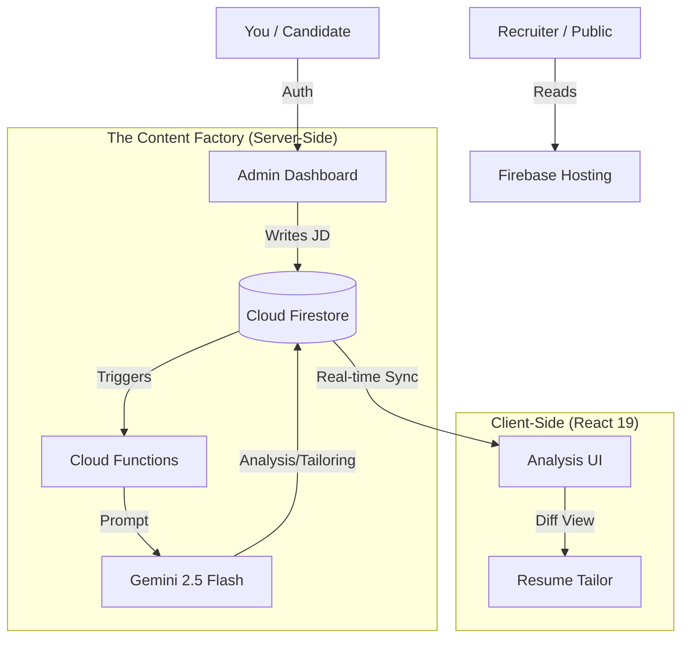

# The Job Whisperer: CODEBASE DUMP
**Date:** Wed Jan 28 23:29:04 UTC 2026
**Description:** Complete codebase context.

## FILE: .firebaserc
```firebaserc
{
  "projects": {
    "default": "ryandouglas-resume"
  }
}

```
---

## FILE: .github/workflows/deploy-preview.yml
```yml
name: Deploy to Preview Channel

on:
  pull_request:
    types: [opened, synchronize, reopened]

# ✅ FIX: Grant permissions to write checks and PR comments
permissions:
  checks: write
  contents: read
  pull-requests: write

jobs:
  build_and_preview:
    if: '${{ github.event.pull_request.head.repo.full_name == github.repository }}'
    runs-on: ubuntu-latest
    steps:
      - uses: actions/checkout@v4

      - name: Setup Node.js (Enable Caching)
        uses: actions/setup-node@v4
        with:
          node-version: "20"
          cache: "npm"
      
      - name: Install Dependencies
        run: npm ci

      # ✅ FIX: Inject VITE_ vars during build
      - name: Build
        run: npm run build
        env:
          VITE_API_KEY: ${{ secrets.VITE_API_KEY }}
          VITE_AUTH_DOMAIN: ${{ secrets.VITE_AUTH_DOMAIN }}
          VITE_PROJECT_ID: ${{ secrets.VITE_PROJECT_ID }}
          VITE_STORAGE_BUCKET: ${{ secrets.VITE_STORAGE_BUCKET }}
          VITE_MESSAGING_SENDER_ID: ${{ secrets.VITE_MESSAGING_SENDER_ID }}
          VITE_APP_ID: ${{ secrets.VITE_APP_ID }}
          VITE_MEASUREMENT_ID: ${{ secrets.VITE_MEASUREMENT_ID }}
          # We don't need the Admin Email for public preview builds usually, 
          # but if you have logic relying on it, you can add it here.

      - name: Deploy to Firebase Preview
        uses: FirebaseExtended/action-hosting-deploy@v0
        with:
          repoToken: '${{ secrets.GITHUB_TOKEN }}'
          firebaseServiceAccount: '${{ secrets.FIREBASE_SERVICE_ACCOUNT }}'
          projectId: '${{ secrets.FIREBASE_PROJECT_ID }}'

```
---

## FILE: .github/workflows/deploy-prod.yml
```yml
name: Deploy to Live Production

on:
  push:
    branches:
      - main

jobs:
  build_and_deploy:
    runs-on: ubuntu-latest
    steps:
      - uses: actions/checkout@v4

      - name: Setup Node.js (Enable Caching)
        uses: actions/setup-node@v4
        with:
          node-version: "20"
          cache: "npm"

      - name: Install Dependencies
        run: npm ci

      # ✅ FIX: Inject VITE_ vars during build
      - name: Build
        run: npm run build
        env:
          VITE_API_KEY: ${{ secrets.VITE_API_KEY }}
          VITE_AUTH_DOMAIN: ${{ secrets.VITE_AUTH_DOMAIN }}
          VITE_PROJECT_ID: ${{ secrets.VITE_PROJECT_ID }}
          VITE_STORAGE_BUCKET: ${{ secrets.VITE_STORAGE_BUCKET }}
          VITE_MESSAGING_SENDER_ID: ${{ secrets.VITE_MESSAGING_SENDER_ID }}
          VITE_APP_ID: ${{ secrets.VITE_APP_ID }}
          VITE_MEASUREMENT_ID: ${{ secrets.VITE_MEASUREMENT_ID }}

      - name: Deploy to Live
        uses: FirebaseExtended/action-hosting-deploy@v0
        with:
          repoToken: '${{ secrets.GITHUB_TOKEN }}'
          firebaseServiceAccount: '${{ secrets.FIREBASE_SERVICE_ACCOUNT }}'
          projectId: '${{ secrets.FIREBASE_PROJECT_ID }}'
          channelId: live

```
---

## FILE: .gitignore
```gitignore
# Dependencies
node_modules
.pnp
.pnp.js

# Testing
coverage

# Production
dist
build

# Environment
.env
.env.local
.env.development.local
.env.test.local
.env.production.local

# IDEs
.vscode/*
!.vscode/extensions.json
.idea
*.swp
.DS_Store

# Logs
npm-debug.log*
yarn-debug.log*
yarn-error.log*
firebase-debug.log*

# Firebase
.firebase
update_docs.py

.env*
update_docs.py

```
---

## FILE: CONTRIBUTING.md
```md
# 👷 Contributing to the Interactive Resume

Welcome to the development guide. This project uses a **Hybrid Cloud** architecture:
* **Frontend:** React 19 + Vite (Local)
* **Backend:** Firebase Cloud Functions (Remote/Serverless)
* **Database:** Cloud Firestore (Remote)

## 1. Getting Started

### Prerequisites
* Node.js v20+
* Firebase CLI (`npm install -g firebase-tools`)
* Java (Required only if running local Emulators)

### Setup
1.  **Clone the repo:**
    ```bash
    git clone [https://github.com/rpdouglas/interactive-resume.git](https://github.com/rpdouglas/interactive-resume.git)
    ```
2.  **Install Dependencies:**
    ```bash
    npm ci
    cd functions && npm ci && cd ..
    ```
3.  **Environment Variables:**
    Create a `.env.local` file in the root. **Do not commit this.**
    ```ini
    VITE_API_KEY=your_firebase_api_key
    VITE_AUTH_DOMAIN=your_project.firebaseapp.com
    VITE_PROJECT_ID=your_project_id
    # ... other firebase config
    ```

## 2. The Development Loop

### A. Frontend Development (UI/UX)
We use Vite for HMR (Hot Module Replacement).
```bash
npm run dev
```
* **Access:** `http://localhost:5173`
* **Auth:** Uses your real Firebase Auth users (Production Data).
* **Data:** Reads from the live Firestore (be careful with writes!).

### B. Backend Development (Cloud Functions)
Functions (Gemini AI triggers) must be deployed to Google Cloud to work reliably with the live database, or run via emulators.

**Option 1: Deploy to Cloud (Easiest)**
```bash
firebase deploy --only functions
```

**Option 2: Local Emulators (Advanced)**
```bash
firebase emulators:start
```

## 3. Branching Strategy
* **`main`**: Production-ready code. Deployed automatically via GitHub Actions.
* **`feature/SprintX.Y`**: Active development.
* **Process:**
    1.  Create Feature Branch.
    2.  Develop & Test (`npm test`).
    3.  Merge to Main -> Triggers Deploy.

## 4. Testing
We use Vitest. Tests **MUST** mock Firebase network calls.
```bash
npm test
```
```
---

## FILE: README.md
```md
# 🦅 The Job Whisperer

> **The AI Agent that tailored this resume gets the interview.**


**The Job Whisperer** is not just a portfolio—it is a self-curating **Career Management System (CMS)**. It uses Google's Gemini 2.5 Flash to analyze Job Descriptions (JDs), identify gaps, rewrite bullet points, and draft cover letters in real-time.

## �� System Architecture



## 🚀 Key Features

### 1. 🧠 The Analysis Engine
* **Vector Matching:** Instantly scores your profile against a JD (0-100%).
* **Gap Detection:** Identifies missing keywords (e.g., "Docker", "Kubernetes") and suggests specific projects to highlight.

### 2. 🧵 The Resume Tailor (Diff Engine)
* **Problem:** Generic resumes fail ATS (Applicant Tracking Systems).
* **Solution:** An "Ethical Editor" agent that rewrites your existing bullet points to match the JD's language *without* inventing facts.
* **UI:** Side-by-Side "Diff View" (Red/Green) to review changes before accepting.

### 3. �� The Cover Letter Engine
* **Zero-Shot Generation:** Creates a persuasive, context-aware cover letter in < 5 seconds.
* **PDF Export:** Built-in "White Paper" styling for instant PDF generation.

## 🛠� Tech Stack & Decisions

| Layer | Technology | Rationale |
| :--- | :--- | :--- |
| **Frontend** | React 19 + Vite | Concurrent rendering for complex dashboards. |
| **Styling** | Tailwind CSS v4 | "Mobile-First" utility classes for speed. |
| **Backend** | Firebase Functions (Gen 2) | Serverless scalability for AI triggers. |
| **Database** | Cloud Firestore | Real-time listeners (`onSnapshot`) for instant UI feedback. |
| **AI Model** | Gemini 2.5 Flash | Low latency (necessary for interactive editing). |

## 👷 Local Development

See [CONTRIBUTING.md](./CONTRIBUTING.md) for setup instructions.

```bash
# Quick Start
npm install
npm run dev
```

## 📜 License
Proprietary. Built by Ryan Douglas.
```
---

## FILE: docs/ADR/001-resume-tailor-strategy.md
```md
# ADR 001: Resume Tailor Data Strategy (Delta Patching)

**Date:** 2026-01-28
**Status:** Accepted
**Context:** Sprint 19.3

## Context
We needed a way to tailor the candidate's resume for specific Job Descriptions (JDs) to increase ATS matching scores.
The "Master Resume" is stored in Firestore (`experience` collection). We faced a choice on how to persist these customizations.

## The Options Considered
1.  **Shadow Resume:** Deep clone the entire resume tree for every application.
    * *Pros:* Complete isolation.
    * *Cons:* Massive data duplication, high storage costs, complex sync if Master changes.
2.  **Ephemeral:** Generate on-the-fly in memory.
    * *Pros:* Zero storage cost.
    * *Cons:* Expensive API costs (re-generating on every page load), poor UX (waiting).
3.  **Delta Patching (Selected):** Store only the specific bullet points that changed.

## Decision
We chose **Option 3: Delta Patching**.
We store an array of `tailored_bullets` inside the `application` document. The UI renders the Master Resume, but "swaps" specific bullets with their tailored versions at runtime (or displays them side-by-side in Diff View).

## Consequences
* **Positive:** Minimal storage footprint. Preserves the "Single Source of Truth" (Master Resume).
* **Negative:** Requires client-side logic to merge/display the diffs.
* **Guardrails:** We explicitly prompt the AI to *not* invent facts, only rephrase existing ones ("The Ethical Editor" protocol).
```
---

## FILE: docs/ADR/002-resume-snapshot-strategy.md
```md
# ADR 002: Resume Versioning Strategy (Snapshots)

**Date:** 2026-01-28
**Status:** Accepted
**Context:** Sprint 19.4

## Context
Candidates need to save the specific version of a resume sent to a company.
The "Master Resume" evolves over time. If we only link to the Master, old applications will display incorrect/new data, breaking the historical record.

## Options Considered
1.  **Runtime Overlay:** Store only Diff IDs. (Rejected: Vulnerable to Master Resume deletion).
2.  **Binary Storage:** Save PDF to Blob Storage. (Rejected: Hard to search/index, heavy infrastructure).
3.  **JSON Snapshot:** Deep copy the rendered JSON to the `application` document. (Selected).

## Decision
We will implement **Option 3: JSON Snapshot**.
When a user clicks "Finalize", we:
1.  Merge the Master Resume + Selected AI Tailored Bullets.
2.  Write the resulting JSON object to a new field `resume_snapshot` in the `applications` collection.
3.  Lock the application (`is_frozen: true`).

## Consequences
* **Immutable History:** We can strictly render *exactly* what the recruiter saw.
* **Printability:** We can generate PDFs on-the-fly from the JSON without storing binary files.
* **Storage:** Slightly increased Firestore document size, but well within the 1MB limit.

```
---

## FILE: docs/ADR/003-async-ai-pipeline.md
```md
# ADR 003: Async AI Pipeline (Trigger Pattern)

**Date:** 2026-01-28 (Backfilled)
**Status:** Accepted
**Context:** Sprint 17 (Application Manager)

## Context
We introduced Generative AI (Gemini) to analyze Job Descriptions.
LLM API calls are slow (5-15 seconds) and non-deterministic. Keeping the client waiting on a synchronous HTTP connection (`await fetch`) resulted in timeouts.

## Decision
We adopted the **Firestore Trigger Pattern**.
1.  **Write:** UI creates a document in `applications` with `ai_status: 'pending'`.
2.  **Trigger:** Cloud Function `onDocumentWritten` detects the change.
3.  **Process:** Server calls Gemini API.
4.  **Update:** Server updates document with `ai_status: 'complete'`.
5.  **Listen:** UI uses `onSnapshot` to reactively display the result.
```
---

## FILE: docs/ADR/004-hybrid-data-strategy.md
```md
# ADR 004: Hybrid Data Strategy (Indestructible Fallback)

**Date:** 2026-01-28 (Backfilled)
**Status:** Accepted
**Context:** Sprint 16 (The Backbone)

## Context
Relying solely on Firestore introduced risks: Quota limits, Offline scenarios, or Misconfigured Security Rules could cause a "White Screen of Death".

## Decision
We implemented the **"Indestructible Fallback"** pattern.
Our data hooks (`useResumeData`) wrap Firestore calls in a `try/catch` block. If *any* error occurs, we immediately return the static data located in `src/data/*.json`.
```
---

## FILE: docs/ADR/005-deep-fetch-pattern.md
```md
# ADR 005: Deep Fetch (Recursive Hydration)

**Date:** 2026-01-28 (Backfilled)
**Status:** Accepted
**Context:** Sprint 16 (The Backbone)

## Context
Firestore queries are **shallow**. Fetching a `Job` document does *not* fetch its `Projects` sub-collection.

## Decision
We chose **Recursive Client-Side Joining**.
Our data fetcher retrieves the parent collection (`experience`), maps over the results, and triggers a `Promise.all` to fetch the `projects` sub-collection for each job.
```
---

## FILE: docs/ADR/006-security-perimeter.md
```md
# ADR 006: Security Perimeter (Email Whitelist)

**Date:** 2026-01-28 (Backfilled)
**Status:** Accepted
**Context:** Sprint 2 (Project Setup)

## Context
We needed to secure the Admin CMS without building a complex multi-tenant User Management system.

## Decision
We implemented a **Hard Perimeter** using Email Whitelisting.
1.  **Frontend:** `AuthContext` checks `user.email` against `VITE_ADMIN_EMAIL`.
2.  **Backend:** `firestore.rules` enforces write access only if `request.auth.token.email` matches the admin email.
```
---

## FILE: docs/AI_WORKFLOW.md
```md
# 🤖 AI Development Framework

**Version:** 2.1
**Purpose:** Standard Operating Procedure for AI-Assisted Development.

---

## 1. The Product Manager ("The Vision")
* **Trigger:** User has a raw idea or vague requirement.
* **Goal:** Clarify the "What" and "Why". Map requirements to User Personas (The Skimmer, The Candidate).
* **Action:** Analyze the `PROMPT_FEATURE_REQUEST.md` input.
* **Output:** A structured Feature Request with clear constraints.

## 2. The Architect ("The Strategy")
* **Trigger:** A defined Feature Request.
* **Goal:** Determine the "How". Analyze Security, Performance, and Data Integrity.
* **Action:** Propose **3 Distinct Implementation Options** (e.g., Client-Heavy vs. Server-Secure).
* **Output:** A decision table recommending the best path. **Wait for user approval.**

## 3. The Builder ("The Execution")
* **Trigger:** User uses `PROMPT_APPROVAL.md` (Decision Made).
* **Goal:** Implement the approved option with zero regressions.
* **Action:** Generate "One-Shot" installation scripts (Bash/Python) to create files and install dependencies.
* **Constraint:** strictly adhere to `docs/CONTEXT_DUMP.md` (Stack rules, React 19 patterns).
* **Output:** `install_feature.sh` or specific file writes.

## 4. The QA Engineer ("The Skeptic")
* **Trigger:** Code is written but not verified.
* **Goal:** Prove it works (Happy Path) and prove it fails gracefully (Edge Cases).
* **Action:** Use `docs/PROMPT_TESTING.md` to generate Vitest specifications.
* **Constraint:** **Environment Mocking** is mandatory. Never hit live Firebase in tests.
* **Output:** `src/__tests__/FeatureName.test.jsx`.

## 5. The Maintainer ("The Scribe")
* **Trigger:** Feature passed tests and is live.
* **Goal:** Ensure documentation reflects reality.
* **Action:** Use `docs/PROMPT_POST_FEATURE.md` to audit the repo.
* **Output:** Updates to `PROJECT_STATUS`, `CHANGELOG`, `DEPLOYMENT`, and `CONTEXT_DUMP`.

## 6. The Security Auditor ("The Gatekeeper")
* **Trigger:** Any changes to `/admin`, Authentication logic, or Environment Variables.
* **Goal:** Ensure "Least Privilege" and prevent leakage.
* **Action:** Review `firestore.rules`, `firebase.json` headers, and `.env` handling.
* **Output:** Security patches (e.g., `unsafe-none` for Google Auth) and Rule updates.

---

## 🔄 The Feedback Loop
1.  **Product** defines.
2.  **Architect** plans.
3.  **Builder** codes.
4.  **QA** breaks it.
5.  **Security** locks it.
6.  **Maintainer** records it.

```
---

## FILE: docs/AUDIT_REPORT.md
```md
# � Documentation Audit Report
**Date:** 2026-01-28
**Version:** 3.2.0-beta
**Auditor:** Automated Maintainer Script (Sprint 19.3)

## 📊 Scorecard: B

### ✅ Strengths
1.  **Docs-as-Code:** Documentation is treated with the same rigor as source code (versioned, automated updates).
2.  **Schema Clarity:** `SCHEMA_ARCHITECTURE.md` accurately reflects the NoSQL data graph.
3.  **Process Definition:** `PROMPT_*.md` files provide excellent reproducibility for AI agents.

### ⚠� Gaps (Opportunities)
1.  **Architecture Decisions:** We lack a dedicated `ADR` (Architecture Decision Record) log. The decision to use "Delta Patching" vs "Shadow Resumes" is buried in chat history, not docs.
2.  **Onboarding:** No `CONTRIBUTING.md` exists for new developers setting up the local Firebase emulators.
3.  **Visuals:** `README.md` lacks screenshots of the new "Resume Tailor" UI.

## 🛠� Recommendations
1.  **Create `docs/ADR` directory:** Formalize architectural choices (e.g., `001-resume-tailor-strategy.md`).
2.  **Create `CONTRIBUTING.md`:** document the `npm run dev` vs `firebase deploy` workflow.
3.  **Refactor `DEPLOYMENT.md`:** Split into "Local Development" vs "Production Deployment".


```
---

## FILE: docs/CHANGELOG.md
```md
# 📜 Changelog

All notable changes to the **Fresh Nest / Interactive Resume** platform will be documented in this file.

## [3.2.0-beta] - 2026-01-28
### Added
- **Resume Tailor:** New 'Diff View' UI in Job Tracker for side-by-side text comparison.
- **AI:** `tailorResume` Cloud Function (Gemini 2.5) with "Ethical Editor" guardrails.
- **Data:** `tailored_bullets` schema in Firestore applications collection.

## [v3.1.0-beta] - 2026-01-28
### Added
- **AI:** "Cover Letter Engine" (Cloud Function) using Gemini 2.5 Flash.
- **UI:** Structured "Gap Analysis" rendering (Yellow Warning Cards).
- **Export:** PDF generation via `react-to-print`.
### Changed
- **UX:** Restored "Thinking Brain" animation during analysis.
- **Architecture:** Moved all AI logic to Server-Side Cloud Functions for security.

## [v2.5.0-beta] - 2026-01-27
### Added
- **UI:** Added `AnalysisDashboard` with real-time Firestore listeners (`onSnapshot`) for instant feedback.
- **UX:** Implemented "Inline Transformation" animation using `framer-motion` to smoothly reveal results.
- **Visualization:** Added `ScoreGauge` with color-coded match thresholds (Red/Yellow/Green).

## [v2.3.0-beta] - 2026-01-26
### Added
- **Admin:** New `JobTracker` module for inputting raw job descriptions.
- **Data:** Created `applications` collection in Firestore with "Async Trigger" schema (`ai_status: pending`).
- **Security:** Restricted `applications` to Admin-Write/Read only.
- **Testing:** Added environment-mocked unit tests for Admin components.

## [v2.3.0-beta] - 2026-01-26
### Added
- **Admin:** New `JobTracker` module for inputting raw job descriptions.
- **Data:** Created `applications` collection in Firestore with "Async Trigger" schema (`ai_status: pending`).
- **Security:** Locked down `applications` collection (Strict Admin Write / No Public Read).
- **Testing:** Added environment-mocked unit tests for Admin components.

## [v2.2.0-beta] - 2026-01-25
### Added
- **Data Layer:** Implemented `ResumeContext` and `useResumeData` hook for global state management.
- **Offline-First:** Added robust `try/catch` failover. If Firestore is unreachable (or quotas exceeded), the app seamlessly loads local JSON.
- **UX:** Added `LoadingSkeleton` to prevent layout shifts during asynchronous data fetching.
- **Testing:** Added "Indestructible" integration tests verifying the database fallback logic.

## [v2.1.0-beta] - 2026-01-25
### Added
- **Database:** Initialized Cloud Firestore architecture with `profile`, `experience`, `skills`, and `sectors` collections.
- **Security:** Deployed strict `firestore.rules` (Public Read / Admin Write).
- **CMS:** Added `DataSeeder` utility to migrate local JSON data to the cloud.
- **Backend:** configured `firebase.json` for Cloud Functions and Hosting headers.
### Fixed
- **Build:** Fixed critical "Split-React" bundling issue in `vite.config.js` by forcing a singleton React chunk.
- **Auth:** Relaxed COOP/COEP headers to allow Google OAuth popups to function in production.

## [v2.0.0-alpha] - 2026-01-23
### Added
- **Routing:** Implemented `react-router-dom` to bifurcate the app into Public (`/`) and Admin (`/admin`) zones.
- **Security Perimeter:** Integrated Firebase Authentication with strict Email Whitelisting.
- **Admin UI:** Created the `AdminDashboard` shell and `ProtectedRoute` components.
- **Analytics:** Integrated Firebase Analytics for tracking interactions.

## [v1.5.0] - 2026-01-20
### Changed
- **Visualization:** Stabilized `Recharts` implementation for the Skill Radar.
- **Performance:** Optimized `framer-motion` animations for mobile devices.
- **Print Styles:** Added "White Paper" CSS overrides for clean PDF export (`print:hidden`, high-contrast text).

## [v1.0.0] - 2026-01-15 (Gold Master)
### Released
- **Core Platform:** Initial release of the Static Interactive Resume.
- **Tech Stack:** React 19, Vite, Tailwind CSS v4.
- **Features:**
    - Interactive "PAR" Timeline.
    - Skill Radar Chart.
    - Sector Impact Grid.
    - Responsive "Mobile-First" Design.

```
---

## FILE: docs/CONTEXT_DUMP.md
```md
# The Job Whisperer: Platform Context
**Stack:** React 19 + Vite + Tailwind v4 + Firebase + Gemini 2.5
**Version:** 3.2.0-beta
**Branding:** "The Job Whisperer"

## 🧠 Coding Standards (The Brain)

### 1. Data & State (SSOT)
* **Public View:** `ResumeContext` is the Single Source of Truth.
* **Admin View:** `JobTracker` manages the "Application State" (JD + Analysis).
* **Deep Fetch:** Recursive fetching is mandatory for nested sub-collections (`projects`).

### 2. AI Architecture (Server-Side)
* **Logic:** All AI operations reside in `functions/index.js` to protect API keys.
    * `analyzeApplication`: Vector Analysis & Gap Detection.
    * `generateCoverLetter`: Content Generation (No Header/Footer).
    * `tailorResume`: Ethical Bullet Point Optimization (Diff Engine).

### 3. UI Patterns
* **Optimistic UI:** Always show a Skeleton or Spinner while waiting for Firestore `onSnapshot`.
* **Mobile First:** All CSS must use Tailwind utility classes targeting mobile first (`w-full md:w-1/2`).

## Directory Structure
* `src/components/admin` -> Job Whisperer UI (JobTracker, ResumeTailor).
* `docs/` -> Documentation as Code (ADRs, Changelogs).
```
---

## FILE: docs/DEPLOYMENT.md
```md
# �� Production Deployment & Infrastructure

**Environment:** Firebase Hosting & Cloud Functions (Gen 2)
**CI/CD:** GitHub Actions

## 1. Automated Deployment (CI/CD)
We utilize two primary workflows:

### A. Preview Channels (Pull Requests)
* **Trigger:** Open/Update PR.
* **Action:** Builds the app and deploys to a temporary URL (e.g., `pr-123--ryandouglas-resume.web.app`).
* **Secrets:** Uses `GITHUB_TOKEN` and `FIREBASE_SERVICE_ACCOUNT`.

### B. Production Channel (Merge to Main)
* **Trigger:** Push to `main`.
* **Action:** Deploys to the live URL.
* **Purge:** Clears CDN cache.

## 2. Manual Deployment (CLI)
If CI/CD fails, you can manually deploy from a local terminal.

**Full Deploy:**
```bash
npm run build
firebase deploy
```

**Partial Deploy (Functions Only):**
*Use this when updating AI prompts to avoid rebuilding the frontend.*
```bash
firebase deploy --only functions
```

**Partial Deploy (Rules Only):**
```bash
firebase deploy --only firestore:rules
```

## 3. Infrastructure & Secrets

### Cloud Functions Secrets (Gen 2)
We use Google Cloud Secret Manager. DO NOT put API keys in `.env` files for Functions.

**Setting a Secret:**
```bash
firebase functions:secrets:set GOOGLE_API_KEY
```

**Accessing in Code:**
```javascript
const { onCall } = require("firebase-functions/v2/https");
exports.myFunc = onCall({ secrets: ["GOOGLE_API_KEY"] }, (req) => { ... });
```

### Security Headers
To support Google Identity Services and potential SharedArrayBuffer usage, `firebase.json` enforces:
* `Cross-Origin-Opener-Policy: unsafe-none`
* `Cross-Origin-Embedder-Policy: unsafe-none`

## 4. Database Security
* **Rules:** Defined in `firestore.rules`.
* **Policy:** Public Read (Resume Data) / Admin Write Only.
* **Lockdown:** `applications` collection is strictly Admin Read/Write.
```
---

## FILE: docs/PERSONAS.md
```md
# 👥 Persona-Based Development Model

Our development strategy is guided by specific user archetypes. Features must pass the "Persona Check" before implementation.

---

## � External Audiences (The Public View)
*Goal: Conversion (Booking an Interview)*

### 1. "The Skimmer" (Technical Recruiter)
* **Goal:** Match keywords to a Job Description in < 10 seconds.
* **Behavior:** Opens link, scans for "Power BI", "React", "15 Years", then leaves.
* **UX Constraint:** **The "Above the Fold" Dashboard.**
    * *Rule:* Key metrics must be visible immediately without scrolling.
    * *Rule:* Zero layout shift. No spinners for critical text.

### 2. "The Narrator" (Hiring Manager / Director)
* **Goal:** Understand the *context* of your career. "Why did he move from Dev to Consulting?"
* **Behavior:** Scrolls down. Reads the bullet points. Looks for business impact.
* **UX Constraint:** **The PAR Timeline.**
    * *Rule:* Experience must be framed as Problem/Action/Result.
    * *Rule:* "Click to expand" interaction to keep the initial view clean.

### 3. "The Skeptic" (Lead Developer / CTO)
* **Goal:** Verify technical competence. "Is this a template or did he build it?"
* **Behavior:** Inspects Element. Looks at the source code. Tests the interactivity.
* **UX Constraint:** **The "Live" Matrix.**
    * *Rule:* Clicking "React" should filter the entire timeline. This proves state management expertise.
    * *Rule:* Code must be clean, typed, and commented (in case they check the repo).

---

## � Internal Actors (The Admin View)
*Goal: Productivity & Strategy*

### 4. "The Candidate" (The Super Admin - You)
* **Goal:** Manage the job hunt campaign with high velocity and high quality.
* **Pain Point:** Repetitive data entry. rewriting cover letters. losing track of applications.
* **Behavior:** Pastes a JD into the system, expects an instant analysis and tailored assets.
* **UX Constraint:** **Zero Friction Input.**
    * *Rule:* If it takes more than 2 clicks to generate a Cover Letter, the feature has failed.
    * *Rule:* Data Seeding must be idempotent (running it twice shouldn't break things).

### 5. "The Staff Engineer" (The AI Agent)
* **Role:** Gemini 3.0 Integration.
* **Goal:** Act as a strategic career coach and copywriter.
* **Behavior:** Analyzes the gap between *Stored Experience* (Firestore) and *Target Job* (Input).
* **Constraint:** **Hallucination Control.**
    * *Rule:* The AI must strictly cite actual projects from the database. It cannot invent experience.

---

## 📱 Hardware Contexts

### 6. "The Mobile User" (LinkedIn Traffic)
* **Context:** 60% of traffic will come from the LinkedIn mobile app browser.
* **Constraint:** **Thumb-Friendly UI.**
    * *Rule:* Charts must be readable vertically (Adaptive Density).
    * *Rule:* No hover-only tooltips (must be click/tap accessible).

```
---

## FILE: docs/PROJECT_STATUS.md
```md
# 🟢 Project Status: The Job Whisperer

> 🗺� **Strategy:** See [docs/ROADMAP.md](./ROADMAP.md) for the long-term vision.

**Current Phase:** Phase 20 - The Strategist
**Version:** v3.2.0-beta
**Status:** 🟢 Stable / Feature Complete (Sprint 19)

## � Current Objectives
* [x] **Sprint 19.1:** The Cover Letter Engine.
* [x] **Sprint 19.2:** The Outreach Bot (Merged into Tailor).
* [x] **Sprint 19.3:** The Resume Tailor (Diff Engine).
* [ ] **Sprint 19.4:** The Version Controller (Snapshot & Print).
* [ ] **Sprint 20.1:** Application Kanban Board (Upcoming).

## 🛑 Known Issues
* Mobile layout for "Diff View" needs optimization on screens < 375px.
* Rate limiting for Gemini API is currently manual.

## ✅ Completed Roadmap
* **Phase 19 (The Content Factory):** [x] Complete suite of Generative AI tools.
* **Phase 17 (Application Manager):** [x] Job Input & Vector Analysis.
* **Phase 16 (Backbone):** [x] Firestore Migration.
* **v1.0.0:** [x] Static Resume Platform.
```
---

## FILE: docs/PROMPT_APPROVAL.md
```md
# ✅ AI Approval & Execution Prompt (Builder Mode v2.1)

**Instructions:**
Use this prompt **after** the AI has presented the 3 Architectural Options.

---

### **Prompt Template**

**Decision:** I approve **Option [INSERT OPTION NUMBER]: [INSERT OPTION NAME]**. Proceed with implementation.

**Strict Technical Constraints (The "Builder" Standard):**
1.  **Execution First:** Output a single **Bash Script** (`install_feature.sh`) that:
    * Creates/Updates all necessary files.
    * Installs dependencies.
    * Uses `cat << 'EOF'` patterns.
2.  **Data Strategy (The "Backbone" Check):**
    * **Deep Fetching:** Remember that Firestore queries are *shallow*. If fetching a document with sub-collections, you MUST explicitly fetch the sub-collection and merge it.
    * **Failover Logic:** Wrap all critical fetches in `try/catch`. If the DB fails, return Local JSON.
3.  **Environment Awareness:**
    * **Secrets:** Never hardcode keys. Use `import.meta.env.VITE_VAR`.
    * **Codespaces:** Assume the dev server headers are relaxed (`unsafe-none`).
4.  **UI Resilience:**
    * **Textareas:** Always enforce `overflow-y-auto` and `resize-none` to prevent Mobile Safari scroll trapping on large inputs.


**Persona Validation:**
* **The Skimmer:** Is data visible immediately? (Use Skeletons).
* **The Mobile User:** Will this overflow on 320px?

**Output Requirements:**
1.  **The "One-Shot" Installer:** A single bash script block.
2.  **Manual Verification Steps:** Specific steps to verify the feature (e.g., "Disconnect Internet to test fallback").

*Please generate the installation script now.*

```
---

## FILE: docs/PROMPT_FEATURE_REQUEST.md
```md
# � AI Feature Request Prompt (Architect Mode v2.0)

**Instructions:**
1.  Copy your current codebase context.
2.  Fill in the feature details in the bracketed sections `[ ... ]`.
3.  Send the *entire* text below to the AI.

---

### **Prompt Template**

**Role:** You are the Senior Lead Developer & UI Architect for my Interactive Resume (React 19 + Firebase).
**Task:** Analyze the requirements for a new feature and propose architectural solutions.

**Feature Request:** [INSERT FEATURE NAME]

**Context:**
I need to add a module that [DESCRIBE FUNCTION].
*Current State:* [Briefly describe relevant existing code.]

**Core Requirements:**

1.  **👥 The Persona Check (Select Relevant):**
    * **The Candidate (Admin):** Maximize velocity. Is input zero-friction? Is the UI dense and data-rich?
    * **The Staff Engineer (AI):** Is the prompt engineering robust? Are we hallucinating data?
    * **The Mobile User (Public):** Touch targets 44px+? No horizontal scrolling on 320px?
    * **The Skimmer (Public):** Value delivered in < 5 seconds?

2.  **Constraints & Tech Strategy:**
    * * **Data Strategy Checklist:**
            * Does this feature require a new Cloud Function trigger?
    * **Data Source:** **Firestore is the SSOT.**
        * *Read:* Use `useResumeData` (Client) or `admin.firestore()` (Server).
        * *Write:* **Strictly prohibited** in public components. Admin components must use `DataSeeder` patterns or specific Admin Hooks.
    * **Security:** Does this require a change to `firestore.rules`?
    * **State:** Prefer React 19 `Suspense` and URL-based state over complex `useEffect` chains.
    * **Styling:** Tailwind v4 (Mobile-First).

**🛑 STOP & THINK: Architectural Options**
Do **NOT** write code yet. Analyze the request and propose **3 Distinct Approaches**:

1.  **The "Client-Heavy" Approach:** fast UI, relies on client-side SDK. Good for real-time interactivity.
2.  **The "Server-Secure" Approach:** Offloads logic to Cloud Functions. Mandatory for AI/LLM operations and sensitive data writes.
3.  **The "Balanced/Hybrid" Approach:** Optimistic UI updates with background server validation.

**Your Output Deliverable:**
1.  **Analysis:** A brief breakdown of the UX and Security challenges.
2.  **The Options Table:** Compare approaches based on:
    * *Security Risk*
    * *Latency/Performance*
    * *Maintenance Cost*
3.  **Recommendation:** Select one approach and explain *why* it fits our "Secure Productivity" philosophy.
4.  **Wait:** End your response by asking for approval to proceed.

---

**Codebase Context:**
[PASTE_CODEBASE_HERE]

```
---

## FILE: docs/PROMPT_INITIALIZATION.md
```md
# 🤖 AI Session Initialization Prompt (v3.0)

**Role:** You are the **Senior Lead Developer & System Architect** for "The Job Whisperer" (v3.2.0).
**System:** React 19 + Vite + Tailwind v4 + Firebase (Firestore/Auth/Functions) + Gemini 2.5 Flash.

**Your Operational Framework (`docs/AI_WORKFLOW.md`):**
You must fluidly switch between these modes as needed:
1.  **The Architect:** Design secure, scalable patterns (ADRs).
2.  **The Builder:** Write complete, production-ready code (No placeholders).
3.  **The Maintainer:** Update documentation (`CHANGELOG`, `PROJECT_STATUS`) after every feature.
V
**Critical Directives (The "Anti-Drift" Protocols):**
1.  **Ground Truth:** Do NOT assume file paths. If unsure, ask me to run `ls -R src`.
2.  **Complete Deliverables:** Always provide full file contents or complete bash scripts. Never output partial code blocks ("... rest of code").
3.  **Security First:** `firestore.rules` are "Admin Write / Public Read". `applications` collection is "Admin Only".
4.  **Data Integrity:** Use `structuredClone` for snapshots. Firestore is the Single Source of Truth (SSOT).

**Initialization Sequence:**
To begin our session and prevent context drift, please perform the following **Deep Dive Review**:
1.  **Request:** Ask me to paste the current full codebase dump.
2.  **Analyze:** Perform a detailed review of `docs/` (Roadmap, Status, ADRs) and `src/` structure.
3.  **Report:** Output a **"System Health Check"** summarizing:
    * *Current Phase & Sprint* (from PROJECT_STATUS).
    * *Key Architectural Patterns* (from ADRs).
    * *Discrepancies:* Any mismatch between the Docs and the Code.

**Reply ONLY with:** "🚀 System Architect Ready. Please paste the full codebase context to begin the Deep Dive Analysis."
```
---

## FILE: docs/PROMPT_POST_FEATURE.md
```md
# � AI Documentation Audit Prompt (The Maintainer v2.4)

**Instructions:**
Use this prompt **IMMEDIATELY AFTER** a feature is successfully deployed and verified.

---

### **Prompt Template**

**Role:** You are the Lead Technical Writer and Open Source Maintainer.
**Task:** Perform a comprehensive documentation synchronization AND a "Best Practices" audit of the documentation architecture.

**Trigger:** We have just completed: **[INSERT FEATURE NAME]**.

**The "Preservation Protocol" (CRITICAL RULES):**
1.  **Never Truncate History:** When updating logs or status files, preserve all previous entries. Use `read()` + `append/insert` logic.
2.  **No Placeholders:** Output full, compilable files only.
3.  **Holistic Scan:** You must evaluate **ALL** files in `/docs` to ensure the "Big Picture" stays consistent.

**Your Goal:** Generate a **Python Script** (`update_docs_audit.py`) that performs the following:

### Part 1: Feature Synchronization
1.  **`docs/PROJECT_STATUS.md`**: Mark feature as `[x] Completed`. Update Phase/Version. **Keep** the "Completed Roadmap".
2.  **`docs/CHANGELOG.md`**: Insert a new Version Header and Entry at the top. **Keep** all older versions.
3.  **`package.json`**: Update the version number.
4.  **`docs/SCHEMA_ARCHITECTURE.md`**: Update schemas if data structures changed.
5.  **`docs/CONTEXT_DUMP.md`**: Update stack details or new Cloud Functions.

### Part 2: The "Docs as Code" Audit (Best Practices)
*Compare our current documentation structure against industry best practices (e.g., Diátaxis framework).*
6.  **Create/Update `docs/AUDIT_REPORT.md`**:
    * **Structural Review:** Do we have clear separation between "How-to", "Reference", and "Explanation"?
    * **Missing Artifacts:** Are we missing standard files (e.g., `CONTRIBUTING.md`, `ADR` records)?
    * **Score:** Give the documentation a grade (A-F) and 3 specific recommendations for improvement.

### Part 3: Process Refinement (Continuous Improvement)
*Did we encounter recurring errors or discover new best practices during this sprint?*
7.  **`docs/PROMPT_FEATURE_REQUEST.md`**: Update constraints if new requirements emerged.
8.  **`docs/PROMPT_TESTING.md`**: Update constraints if new testing patterns were required.

**Output Requirement:**
* Provide a single, robust **Python Script**.
* The script must handle UTF-8 encoding.
* The script must explicitly reconstruct file content to ensure no data loss.

**Wait:** Ask me for the feature name and **"Were there any specific errors we fixed that should be added to the process constraints?"**

```
---

## FILE: docs/PROMPT_TESTING.md
```md
# 🧪 AI Testing Prompt (The QA Engineer v2.1)

**Instructions:**
Use this prompt **AFTER** a feature is built but **BEFORE** it is marked as "Done".

---

### **Prompt Template**

**Role:** You are the Senior SDET (Software Development Engineer in Test).
**Task:** Write a robust Unit Test for the provided component using Vitest.

**Input:**
* Component Code: [PASTE CODE]
* Data Context: [PASTE JSON SNIPPET]

**Constraints & Best Practices:**
1.  **Execution First:** Output a single **Bash Script** (`install_tests.sh`) that:
    * Creates the directory `src/__tests__` (or component specific folder).
    * Uses `cat << 'JSX' > path/to/test.test.jsx` to write the file.
2.  **Environment Mocking (CRITICAL):**
    * The Firebase SDK will crash instantly if `VITE_API_KEY` is undefined.
    * **Rule:** Use `vi.stubEnv` or mock `firebase/auth` and `firebase/firestore` modules entirely.
    * **Mocking Libraries:**
        * `react-to-print`: Mock `useReactToPrint` to return a void function.
        * `framer-motion`: Replace with standard HTML tags to avoid animation delays in JSDOM.
3.  **Testing Strategy:**
    * **Happy Path:** Does it render data correctly?
    * **Integration:** When testing Tabbed Interfaces (like JobTracker), verify tab switching logic explicitly.
    * **Interactive:** Click buttons and verify handlers are called.
    * **Defensive:** Ensure it handles `null` or `undefined` props without crashing.

**Output Requirements:**
* A single `install_tests.sh` script block.
* Do not output raw JSX outside the script.

**Wait:** Ask me to paste the Component Code to begin.

```
---

## FILE: docs/ROADMAP.md
```md
# 🗺� Product Strategy & Roadmap

**Vision:** Transform the platform from a static portfolio into an AI-powered Career Management System (CMS).
**Status:** Active Development
**Last Updated:** 2026-01-28

---

## � Phase 19: The Content Factory (Current Focus)
*Goal: Stop writing boilerplate. Let the AI generate high-quality tailored documents.*

* **Sprint 19.1: The Cover Letter Engine**
    * **Feature:** One-click PDF generation based on Resume + JD.
    * **Tech:** Gemini Prompting + `react-to-print` / `jspdf`.
* **Sprint 19.2: The Outreach Bot**
    * **Feature:** Generate cold-outreach messages (LinkedIn/Email) tailored to the Hiring Manager.
    * **Tech:** Clipboard API + Tone analysis.
* **Sprint 19.3: The Resume Tailor**
    * **Feature:** AI suggestions for rewriting specific bullet points to match JD keywords.
* **Sprint 19.4: The Version Controller (Snapshot Engine)**
    * **Feature:** "Freeze" a specific tailored resume version into an immutable record.
    * **Feature:** Dedicated Print Preview route for generating clean PDFs from Snapshots.
    * **Tech:** Firestore (JSON Storage) + Print CSS.

---

## ♟� Phase 20: The Strategist (Workflow)
*Goal: Manage the campaign lifecycle and win the interview.*

* **Sprint 20.1: The Application Kanban**
    * **Feature:** Drag-and-drop board to track status (Applied, Interview, Offer).
    * **Tech:** `dnd-kit`.
* **Sprint 20.2: The Interview Simulator**
    * **Feature:** AI acts as the interviewer, asking technical questions based on the JD.
    * **Tech:** Browser Speech API.

---

## 🛡� Phase 21: Fortress & Foundation (Security)
*Goal: Lock down the application before public release.*

* **Sprint 21.1: The Identity Shield**
    * **Objective:** Server-Side Auth Blocking (Fix IAM Permissions).
* **Sprint 21.2: The Data Lockdown**
    * **Objective:** Strict `firestore.rules`.
* **Sprint 21.3: Cost Governor**
    * **Objective:** API Rate Limiting.


```
---

## FILE: docs/SCHEMA_ARCHITECTURE.md
```md
# 🗄� Schema Architecture & Data Graph

**Storage Engine:** Cloud Firestore (NoSQL)
**Pattern:** Collection-Centric with Sub-Collections.

## 1. High-Level Topology
```mermaid
graph TD
    root[🔥 Firestore Root]
    
    %% Top Level Collections
    root --> profile[📂 profile]
    root --> skills[📂 skills]
    root --> sectors[📂 sectors]
    root --> experience[📂 experience]
    
    %% Relationships
    experience --> job[📄 Job Document]
    job --> projects[📂 projects (Sub-Collection)]
    projects --> project[📄 Project Document]
```

## 2. The "Deep Fetch" Strategy (CRITICAL)
**Firestore queries are shallow.** Fetching a Job document **DOES NOT** automatically fetch its `projects` sub-collection.

### The Client-Side Join Pattern
Any component displaying Experience (e.g., `ResumeContext`) **MUST** implement this recursive logic:
1.  Fetch all `experience` documents.
2.  Map over the results.
3.  For *each* job, perform a second `getDocs` call to its `projects` sub-collection.
4.  Merge the `projects` array into the parent job object.
5.  Return the hydrated tree.

**� BAD (Will Result in Empty Projects):**
```javascript
const jobs = await getDocs(collection(db, 'experience'));
return jobs.docs.map(d => d.data());
```

**✅ GOOD (Hydrated):**
```javascript
const jobs = await Promise.all(snapshot.docs.map(async (doc) => {
  const projects = await getDocs(collection(doc.ref, 'projects'));
  return { ...doc.data(), projects: projects.docs.map(p => p.data()) };
}));
```

## 3. The "Indestructible" Fallback
We implement a **Hybrid Data Strategy**:
1.  **Attempt:** Fetch from Firestore.
2.  **Catch:** If *any* error occurs (Quota, Offline, Rules), swallow the error and return `src/data/*.json`.
3.  **Result:** The app never crashes, even if the database is down.

## 4. Application Schema (Phase 19)
The `applications` collection is the core of the Content Factory.
* **Document ID:** Auto-generated.
* **Fields:**
    * `company` (string)
    * `role` (string)
    * `raw_text` (string) - Original JD.
    * `ai_status` (string) - 'pending' | 'processing' | 'complete' | 'error'
    * `match_score` (number)
    * `gap_analysis` (array<string>) - Structured list of missing skills.
    * `cover_letter_status` (string) - 'idle' | 'pending' | 'writing' | 'complete'
    * `cover_letter_text` (string) - Markdown/Text content.


### Application Schema (`applications/{id}`)
* `tailor_status`: 'idle' | 'pending' | 'processing' | 'complete' | 'error'
* `tailored_bullets`: Array of Objects
    * `original`: String
    * `optimized`: String
    * `reasoning`: String
    * `confidence`: Number (0-100)

```
---

## FILE: docs/SECURITY_MODEL.md
```md

# ⚠� DEV MODE ACTIVE (SKELETON KEY)
**Current Status:** Authentication is bypassed. Database Rules are `allow read, write: if true`.
**Do NOT deploy to Production without reverting `AuthContext` and `firestore.rules`.**

# 🛡� Security Model & Access Control

**Auth Provider:** Firebase Authentication (Google OAuth)
**Strategy:** Zero Trust Client / Strict Server-Side Rules

## 1. Authentication Layer
### The Whitelist Gate
* **Location:** Client-Side (`src/context/AuthContext.jsx`) & Server-Side (`firestore.rules`).
* **Mechanism:**
  1. User signs in via Google.
  2. App checks `user.email` against `import.meta.env.VITE_ADMIN_EMAIL`.
  3. If no match, the user is signed out immediately or redirected to Public View.

## 2. Authorization (Firestore Rules)
We utilize a **"Public Read / Admin Write"** policy.

| Collection | Read Permission | Write Permission |
| :--- | :--- | :--- |
| `profile` | � Public | � Auth Only |
| `skills` | � Public | � Auth Only |
| `experience` | � Public | � Auth Only |
| `projects` | � Public | � Auth Only |
| `applications` | ⛔ None | � Admin Only |

**Current Rule Implementation:**
```javascript
allow read: if true;
allow write: if request.auth != null; // Relies on UI Whitelisting for now
```
> ⚠� **Note:** In Phase 17, we will upgrade the Write rule to strictly check `request.auth.token.email == 'YOUR_EMAIL'` for backend-level enforcement.

## 3. API Key Exposure Strategy
It is standard practice to expose the `VITE_API_KEY` in the frontend bundle. This key **does not** grant administrative access. It simply identifies the Firebase project.

**Defense in Depth:**
1. **Security Rules:** Prevent unauthorized writes even if someone steals the API Key.
2. **App Check:** (Planned Phase 18) Verify traffic comes from your specific domain.
3. **Cloud Functions:** Sensitive AI logic (Gemini) runs on the server, keeping the LLM API Key strictly hidden from the browser.

## 4. Header Security (COOP/COEP)
To support high-performance `SharedArrayBuffer` (potential future use) and Google Identity Services, we enforce:
* `Cross-Origin-Opener-Policy: same-origin-allow-popups`
* `Cross-Origin-Embedder-Policy: unsafe-none`

```
---

## FILE: eslint.config.js
```js
import js from '@eslint/js'
import globals from 'globals'
import reactHooks from 'eslint-plugin-react-hooks'
import reactRefresh from 'eslint-plugin-react-refresh'
import { defineConfig, globalIgnores } from 'eslint/config'

export default defineConfig([
  globalIgnores(['dist']),
  {
    files: ['**/*.{js,jsx}'],
    extends: [
      js.configs.recommended,
      reactHooks.configs.flat.recommended,
      reactRefresh.configs.vite,
    ],
    languageOptions: {
      ecmaVersion: 2020,
      globals: globals.browser,
      parserOptions: {
        ecmaVersion: 'latest',
        ecmaFeatures: { jsx: true },
        sourceType: 'module',
      },
    },
    rules: {
      'no-unused-vars': ['error', { varsIgnorePattern: '^[A-Z_]' }],
    },
  },
])

```
---

## FILE: firebase.json
```json
{
  "functions": [
    {
      "source": "functions",
      "codebase": "default",
      "ignore": [
        "node_modules",
        ".git",
        "firebase-debug.log",
        "firebase-debug.*.log",
        "*.local"
      ]
    }
  ],
  "hosting": {
    "public": "dist",
    "ignore": [
      "firebase.json",
      "**/.*",
      "**/node_modules/**"
    ],
    "headers": [
      {
        "source": "**",
        "headers": [
          {
            "key": "Cross-Origin-Opener-Policy",
            "value": "unsafe-none"
          },
          {
            "key": "Cross-Origin-Embedder-Policy",
            "value": "unsafe-none"
          }
        ]
      }
    ],
    "rewrites": [
      {
        "source": "**",
        "destination": "/index.html"
      }
    ]
  },
  "firestore": {
    "rules": "firestore.rules",
    "indexes": "firestore.indexes.json"
  }
}

```
---

## FILE: firestore.indexes.json
```json
{}

```
---

## FILE: firestore.rules
```rules
rules_version = '2';
service cloud.firestore {
  match /databases/{database}/documents {
    match /{document=**} {
      allow read, write: if true;
    }
  }
}

```
---

## FILE: fix_tailwind_v4.sh
```sh
#!/bin/bash

# ==========================================
# 🔧 Fix: Migrate to Tailwind CSS v4
# ==========================================

echo "Step 1: Installing Tailwind v4 Vite Plugin..."
npm install @tailwindcss/vite

echo "Step 2: updating vite.config.js..."
cat << 'EOF' > vite.config.js
import { defineConfig } from 'vite'
import react from '@vitejs/plugin-react'
import tailwindcss from '@tailwindcss/vite'

// https://vite.dev/config/
export default defineConfig({
  plugins: [
    react(),
    tailwindcss(),
  ],
})
EOF

echo "Step 3: Migrating CSS to v4 Syntax (CSS-First Config)..."
# In v4, we use @import "tailwindcss" and define theme variables directly in CSS
cat << 'EOF' > src/index.css
@import "tailwindcss";

@theme {
  /* Migrate custom colors from tailwind.config.js */
  --color-brand-dark: #0f172a;  /* Slate 900 */
  --color-brand-accent: #3b82f6; /* Blue 500 */
  --color-brand-light: #f8fafc; /* Slate 50 */
  
  /* Migrate font family */
  --font-sans: "Inter", system-ui, sans-serif;
}

/* Apply base styles using the new variables.
   Note: In v4, we use the variables we just defined in the theme.
*/
body {
  background-color: var(--color-brand-light);
  color: var(--color-brand-dark);
  font-family: var(--font-sans);
  -webkit-font-smoothing: antialiased;
}

/* Custom Scrollbar */
::-webkit-scrollbar {
  width: 8px;
}
::-webkit-scrollbar-track {
  background: transparent;
}
::-webkit-scrollbar-thumb {
  background: #cbd5e1;
  border-radius: 4px;
}
::-webkit-scrollbar-thumb:hover {
  background: #94a3b8;
}
EOF

echo "Step 4: Cleaning up legacy config..."
rm tailwind.config.js
# If a postcss config was auto-generated, remove it too
if [ -f postcss.config.js ]; then
    rm postcss.config.js
fi

echo "=========================================="
echo "✅ Tailwind v4 Configuration Fixed!"
echo "👉 Restart your server: 'npm run dev'"
echo "=========================================="
```
---

## FILE: fix_workflows.sh
```sh
#!/bin/bash

# ==========================================
# 🚑 Fix: GitHub Action Repository Name
# ==========================================
# Description: Corrects the capitalization of 'FirebaseExtended' in workflow files.

echo "Patching .github/workflows/deploy-preview.yml..."
# Use sed to replace lowercase 'firebase-extended' with 'FirebaseExtended'
# We use a backup extension (.bak) just in case, then remove it for cleanliness
sed -i.bak 's/firebase-extended\/action-hosting-deploy/FirebaseExtended\/action-hosting-deploy/g' .github/workflows/deploy-preview.yml
rm .github/workflows/deploy-preview.yml.bak

echo "Patching .github/workflows/deploy-prod.yml..."
sed -i.bak 's/firebase-extended\/action-hosting-deploy/FirebaseExtended\/action-hosting-deploy/g' .github/workflows/deploy-prod.yml
rm .github/workflows/deploy-prod.yml.bak

echo "=========================================="
echo "✅ Workflows Patched!"
echo "=========================================="
echo "👉 Now run these commands to retry the build:"
echo ""
echo "   git add .github/workflows"
echo "   git commit -m 'fix: Correct casing for Firebase GitHub Action'"
echo "   git push"
```
---

## FILE: functions/.eslintrc.json
```json
{
  "root": true,
  "env": {
    "es2022": true,
    "node": true,
    "commonjs": true
  },
  "extends": [
    "eslint:recommended"
  ],
  "parserOptions": {
    "ecmaVersion": 2022
  },
  "rules": {
    "no-console": "off",
    "no-unused-vars": ["warn"]
  }
}

```
---

## FILE: functions/check_models.js
```js
const { GoogleGenerativeAI } = require("@google/generative-ai");

async function listModels() {
  const key = process.env.GEMINI_API_KEY;
  if (!key) {
    console.error("� Error: GEMINI_API_KEY environment variable is missing.");
    process.exit(1);
  }

  try {
    const genAI = new GoogleGenerativeAI(key);
    // Note: The SDK doesn't always expose listModels directly on the client 
    // depending on version, so we fallback to the raw REST endpoint if needed,
    // but let's try a direct fetch which is 100% reliable for debugging.
    
    console.log("📡 Querying Google AI API for available models...");
    
    const response = await fetch(
      `https://generativelanguage.googleapis.com/v1beta/models?key=${key}`
    );
    
    if (!response.ok) {
      throw new Error(`HTTP Error: ${response.status} ${response.statusText}`);
    }

    const data = await response.json();
    
    console.log("\n✅ AVAILABLE MODELS FOR YOUR KEY:");
    console.log("===================================");
    
    const models = data.models || [];
    const generateModels = models.filter(m => m.supportedGenerationMethods.includes("generateContent"));
    
    generateModels.forEach(m => {
      console.log(`🔹 ${m.name.replace('models/', '')}`);
      // console.log(`   Description: ${m.description.substring(0, 60)}...`);
    });
    
    console.log("===================================");

  } catch (error) {
    console.error("🔥 Failed to list models:", error.message);
  }
}

listModels();

```
---

## FILE: functions/index.js
```js
/**
 * 🧠 The Fresh Nest Backend Brain
 * Includes:
 * 1. architectProject: Callable (Gemini 3.0)
 * 2. analyzeApplication: Trigger (Gemini 2.5)
 * 3. generateCoverLetter: Trigger (Gemini 2.5) - No Header Mode
 * 4. tailorResume: Trigger (Gemini 2.5) - NEW!
 */

const { onCall, HttpsError } = require("firebase-functions/v2/https");
const { onDocumentWritten } = require("firebase-functions/v2/firestore");
const { initializeApp } = require("firebase-admin/app");
const { getFirestore } = require("firebase-admin/firestore");
const { GoogleGenerativeAI } = require("@google/generative-ai");

initializeApp();
const db = getFirestore();

// --- HELPERS ---
async function getResumeContext() {
  const profileSnap = await db.doc('profile/primary').get();
  const profile = profileSnap.data();
  const skillsSnap = await db.collection('skills').get();
  const skills = skillsSnap.docs.map(d => d.data());
  const expSnap = await db.collection('experience').get();
  const experience = await Promise.all(expSnap.docs.map(async (doc) => {
    const jobData = doc.data();
    const projectsSnap = await doc.ref.collection('projects').get();
    const projects = projectsSnap.docs.map(p => ({ id: p.id, ...p.data() }));
    return { ...jobData, projects };
  }));
  return { profile, skills, experience };
}

// --- 1. ARCHITECT ---
const ARCHITECT_SYSTEM_PROMPT = "You are a Resume Architect. Convert raw notes to JSON. NO Markdown.";
exports.architectProject = onCall({ 
  cors: true, 
  secrets: ["GOOGLE_API_KEY"],
  timeoutSeconds: 60,
  maxInstances: 10
}, async (request) => {
  if (!request.auth) throw new HttpsError("unauthenticated", "Login required.");
  const apiKey = process.env.GOOGLE_API_KEY;
  const genAI = new GoogleGenerativeAI(apiKey);
  const model = genAI.getGenerativeModel({ model: "gemini-2.5-flash", generationConfig: { responseMimeType: "application/json" }});
  const result = await model.generateContent([ARCHITECT_SYSTEM_PROMPT, request.data.rawText]);
  return { data: JSON.parse(result.response.text()) }; 
});

// --- 2. ANALYZE ---
exports.analyzeApplication = onDocumentWritten(
  { document: "applications/{docId}", secrets: ["GOOGLE_API_KEY"] }, 
  async (event) => {
    const snapshot = event.data;
    if (!snapshot) return;
    const newData = snapshot.after.data();
    if (newData.ai_status !== 'pending') return;

    await snapshot.after.ref.update({ ai_status: 'processing' });
    const apiKey = process.env.GOOGLE_API_KEY;
    const genAI = new GoogleGenerativeAI(apiKey);
    const resumeContext = await getResumeContext();
    
    const model = genAI.getGenerativeModel({ model: "gemini-2.5-flash", generationConfig: { responseMimeType: "application/json" }});

    const prompt = `Analyze this JD against Resume.
    RESUME: ${JSON.stringify(resumeContext)}
    JD: ${newData.company} - ${newData.role} \n ${newData.raw_text}
    
    RETURN JSON: 
    { 
      "match_score": number (0-100), 
      "keywords_missing": string[], 
      "suggested_projects": string[] (List of 3 relevant project IDs from Resume context),
      "tailored_summary": string, 
      "gap_analysis": string[] (A list of specific, distinct gaps. Do not number them.)
    }`;

    try {
      const result = await model.generateContent(prompt);
      const analysis = JSON.parse(result.response.text());
      await snapshot.after.ref.update({ ...analysis, ai_status: 'complete' });
    } catch (e) {
      await snapshot.after.ref.update({ ai_status: 'error', error_log: e.message });
    }
  }
);

// --- 3. COVER LETTER ---
exports.generateCoverLetter = onDocumentWritten(
  { document: "applications/{docId}", secrets: ["GOOGLE_API_KEY"] },
  async (event) => {
    const snapshot = event.data;
    if (!snapshot) return;
    const newData = snapshot.after.data();
    const oldData = snapshot.before.data();
    
    if (newData.cover_letter_status !== 'pending') return;
    if (oldData && oldData.cover_letter_status === 'pending') return;

    await snapshot.after.ref.update({ cover_letter_status: 'writing' });
    try {
      const apiKey = process.env.GOOGLE_API_KEY;
      const genAI = new GoogleGenerativeAI(apiKey);
      const resumeContext = await getResumeContext();
      const model = genAI.getGenerativeModel({ model: "gemini-2.5-flash" });
      
      const systemPrompt = `
        You are Ryan Douglas. Write a persuasive cover letter for the role of ${newData.role} at ${newData.company}.
        STRICT FORMATTING RULES:
        1. DO NOT include a header block (Name, Address, Phone).
        2. DO NOT include the date or recipient address.
        3. START DIRECTLY with the Salutation.
        CONTEXT: ${JSON.stringify(resumeContext)}
        JOB DESCRIPTION: ${newData.raw_text}
      `;
      
      const result = await model.generateContent(systemPrompt);
      await snapshot.after.ref.update({ cover_letter_text: result.response.text(), cover_letter_status: 'complete' });
    } catch (error) {
      await snapshot.after.ref.update({ cover_letter_status: 'error', error_log: error.message });
    }
  }
);

// --- 4. RESUME TAILOR (NEW) ---
exports.tailorResume = onDocumentWritten(
  { document: "applications/{docId}", secrets: ["GOOGLE_API_KEY"] },
  async (event) => {
    const snapshot = event.data;
    if (!snapshot) return;
    const newData = snapshot.after.data();
    const oldData = snapshot.before.data();

    // Trigger only when tailor_status flips to 'pending'
    if (newData.tailor_status !== 'pending') return;
    if (oldData && oldData.tailor_status === 'pending') return;

    console.log(`🧵 Tailoring Resume for: ${newData.company}`);
    await snapshot.after.ref.update({ tailor_status: 'processing' });

    try {
      const apiKey = process.env.GOOGLE_API_KEY;
      const genAI = new GoogleGenerativeAI(apiKey);
      const resumeContext = await getResumeContext();

      // Use JSON Mode for strict schema
      const model = genAI.getGenerativeModel({ 
        model: "gemini-2.5-flash",
        generationConfig: { responseMimeType: "application/json" }
      });

      const systemPrompt = `
        You are an Ethical Resume Editor and ATS Specialist.
        YOUR TASK: Optimize the Candidate's existing bullet points to match the Job Description (JD).
        
        STRICT GUARDRAILS:
        1. You MUST NOT invent new experiences, companies, or metrics.
        2. You MAY optimize phrasing (Passive -> Active), inject JD keywords, or emphasize specific technologies ALREADY present in the data.
        3. Identify the top 5-7 most relevant bullet points from the "Experience" or "Projects" that can be improved.
        
        RESUME CONTEXT:
        ${JSON.stringify(resumeContext)}

        JOB DESCRIPTION:
        ${newData.raw_text}

        OUTPUT FORMAT:
        Return a JSON Array of objects with this schema:
        [
          {
            "original": "The exact original text from the resume",
            "optimized": "The rewritten version with keywords",
            "reasoning": "Brief explanation of what changed (e.g. 'Added [React] keyword')",
            "confidence": number (0-100)
          }
        ]
      `;

      const result = await model.generateContent(systemPrompt);
      const suggestions = JSON.parse(result.response.text());

      await snapshot.after.ref.update({ 
        tailored_bullets: suggestions,
        tailor_status: 'complete',
        updated_at: new Date()
      });
      console.log("✅ Resume Tailoring Complete.");

    } catch (error) {
      console.error("🔥 Tailoring Failed:", error);
      await snapshot.after.ref.update({ 
        tailor_status: 'error', 
        error_log: error.message 
      });
    }
  }
);

```
---

## FILE: functions/package.json
```json
{
  "name": "functions",
  "description": "Cloud Functions for Firebase",
  "scripts": {
    "serve": "firebase serve --only functions",
    "shell": "firebase functions:shell",
    "start": "npm run shell",
    "deploy": "firebase deploy --only functions",
    "logs": "firebase functions:log"
  },
  "engines": {
    "node": "20"
  },
  "dependencies": {
    "@google/generative-ai": "^0.21.0",
    "firebase-admin": "^12.7.0",
    "firebase-functions": "^7.0.4"
  },
  "private": true
}

```
---

## FILE: index.html
```html
<!doctype html>
<html lang="en">
  <head>
    <meta charset="UTF-8" />
    <link rel="icon" type="image/svg+xml" href="/vite.svg" />
    <meta name="viewport" content="width=device-width, initial-scale=1.0" />
    
    <title>The Job Whisperer | Ryan Douglas</title>
    <meta name="description" content="The Job Whisperer: AI-Powered Career Management System. Bridging the gap between Strategy and Execution." />
    <meta name="author" content="Ryan Douglas" />
    <meta name="theme-color" content="#0f172a" />

    <meta property="og:type" content="website" />
    <meta property="og:title" content="The Job Whisperer | AI Resume Platform" />
    <meta property="og:description" content="AI-driven resume tailoring and job analysis engine." />
    
    <link rel="preconnect" href="[https://fonts.googleapis.com](https://fonts.googleapis.com)" />
    <link rel="preconnect" href="[https://fonts.gstatic.com](https://fonts.gstatic.com)" crossorigin />
  </head>
  <body class="bg-slate-50 text-slate-900 antialiased">
    <div id="root"></div>
    <script type="module" src="/src/main.jsx"></script>
  </body>
</html>
```
---

## FILE: install_sprint_17_3.sh
```sh
#!/bin/bash

# ==========================================
# 🚀 SPRINT 17.3: ANALYSIS DASHBOARD (UI)
# ==========================================

echo "� Installing Analysis Dashboard & Real-time Logic..."

# 1. Create the Visual Dashboard Component
# ----------------------------------------
echo "� Creating src/components/admin/AnalysisDashboard.jsx..."
cat << 'JSX' > src/components/admin/AnalysisDashboard.jsx
import React, { useState } from 'react';
import { motion, AnimatePresence } from 'framer-motion';
import { Copy, Check, ChevronDown, ChevronUp, AlertCircle, RefreshCw } from 'lucide-react';
import clsx from 'clsx';

/**
 * 📊 Circular Gauge Component
 * Visualizes the 0-100 match score with color coding.
 */
const ScoreGauge = ({ score }) => {
  const radius = 30;
  const circumference = 2 * Math.PI * radius;
  const offset = circumference - (score / 100) * circumference;
  
  // Color Logic: <60 Red, 60-79 Yellow, 80+ Green
  const color = score >= 80 ? '#10b981' : score >= 60 ? '#f59e0b' : '#ef4444';

  return (
    <div className="relative flex items-center justify-center">
      <svg width="80" height="80" className="transform -rotate-90">
        <circle cx="40" cy="40" r={radius} stroke="#e2e8f0" strokeWidth="8" fill="transparent" />
        <motion.circle 
          initial={{ strokeDashoffset: circumference }}
          animate={{ strokeDashoffset: offset }}
          transition={{ duration: 1.5, ease: "easeOut" }}
          cx="40" cy="40" r={radius} 
          stroke={color} 
          strokeWidth="8" 
          fill="transparent" 
          strokeDasharray={circumference} 
          strokeLinecap="round"
        />
      </svg>
      <div className="absolute flex flex-col items-center">
        <span className="text-xl font-bold text-slate-800">{score}%</span>
        <span className="text-[8px] uppercase font-bold text-slate-400">Match</span>
      </div>
    </div>
  );
};

const AnalysisDashboard = ({ data, onReset }) => {
  const [copied, setCopied] = useState(false);
  const [showGapAnalysis, setShowGapAnalysis] = useState(false);

  const handleCopy = () => {
    navigator.clipboard.writeText(data.tailored_summary);
    setCopied(true);
    setTimeout(() => setCopied(false), 2000);
  };

  // Safe Defaults (Defensive Rendering)
  const missingKeywords = data.keywords_missing || [];
  const suggestedProjects = data.suggested_projects || [];

  return (
    <motion.div 
      layout
      initial={{ opacity: 0, y: 20 }}
      animate={{ opacity: 1, y: 0 }}
      className="bg-slate-50 rounded-2xl border border-slate-200 overflow-hidden flex flex-col h-full"
    >
      {/* � Header: Score & Quick Stats */}
      <div className="bg-white p-6 border-b border-slate-100 flex items-center gap-6">
        <ScoreGauge score={data.match_score || 0} />
        <div className="flex-1">
          <h3 className="text-lg font-bold text-slate-800">Strategy Report</h3>
          <p className="text-sm text-slate-500">
            {data.match_score >= 80 ? "🚀 High Fit. Apply immediately." : "⚠� Gaps detected. Tailoring required."}
          </p>
        </div>
      </div>

      <div className="flex-1 overflow-y-auto p-6 space-y-6">
        
        {/* 🧩 Missing Keywords */}
        {missingKeywords.length > 0 && (
          <div className="space-y-2">
            <label className="text-xs font-bold text-slate-400 uppercase tracking-widest flex items-center gap-2">
              <AlertCircle size={12} className="text-red-500" /> Critical Gaps
            </label>
            <div className="flex flex-wrap gap-2">
              {missingKeywords.map((kw, i) => (
                <span key={i} className="px-3 py-1 bg-red-50 text-red-600 border border-red-100 rounded-full text-xs font-medium">
                  {kw}
                </span>
              ))}
            </div>
          </div>
        )}

        {/* � Tailored Summary */}
        <div className="space-y-2">
          <div className="flex justify-between items-center">
            <label className="text-xs font-bold text-slate-400 uppercase tracking-widest">Tailored Executive Summary</label>
            <button 
              onClick={handleCopy} 
              className="text-xs text-blue-600 hover:text-blue-700 flex items-center gap-1 font-medium transition-colors"
            >
              {copied ? <Check size={12} /> : <Copy size={12} />}
              {copied ? "Copied!" : "Copy Text"}
            </button>
          </div>
          <div className="p-4 bg-white rounded-xl border border-slate-200 text-sm text-slate-700 leading-relaxed shadow-sm">
            {data.tailored_summary || "Summary generation failed."}
          </div>
        </div>

        {/* 📂 Relevant Projects */}
        <div className="space-y-2">
          <label className="text-xs font-bold text-slate-400 uppercase tracking-widest">Suggested Evidence</label>
          <div className="grid grid-cols-1 gap-2">
            {suggestedProjects.map((projId, i) => (
              <div key={i} className="px-3 py-2 bg-blue-50/50 border border-blue-100 rounded-lg text-xs text-blue-800 font-mono">
                {projId}
              </div>
            ))}
          </div>
        </div>

        {/* 🧠 Gap Analysis (Expandable) */}
        <div className="pt-2">
          <button 
            onClick={() => setShowGapAnalysis(!showGapAnalysis)}
            className="w-full flex items-center justify-between p-3 bg-slate-100 hover:bg-slate-200 rounded-lg transition-colors text-xs font-bold text-slate-600"
          >
            <span>VIEW STRATEGIC GAP ANALYSIS</span>
            {showGapAnalysis ? <ChevronUp size={14} /> : <ChevronDown size={14} />}
          </button>
          <AnimatePresence>
            {showGapAnalysis && (
              <motion.div 
                initial={{ height: 0, opacity: 0 }}
                animate={{ height: 'auto', opacity: 1 }}
                exit={{ height: 0, opacity: 0 }}
                className="overflow-hidden"
              >
                <div className="p-4 mt-2 bg-slate-100 rounded-lg text-xs text-slate-600 leading-relaxed">
                  {data.gap_analysis || "No detailed analysis provided."}
                </div>
              </motion.div>
            )}
          </AnimatePresence>
        </div>
      </div>

      {/* 🔄 Footer Action */}
      <div className="p-4 bg-white border-t border-slate-100">
        <button 
          onClick={onReset}
          className="w-full py-3 bg-slate-900 text-white rounded-xl font-bold flex items-center justify-center gap-2 hover:bg-slate-800 transition-colors"
        >
          <RefreshCw size={16} /> Start New Application
        </button>
      </div>
    </motion.div>
  );
};

export default AnalysisDashboard;
JSX

# 2. Refactor JobTracker to include the Listener Logic
# ----------------------------------------------------
echo "♻� Refactoring src/components/admin/JobTracker.jsx..."
cat << 'JSX' > src/components/admin/JobTracker.jsx
import React, { useState, useEffect } from 'react';
import { db } from '../../lib/db';
import { collection, addDoc, serverTimestamp, onSnapshot, doc } from 'firebase/firestore';
import { Briefcase, FileText, Save, Loader2 } from 'lucide-react';
import { motion, AnimatePresence } from 'framer-motion';
import AnalysisDashboard from './AnalysisDashboard';

const JobTracker = () => {
  const [formData, setFormData] = useState({
    company: '',
    role: '',
    raw_text: '',
    source_url: ''
  });
  
  // State Machine: 'idle' | 'saving' | 'analyzing' | 'complete'
  const [viewState, setViewState] = useState('idle');
  const [activeDocId, setActiveDocId] = useState(null);
  const [analysisResult, setAnalysisResult] = useState(null);
  const [errorMsg, setErrorMsg] = useState('');

  // 👂 Real-time Listener for the Active Document
  useEffect(() => {
    if (!activeDocId) return;

    console.log(`👂 Listening for updates on: ${activeDocId}`);
    
    const unsubscribe = onSnapshot(doc(db, "applications", activeDocId), (docSnap) => {
      if (docSnap.exists()) {
        const data = docSnap.data();
        console.log("🔥 Firestore Update:", data.ai_status);

        if (data.ai_status === 'processing') {
          setViewState('analyzing');
        } 
        else if (data.ai_status === 'complete') {
          setAnalysisResult(data);
          setViewState('complete');
        }
        else if (data.ai_status === 'error') {
          setErrorMsg(data.error_log || "Unknown AI Error");
          setViewState('idle'); // Allow retry
        }
      }
    });

    return () => unsubscribe();
  }, [activeDocId]);

  const handleChange = (e) => {
    const { name, value } = e.target;
    setFormData(prev => ({ ...prev, [name]: value }));
  };

  const handleSubmit = async (e) => {
    e.preventDefault();
    setViewState('saving');
    setErrorMsg('');

    try {
      // 1. Write Initial Document
      const payload = {
        ...formData,
        status: 'draft',
        ai_status: 'pending', // âš¡ Trigger the Cloud Function
        created_at: serverTimestamp(),
        updated_at: serverTimestamp()
      };

      const docRef = await addDoc(collection(db, "applications"), payload);
      
      // 2. Set Active ID to trigger Listener
      setActiveDocId(docRef.id);
      
      // 3. UI waits for Listener to flip state to 'analyzing' -> 'complete'

    } catch (err) {
      console.error("Submission Error:", err);
      setErrorMsg(err.message);
      setViewState('idle');
    }
  };

  const handleReset = () => {
    setFormData({ company: '', role: '', raw_text: '', source_url: '' });
    setViewState('idle');
    setActiveDocId(null);
    setAnalysisResult(null);
  };

  return (
    <div className="max-w-4xl mx-auto h-full flex flex-col relative">
      <AnimatePresence mode="wait">
        
        {/* 1�⃣ STATE: FORM INPUT (Idle / Saving) */}
        {(viewState === 'idle' || viewState === 'saving') && (
          <motion.div 
            key="form"
            initial={{ opacity: 0, x: -20 }}
            animate={{ opacity: 1, x: 0 }}
            exit={{ opacity: 0, x: -20 }}
            className="bg-white rounded-2xl border border-slate-100 shadow-sm flex-1 flex flex-col overflow-hidden"
          >
            {/* Header */}
            <div className="p-6 border-b border-slate-100 bg-slate-50/50">
              <h2 className="text-xl font-bold text-slate-800 flex items-center gap-2">
                <Briefcase className="text-blue-600" size={24} />
                New Application
              </h2>
              <p className="text-sm text-slate-500 mt-1">
                Paste a Job Description to initialize the AI analysis pipeline.
              </p>
            </div>

            {/* Form */}
            <form onSubmit={handleSubmit} className="flex-1 overflow-y-auto p-6 space-y-6">
              <div className="grid grid-cols-1 md:grid-cols-2 gap-6">
                <div className="space-y-2">
                  <label className="text-xs font-bold uppercase text-slate-500 tracking-wider">Company Name</label>
                  <input type="text" name="company" required value={formData.company} onChange={handleChange} placeholder="e.g. Acme Corp" className="w-full p-3 rounded-lg bg-slate-50 border border-slate-200 focus:ring-2 focus:ring-blue-500 outline-none transition-all" />
                </div>
                <div className="space-y-2">
                  <label className="text-xs font-bold uppercase text-slate-500 tracking-wider">Role Title</label>
                  <input type="text" name="role" required value={formData.role} onChange={handleChange} placeholder="e.g. Senior React Developer" className="w-full p-3 rounded-lg bg-slate-50 border border-slate-200 focus:ring-2 focus:ring-blue-500 outline-none transition-all" />
                </div>
              </div>
              <div className="space-y-2 flex-1 flex flex-col">
                <label className="text-xs font-bold uppercase text-slate-500 tracking-wider flex justify-between">
                  <span>Job Description (Raw Text)</span>
                </label>
                <div className="relative flex-1">
                  <textarea name="raw_text" required value={formData.raw_text} onChange={handleChange} placeholder="Paste the full job description here..." className="w-full h-64 md:h-96 p-4 rounded-xl bg-slate-50 border border-slate-200 focus:ring-2 focus:ring-blue-500 outline-none resize-none font-mono text-sm leading-relaxed" />
                  <div className="absolute right-4 top-4 text-slate-300 pointer-events-none"><FileText size={20} /></div>
                </div>
              </div>
            </form>

            {/* Footer */}
            <div className="p-4 border-t border-slate-100 bg-white sticky bottom-0 z-10 flex items-center justify-between">
              <div className="text-sm font-medium text-red-500">{errorMsg}</div>
              <button onClick={handleSubmit} disabled={viewState === 'saving' || !formData.company || !formData.raw_text} className="px-6 py-3 bg-blue-600 hover:bg-blue-700 disabled:bg-slate-300 disabled:cursor-not-allowed text-white rounded-xl font-bold shadow-lg shadow-blue-500/20 flex items-center gap-2 transition-all active:scale-95">
                {viewState === 'saving' ? <Loader2 className="animate-spin" size={20} /> : <Save size={20} />}
                {viewState === 'saving' ? 'Initializing...' : 'Analyze Job'}
              </button>
            </div>
          </motion.div>
        )}

        {/* 2�⃣ STATE: ANALYZING (Pulsing Brain) */}
        {viewState === 'analyzing' && (
          <motion.div 
            key="loading"
            initial={{ opacity: 0, scale: 0.9 }}
            animate={{ opacity: 1, scale: 1 }}
            exit={{ opacity: 0, scale: 0.9 }}
            className="flex-1 flex flex-col items-center justify-center bg-white rounded-2xl border border-slate-100 p-8 text-center"
          >
            <div className="relative w-24 h-24 mb-6">
              <div className="absolute inset-0 rounded-full border-4 border-blue-100 animate-ping"></div>
              <div className="absolute inset-0 rounded-full border-4 border-blue-500 border-t-transparent animate-spin"></div>
              <div className="absolute inset-0 flex items-center justify-center text-4xl">🧠</div>
            </div>
            <h3 className="text-xl font-bold text-slate-800">Analyzing Vectors...</h3>
            <p className="text-slate-500 mt-2 max-w-xs mx-auto">
              Comparing your experience against {formData.company}'s requirements.
            </p>
          </motion.div>
        )}

        {/* 3�⃣ STATE: COMPLETE (Dashboard) */}
        {viewState === 'complete' && analysisResult && (
          <motion.div 
            key="results"
            initial={{ opacity: 0, y: 20 }}
            animate={{ opacity: 1, y: 0 }}
            className="flex-1 h-full"
          >
            <AnalysisDashboard data={analysisResult} onReset={handleReset} />
          </motion.div>
        )}

      </AnimatePresence>
    </div>
  );
};

export default JobTracker;
JSX

echo "� Sprint 17.3 UI Installed Successfully."

```
---

## FILE: install_sprint_17_3_tests.sh
```sh
#!/bin/bash

# ==========================================
# 🧪 SPRINT 17.3: TEST SUITE INSTALLER
# ==========================================

echo "🧪 Installing Analysis Dashboard Tests..."

# Ensure directory exists
mkdir -p src/components/admin/__tests__

# Write the Test File
cat << 'JSX' > src/components/admin/__tests__/AnalysisDashboard.test.jsx
import React from 'react';
import { render, screen, fireEvent, waitFor } from '@testing-library/react';
import { describe, it, expect, vi, beforeEach, afterEach } from 'vitest';
import AnalysisDashboard from '../AnalysisDashboard';

// ==========================================
// 1. ENVIRONMENT MOCKING
// ==========================================

// � Mock Framer Motion
// We replace animated components with standard HTML elements to avoid 
// animation delays and JS-based styling issues in JSDOM.
vi.mock('framer-motion', () => ({
  motion: {
    div: ({ children, layout, initial, animate, exit, ...props }) => (
      <div {...props}>{children}</div>
    ),
    circle: ({ children, initial, animate, transition, ...props }) => (
      <circle {...props}>{children}</circle>
    ),
  },
  AnimatePresence: ({ children }) => <>{children}</>,
}));

// 📋 Mock Navigator Clipboard
const mockWriteText = vi.fn();
Object.assign(navigator, {
  clipboard: {
    writeText: mockWriteText,
  },
});

describe('AnalysisDashboard Component', () => {
  const mockOnReset = vi.fn();
  
  const fullMockData = {
    match_score: 85,
    keywords_missing: ['TypeScript', 'Docker', 'AWS'],
    suggested_projects: ['pwc_proj_1'],
    tailored_summary: 'This is a tailored summary for the candidate.',
    gap_analysis: 'You need more cloud experience.'
  };

  beforeEach(() => {
    vi.clearAllMocks();
  });

  // --- TEST CASE 1: HAPPY PATH ---
  it('renders the dashboard with correct data', () => {
    render(<AnalysisDashboard data={fullMockData} onReset={mockOnReset} />);

    // Check Score
    expect(screen.getByText('85%')).toBeDefined();
    
    // Check Summary
    expect(screen.getByText(fullMockData.tailored_summary)).toBeDefined();
    
    // Check Missing Keywords
    expect(screen.getByText('TypeScript')).toBeDefined();
    expect(screen.getByText('Docker')).toBeDefined();
    expect(screen.getByText('AWS')).toBeDefined();
  });

  // --- TEST CASE 2: VISUAL LOGIC (GAUGE COLOR) ---
  it('renders correct gauge color based on score thresholds', () => {
    const { rerender } = render(<AnalysisDashboard data={{ match_score: 85 }} />); // Green (>80)
    let gauge = screen.getByTestId('gauge-circle');
    expect(gauge).toHaveAttribute('stroke', '#10b981');

    rerender(<AnalysisDashboard data={{ match_score: 70 }} />); // Yellow (60-79)
    gauge = screen.getByTestId('gauge-circle');
    expect(gauge).toHaveAttribute('stroke', '#f59e0b');

    rerender(<AnalysisDashboard data={{ match_score: 40 }} />); // Red (<60)
    gauge = screen.getByTestId('gauge-circle');
    expect(gauge).toHaveAttribute('stroke', '#ef4444');
  });

  // --- TEST CASE 3: INTERACTION (COPY) ---
  it('copies summary to clipboard and updates button text temporarily', async () => {
    render(<AnalysisDashboard data={fullMockData} onReset={mockOnReset} />);

    const copyBtn = screen.getByRole('button', { name: /Copy Summary/i });
    
    // Initial state
    expect(screen.getByText(/Copy Text/i)).toBeDefined();

    // Click
    fireEvent.click(copyBtn);

    // Verify Mock Call
    expect(mockWriteText).toHaveBeenCalledWith(fullMockData.tailored_summary);

    // Verify UI Feedback
    expect(await screen.findByText(/Copied!/i)).toBeDefined();
  });

  // --- TEST CASE 4: INTERACTION (EXPAND GAP ANALYSIS) ---
  it('toggles the Gap Analysis section visibility', () => {
    render(<AnalysisDashboard data={fullMockData} onReset={mockOnReset} />);

    // 1. Initially hidden
    expect(screen.queryByText(fullMockData.gap_analysis)).toBeNull();

    // 2. Click Toggle
    const toggleBtn = screen.getByText(/VIEW STRATEGIC GAP ANALYSIS/i);
    fireEvent.click(toggleBtn);

    // 3. Now Visible
    expect(screen.getByText(fullMockData.gap_analysis)).toBeDefined();

    // 4. Click Toggle again
    fireEvent.click(toggleBtn);

    // 5. Hidden again
    expect(screen.queryByText(fullMockData.gap_analysis)).toBeNull();
  });

  // --- TEST CASE 5: DEFENSIVE RENDERING ---
  it('renders gracefully with empty or missing data', () => {
    // Pass empty object to simulate fresh/broken DB record
    render(<AnalysisDashboard data={{}} onReset={mockOnReset} />);

    // Should default to 0%
    expect(screen.getByText('0%')).toBeDefined();
    
    // Should not crash on missing array maps
    const keywords = screen.queryByText('TypeScript');
    expect(keywords).toBeNull();

    // Summary might be empty but shouldn't throw error
    const copyBtn = screen.getByRole('button', { name: /Copy Summary/i });
    expect(copyBtn).toBeDefined();
  });

  // --- TEST CASE 6: RESET ACTION ---
  it('calls onReset when the start over button is clicked', () => {
    render(<AnalysisDashboard data={fullMockData} onReset={mockOnReset} />);
    
    const resetBtn = screen.getByText(/Start New Application/i);
    fireEvent.click(resetBtn);

    expect(mockOnReset).toHaveBeenCalledTimes(1);
  });
});
JSX

echo "✅ Test file created at: src/components/admin/__tests__/AnalysisDashboard.test.jsx"
echo "👉 Run 'npm test' to verify."

```
---

## FILE: package.json
```json
{
  "name": "interactive-resume",
  "private": true,
  "version": "3.2.0",
  "type": "module",
  "scripts": {
    "dev": "vite",
    "build": "vite build",
    "lint": "eslint .",
    "preview": "vite preview",
    "test": "vitest",
    "test:ui": "vitest --ui"
  },
  "dependencies": {
    "@tailwindcss/vite": "^4.1.18",
    "clsx": "^2.1.1",
    "firebase": "^12.8.0",
    "framer-motion": "^12.29.0",
    "lucide-react": "^0.562.0",
    "mermaid": "^11.12.2",
    "react": "^19.2.0",
    "react-dom": "^19.2.0",
    "react-router-dom": "^7.13.0",
    "react-to-print": "^3.2.0",
    "recharts": "^3.7.0",
    "tailwind-merge": "^3.4.0"
  },
  "devDependencies": {
    "@eslint/js": "^9.39.1",
    "@testing-library/dom": "^10.4.1",
    "@testing-library/jest-dom": "^6.9.1",
    "@testing-library/react": "^16.3.2",
    "@types/react": "^19.2.5",
    "@types/react-dom": "^19.2.3",
    "@vitejs/plugin-react": "^5.1.1",
    "autoprefixer": "^10.4.23",
    "eslint": "^9.39.1",
    "eslint-plugin-react-hooks": "^7.0.1",
    "eslint-plugin-react-refresh": "^0.4.24",
    "globals": "^16.5.0",
    "jsdom": "^27.4.0",
    "postcss": "^8.5.6",
    "tailwindcss": "^4.1.18",
    "vite": "^7.2.4",
    "vitest": "^4.0.18"
  }
}
```
---

## FILE: prod_merge.sh
```sh
#!/bin/bash
set -e

# Colors
GREEN='\033[0;32m'
YELLOW='\033[1;33m'
RED='\033[0;31m'
NC='\033[0m'

echo -e "${YELLOW}🚀 Starting Production Merge...${NC}"

# 1. Identify Branch
CURRENT_BRANCH=$(git branch --show-current)

# 2. Guardrail
if [ "$CURRENT_BRANCH" == "main" ]; then
  echo -e "${RED}� ERROR: You are on 'main'. Please run this from the feature branch you wish to merge.${NC}"
  exit 1
fi

# 3. User Verification (The "Human in the Loop")
echo -e "Target Branch: ${GREEN}$CURRENT_BRANCH${NC}"
echo -e "${YELLOW}⚠�  CRITICAL CHECK:${NC} Did you visit the Firebase Preview URL and verify the features?"
read -p "Type 'yes' to confirm merge to Production: " CONFIRM
if [ "$CONFIRM" != "yes" ]; then
    echo -e "${RED}🛑 Merge Aborted. Please verify UAT first.${NC}"
    exit 1
fi

# 4. Merge via GitHub CLI
echo -e "\n${YELLOW}🔀 Merging PR into Main (Squash Strategy)...${NC}"
gh pr merge --squash --delete-branch --admin

# 5. Local Cleanup
echo -e "\n${YELLOW}🧹 Syncing local environment...${NC}"
git checkout main
git pull origin main
git fetch --prune

# 6. Final Status
echo -e "\n${GREEN}✅ Production Deployment Triggered!${NC}"
echo "The 'Deploy to Live' GitHub Action is now running."
echo -e "Monitor it here: https://github.com/rpdouglas/interactive-resume/actions"
```
---

## FILE: public/og-image.png
```png
‰PNG


IHDRävÖ„HísRGBÙÉ,gAMA±�üa cHRMz&€„ú€èu0ê`:˜pœºQ<bKGDÿÿÿ ½§“	pHYsÃÃÇo¨dtIMEêÁÇ‚ IDATxÚìİw|×}ïıÏ™™í‹Eï :‰F€;)VQ½:¶+�,Åqâ<)�ß$7¹¹¯[ronâ¼n�?¾Qb;�»dI¶z¡
EŠ½“ 	’ *I�èm±‹í3Ï‚;²ü{K|½$`fvΙ³Ëı�sæŒ
GãB!„B!„ø¹Ò¤
„B!„B	äB!„B!„r!„B!„BH B!„B!$�!„B!„B¹B!„B!�\!„B!„È…B!„B	äB!„B!„�@.„B!„BH B!„B!~Yjo¥P×ı¥…e½¿}¬ywø„ûPõ¡Pê}Ô½B!„Bˆ_ü@�ˆ�³ÿ©á�öÉyr¢AÖÂM<öØz²fFk‚ıÏş�·NõµfåGPÙÜşåÇY_äæ~9*ߌ…é~÷ßøö®´YeÖğä/á³O<ÈB�>ÿαıG�ã_nG×Õ¬ºÏ¬ÚÂo~~
©JIB!„BˆOZ ×5'‹¦ñ—ó`¨Ù�¼i³Å’-k¹½@'™½æÀIŞÛöß}£�ñ�<î�°ôOÿ‘?ğ9fçŸÈMB§øûÙƒÇ5»à�‚“„Ròù“ϯħÏS)–Il¬ƒø»ŸâÉ�q�>î~|�KÛB!„Bˆ�µ~¹n'¥î>¾x:‘èœùÑVœÖ®6�é&>5J«”IïÙÓœ½Ğƒßš½m$o_º1>¯ƒ_Ê1İy
ìíà¥çŸâÅı—‰[êÖwB!„Bñ	ä(îÖÜÿnsE˜›É=—i=İLW
ääéNºº&™¹ix@cËã°fAn].È4Ëäüşƒ¼üÂ+ì	��ğ-„B!„ȧ#¹ÍEöâ;ø�_)!˜�ÈUt�§OĞÚM1Ùs�–³§ióÏ–fŒÄ²�<ºi1¹é.¹sèF�Wü<Ͻ²ƒãQä–p!„B!„�@>½»'½€e<ÈF#HdF&WJqüD­­­øU„îövZ�Ÿ#0cõ²ğ°Á½÷o`ie^ãzË‚+”ÒĞ´ùÿ¨¤Ôï7sÃëo7}ºJİôX³^ï#	Ï
�ÙÓ?~‘7ö´1²>Ô8¹ºAnT—·V�
uÍïçY~ŞsP·T®ëŸ¿’ùB!„Bˆ_8Ƈ>‚=…‹VóÙÏóއqx®F#£«•ÃgÛ¸§#•�ÎÓoQèWÂ-“Īõ<¸z	¥ÙN°ÌyD'úèl=KûÅ!Æ'BÄ-”†nsâÍÎ¥²º�EùéØuf=êK©Ç�pøØyÂ3Ó±e¡g-bíªe”gÛ°,‹øù=üdw'ѸyM ^°æÓ¬/·ê=ÂëÛΙ“ü4»›ªõ¿Âòœ0=ç�räôÆ'ãä¯z˜�S±Øiøº
GËv¾ş�"
‹~—»ërqêïï™fJ)Ñ»éîíc°o„`$B4n
ÍaÕ’Cù¢ZªËsqk\½­@).7ocÏ©&ã̪GÓYÄÆ;WR’é…±9zœ�Şq¢qÍæ %¯’eM‹)Lµ£(+� ›'Ïp©ÏO8a¢Ù]d—ÔĞ°¤�×y\›‚D„��sœ:ÛÉÀĞ‘„	JÃîñ�•_EmmEiLyŞ›B!„â—&�[:)…4İõ)î~ñÿ°İtM?¶Ìî
ğö™Ú£i;Áit<S»Åâ.Ú¸’Æú
¼ºyM‹G9½÷5^{ïmmí´´÷ÑÚå'1Á¦£gøXXQ@Cu‹*kY{ÿƒl(OÅĞÉQõ(ƒ]GùŞ—ÿ�m6÷ÕÇTşÁ_ñ�ÅM”g˜Ã-üë?<ɾÓ�Ù'aÓùŸ¯<ÀºR�ÈèY¾óÛÿƒ¶ÙUV¶º‰?.Y�¹ë{|ÿõ}ì9ÔÆÙ�Aşâµ»XW‘
Á}ñ†ÛC϶øFÅ"*ÿãCTgxnñ°
•¦y÷6ŞÚq’�ŞËœ¿ÜËÅÎ~zÇ‚�˜É@^à¦$¯ˆ%µÕÔ7-å�ûïgUqÊ•#à?„§¾ñ¯¼Ş<cBE,[¾Â®µU˜­oòÊÖİìŞŒ½§ú± ÇCuu-׬çW¿ôVd›tì~†gß8Èág8Ù2DßxrÓX±¤�
wİÏgåA–æë³Û‚'Ğ×Ì+?}ƒCg:9ÕÒÎÙsÃøã`褗dP]QCıâjÖßû[–-"Ã!¡\!„BñËȱPF•Ywo>ï¼4Šm*‘+]gâØiŞr_"4zÃ~uxÙY×Ȧ5kYœ›¥¾*Ap´�7Ÿ|’{ûÇÚÆ¡Ğè;�éDââÙ.œiÇğîaç¡£œûâñ›`7’qU)
7Îçt€MLš8æÎ'W
›İ�'Ã9ëÇš¦Í˜Ó¯0lNlöÛè�Úw?Å[Ï?ÃÖ1lš†æp¸)Ô
<>–?ÄäTÕ8Ü&�ÿÿTRÈ_?±†¬[¼r* ¿ó?üë—éζ¡©©µÙ•OæÔF‘çÏóÖùóìÚs„saÔoı:+‹lÓõcØœx2fò¸"èsü¥ïмo¯ïíc,J³ãÉJ鋧›ùQG7=ãq>·|ˆŸ|÷-vŸõF¡tO†±0-‡ÒŞ9„rùÈztÅN+9BoÆiy‰ÿçëϲuw+í~Ğ5PÆÔ¾@tt‚æC8vô(»� íş#_ŞRC–[“w·B!„â“ÈÁ²é•Õ¬\'¶?Ã�ĞÔ=½JÃ3ŞÂÛÛ4LKḒŠ
—.cÕŠ…8”5kD4:ÑËÖ¯ÿ%ùÔYz&Íä}ÃÓ¯caZW2b2¤+¥HÇ9ºsCã!”ö|iSɬĞü³Ôß7Âsß}š€?†í#Ê€v—ƒ
�ı*™Û_â{§Ç’�	Ja
ñæ·Ÿdqm¿½"õ–;L,Ó"a)2s³©,)¤ ËӮA"ÎxÿEN�íáR0yzØ?ÄóϼLEU>»�BÛõZ�÷‰×ùǶ#BqP×ÜË­°"~v½ü}Îm�sy(JÜbêºÍê <ĞÆOwfóÊFÔe‚e2y~;_ÿßßå©�ñ'ÀĞ aÙ¨nª¡® #<ȱCçè˜0ÑÍ8İ-Gø§ÿşm*ËÿŒ‡kòpH&B!„B|Ò9XXF>MK—±jí{œØ6@xúw	&#‰Y!-­¨ŒÕ›7Ó˜¥f…qËŠpéİïğOÏŸãÒ¤9;Üé>n`3M¬È]§öòÒ®!,‡šÚ×äüÉc¼ñÒ,©ş}n+úùT iZŒùÃÄãq"�8$€øjÒ´ÍEvå}üv½IÇùï
h$'(gùÁß}ƒŠ¯ı>u·ø*š#ƒÛÿàQ*ëiZºœúò\Rİ6T,DÏ™�|ï›ÿÊw_jgxªÆµ�vkãŞµ«),u\÷¸*`¢p)Ÿÿtéö(]{Şâ'§&¯iT‰hˆyÜ÷ÈgŹÔv’íÛ[¹djÓ×XÓ]{Û9ÿX�ÅY¤DúyûÙ—xã`2ŒX‰ZõF~ïϿ§W”aoá©¿ı¯üé³]˜(¥íyƒ¯?s'ÿìr<vYìM!„BñIä€e‘ZÙÄšå�¼{ä-ZÆ®³�ncQımlY³ğšû ­Éó¼õö1.�Çg‡Şx„å�|‰¯şßŸfmY*VxŒ–�?Eı;~pÖ†gz>z˜÷��䮣�,_�ıs«Ä„ÍÅŠM¹wİbrİ–e’_äBÿÀ#´
›ÃKé†Gø½/œáÔŞÇx¦mj¦€Iç™]|ÿ_
ø“|»bŒë/—oé^Ê–=ÄßSNq¶“Dt’‰	?½#"Ñ81WJJÉ5Î1OV¤aÓÙÛŞÃèè0fYÁu;a‚ù<ñ׿Ív
yöIN>åȾÆyCÍ>‡‡%w>Ÿü‡'Xš§sï+ƒ_ãŸ�%®^;¥ c��‰!S¡·`÷ñVºƒWŠrσ°¹®ŸÓ†eÔrß��ü§çºˆNõMhv�/¼ÃÑßÛÀ]n;º$r!„B!Ä'>�ca9
X¹aõoæܱbólåNÉaõ½÷P“vmMôœæp÷8‰ÙÇ
�–sßgïaY±……r¥Qİ´‘ûo™ìï€Ì«ñ/rúíİôFs~>ÏíÖ]¬Øü0_ùêçÙ¸¨”t×Ô¨¿eNO¯ÿ ¡Üé*`İÃ_äÏ»úø£o_Às¥œ‘	ìøÃËÈğ%ùõ¯I6‹ª½ô_ìäÀ�>†úéî¾Ì¥îsœ¿|‰“Íİtúè†íjcĞú™‡ˆ^oŒÙŒAı*î[_M¶Û@³Ü”®^ÇêØ«´
÷Ì<��AíšMÔØHà ¨´‚ú%Åp \3�?ÎèD”h$Fg{.öŸÙmãt£�œçĞ�}t¹LHÄ	´
Ï©g
sò$ç/™X9 CäB!„Bˆ_‚@�¡éUë¹sÍìn¡gòÚM
×<ħ×cŸ'-‡‡˜•ÇI€¹�Ê64}:gâ°¤gçA¼�™ãÃ!&&C„Â?Ÿ,æÎÎaõݲ¥¡�i‘H|t+|[š�ÔâeÜûk_¢µó¿ñäağLİÓí�äÀ¶£vı“WâôѼôüË<ıâÎ\ˆ¶ä�ìCÃnh×Ö•i&;?®wèD
RI³M½¾åñ‘iY×L¤·Ûl¤øRÑ,@YØl·›d’�õ@øä?jœ��1Fzg¿º+Uñú?ı-¯üm`újC:�\cN7Ä(“ayšB!„â—'�8rÙ¸a)Ù/Ÿ¦g2<'*6=p/•©ú¼A/‹ašsŸnvl†šgëº9ôç52š�–BåÂJ<¦ÅGŸÿ,,ÃEQãZ>õØ£œ9ûö…S‹ÙÙoò�seMĞÙò.ßúÛÿ—oíByÜxrg^�d�ZÖGtîÖu¯È5?¿qX�‰D‰Msnaw¦z Õs“Q20.„B!„ø%ä(<†¡Í›“3ÓRЯ3—Üíõa·Ù�ĞŒŸj@/ãqÌ\¦Ã	“hh�IñJaÓúÔ£ÍÔ<¿·10sÂዤº®a·ÛøYÆê®\Öny€Ç:ÎsñÉıôİbÜ�rrÛ3|ãÍaÜÙWj$¥°„û~˜6­¤¢ÄM÷›OóÏ_Š]CÆǦa*”ãÚoOI¥8˃ÓP7ØWÇ®+™®.„B!„øeä7	Z×
I�¼¤ºq¨q"Ó	WÇæ9ÆÜWš‰Ã­ƒcph€“ÇöAê윙Y9äæä’æ6˜tºH©21G™^ÜK7tN_ 0áÇ´Ü(+ÎÈğ(Ñhâc|™öìî~ğ!ZÛºùşö~æÍö0	Æè8~|éW³©7›»?ó;üç?¼“\İ@×Grj˜Ñ�KY-,RÉÍN'#_AïÕßDFÇXñå¿äk�m¢2×�®_�jo™&ñxŒ„¥c·6ÇGö:!„B!„øYøXE-¯�ÍKÉ°ÏNív¯Îëßø{�Ù×Jo_Îç�ı=ıº�Û9»8ë+©«^Hv�ÜjöèµÍï½ÇËûÓr¾���½<õüz†¢ëe¡ÈnØÌg?}k‹�è·°GÂŒ‹3kc»�#5…݆¡[„{;9{ög?FMÁòPRYFqi3ƒîÈHãà·¾ÆûÖOÙ{æƒcãøı~ÆGǸÜÕÆŞ­?àÉ­gÄì†�!„B!>ŞŒ�ÓÉ(-“Õ÷İÇíÛ›ùæÉØÕGb¡\:ÄøÕOóG“*ņÛ9{12͛ɦ
·³zq¦¥ÈÍÉ¥dQœ�QR…ÇÖÏÿ÷_şŒ'¿MÇğÙpüBŒ¦zh¸ûS<ÑÙIÇÿÙEGøFÃä
]³ãM·%Ÿ�~¥ü£C´ì~“­
Ù4¦Œsô�Ÿòİïï¥ÏîÄşqÉã–EFõJn_]Ï®æ]tNZÓÓíav~ïyóÉ¿cÆ4
°idãÿ~‘/ÊbnB!„Bˆ_¯ª¾º;ùÒş_X"è7gŒn+\n�,'�4;ÌÁ�Á�¿ş[<şÀZ8-,Ó"½¸‚†úeÔ¹ã×ÜãmØ
<NÜ>E|,ş!Qös¬"G)›ùu~ã�l‚7Èã:^_‹VmB‹1½©åğ[Ïó…
¨oºƒ'�¿Lñ’§~Ì*ÀU†O}�ßz Œˆ?NlÆéiº�'eª-\ù“jǦìò�B!„BH ÿÀ'¤ûX|Ç#|õ}�ÿñX1“ı£ÇãDâ³W·L‹H8F°„ÉÜZşüş†¿ø�Y^ê�^¤Íô±öşOñ™-Ø1‰«Ç0	‚ıãL¬â¯ş|i¿8aÎ^°”‡ÿ¯ßáw+ã­ëGrGj�›å�É$Ô%:•ÊuÃ@sù`уüåWçS÷­¤Ğó1»‡Ş²H-_Å#¿û_ùñÿº›:sœ`”`ìÚç»›	“p(JÌ`2a"äB!„Bˆ_?£)ëñXŒàXdNÚV·4­ÛÓ¨^}/yåKØòh+Gvïàí#§9qà<çÇbàuRXZʲe
¬ß¸™
õå�íµÏc–Nfù
�øÏÅÂÏóÜOŞâ�=#3¼”/]Îg?õİÖ@ÑÈV^ziç眯M¿:²ŒE"!6–`æÚî‘xâÃ=ïÚ2a<B0|uÄ?è¸ñˆ½R6òk6ó¥?yŒ#�~›ƒÊvuEñ”	+ùü1Ks‘Wµ�¯ü÷4ª›^äéßá�ÖŞÒ">ıøƒ|î¾{X·4‹¶­­˜¡Á±©N‰DŠÌ«å²’e�Í迉„ nÎ*»……9�¨Npfóæ©#+�Á˜6½7Ä0gm¨‘YÙÈ]�åQ½ésœ=¼�·waï¡N�ŸL®˜á¦º©‚úª6­^Ê¥õdxtyg!„B!>öT8ÿÈ­°Ÿá@k�¤jód�êÒo°Úúl‰X„p(D$�ÀœıT(¥Ğt»Ó…ÛiG»áñ„ƒ&Ã1¦•Ü_Ó°9İxİ´ÈÄMÎW#�`̹fôU)
GJ)�°ˆ˜e	ŒáÏ�V®TÒ¼¶ë?¹Ë²ˆG&Ÿˆ`ÎÙW³¹HKóL¯å¦ÌÁ`�P$�¼J¡ÛœxÜœvMø	†¢³�£t\/·�X`Œ‰PìÚNe#%5‡MGa‘H„ğ�‰_Ûƒ€Í�Fš{ªÿ'f"$3¯-·Óƒ×ë¦æ7N44I(#nZ3®•Bi
M·áp:q9nÖ„B!„âÈ…B!„Bqcò¤f!„B!„B¹B!„B!�\!„B!„È…B!„B	äB!„B!„�@.„B!„BH B!„B!„r!„B!„B¹B!„B!$�!„B!„È…B!„B	äB!„B!„�@.„B!„BH B!„B!„r!„B!„â—3�«ŸÑ¶âçCÍùóñ'˜`4Å´~±ê÷£ºFÒæn|¬�G%úıŒ"ò#„B!®ËøP{[	"ÁQz‡#�4²Ó½8ôùS’2C�Œ*Rr²ÉtÈàüG›p
ëCªâÑIFÇü#	Lsꇚ�;%�ÜTçÇ2ÆiÚß}—]Ú
şô®2\vmªø
ŞGù?X+°,nå%”e�ô34$’¥xRÓÉI±¿¯Pça4˜ì|°¦ÎA·;IK÷‘â0~áº59JÏHˆ¸™¼VJ�Òm¤¦§“ê¶MõZÄ£“L`KM%#Å5oÏ¡2#ŒŒŒ1>Çš®Pš�İå&=Õ‹Û¦ıLÛÄõMpàÕ×Øçiâ?=Tƒ¦¤+R!„B|Ô�ÜŒ2Ò½�¿ù·VœKoã«,§4İ6Ï7g�Ğ`¯>¿“İ—�<ò{¿ÎİùšŒ–dI1ÆøÀ ıQey>lººiGJpô2'N�cÿéN.…läe8�Nâ·êVmâ7וbYÏ!h¥ÚŒ"Zñ(Ãı©ägù°ÿ,N;2Á…¾Q´Ì
¼7Â&“�^í<Ä�Ë1r2‡Ç±
êxh}e©Æ-–3Dëş�üèğ0e™¸,“ñ‘QF•�¥Ëز´‚\�ãê}d]>Æ“Ïœ&––OYŠIÀ?Î… Î’Æeܳ®†B�

“ ÿ/ş`7ù÷ŞÁ=M%8¯i‹
áä¾wøÁq“š^ìzœñá	Æ¢&�´<V5,¢©¦”|Ÿ]ı{µSù”B!„?«@�¥áqÛ½ĞEÛp%ùi98Ôì/ÏÊš ³ı—Æ-ìvcV˜úk?Jéh9Ì›ÕüÁ�^lº~ƒDdnãÍ·�p2šÉºu[¸Ïç$Åk›Œ�›è�t°¬_˜H„œÛ¿‡Î’<�•Š��øÜ•B�_ä½mͤŞñ)ò<Æ�^<ÂpÇ	¶]vrÇ–õÔçØ�wñÊÇy;»�/¯Ê�ºnpãQ}…Ò4ÜEÜ{Ï
òt�ğd�á‹]¼»/ÛÜé|jI>㩹j8\nª×lä¾RE,f¸§�wöb[N.�Öçà4Tr&€¡ß4Ğ*¥H+¯åáÍeøœ™
Gèaï¡]œ¹4Áçî^¯]ÌB!„Ÿ´@>u�L%v“'{XšŸ†Ãc›fâÃtv�âËu3:¨®ûÅz*1ÎP’’gn{ı s³cM÷%0û83_ãÚãYWş�›Õ®î?ÏyİÊTêîkÁµÓ¦	±(13y¬™çtMVŒ�qxÇaNÅóøÔk©Éô`¿&©\{¾·T§s·½ÎôîérÜB™o¥C²,b¡ñ+áynıÌx½[m[³ÏK¡Q‘8>nÜV’=	⣣è¹5”d“î²°<zOĞ61	(£ı?v{íbç¥q£‰ìJw��–A¶Ã@‘Í‚<'Aÿe^9×ϽÕÙxã–®Ó¼íB�š¯]3_[¿Áû`V޸?Gi:._Ù™: (ğÅ8ßÑÁşËuÙï»èN™é餻
ÈLşÌ,-dAª�çŞnfëé�XZ€ÓP·T�ë^Ûy~q³¶uÓ÷ÈõÚä5Ÿ+Üğv‰[mã3%„B!>�Üw.õœ\jo¥Å_Á·
ÛÔ?e¹ØÓÍ©p.›
ıøGƒ³ö�†9uòG;ÇÇ-tg*u+—³®45.µ�î>FK¢‚ûF9pè,]#1,{
KV,aYE®©‘ÆXh�ãû�Ó|)@8º'ƒµ·-¥6Ï7}>$Â^hc×Ñ.zq4‡—Š%�¤_8H›¾€Ûïl$ê‹ox¨“�‡ÏĞ9%¡id—s[c
|Éj9½—×Θ,½³‚ñ}Ç9Ş7‰åÎbİú&j²í‡�°·c”°¥“¿°†
MÉv\­·Xh˜ãû�r¬'@ÔÒpe²qM-et,ÂÁ^¶¿ušôª…©Av6÷01qd²yÓr*Rƒ—Ù·k;;ÛÇ6ğ­áSx}™¬¾k
>5û¼e¿ØÂ{—tšîZI]Vòunôå<1ÙÏÑ#§8qÁO8Ê°QTYͪ%•äNİfnšÙúbfe+}—Ù~ ›Á�…-5ŸÍ›©Hs¡ÄCôu·°ãHÃaK³‘]ÛÄg!àÌŞİœÏ®eÃ’R|–Eò^âav½q˜xY#w/ÉŸÓô{�ñã×ÚéîÜÇğ©fœ9UüÆíU8
“¾�ìh¾ÄèdKÙȯkä�úB<v
ˆ1ÔßÂÖı1V4ºÔÊ‘�q–NVÉ"îX[E–m’öÓ'xoûYZC´¿öç=ò˪¸gCŞù*Ïf`/Ì&ñV/ı£Ù¹|⧃N–Tå'ÓQ,Do['ª¤’š›%XËš¾…@³Ûpz\D.…°,39ë!Øϱ}Íœì›$šÍádAm#wÔæá2Œõ6óü�+Ö.¥¡Èƒe�;Ïë/�b2o®_ˆ…b�C;�ÑÂ"]³‡‘À?ØÅ®}çè‹‚æ ga5w,-!Ín ©½OñöqÅÒr—»ºéöÛi¼k3Ë3o0µßºZK�ˆ+ò²|hš˜ïóh*TϨCe¸È­ª`I×^9ÙÅxCÆ"ÎøÀEh¡c$JB³‘Y\É�k‘¥Gé=wˆÏ:¸k]•9®©Ëb
\ä­×Ï�¶¸‘Ûêò1AÚO4³ÿL?ãQİí£nÉbV,ÌÅyƒAıÈØeo¡¥'@,ÊªšÕ
e¤SL—�òôşÊ×­&§÷(;NŒY8ÓrY³¶‘ª,Ó}f˜¾óçØ}¤›ş`ÍæaA]·×âÖJMp¶ù8sØP0Áá–^&ŒVm¹�º�\.„Bñïë#™Å™°lTTPSgÏ©A"±«_¨şq.�»ˆ·¦‚ŒŒTfN¦V±q:Ï`k³ŸôÒ46â	^à�7w²ûR4¹@q&Ƈim=ÌS¯Ÿa2sKj
H‹^äÇ[Ñ~y0M“Ó;v°­3Dzy)˪rp�wóÃĞá%¿â›Qú/ç/¡ÓôPUWN}‘FÇîwyşèEºD“߉	÷¶ğâë{8Ôo£lq)õ•iŒŸ<È3ï�æüDr¤)£µí;w¤Ë–MÃÂl£í<ıæaŞ}uï^²XTSLU�úÌX5 IDATÉÑíûÙyæ<S%îãİŞdkG�¬ÊR–Ueb:Ãw^8ÀÅñ0&f"Ê`Ooî=Â;gÇÉ®(¥¡ØIë)~úÆúM‡ÇMy]	•9.¼™y4Ö—ÓXSH®óÚ/Û–=�—ˆz²)¯ğaÜäëxt¸‹·^ßÆË'†pÓT_BEfœ»wñüîzCW¦ÿB�àåıƒ¤VTÒP–Bàâ)¾óz3şp̃İøÎË­ÓrXÒXÊ¢Lèò'ƒ”™ 04@_0LbæıáVŒáŞA±kOP)l)¹4ÔQ–j'{A>K+Yº(CƒHÿQ�}§� +‹ú¦RJÒb4¿û?9=B4a&ñX€óçZxaÛaNM¸YX[NEjˆÃ²õ@q¤gÒT•C¦ÛFAe	Kʨ.Θç¾æ+ï*Ùù‹¹³x”ç~ò_ûçgùæŞ1V>p
œSå²Àî$E7ĞßG,²,“ø¨Ÿ±Ş1Ró2Ñu�ğx+Ï=ıov…H/)aEÃò“İö&ßİ{�pB¡;ÒQ—»è!t¥
^ºÀÑ�ZÚ{¸›šY12Bwçe´hş�~ôì>Z#.ª/¤®Ğàâ‘]üÛ¶"q3Ù±� ûÔ1^>1DAÓZ>ÿ+iL¿~·,‹x,J$%8~™}‡Oqʪà¾E)8>²é÷ʖÂœR‡z¹hšXV‚ñşv^ùé{Ÿ´SQWNc±�¾SùŞkÍŒaÃáË€Î6Î�3i©+=N„.�ãğˆ‰35›éçäŞ]ütWÑœ<Sbá­­»Ù{¶—ØuJìí`ë«ï°õÌÙ¥Å4Ö—RìppÇ.^Şw†¡øÔv4@×ùK´4ïdkk�¼…,©Ì Ñ�¾°—.xêó,Ì¥�#üğåf†œ,®¯daF˜ãïíàÙ½I P*Ád`Œö“yñl‚[nçÑ{V°È+a\!„âãà£ùúkY¨”"jË{9²ç4ç–Ò˜áD·b^âĞP·¯É c¤kΗ@
On
�=’OQ†°XVîä›ß<FWç%Ö-('9©}6?q/ë\šIMaÑg¶qd �’¼tR”"¥¸†Ç7Õ’çÔPJQ“é"ôêa�ö¯¢<ʼn99Ê¡m'ѪWò¹Í
8“gÅÂ|óû™H¦<Tl€£'Îpƨâ÷n$Û�Y«-Ìà™Ns¾6ŸB_
0µ0ÎÜ-üÚŠ”f²(Ãų¯îck´�¯şÚjŠ<v¬`¡y©{œ••àó&¸täûÆ}Üÿ¹ûX�®ŠååYüä•}¼ÓÑÄãK¦&1‡"˜ù…¬Û¼ŒŠTˬ§H{‘=ŞMKïJ¶¦RY]Eßù^º'‹Y¶¸‚§~unêã1œ�2o²Ø·JŒÓÚzŠ÷zÓyìsë¨Êò&ï›6k©¯<Æw_<Ź’²æ$;YL+æbÍÃ[¨õ)PÕ8vğÔ�6�úÙè3>×M°`!ëÖ¬fQŠÂªodSÂÂfhÄ?ĞÓ¡4ìŞBj�Lv¶£•”°tI%i–…Â"âÈ`İ=µ,-MIζ¨ÍÅÙÁ»';‰Õ¦cŸê
‡)¿­�û–•‘n·ˆ×•â
<Ç�î‹t.¯`QN15Ã97BÖ¢ZV.pc¨ë=^ËÂŒOÒ{é§ûL2Ó]ØãÂQ“X,F,aâ4,&B.á£Îáäfë®[‰(~ÿc6�h`�c‡�°ëR÷.—#LóÖ£´«|>ûÈ,NMΊXÑÔ@ã¾wùáşƒì­)`½'ƒš"“ıC~Æ£à²%èlï#’—AêÄ{ãT—êúé
ú¸­Ğ	?GßifrÁb½o)Àbê3·ó¯;Npheë³’ç89ngıÒ*ÊÒqݬ/2Éş×~B»Ë"‹1éÈâşÍ¤»mñu©.–E<2IÛ¾C\Î_ÌçîZN±Ë«�%…;ùÆë­ìëiàîŒlJ#lïcyq..·"‘ˆpöd
”Ùïlá@óUw?À=åi8t0kË)Üó/Ÿ`á‚|xg½› 2¹3‡Ù.áË�,§<Ó�,k}K[÷ñä¶V:‹òÈ,Ï,‰0ùüögHŸZ°`UY&?zù/«å×çsp{Y+ÖñЪJÒ5ˬ¥Úû
ß>sš–Æš|Év:1æâ¾_¯¥0݃!ï	!„B|l|DëYX—Qîbç‰b¦E" ÷l+””“—™†6'�[¶Š“ãŠ32:B_ÿıc^#A $0ãë¹½´ŠUÙvlºB)ƒ4�—²|ƒ‘@‚x”¦Q^WG†ddx„¾şA&#Qt#ÁฅešÄBİœğ§ÓPQÂw2´kš�‘¹˜¦"#9"¯ >4FßÅRs}ø‡G¹Ô;@Oïş	E†6ÁùÀ$“SE±ÛSXT•�¦%Ï+'=…ÜTƒÂªrvt¥°9m¤¤19$‰ƒœlÃt§’¤§w€�Ş~â	4›Æ…�ALÓœ®£†â<Š3lÉóÕ5
K2qY	‚Áä�šRÉ»á“çõÿçOÚ °n|	€ÁÎ~òšê(JóaÓ’+Fkº“œ¬2Vçû9ÚÀ�ÚE·‘_VÉâTmêìçøHwÇ	$¯�/'‹x/mè� b‚ݦȶ—<¯dù§ş;ùì+™‹hZ`Ã?>Fÿà —‡b`é¨q?#WÚ¢eAVM…™d:Ji†›ª’B‘(ÁÓuÌÜטï�`&èï<Ìß<OŞšÍüîã�ğ•Çà³Miœ|ã5~ÚÜÇDh’±ÁNâY…x}ÔM†*ccyöÙ×ù—§_廯¥+’ËC¯§)/[ø<ÍcTÕQŸ¦MŸŸ¦œ”5, Ïätë6‡�¼ŠlFzƘ�A¬�s—MªWRí	3p¹—8“ô1‘SJ™İ†
urô’…×í�¡�©v:@Ц£t^�%ëϲ ;“2�÷-$jİf§nÕm|î�u|ö�ܹĞÅÑ·ßåك݌ÇÌ�ğãÍ"‰±4teKôr¸-F–Ë@ïO–§o�›g4BoïFŠ�üEeÄ:»±°HÚ8Ö礬¼”|-@ÏP?,?ƒÉ:éõr{˜è!Ïz) èÑ}ÎÏâ¥eäfxѯ\'››´üÅ,³rvdÿÔ¨¼n³S±¸šLC›º��ÂBÊs}Œ\è!’ˆ�hç؈‹4M#4�,Ï¥¾A"'Ñ ŸËƒq®Ü=®äQé°KB!„ø˜ù辟YVz1Ë+³ù~ËI.,Ë"gâ2ûÏÔß�M–ÛÂ?'x˜Ñ0=œh½@Ç°Ÿ`†“(=“&ųmáMKíjÿ�¡k¸œ04I$ÀJøéîèá\G;gû [8âQ:GM�Ÿ9á'êòàIIeî„Í™«fGâ	B1‹Á¶c¼ÚcL÷Z(¤dSaØ 1µŸî!İ7£‡CÍPhvcÖ(µR�ˆÅ±LÇñ{xùíşC­
]K¡Ğ{õG–İ�×éÄi]½³V¹ìØÌ“¡�ş¾.“Ï­£oR‘ë¾~ŒÆMa9™Æœ!\»¡‘š¢�H�ˆzr¡.wŠoV­:†g,`�á £fŸ�æğ±�ì9âcMS5µ•å”¥ÙgD—�®=.pº£‹Ó]ƒ'À®cıc„Y³6ux<èvÇŒ¥p¹l„£1B᩶nñeã±q�îî ½v5ë‹ñabéi,Y³�4Ï~�ß¹ƒWCµØÎGY¸,›�ÆÍ�ln¤ğÀ�äÚt4ÃIzj:)
Ó²0Ca&Qä¥g^Fñzñêç'&°ŒlR²JÉ�8Ípp‚ÂĞeº£iÜ^�…cØà•�Aı£ƒ£d–5bØmXş�X˜¡ö“üôòŒEÛĞğåe‘®…�ä|‡×ƒn»µg¬+İFzA)UeÉΘ%u5,L}�l?ÂÙºBVfØ?’& 2< èM'W)0'	£t·µèkŸ®w…†­0‹LGKyÈË,¡ÆØEóH˜™.üg:òårWy–5F4!aÛîƒ8
f
ò]Øõk;¦ÅdÜI¶×�œ™1ã’Û�Ôè
ƈƦ�¥9ɘõI°ã²há–…}2L(2Nó‰£\h½Z¥ŠÒñ�î.õ¤¦ t]şÆB!„øÄrÀ²”Ö—Pxòïµô³&x‚¡ìRîZ�‰ıšûmãøG:xíõ£ØÖ²vU5^�‡6Ê»Ïí&Àµùbş%CÜÄ…“üäÕv2V¬dó:7)^¾‰ó¼ôΑ©©è€ÒˆÇâD£QÀ1³k€¸Éô|M)4tÊ›Vqwy*Nmæk*n�«_wo1­]Íç:†®“Q¼ˆ_½½}nµ{°Ú•Ìÿ¾"È�2­R�W•�½ù2mç¨iÊÁv�“7t…ËçÒ„™İÆÕ׈',&'!½@C¿å¤áôæ±ô¶tʪ¸ØÓþı{h¾â‹-!¹¶v‚PÄ$¥%¯¯e…˜ˆÌ¾Z7«,H$†8¸í=vÇŠ¸gÅRÒRÜxİ	ÎìÚËÛ—nõz©k®nØi`aZtdÕ¦�¡Y$¦{Q/^ʽãüÓÛû©\¾‚GK²qİ4�ƒfs“Ÿ_@‘=y_¶eY˜W®›Ã†‹``…söÊğá0aËÂãõ:©Şª3'97:‚66L"¿”R§A¼²kû(�'4ä9pÚÀ4t‡›šÆ•Ü[åÅœ³t½Íå½ZWê}}XL/Âfá 3Õ‹ÏŞCÀÂJÿğŸEJA`°‡³íƒäÔİN–a`%tt§›ú%�ܵ8Ëœ½ƒáLIvşe§Q^æåͳÜYæğ¹ …•k(óXÉ°¬4Tz÷ßÑ@–×>«Ø–n'ÕëÄ":û*…]‹2N$?kfì7-&Ã�æ2°M½ŸL+ÎdxNÛ³ÂLF¢�’BŠRD
#%‹Õ«W±¬È9ûúh:.·kêÓOSòĞ7!„BˆO| -­‚MU­|ëÀAü¶Õ«JXà�gÙ*3F`ô"gͯ¯aI‘,“ÈÀ%†&­©q·[7ĞÕ‹ß–É�+kit)P&CgÎœŒNáÖS²Éœ<BwïeK+ğ)3ŞFÛiéK`M-âíHu‘�eãÜåIRKÉpêsò^2L|ğE‘²)αs|`¿c95)jÎ#£¬äêÙïSpr2y?¿Ró?"Ii¸ó¸½¤‹—ö  m
ËʲqÌS›×IF‘—îæNeáKw%û+¬£ã—9Ú뢮Ñ�×·Ús Lté¹Ådääáó�=çèד§+¼N‹Ş¡ ¡ ‰òiX–E¤§›ÖI“%7=xœ@(A<®Pº…졹עx]-«êP¨É‹4‡£D?ğ¬èşÉ©p¤æïˆÑT&…)aº¹.!ß1µ€º²0#“øƒqñQ ¡´[z,Ş•ğjͳ‘r±0ı({ÚÏĞÕ�C¹gª£JÅém½L_ØÆÒòŒd?OŠ‹œ’4··áP´%‡aGK¯ XÛÁ‘–º#Ÿe6 æɧÄq†Q=£ŒeÍ%¿²ªùœÕ0ó6‚ô�Œ3õ²Ö§Pïó�jª#êjJ‚ÀĞEöl?Â	UÊã5¹8�X,ŸòÌıt£�’C�ͼ¦<–#�âÂBÜÛÛ8Ûªs*àeÓâl,<¤{3ÉŒt0 R¨ÎL™^ñ|záó9×ÉÜ;El¼ÜÒúÒl¼©�äöf”àpÍ�tÖ§ûHÑ“OHÄCtvô).M~j
ÿÅË´÷È[V‚C70S
(233qgfãeîõK–nB!„øe
ä€rS¼´ŒüC‡Ê-çÎÊ\ì–…5÷[¶Ò±¹3È
�bOó	¢Y�>N�íe\{ÿ�<'ÃêgÿÎ#Xå)ÄGi?w�ó=9ı]é¸RJ¸siÿ¶o?ZtŒÚ|æx/gÚ†™°'¦ñm¡yhª©äô»GøÑ«C,­.$Ín	ŒĞô²¤v%™�QINêÖÖrø©#üäåwXQ�|fr$8NOOˆÒ
K©ñŞúñ-œ¤8=ΰó´�b›…£´–E)×&İ�NãæMLlİÉ‹/½Í©Òæ‘ïƒñ�qFƒ!<EµÜµ8‡êÚÅ,9ˆç^°´¾‚B�br¸‡C'.ãX\O}i2ÌßJ¾MDÃtßÍñp:…i8ã~Z:Fˆf—QaWh6;iK1^:Åën“åéX㽜<3Œç&«„Ù�ô4ƒÓ§;höƱnšJRÈuÆ8{º™í?Ùj’]9ÕÄ|¿­ŞÜNÜ8uø0ÇÈÃÀNeM	^kv44ŒTV­)äĞë'øq<@Se6™íéãÜ…ú£î}h—ç¹W'h,öbd³º<‡ñşG1•�Æò;ê9õôq�y%Îòª
<==?y‰ÔU·³67ş,ÃGVV1�ƒ{h‰—²1×�®)t›—šì8Û^¤qS%nwrʸáÌçö�ù<¹õ0?NŒÓX–Eªİ$02Â%
6Õ’ù>A¬DŒá‹í´(ONp©»—–¶>Ò–o¦Êc[(ˆ�õÓÚiàµ'ë¦odœK½#ŒºóùÌ�MTd8’#ÔNË6,äÄËGy::ÁÊŠ,|�àØ }#–ÜÙD±RX¦NNI.eé�¼µg¬¡Ş§Oõ�”ÓTŞÍ»¯¿Ã@]9uyn¬DŒ¡Ş!Œ¢
šÎiº;ƒšú&Zß<ÌÓ¯øYµx™.�ñŞ.��¤`ÉR§cLİš¢Li;ÀOƒÔ•¥’æÔñ³œsTò;Õ>İÀ›ZÄí«Zùá{{ùûY\�ŠSO0>8̨•Ã†µ‹H•¿ã„B!>Ù�\iv|.úŒoÑ6_·5tÑ–¶ˆÚTã꽚º�ÇåH>\ÙÉίâá;ÆyõÀY^m×ñdä³ö¶F\Û2>½Ø—†ÍîÀ“ĞfŒÅ%¾aw’bÓĞoíİÅË'Nòò9)¥ÜSW†JD™˜ºA\·û¨Z{O¸ğVó	:N¸S3Y~Ûz
÷½À~®Œ€äÔ¬à1ÃΫûÎñö»=èØÜnÖ7áõØÍ°áq1ëQn(»Ã…[Ÿ9¹Y¡év|cú6xOf-�=bgÛ{'Ø»û2†®£ÛläW,f¹aK†¥át9°és;3<nıÊ誇ÚúE¬í;Èá=G8›ZÀ]eµWfoϽ`x²JÙò+©”�;ɶƒÙÛ݃M‡xÌD÷ùh*Ò±ĞñäVóЃví9Îá=9„B9\T5®dcCYÓ3t.ÖÜóÔtœ.'†®Ğ4pÙMÚ��âÌIMW¤Õğ›ëëȲ렜–7ñèí1^;xš×:t<¹…l¹s©o†©°j¡aØíx”~uHÒ壨aëú²cÇ®EËi¬¬àş›½y’íÛp¸ShZSÅRñş©úE¡4�ËD×Ô¬�§t;>§mêe-,ßB6¯d`W'¯o塞n)U5×Ö°ÒíäÖlä÷]gygw+ÛßëFW n*/ã‹õEd8a8×ÅÛÛ�³}ŸEβlV”ÎÿşÒmvR\Éó�àX×[Ï¿æcçÎ#ìÙu	M�r¦Òtûܶ0ŸM]‰…䤧R�íaÈWA‘c*üÚ
ÒKóÈ>1Ê¢üRÉr)ÍAnõz¾d4óÚ®vŞìhÇĞ6w
‹—–à›ZLOÓ¼NíV†¶5—MãBó�o�„ib^–n¹›u‹
ğÙ’Ï!WJÃév`×µ,P¨aØ�8†ºÙúnº²ˆÇ-ì©é,Y±–‹ŠÉtÓ×Vi6òË—óÄı.ŞÚÛΛç;Ğ5
‡Ûâ†ed\]¹=%—Š¢ÎZÔ.]ˆKÍø�;�M[ÖãİwŒ÷š›ikV(]'5·ˆ
Õ)S�‰
Ãá˜zŞ=XJ'µ¸–‡°±sßqöìêÃD¡»|Ô­\Çúº¤Ùµ©™
İî¥~ã*|­‡y}ë$ñ„FJi-_¾­�ÒÔäjôÊîcáò�üšıo9Ík§š¡áJÍdÅŠj<É«ˆaØñÚõë.D(„B!şı¨p4ş¡æ4Zfò�H]×™™iÌDSi3~h™	&(]ŸZDÍÂ4MLóê‚Dº®°&–ÒĞu
…E"ab¡¦şÿÊÁ,L3�‰�®+fÂÄœšª}eµiË4±4}Æy\ûšXQv?ó4‡u|áWWS0uË4“�af°Ö´äŠê3Ê£úÕQ=ËL�ï<¯™˜[OSÛξ•U»ZNË"�0Qš6;0Z&ñ„5ûç–EÂLLİGª®¹ó\¹©òÍ�Ôš,ãìãš3¦áήƒ©«M<n¬2_9O4C»R_3¦ÕÎ,+×kV"š>uNWÛƒ1£ȲÌäõ¿Ôt
5õúÓ‹niSSù-Ğ
}jZo‚äág××|ízæù«©×¸ní^i×k;3~m=̨�„‰9ã|oğ‚3®ÿ<×qNû4¯ÔÑœòηÏõŞW¶›~Ü´Íf‚øÍÚÜŒúQÓ×}ş6œH˜×LW(Ô5môÖË3ë3̲Pº�®®wmf¶ç©k¬®ßN±Ì©÷Óõ^[auíäo_¹ÌÊG?ÃÆL¦·UJC×´9Súç¾g®–ÿÊûÅ4MLKͳ¯B!„ø÷öŒ�ëØæÉ%š®_3õTi:³gå&;¦ÍİpÖFÉpyí+4ݘñjŞ×¼öàúÔˆíTgr´�ÖEzS&™ÌXMZÓ04í†e7®-$úµ?œ¿œSÛ^wíc¥0ŒùÊ®a×n«ë·¾�òÿÏŞ{7Ùu\	�¿¼öyÿ^Y Pğ ‚^j©%ªÕfz&¢#º£gc÷ÃÌĻو�˜���ÖN«�$RIQ„!<PŞ×óŞ_“ûÇ+åQ !‘”ò�?ğnݓy2ófŠÃóÏarõÈÕ0$öşşâô�Òã…ú «KqD¾ö¼§¬Ë#ôúDõµ+?Ç¥-N�·#uúÈv:Aû¡sGÙñW¶ƒ#Uåd{Òúy±n¾|y�óa'o›£üÖhòE?�}�¬|GØÌşçª¯S(
…B¡øãÈ¿KHÏ¥Y)R÷-ÂC¸tÛ]–w—¥`–¸4…-Õ1H
…B¡P(
…B¡Pù«
Èİ!…‡ŸñÎ9d¢a‚ôÉ—›��åï~ú:oNO|…™B¡Pü~•�ëyjbP¡P(
…âO€¯ı
ùw
ߣ×(³Yíâx£o‰5Ó$’H1–]õ¤P(ßh<Ş.±T�˜"P}+
…B¡P¨€ü�«È6RÛÔ
Å·ÍG)¿¤P(
…BñG�ñ§Wd©¶¥+
å£
…B¡P(ß8êğ]…B¡P(
…B¡P(T@®P(
…B¡P(
…
È
…B¡P(
…B¡P¨€\¡P(
…B¡P(
�+
…B¡P(
…B¡P¹B¡P(
…B¡P(* ÿÖ ¥Äÿ½^$ñıã¯(åAİa¤øÃèûwAÕ^h;Ï•Õœ¸Bñı_ô]n÷o¢Ş~Oz¶§¬òÅıÄWŸ+¿z#åwÆg*
…Bä'Â÷}ÇÅı–ôn¢_çÁ�Û|¸Ğ¤çı~Òğ+«ü˯îp·zx™}Ïãá§_ğó[t„øÃ
Š|�¡ãâxşáƒM)q—¡ëÿ�',şˆ�ި�Ÿÿó¾Ñºtú}n~|“›K5ÄP×^~ÜâÆÇ7øçÛù£	İ'øŸŸ/Q‚—+‰�ãxx{ÚAâ¹î�¶òşhô^RİÜâ—¿ü-ÿã£'l÷œoePî‡|ùë/øÕƒ<½oƒ~JŸîæ?ûx�•öËêÙ‹ŒqHåÎ]~ş`‹š¦¡7øå/oğÙÖğ�Hïés…`ûñşßO–8ş+“YYYåg¿�§Ùs^ef•<ÿê¯÷q}
…B¡øÆ0^I߆Oiy…�ïæ™úÑ›¼›a~£c.1
:‡Cz®�” ¥C¯ç¡YÆ+JÆ÷èõ‡8¾¥yX›&SGü¡†ÉÒg°=Çÿø¼Jjv†½yŠ¨Ø›ö ×æóo²•<ÃoÎ2T«‘£¨Á¡;ô1‚Ö1AàӦ²±ÂgıÑŒ–ği÷üè'—9²¾‘m'RJı!•Às†ô‰´0¾v4
jûC‰m›ºøZ¶iX&C{6±Ñ8h–…eh#;q:“Ï£ù.ݾC¸Å'¿ksî½ë¼�	Ñãş¸S�Hpx™‘×/Ír:ùİ_Öë<~´Iòòe~<�À¯8¸|…�i؆öíÈŸ”HÏ¡;xş«—í;CºÒùUMǶMLı[Ú6¯Ïuétx…=Šç�ìû•ÛªĞ°,tÕõ)
…â�  ÷;
¶54İes±ÃÕxó˜ˆ|´‚÷4ˆ}>(޳²·o+á¡ÏÄÁ~_ˆC†<w‹ûe‘ñëïóg§Ÿoe?.Í£óşLìaãÎgO4]çò÷ŞæòNÅh�à`~ås‰ÏÅï
�ÿ.}~`@èúÔê
õ	b)ıùßJ�^k�•¶À�ïO㈺�D²k@y’öá°r½ø}¹+S{uåy¹O¬+‡Ôã�r<}.¢°Î¿Ş®qîo®sÕ6‡Ôï ÙàÖ�éŒMñ“¿:EFJV�@{Gæa™ö–ù¨ú|úš<RvĞİõU~ş¸Ë÷ÿòu¦Ƴ—�¯·ÃuLŸja•�¸üàıóL%�ƒiÌÈP IDAT
�8Lgèp„·ÿì­‘lN½Êï¾X&ùÖ^�¡?K[ìËïú.|:ùşı^]ô);!f÷çq<ŸÌì[ü‡+ºÆ±ò^h£â„6À‹mëe|ÏáşOàx>
Oã‚iĞ´#·ö�–@ˆCò¹KßFZzt¼Èg<uÒ†iríïìÈ�‡¼x>'LûÈú~¹I—¯êWö<ß/#;É�sSûÚıxûßß<�d>©�^Ç'ñEÇû׃íòuwŸ®öÿãeâ×�±Ûƒu ‘é1şìGã{ìéEıÜ‹ıúÁg/;ÆP(
…
È_!iwº”†޸cnu��n‚KqóĞ•B)‡·ô
½ßa`„É¥ãDE›ÍR›®ã#…N$c2
º-6ªmº®¡ŠÄ˜�êTkmüH„äΪ¤çµÙ.&2dw÷��:Ë�&mgH¹¸Å‚"›J÷[¬ï’�ŒÒ<râÁR+W©% –îó-ˆ¾K»Ş á�¶ª†‚äd
Q­Ò7C¤ƒ>źO*%l�jÆ÷Ûlmïä72¤VkRnñÃ
15ÇƧÛiSiA@¸´)°!&Çc˜Gôîº)ÀíR(טIg1wF�7`ãq
™�Ù=4´X+vèû„N$%—¡K‡Z©AK†»
jC‰:ñDŒL<€&�~‹ÕR‡Áλ±x”L"„¾“f¿Zb³åà#°,C3L6ÀÔFõ°¹Ñ¢/a�Î$H†Mğ‡ó
úúHWº>˜Ái�F©Asà!t“x2K6¼3�}Š…��‡DE˜ÈE1¥¤ÛlRêJRú�bÏÅ“;&—‹A£I±Ô¢í(¬å	…ÂŒM&‰ì©Õ+÷³>ú:FèéàJÚœ¹4ól°%=�f¹L±?Zzf�™±¦®á{•R
O3ÑİuG"„Iz*EB­úŠÅQ}¡IeÈ*ÅF,M&<B;Íù¶Oz<±cÈ„G»^c½Ü¢;tX_Ï3G™šˆ£õû”Ê5:Şh`Œf™JèéÑk5¨8]úôºC<!„“œJôZUÖ
mº�µÍ<ƒA’SÙÆ΄p†T+MÑ(™°�!%½J™¢k’�–‚^«I¥'ȦLå&�#rÙØ®P:ò%ì¡Ãôxl'Îvh×ËÌ׆øìH†©¤¹+ ~¶x4]›Ù‹¸`nñO÷ú{gâĞs%¦%Ğ´� ç°A±ï3¬Õ(H‹l6J`çõ*…�Nn<�í9ÔJ*ÃÑÃ@4ËTÒ@à9åb™¦;zïY~…Ï°İ ĞöĞtèu}bãIÒ¢ÏV©CßÙL4%›¢*|ºİ&ùb@hÄÒYÆÂgĞ`}«Bs0d3_DCr*ÆÔ÷Ny�6…j‹�'B'’Ì1vi5ê{&ãé(![ƒ~“µÊ+–&av)Õ="´û=z�D7d§’Ĺ#7_mÑİ-7ÒÒ¨µè p�§“œLà—kx�(ã‰A»Z¥ØêãJĞM›t&M–Ğë’¯ö0¢íú€¡/ÑÍ©dŠdğ©�wÙŞlÒv|$3"“�5��k½ 1ì°]nÑúȧıL:„”áôÈ—›´†£ôì`˜‰±(æNğÚ©Õ(6{8R`HğŸuè´Ù¬�%‰!©•ª8ÂÂô{Ô†#ûOM¥Hê£İÂwiÕëZΨ/†	ºü`œÉ¤uhö½z••ÆŸ§>4N"l£É›ëM:Ş(è¶BÆRQ‚ºõÅù=İÆèwèø`ãL¤ušå�¾‡Ğ
b‰,¹à(W[!´N›ÖĞC
�X,Æxòğ~ÓsJÅ2-@#’J3Ññ;uÖë±D‚LÔ„a—|¥ÅĞJ3•Ô÷Ìm>‹®›u–ʮÒÍ$ˆš’a³I¾™èh÷�ïÒi4¨y2É0AÃ¥œ¯Që»;º$“NuÛlWû˜Ù	]Ğ(Uèa”]ʉ†Ar2EÒÔÑéºÔËÊÿ¹�§LFIº”%;öo…ÓL¥,t1 ¿Y£å�ê?‰‘K„°Õª¼B¡P(vÇmÿå¿ş·ÿşµâqg@amƒ
+ÅåËãˆr�ÅN�¹ Ú![e¥lqó7¸U ë¶m3\
+ËÜ­@À€~¯Î“Å:áX˜„1dãÉ"·+4a0¬°ZÔ¹��Ìİ]¦Š‘‹Ğ‘8Î&¿úx?1Å©p�íí
­`†3!�J§ÁVq€‰’[D
ŸÒÒ^¹+E�óSÑ#‚q‡ÂÂ2_n7ñƒ¯ÎÂV‹JG’;=Í´Õgsş	¿xTEZ&¦fŒX¿q—'ƒ§ƒnÜÚ@K%HEL„”Ô×çøèQ‡Üé$¢³ÉÍÇ-\t4<Vç6hè6é¤M#¿ÁG_¬QèØ&x^‰›÷«Ø‰¹ğş9‰Û*3_…‰É,ıf—h2NÌÔ@J¼ò&7
.§Ï„è´t&'RÄ,¨.­2ï€á{´[5­4‰'£$‚.�¿|Ì'‹M†�‰m9TªÛ<ŞöÉ¥c„M�òâ2ó®Àò=š�*�×Ú$RQbƒ^1Ï—wW(„C„ä�j=Ï�»›”ô8§Ó!,­ÁÜ“mbAŸZ±Æj©M$%¨w¹ı›Ü(ôÑMZ5/•©´ëlµÀħ´°ÂÒ0ÄäD[ôÉo­rcÑÅ2®ã°<¿‰
‘Œ©-¯ğ«;k´:`İn�{óU‚É81Fƒ­µ†C !ª›D!ì]Á�¬mğÉB—é7.0:|ˆïûl/,sw¥L?Âöû,-©w%ñtm8äŞoos{{ˆ¥k}Àü£
¶µ g“A|gÀ£V«.Á€Ism›¼�b"ØáÆç+t£“L'FÔÎê¿xPel6CHúl­å‰¹0”U¶Û>ñdˆ€a‘ˆ´òE–}Kàæ·¹µåIÅI.••9~~·@ÛÔ15�¿µÉo×d²I‚~‡­r“RË'„HE,´§¹×aea�;�Ó©–èñøwwùpµK|l‚\pÀÚŸ¯›ÌŒÁÃß=fÉMp.#¨ëäë=ôHˆ°e“ˆ•·ó=4$ºaĞÛŞæÎú�ätœØ�-Ï:±D‚ñ„�ß®ğ¸à’��`,¸³ÊØo0¿T¡â¸ôZuŠõÂ�µ÷›�G»¼Ä/÷H�eIš€²rçŸ.L†¨/¯òp»	Ñ*s­�é ¤[.òh½‹iëxå"w×»X‰8I[ÒÙ\àg7¶éi:–aŒ�ôöö¶I<èÑl6¨t¹\s_�zÕm¾x²E¹¥²Gív·4ÀĉY}Š……z�`8H8&±Ñµç»¼n›¥Gˬ÷=4]ínqgË'�è¹}/Ï '…­GOøt]2=Gv·ùèÓ%¶š–)ğ¥ÏÊ£
ºE*ÁèìÈx蚆óTn,NB´Y|ô„�êhACÂK_ÜcKF97¥]©pûÁ&¾¡#}�öÚ&s‹t"B¨Qà³›ó<©÷ĞlC6æÖÉëƳA¬~“¥Õe>Ÿé8½>…B+“Åj”;?°HÇÃõ=N³Ì\E0y*GFtØ\ZæË¢�m€3lòh¾J0&±hnm3ßê!åèÙƒÇ%ôh”±ˆM»ZåÎ�jº�‰O¿RäQµ�ˆÄ93™$\Üà—76áL�´ôyøÛ[ÜØbk²ødƒMis6B“�â_<®Ğô-†ÏÖê÷ŸlPÔÒ\ğ9�íMî?\eÉ3†lçkx� sÀÂÒ27–¿Óak½@Ş��‰Øz›[ŸÜçF¾�f؈N�Ç‹%Êí[M0…Oy~…Åa�‰É0�^�ûwæøİV‹�cĞ=Ú�w;$b!“F¡ÈjÇàõ™$Bú¬Î­°XèZx¥"
=ÌhŒ˜×fùş2n�鉭õU~ó¨A,•&Ñy¾Ù`4Á²’¯1è:h¶�3°¹°N�™Xws™_η9?�Ä44„; ¿8Çgy�ɱ$Ni�Oï—…-Ü^Ÿ|¡…‘Î’iåùÍÍ5úÓY²:<ùí-~»ÑÇšé²²°ÉêĞäl:„&}ÊË«Üߨ#ƒ6¢UááZß�“Jª+kÜ^­¡‡ˆJ‘…V„É”Mmc‘ß͵ˆÇ,zÕ[A2#d¨Á§B¡P(^á
ù 7dc»ÇøÅ1+À¹T�ûËyòWSLñÅœĞ4BÁ×_;MÌÔ×–¸W4¹öÖiN%Lä M¤rŸ/·ê¤¦‹Û=’o_àZ.„ğ³4šĞEì¬xíŞDşllwzÉ4—m熌MÎğÚPŞâön¹^–FK<ß¾¼+À•Ò§ß/pw¥KêÚk¼}:€!ŒióTë�=“ø¾™âÜéN%|×e[ÓĞЈ„ƒLF7X¯õ9�]–Û„²×:<|R%–9Ç›ç’XšÏ´¨óó'[drqÂBàK˜™ÉrõtM¦Ğò÷˜_­0››|¶š·Í$‹ãT—)Ö»äÂQ4	ùÕ
ÖØ9ÎÄ·�ÿ¹��äíx„¨.4«?yÂz¥ÃxrgbEÓ¸reš‰¸ S±ùäóm¶ê’á(Á±iŞIDˆj‚~½ÌgŸ.°Yí’‹˜_Xe;r�¿¾�&¦IÍ ^y‰ÒN7W7¸Ÿğ—ß?M&"Ö
|öÅ"�ó9Ş?%šN"�áÍ+SDdíˇ|¾ç?üpšÓ	�f²Ã¿ÜÙb³�圬ñp¾Ë…—9?Bó‡l8>[(‘I%š@—‚øùi^ŸàE¨ú�¥­ÓoLqq"Áƒ¼äÔ¹i®ØæŞ=�hh!&GYƒÄ­mñåR•ÔÕ«¼;ÆÆãtp‰½½�5�åµ°@ ¤bœ¹2C& 9åöùÙ|�ül’D¿ÉÊÖ�Ó×/ğÆé0ƒñ$mİB�ƒº-º¶³ª¶“>R'–Êpn¼Â|½Ë¹sÓLLğ\H§¸–éÈi��W˜/�bfæéöä(gÆNsyÌB›°È¼ÄÃüs)˹é6u—s3§˜N{°³Ã$Ò)äjgà!½2ËM“P`@½ÜG{´ZCR§‚˜öÈş5!cÌ�Ê‘ÏwH�šàõ±(ºçÑ|İ"•›áúT9eĞút™Ç[SLÌèÚşI>Éáû’%ROpı­×FgI¸Í•U>®J~ôú$ã‘]«¦šN 3Å™ÅUj¥³gÂĞ©±Öœ{+ƒæ”x¸Ş!óÆ®�ЇYäçw¸³TâB6K çÚµq’•�ç™+œb6ºãb�0c3\?@´Öøç�©×®qmFÇè$Ö¾2x�ËÒ£
ÚÖ4¼5E4 !§’t{—/—£œ{/ǹŸÍB‡3§&¹8Ù³e]ˆ!•ê&ıo¾u†Éˆ�߉Óüø>·£üÇ+\¬·¹³^#×îskKpı½SL'•ÂÈf§²¼v.�eÀT¼Ã¿ßØ`5‘d¼{¸ÜGQNŸm…÷­—Îœ"ÖqV4
!bĞbuaƒÁäï�ÍÔ$�¤äŸo®³‘�“Öš&!<Éëç²D4—B¨ÅG+EÊSIbå7ç=Şyë³¹x.İî!Z¬,¬3˜œÜ'wƒ�TŒä„uħ͂V¥Ê½m�Ëoœf6m�Ó%^½Ç­õ
ɱ0f<Íkã6QË@:=ôüm7êœO	6—V(„²üäâ)Kජè7æx²¿_zö?A áô•3ä‚’ÓrÀÏæólŸM3î:ÌÏçñã³üğµ	B¦¤•Öù¸ÕÁ=´;­óèñ±Küôõ4	Û§;ÕÇÓLªksÜ\üè½YN¥Ïe{a‘_-®s>}�`|ôYU<šæú•i¢¢�~çŸmüõ§9“4h%»üËí-6ªYM"ı$¯]˜f*ªáõ£Ø¥yîæë$Ò¡][½}•-—‡\yïç£ôÂ4?yÂıµ4g^ÏpéJ›_<.±¼àP[k2qáçÇŒƒ«ã�Ä83Í•é:.ÅĞ��æ¶(¦cä4�.ö~B&ÄÓ:°µV¢œäõ“èøtÛ=Jd÷ùxA B`GCœºr†‰�àŒæò¿æÙ<ŸbBVx°Ú$qí5Şœ¢;9´/îğåR‘s‰4›«Ûh¹¼si­›fjh0º<\¬ 2—¹v1�×ĞJlSmZW(
Å+
È]:N‰²™à�Dİ—fâ$–6XØ�LÎqԙЈÅFÛͤRkw¨Ö|q³Ã—ºߧßt0ã.ıXŠtÚâşİ|8q�.%HƲÕ=y6wÆërgeDJ %�²x°O®è¶Xš_ánÍAİNğıw¦Ğk
º±(oL0|‰Ä"`k�=ñT˜�m´P”ñ‰kÛMúÓqìA‰M'Ä…ËI¼^ƒJ©I¡>G~Ó]ó2èÑ÷Bô†Fbãdc†�ø~€¸-pœ!îaÒï”ÙŒ…HNÚÜÛê0“Šëmğ°arú�0fKîùÛP<Ìê½û|Xsğ\—ZÇ眔;k	Bñ4™°@J�¡ˆè.ßÃB±Ë_ŞãW
Ïq¨u}® ñ[-
mƒ3ß� ¥À6C$#å�¤ËÛmê
Ÿßüîæh¨ê9ÔšCÒC�şhËv0&jŒ¶öÚ!ƒD2K*h"„�³Ñİô�õZ“ʃ<�Ó@ú8İ.ƒp”¡QfO^3I4{	á‘;×᪻¾KO£g•*�`’ïO†°|‰�Ft<Ët´B±WBt“\<BÊÖğ%Ä&ºß¥L˜AÎÇ=>»óǘåòXœgÈËéû�N<+‹¦0amù1¿Úê!µ!¥®Ë„û4¨Da’aİ—ø¡!j=°y~ƒÓÁog%1;H _¢æäˆÖÛ")~oñ U£ÖÒ¨u-ÎÅ,Úpw6Gòvåóé÷¬¡H�ìXÍ—2	Ø’R‹—?+Ê’ÉGm)%ı�Aãö
Ë¥ ©hòÙ§ °­0Ó�Ç�MAêÔôïÆüR�µz“üݬ>e£ÓèÓ‹ö
Ó2¨­Íó?W;øšC¥1$‘yî‚a›XÔFHÈq*¶Í—OîòQkš¿–%f2¹ãµ)t,Æg&ˆÚß—Œpu<ÂR¾NKfGŸŒÈ§õ¸¯r‡n½ÉVÉ¡ûyKı]³ç“öğõ8§OçØúr��Ö¤^ƒÙ„�”#«7‚QÆ’,cô^$•&.–iæÄd‹­Òğ \§‘R#™	4ôƒ[İ.­V‹µú€Ÿol !ñÜ!u×Äz¤ÅäL”€>šn²b6ô}œá€J³ƒ‘œf<^×	ÅÂhµ"ÍV›µúÊ>¹�sô�‡F§C¥VåÖí{Ü7F}Ğ°5DN�|C,¢¾°Èo·ô<I§á�JÜ^�fËçô¥8sôÕ¼“‹<>*Aİ �’	Œì?j›˜~Ÿ&>i¯E©dâ|–�9º#”ˆ35ª‡™z£A¾osî{	b–Ä—‚@0ˆVk]BÙ‹ŒÅí‘~èÙL‚Së›Ôİ!#õÔÃDÍÑgvhô	P*´ã_ã6ºÛ§ßl@j¤Ç¤ƒ#ªëarY“¹æ€Öî¯E|‰W®°^íÑùâ÷GQ5�æ3ä …F$=ÆÕä>»U%~f–?�ajGœ=ˆr!fô5†A8‘%æ/1è÷�u„ƒÙt„{O6ù—Ï»\ÿŞ9¦báCÏŸAÓIÄ¢ä‚:¾„ˆmbK—–/ÉÖk¬5ÚlİÈÆãÑ«İfŸn¸‡¦	&§ÂÜŸ[æCÍçÚùqÒÑ‘üK¹ �Ö–ø¥ÑåÚÕiÒ–t*
…âäŞÀ¡ø8Ïf
ÚŸ7ùBŒ‚ôvoˆ±´JãÔY‡|H.Ähås4ö–øÒ'<v–?¿š$b‰]ı£�©iD¯_å¬[à“Oø6“³—ùóñ�5Á݇\½Ä`]êa.¿y•sÏäjLÎ^ä‡çÃL_¹Ä˜¿s´‹Øš åH„®¡é{ŸıC;MƒÃµ–B'—“X-Pæp6ëô#)Ît]‰$xëò9f³6»N¹Á´ Ò­*"^î¬v©ÙLeÒ¬kt{q¼­*Nz’ó¶ Ùz�Í->¾½IAKñß›Bö:<¼5Ç�ç*š¦:”¥¾Å‡·7©šşöıI¼v“{·Gùtå(€7÷
’v
Ğ=©ÉY~z-¹çÍ00´Ö�ª~¶Â¤iÏşóôp*øR¢GÇxÿú)R»¶òMò$E	hâ«)½¢6ê”+>çÆ�8-Ú4
]ŞŒR×Ñ5�»–•5!Ğ�	´@„sï¿M6_àΣ‡üß·‚\ÿñ.˜uîi {úí_~~—Büï¼}�´]à×­îѧCw—œ°nB±éà€åò�~©Kbú
‰ì޽2÷Œ;EÄ"8ÙÌ‚bdk¯h1éé¡Mz @Hx´=÷ hÓ$2Ç}Ò£QïÒ®öÉœ9GPÓ¸Édyû{gß3ˆ×�î€[ŸİfÅÊòæ›×˜Uøü³E|ŞNFt‹Kï]çô Î�Oø¿67¸ta–·Î&÷Mäùø4Mß“WS}~âó‚{+¥Dº:“'x÷lvÏyš®�l3 †nŞ'g™»œ–£Ã¨v+„¯¡‰ÑµŠÒÓ˜¼xú¹Òk�tYù÷ÃÃA®_�åB*üÜ…À0MdetF‡nìoÁQåK‰¦µSʹg¹�
í•kÇî&ñ¥G({†ï_Íßµ+\è:v·ÊİûËÜi„øÛw/4$ë·î2·xJ)°t±ûü¹Ø¥Øcÿ»mMâᣡiÚ®6—GËó$mŸ�İÑ	úŞJD£Õäãn0Øãëå~?0êãvŸ½(:²§�éÜ8¼sj��Í�?a™„Óş£&¾abí8‡°ï0ô‘ÿİ]/’Cúf©<s�¿›t)Ü¿ÏGÿşÉÜ8ï½u†œ8º]ä~�.„SiŞúşy&ÄŞÅÓÒÉ\x�ÿœk²ôd‰ŸıÛ*§._ágbÄ_»Ê�é±zÿ!ÿß?osæÊYŞ9“!¬�vS(
Å�^íkq�a�¥¦Í»o¿ÅÿşWïğ÷?}›¿ÿ‹÷ù?®gİ*+ÿz›¨Âm—G³û‹`ÀÄ644¡¡ù>>:v`ŠŸüøMŞ‹zäË:º@Ã¥:tp|F[äò:ò˜AĞîÜÛ/×%_®ÒÖtLË"°	,‚¶‰&ÂĞèÕ:”¾
xõï䧦jé0é¤ÏZ¾ÌƒÂ�ìø†ÛЈŠugtıS0`°u4¡a~Í;´´T’ɤdn{…϶t.¾�Ä{��J‹bÇà½wOY؆8Q '´ËMJ]›÷Ş9E88z÷ùèÏÀ=V†<½–Öé¶vfIGLÍ:İÕwÀÀĞ5Líå®’¶�=lS÷%–=ªGÛm�>ÑM]Úè”]ß?\ßE*é¤`m~ƒŞÀİ5˜–8CGJH„0ºMÖÊîHO¸•*…® •ÙhrÊC#>=Í?¾ÀÙH�•%ßÓĞ}‡n·9:0Êó¨u†ü£Š2ª?og–`èØ&¸túÓ	S{™ë§
ñlû�º‰DH§‚ôj›Ì×-ÎÌÚXö89­Ífi@|"@0,¼ÅN`òû¸Ês8Ïö08”�˜ec(‹N2’b&Ø£¹¾J¾g2›³Ğ
�–¡wú4k:�à�né]×pı<k›3§Ïr6eaéúñ�Õwñ¤N$œåƒ]çG1—•V›Ú�À'JÂP«qŸFP®Ã|©‹{Q}™VÒ¤]ppsÇ·ZXš@Óu�…å*Ûn–Ÿ\LP�["?pŸ{ßcàø£kÁ¤Ï _¤*dO%°í‚{ˆ\íøY	M¶ËvÍG3Ìgbhí…† Ò«mÑ퟿;tqí§r½—’+1‰XaüNÏ—ú §Õ§XñxãÍi‰ÁİNY×1Ä€åBŸ�3*·ë:[ï¤ÎšĞN‡z½Š7êhp‡MêÃ#="fôX[0ôF¥ñ\dzI„mZ•Mz;m*|ŸJ«GŞ3HÆW¾íËuv|àôä‹édˆD�=§ìk	¿Û£Ö7îØŒ©	tsÔ¿´kVàÚk3ÄJ¬×Û¸Gî>òèw®‘“íî
#A8M$º	ø®C·>`¸3Å1ôÁ
Ø̼s�ÿô^œöv‹Jù%Ü�õİF·O­ºÛş5tcT‹�f*Íkß¿ÊÎ(mÖq\Ç„â1^û³7øà²I~µG§£�
…B¡xE¹ô}Ú›šv„\6Œ®iº�aè˜3Óœ·¶¶j[-Şõͧ²Éç-~ı¸N¾Ü¤\®²º¸ÂbÅA¯¸so›ÕB‹Z³C×7HÅmD$@êTˆú\‰ÍÍÅj�[«­ÑIß;ƒ´İ1¥Fœñ GµR Ò0,¸s/?’ÛèĞÙ‘«6˜Ôt¹Y.‡,m,±\kQ®mğE±ÅÀ{¾DØvŞç':K¤ˆ1›�ãln²é%¸63ºäÉ
˜š
²¾˜ge£F¹Ö¤PYá‹'µgƒØı²|Áõ)rçÚ‰Íx:Œ»Q¡›㌮?Û­÷ô_8%©»l7[”Ê56×VyÒòw®€Ù-k_ú"±qmÈÖλkk̵üQûFǹ<“Å]{Ľjƒr­Âby›'-ï™â%¦2Œi
~w§@¹Ö¢R+ğåÂ&õ¶óôR¼=uº?ÏW�$ÁD”™ܽŸg»X§\«±^XåájûÙÕ3 ö  IDAT¶[ïjb’—üj‹J£ËàÀÀ,ÂïŸaš¿ø|�õZ“r­I¥^âæÍ%Vû.ZöW’°øh�¹Z‹J­Ä­…:"9Á›Ù�º—‡O(€¤Ó.sëÎ2›�Õf�¡"Ô0õçÆ-
ù
æjMÊ+k¬t½çqÎó­ê’H,DT²QoQiz”´5 ^­P©5yò L¾íîù\ªE£-é!;BTëP©Ö©´†{¿!$&QȨ†ÌhS׉‡ÍR‡�iavm¯Ú˜$C…F“B­ËĞm½–‡rÛşß²+(ùu>»Wb«Ô¤\ª²=·H#1F&;|ì	Ëš,¯•©E“¤,

Óœd6決¾ÈR­E¹ÖdåşUMÄy4jeªµ&ó�+lT{V!åó{砱ŧ_n’/7©6»t0ˆE,Œ}m`šÏ'ilmrs¾L¥Ş¢ôd�EB\>?şÌ†�òRØÄ£“äœÛlÕš”Êuï-³Ñôiomrg®JêL†é·¦9k·øìËâ³­Ç~¯ÊÍù"+Û-JÕŸ=j’˜È0��L’æÈ]ï<]TßçåsÅ—Á0cSIú++,«kM¶óU<Ù¢ùÌNå‘>ml*ÍÅp‹»½M¾Ü ¿]æñÃu
Z”ñCånÓ<â~ö§º˜JD¹îòÉ“ÚHW*uÖ—–™+
	†‚¤‚:åV›RµAau‰{Ugôn,ÊÄÙŞÚ*‹…
Åj�ÂÚ2OZޛڭ»‡é÷(+É;3A67
Ü_kR©5yt·FmèÚÊBdyãLŠÁê=~·Ö¤R¯ñha�•R‡ñ™³f•¹½M±Ú¤´•gm£DtvŠX8p¤öÈ}
·çˆáSZ\ä^©J±Rcse‘Ç^Œ™tŒÀ�‘J)‘šÀÌ�3eöXœ_asÇfŞYesèâ4<ùò	Íd�o�svBpï^�RÃ=Ü?öêüún�|©Áv¾Îƒ{MÒ³qR	g“LºÜzÔ¤X©±VÙàNÍA„èñøŞs…*åF‡F×#4�ê“Üã7é¾G;Œ	Î%a}m�…Z‹J­Åʃ%æ+áËã[�yTkQitè8:Ɉ…F‹Û_<a©Ò ÒèĞêÄÂö×�dW(
Å_ù”uéKÊ•‘l†3cÁ=³í“°æ2Ôu"™¡½/â8’h2Aö釓¡“1›a·Æv¥I±ŞÅ
Å™9“ àz´;u6«
Êõ^bŒ·¯Œ’&q+€M—ÍZ‹jÓ#waœœi“N'H|†cq²QS³HÛ¥V‹j_	†À­±QÉõŸÊ=ª¢L“T&�¨×Ø.7)Õ4fÎ¥IØA2™IKâú>F0J.ÀÒ�®&¸ãqÆ�Ëx>ÄrãÌ&íÑ6mİ"�Óúl–k-ê-ƒé³“$mğ\aÈ¥#vzsßuÑ#Qr»·f>[Lpñô ÙtŒ¨	fÔ@`�Ï��Íñ}Dpt-L,JDw¨ê=\#Îù‰0ÑxœTØÄú#QÆwò+}A$#‘M×”u
�>¾çìx˜X"N"lO§Iˆ¥B�B­‡nˆ\zz’Ùlˆ@$Æ©„F£Şd»Ú¤XJåO…14Ç‘Dqr±Ñ7��#±1Æ£ÏS=<Ï"��‹È&‚N‡�J“b­M×
qjfŒˆ	�뢙6ã™(ÆÎJ�çúh‘ÙXËÒ<Ú�Õ®G$; šfj*ƒİ­²ZlRªµ(V{èÉ—Ó!,S'™Kcwkl›«]D|‚¼6†mjH	�ïIÄIEG‡L	×ehÚdr1ÂÒ¥Qm�ì 2$:~�·gX¦ �#šmJ•&/È…\ŒD<L.# vÉ�ØÈ��%<¥&õ¾`b<M6葯4(TšˆtšÉH�t:I6¾ç£Âäá�+y$ÎP‰'ÈÅLlS4<¶+-j�Íx"°ë4ï‘Õ[ ŒML33Ğ50m
;”àÌx’˜¥!‘¸�$’ɶ�nkôËMJM—D&B@úø�0céÁ� `8„p,ÉXL?üĞ'1Ò{W�IljY£…çÒlWGºÕèÒ�dxóÊi&£GİCnâu,®59{í4“Q
Ğ
ƒT&‰Ö¬±]µ{;�àútË°IE$åjƒíJ?c<%�L�‹iHÏ3D6%lJğ<:�&›•&Åf™ÎñÆù1â.RÖD⌅œQ»U›”½WŞ>ÏùÈhrÇ÷GÛÚ“©‘ÀÁ�1ìPˆTܦWª’¯´(7:ø‰,W3:ÍJ•vb‚×Æ“DŒ cAAgĞdzã„i²VL%Lú­Ûµ!ÁÌï]›$Øá0©˜M¯üTn?‘åõñàèsObGâäb†6
u\×#”ˆ“‰†ˆ%£ÄM—b±A±Ú¢ÚuH�O21F»„A<'nêhH|ÏC$›Š�„OÚø½›•&åö€P:Å©L„ä>¹µ®Cj|‚éÈÁ©Vé¹xF�l*F$b,ÄïÕت4)Ö;¬8³³Iv�`@£Sª‘¯¶iÈ—¦B„"1²‰ÉD„„åQ.5(Ö:ô´8×NG±Ârñ–ç2ĞRÙ81]Ãs=‰8é˜R€ë0Ô-2¹8Qà O�¦ÃFµN±ÖÂÈ�¨7p¢Y.8e]L¥ÉéƒÑd@µÃPs*—$‹1•4é·wüIkHèÔ4×Ϧ‰h£i�g67bd›–e,icîøW×3Ig$ô.›[uôñ�V›bµE“0—ÏÏpaÌÆGà9z Äd&‚eÉeƒvì¢Tk!c\J�Õ"kZœK§¦X$-áuhˆ$¹è.ßuáçÃ}ÖÊ
JÍ>Ñ©I®íØŒ´Ã¤,A¯W'_í0ôCœ=—$“Mƒ.ùbƒbµMkââÅYÎ$Ïe(Ù8qCÃs\Bñ8¹¸
rt�É@³Hçâ$,“T6‰ÙÙ±Ö¤eÅyc:Š¡A¿İ ¿ãï½`–w/e	ÛĞouvş¾‹kfyãÂé°Ú®®P(Š}½yè~åŞA³šñôÙawş��íï¬`ˆ=*òÙßöûaÏvÏêHgçû°çëGË=®ÌÒÛ)ãaõqXY-ÿ>Ù{Vow~?(÷ˆ<?•³«î¦9Ú>}T[�ûä½è]ñtI^¼V•Û7�Ğš¾Èû³I‚ÚŞvaߪøş´�*Çó²î?yÿøzÜÿÛ�²³A²âæ¡—‡=Û¯—ÏÛkoşå!õ~¼şí­+±K·�k§£uì ¼ıå9Ö¶ÅóOE$ǵ)ÏÒ—'ÒßCS?xÏø>¿òâvuɯ.óë9ÁïŸ!3�mwÿy!vù–Ãëö(}‘ï9Ò/ì®›ãvÌá[ŸÊİ_‰K¥°Æ‡·º¼ıŞEÎfŸŸNîb;Gùìù½åzöì°ûâ�·ó£ú‹Ãlèh?yP&û|Ç~û9Ş>}¾7ïÇÛÿN;ìò™²³Í¿~´Œ~á:?=|I9^×Nì_:e¾¸1Oiüu~z>öì9yˆ-Ë]‡%î÷Çş¨cØçÄá;+v×ÇØÌ¡öwĞï§g/l—cìÿ¤¿¿hg›B¡P(ş4ùZ‡º7ˆ|égOO[>âïå1²äIÓÙ9io×üòe–/Q®“şv¬lù¢m…_åï÷oÿêå:îİâÊíÄ8³	mا´²Á‚“à½T”€şld…´_TÙ^\½ìÿí¤¦~2ğ’z)O’ÿ—”+_¦l'Ğ™“ÔÍ‹mîè6•_Uß�Ô…ãıÊaš×ë’ߪ‘�:K$lxó8õO\·òDÛï_F×^ àĞ:8 ÷0ÿøt²<¹Ü“ú½£ËuXz'·ó=/Ó./Ğ£ãÓ<èk�̇ëĞÈ—i…3œN[@“¹'›´8;ø
:òbr2ÿºkÒtG'|y’v?"ıCuíÅítœÿò¿bİœÌ//ëeW(
…â•ä
Å‹Ù(óÅ|‘G¶†ğún€—f™�‡À¬P|#ø�Â*?¨C:Ë›ç’õ?eİ¿¯@ñAzô>¾¿E"b€ìSìEøëwgÈ¿Ùöصp¬P(
…âU�º¾Î–u…â…qÎpHÏ}~ ‘ĞtlËÄPÛ(¾]‘¾ãĞs|4ÓÀ6
ş”UÔ÷\CÓ21t�ıáÔPâ¹}g×!nšNØ6¿ù@Xz.¾n055]£P(
…
È
…B¡P(
…B¡øî¢Ö)
…B¡P(
…B¡P¹B¡P(
…B¡P(* W(
…B¡P(
…B¡r…B¡P(
…B¡P(T@®P(
…B¡P(
…âk ÿ—ÿúßşûw6÷½:ïÏñéÃ
J~š©„�ömº‹Å÷é->á_çêiÖw N]‡ÚãG|¸> –H5¿%ù’_‚Üõ!^ÉÕ;¢Uçá�Ç<„ÈÅlLáÑİ^â_·ÄBÕ#2tY|<Ç’c,jò2·@	1`ùÑ<7·`:B?  é_)å³çšÓccş	Ÿ®	Ò‰Aó[¤;í7¾\à‹¹mêZ�©¸ö«š¤/÷´é¨˜ß²•Ó=Ä®²I|ÿoÇ¿ÿ*õ÷hİó¨6ø탑x„°ı§6ÿ*éw+|öÙ"m-ÈXÂ>¦®†¬Î-pcÍg2À+/ó‹/‹¸Á,ÙÈQï¸Tòüúv�X"J8`¼ÊÖCt«|ùåµãL'MtíeÚ¾ÏÂı9nç5Ng‚h'è…pȯ­òëûré(Kß÷\P^Yå7OjLd£˜/º»Òs¨­Íóáã.¡h‚xà÷İÜ>ıÂޯ¢'Ò$-
…B¡øNğ5Gßõğ„†¡ÿaï%ôXŞ\áq7ÇßÍ‘ŒèßøİÖÒ÷ñ<¡ëÏ/éià;s¹œİÇܺx_'Ͼ�ëù`è_3Àòİ>¥ê:Ÿßª1Ø#z®Åq•+ã¥õNz�¦©#àû8ı!=wºÎß«‘¸ğ&ï�Ö1ëeV{CúŞNÄør¹§ßíRé»ÈQ¶wĞİÊóñ­U6œ8ùÁEr¦vàıÅ›w¸Y�+ï½Éõˆ�ëé<üo‘N	Z<\\eCÌò“÷c„x.º¡º§×lró󻬺&¶!�øÈà8÷ş)‚û‚�oÒœÂÿt³Dß0°4p†gŞ>Ç›ãI‚§ß_çWŸ´8}õWÇw&O�+/Íõ9ş×İ:Ò20µòl^ûñe.ØÖïí�o‰;Piø¸ŞŸæí–RúôzC†®¿c{òH;ôº”Û‘‘�z.��ƒã½ æÜù;ÿ÷aŒÒc8ĞsäË»|z�ß}©w=סӓøòğ·ÜAŸrÃß™€:ÉøÀ¡=ØéK�«ş¯¨ß�çáËçãاÜô9í£P(
ÅŸH@î)߹ϧV�Ş<MÊ—üÁ†}—~mˆ1	†L,ıp
Á°Váó[«¤®_æÊX]Ó]¾Æÿv	„ö¬›¯ƒi‘zãMşâ+æY´j�Onnş³×y3üÊŠæw;ÌݾÏ#;Ë»şS¡ÑÈnãÑ<õH^6ޯ>¼Ï¿—üõ_\$%@Æ“¼ñçïqM4!qò]�ÎdÂÄ6A¦³|ïƒ,Rˆ—Ü�!öà‡ĞcĞ÷ªÌrÓö�÷ıa�¥j‡vÏÂñAZaf®¾Åé�öù¶„ã¢;¤Ót±s&�€‰‰KãÁ=şm�àƒïŸ%wˆo�¾OÏ3yãõË\=Ã÷KüöÃEşéÁ?üp†oÍæßÃA®½{�«)Aum•�o-±ñ£×9³�Ò¥×sq�¤ëB8Å÷޽ÄldTõù9>ùõ-–Ç.ğ7×3Xêã¡ß‹^ÃYşê¯³!v&ÄNòšF`â"?¾ãåQÁ¾Avr–˜ñÊ·fId8Ã{?È|¿óU'/L&g/ò�g8ÑŠúÑ-Rç®ò�gwú¿W쮄è²4ÿ„ûõşò­1ë÷+•(
…â�8 —RÒ®7)u†tŠÅZ4DDsi´†h–Æ°ç¢Äc&ÃV—vÏE"ĞtƒX*BÀuhµûHKcØwq=¡„ÂQb6 |º­.­¾ƒ/B×	…BhÍ&µ®KßmS*Ûh¹ÈÿÏŞ{7Ùql	~¿,_u}ßÛŞÃA�hŸ�y³;£ˆ�ĞJ±±ú2’BŸG!)v¥ÙÑîÎÎèÍğ‘�$ßhﻯ7å«R܆o‚|ó†oê÷Ğ÷ŞÊ“'O�Ê“æ$yEúÔ½øè…¬Q,98º
R´#‰®JÜ
ÅJà1HT,0ˆ%BÕ)ä-”ȧëE¤t+O5?T•H#z}�~�E3¨TlDĞlõè´:ì©P+;h¾K+V(”L†Û;m/L†ºĞ4ò…9M"“�NÏGZ:É  J%¨y'GÁR�[¤qL·ç¡k*IáÆ)(*N¡8œ$1nß#Ç	±Ô¨Œä0‘„ı>MÿhùGÑ(—sXª2%îè
�bŞBDìÓèú„‰¡`;åœ�”Ãm±½ö€A”ÿ¯XºNÚîÓ
"¢f‡ı(¦2’ÇLBÚm—èh»®™+P²Ôg6eDóξMGùÍ•Œò(À�»p†¹û_K½½hø©fÉ©(H¢AŸnª’âECHêıχƒÃÒ¶(Û*nß'ul¬Ğ£Ñö	ãˆv«Mİ°(š
n?@
šŠ�¯Û¥#0ÕÌQÉG;4$‰ïÒ臤R )~ôâQ¡aJ6–wğf±(—ê4Í•#›i‚çºx˜�£2eL»Õ®àŠáPÎk„
5
QÉ嬄şƒ¾BÑÈô£íâQ@«ïáÇ„@3ljE!$¾ëÑG«]
V®Dņ$éµûtü¯ßc¿5¤Ñq#—Ã6zΡ`ë¨ÇMŠ(Š@ˆ1Ş[<ä¿Ûa-‚3JL¿? w¤g¡T*9RB×¥—hòÖ0˜õ\ê^‚YÖ%�Bzƒ3gcé*Q¿GÓO�R"4“b>‡£KdäÓì‡(ú‘¿2MŠE㘹¡((Š`´b3jJZ2åå⊢ MÌ�œ9Ë_Úwù¿®¯scºÂÛã*Ä��‹¥t?Z2}Ÿ®+ÉçmL}hÿiêÓnGè¹E+aĞwé¹GşU3©8Ϝк]ZÁı¾¯S.:غ‚”’A·G€NND4ƒÁQ?µï÷SIy´Ûɾ#MC:ŸTQ‘QHªç)�í\IÌ ? W¬…n2Z4IC��š®y>±Íd´l¡͸É8¢×àÙ¦a—ɉ£à,Ås]ºıhØ&BÁ)Èi1İn€nçÈÛ*‰; å†Ä©EŶs”õ©`8
=š.85zÄîG¶ âäò˜xô<(äméÓìG(¶F܈¡™”6¦ö°İšMŸXJPtlU¡R)ÚOgI"z=ŸÔÌQ²ÒÁ€V†.ñÜ)ºU ’{�¶w#IA
Ǧ˜7Ñä#}Æ�|‰i›˜JŠJM¤©G³åU
\h�Mªu{t£a{–F¥è¹%C{.İH%_p0#�æ Âp¼~D"%ŠfRÈç°õ#yÔ»q*ªŠ®¨H”a?שd’à
z4º!·ÇA]%*Ç‚ßp$B è6µ‚ñ`’!‰cº�~
B(Xù%ëŸv‡_FFFFFÆ��§)íÃÛƒOí³¹YG=1‰ïñÛßm!FËŒØ6•Úº««t]•îv™¼|–·&J˜½67¿Xb'oSqôTÒİk¡.^à—Jˆn›o®mj&º¦0h¨œ;ÏT·Íş Æõ;lìŒÑ©³rw“%µÄ¤�†K~¼ÊÙ³SԄĽw›ÿ°–pz¶€¦åX4Mwîğ{*g*ºÒjzXã#XIJœJÔn�u}Š¿|w�ª-Ú–6÷éJ]líƼşÎ)�˜½Ã�0"¬·P#ÈåM´å»ü¿­¿ùõkÌD>õÖ¿¿Ş§P°ĞIÔî#gOóö\…rØä›/–9(©˜&NÓoôPgOñáÙö»×å«O¾%¶KŒ•u<Ee°W'š9Åû§Ç¨FÖ®Şä»È`º–CÓ‹ØE›¨¾Çİ{»lêEÆlh¨ÌOpöÔ8#ILûÖmş^å/ŞYd4pÙY]áËC•Š##?.ğş³T’Ã}¾øæ€|5�’&ø°ÆféõèÄş~“�^„R4‰ÖW¹¾îS©åğëmÒùsü|1�ùŒİÉ©×àë½�ñ3“GÁø1v˜¤´·¶¹¹Ñ *æ1½»ñ(o½6ËB)¡wçÿq[rjº€¦;”„z/$S¶vê$#UŠiÂíÏî1xó“›
?�8ܯ³cUq,Ÿo>ÛÀøàu®”Âı}®ßÙfP*b‡}‡“§9;¡£x-îŞYãf7ÏT\/¦wà‘Œ<¿?�ÎÎ’l7¸Û�x³¬+¯Ãj3df®D³ß~1öعs‹o˜åÏ/NQ1lmîrõf›êDá
hÉ1޾Xaï»\íÛÌmòE›™IÜ>»ÕB(&–)H›S'¸2?JÍh­¯ñéN„•7PéÑğÇù·?›Ä4ùö»]±‚“3Hû-ô>xm„Q=¤ÑèĞğbüv‹
%¦jzìõB‚dÀÖfmnÛÑyÑF¡+(iH0ˆh·6ùv³ƒgç(êPßë3sa�SÓ¼ı5~»nòáå“Ì–T:+Küßwúœ¼|…_-š||­ÅÅ·Ï0®v¹u}•z.‡“Æô1ùÉS¼µ�ÇîíñÑÇ›$#eª�E¹RÁ,9O,ç	†gh%¦İíÑ¥À)U{õA¼(SSÌܺN«ŞCÔr´v6ørÓG3uTá³ßÖùàÍ9òq“ßÕäì•3œ³©¤¿¿Âß]Kxûıó¨ñ_İèI
Ë€ÆÁ€ÅK'9;é<Ul{oŸ»·Ö8¨T¨’Ğè„ŒVG9fG…{_}ËwA‰·FU:ºAĞlÓ±k¼}~�™‚Bš´¹{o›µCƒ‘ÒĞwŒ,NsñD5hñû¼C»Xc&¯’¯M‘w	ÈÓ÷p—oîÖéÚyJz�ÕV‰÷á,ÁÎ2}Ã¥:U£$S4mÀʾÂ;¯/rzªIÄáê·ûà8hn‹=¦yïüÓÅ··ÏÕ¥Cz¾A1¯2Øoc]|‹·

>şx›©7.peAesm‹7!Q¢^›�5Ë//N3’{l¶™à`�ÿz=áò‡¯3÷ØÜjã#€€µå:Qyš?¿|£»ÉooÁ/ß?ÉD´Ãß¼ƒ:W¥,4,ße·
'_?Ã…)UôÙX_ãë%Éä˜Iè'„Íëb„ÿéק)<–B ¼ß|¹ŒâMşlÖÄ_¾ÍØH81_ÀHu¢F�}m–?ÿ`ŠQãø€2è7¹uK;ş  ‡Êù7O²�·PvÖø›oÛLÍp‡ÚDÑ;àËu›¿ú`�²ã±¾¾ÆÕ%Éä¸Ià&Äí¾R}0èîìpíŞ.ƒr™>}Ïgk'ääûïòóqI{c‰¿;(ò‹wN3ÛÚå£/w1gòØŠ…„Ô›3o¼Æ¥#è±qo™Ow-¦«‚(Ji¶hkUşê½Œ—´Ç&vúõ{�?è°¹áã° !
lìnĞ’*F·ÅŠ_àçï�f®¤‘&1Û+›,ïu±J²Õ¦YœâòÙI&rYP�‘‘‘‘ñÈUeîô	¬AŸ�>ÎåËóTSIR¡Æ4ï¿]ÅÂ^Ÿ™¹E^/Ù˜"e÷Ë/øÛ›»,L”˜ (	İt„_�›¥jBcı:ÿmi‹�ù<ÖŞ!ë‡ÿîç'©Ø*ız7o16:G¯?à�9Ã;çGÉ)m¾¾¾Âfñ4şÆ#–Àmoñ�¿_åZ¾Æ/§„€H3¨NŸäÒ”E*a�®
æÏŸf±±»|‡ÿøÍ.Ş|�÷OVĞ»­ßoqcw‚_�°Hu‡¹S'©sh©Çíß}Í×·œüå"ÎÄt:kTÏ,pa¼€ÇôÅpP�ÛjğÅ7MÆOóÖ‰2º"émmòŸ¯İcÕ~�·Ë¡¤øn™7®Ì0®$4V—øÛ•ö'Ë,�¨OmûSÒ„n®À»çg©::ƒ=ƒ¿ıb™ù¿ª­`#œ?;O-§…M¾ønƒÆøYşüB�²İú*ÿûU¢|�Ÿ×�‚1ÜnİİßåËm•‹oŸa±¢»m¾ıø6Ww
¼3ñõ·»äOòáÉ*šLpÛ}v‰±Á$»�mòçOğvÑ"qÛ|t·Mõµ×ùù™^³Eóùçşû}úÒäµIë;%QTçæ½:Ö¹sül.�ôùúÓk|~Ïfö­2t›‰¹Sœ7I%4Ò.»û—ß<ňˆÖ!BÆòÓ3\V¬wœ9wš7ªÀÁB®¥i‡Û·6ğæÎñë3eÌØãε›|º´Ç\e’Şò*߶óüæ½³Lƒö_x-/èOª3Êkž^npîÊ&ĞİkÒRƸ<�òÕ�'‚¹£¡£»¿Å§ßõ8õöŞ�.‚ïÑì¥ì™(œ{ã4Óy…°Ó䋯vÑFyÿµQl]ìñ_¾Xâ¦æğëI�¥�úéül®„–vÙ=€4ğY¿½Î>U~ue�K#é7øâ÷·ùü�䯮LròÔ�¶Ëáø<ï�*bɘépÀaPá­+§OÓg�yB …Ômpw£‹(�SUøâvëóS�8 IDATÌ9~½XÀV%�í›üׯV ™³åQFVöğİQJYjøèzJó°ƒX(Ó{VÓ�X½¾ÂVq�ß\%OÂáú*wk�é‘Ó,(ÃDl©>ÅûoÕ°Çnm��•{Ë;Û{]Jç˜sLT’Wv¾
65G°‡øݘïVûŒ�:ÃëÓ94é²òûk||§Î¿~£Ätn‡­�ÏLÕÆÄgıN³v‚kÀ�ëûhż¦Š¥¥ì߸Êß^Û¤T>‹)™Rp›\»¶Bê4¿º8JI¤ô÷·ø‡/6¸Q)ñÖ¸=ô‘
˜'Nò‹šCØ=àÓÏïru­ÌĹí�MVšE~ùŞIª9èm,ñŸ¯®“)sÊH	¥R‰Ë—f)h�·¹ˆC[{ì§øóKsTÕ>{šªH"A!?Æ•SerºËü×·øÛﶩL:8ƒnlºL\:ÇùqÅmóÉï¾ãó‡sÎ`éú&sš_¼3MÑVğ›´-!‡Ûɇ›WRŒ±	.—˜ºÀk¬óŸ>Ùe¥>F5'�ÙÑ R©Mp¹6�‚Ææ=û1§.-0?;İá÷Äı  ãÊ{£”ƒ·¿»ÍÕ­5¥¹Éç·b.½�s5“xĞãÖ5—õÖ³Ã@å¾ìÃnO,5JÕޚ˓¶şş÷Ü:£:e›l2<Joœãì¤Côøî›ë\¿Û¢öú$E!ªD–øùÙ"ˆ�µÛG+É’şÎ_ÜŠyóı¼v$ïÍk.k-	H’¸Å�›[øsçùõù29|vï-Ó:h=lŸØn/D‚Ë¿¼4†“ø¬ÜºÎÕí:ó£ó[[|²!y÷�Óœ¨©Äş€[ßõøª)�:ù#
‹±S3\z|Ó�áÊÅQŠfÌ`CG
gš÷_+áôëğé¾İì3�/à×÷¸¹;àìåóœ.[Ğİã¿}¼ÄÕ�õZ‘Eä?¥€|¸�p?ù‹<Ê–|´eVÑ©N”1¥$ôB�âá×¾^¦I’VH¢§„�£3»X!o(@Š]sĞ®»¸=…éœE9=à“««¼şÎ"³£UrR"ƒûÙ™‡2¤İ›�Íés£TIšJìò('Æö¹¶7@Nh€ PÌQµHS‰	¨v‘™¤ªŠVÌQ)ÀlÕÆÔ$I)OI•¸ƒ°°KyÂİ]¾¼µL?·‘æb|ÀzDi*ŸHdÑêõqÍqŞ�*¢*�"°k£\,î³ïö+ÃàèL�!�BA-ç0£6QÃ1~¥frr¼BÙÖIS‰Y›bÚŞa·Õ�Q¤ÆÔLÃVIeJÒm°C�‹g«µ”$…|u’“Õîî
�Uû‘ÁSÈak@«çq÷æ-VT NèöCD³W÷¨#\�)£H…ŠU-a#‘ı‡í#%hŠÆ|Qğé½5g–ÓSÆeúç
Sâø™HÜn°ÒñÈ­¬Òİ�/ï´Cºf)K Êå<Ū9ls8Úf<l#©<‘éúAíû²?ş¹ì5XéÈíMş¡±-—Nb�¦6#ªÓsŒå%I*±ËyjE›ÿ¦Š`ääÚ·u6Z“œqz¬ôÉÏ� `t�]¹@c«•IÎM†‰¥‹JM$à”kŒÛ eBßëÑLË\š®bé‚T‚Z©ñfm‹oúm|»L¡l±¶r�OıE>8YffBà¶ÛÔ›
'Î�S²4R)N™³óy¶öz´™Ä’�¶·|ĞîR>̤~lÀ»\¿³Ìş��ôº´­E~uº€Ù^¡WáÂ\Kvå‰yNä®ÑØóqf-Ƶ�ıĞgÎõh†o,,Õ;4‚Aݧ26JAöù®íÓÖöøäÓ}„®Gˇ4	AnÛ›,cğ9U•b±ÈhQ0¦l67¹S49_{õ“î†[§‰é¹!{­>­åe[b˜L®â;>®3ÃÄD…̓şT	#<d#°X¼\%t9ÜëÓvÖù¸»ƒ”’ÄuñB‹®£�‹lÔÙ—yŞ=Y¥ %©ä«#Ì�°ROHj€P©TFX¬Ú$iŠVa²â°Öì�ÄûëAÄÕkîğˆJЧã‡4’“(ºÉH©øT0>ôUFµHzw›/nj¼r”éq‡4‰�U(0=Q"§¥¤©ÍäD�üv›­vÂ\¯ÁF×¥wû{ËÃ~ŞìÇxz‡ tØXÌŸœ h‰#?8„Lô•Àfr4âÖõ%vûQìÓMÒ¡ >÷='Pßå«ïö1Ïs²6Ìğ´�èŒOW)¤’ÔбŠr= ‰Sš=´Ú'FtÒ4EͨU
ä:ÉK¾oò¥9ÔD¢–Lr–¤Ù”0ɱé*œÊ8‹£RJ4Ó`l¼Äİ%—ÀO€ªÚLÏå‡}ú‰iÏÃÍ>zm�ÅGå-p:É0 ï6Øy.-”°Ó”“ñ‘<E³ól?'LæNU°]àTMâ›	QĞh0j'˜-Ïûk–Am¬„Ó:voÔÑ»ø�Ş%Óq«±Ò”Ô±ÉÛ›ı™8ćûlv#’[K¬ÉaßÛs#”�2G‘gddddüäòç„hGg„ğÙŞÜäËïúÌ_œåbŞ ZöÙ{ô�-tı¸…À›â?«qxçŸò-×­—Ş=ÉÌSK)RÑ°ùàœ1ÒÀT5H££¡†@UT�'ö??ˆK@QTà(ò£‰µC�ÍÕU>YOyûµINãWã—ÑIJ*cTİ<ÚBp4€àè*‘”õ6)еûe¾8«·
š®¢¿ª¢+�$÷y
š~´Ú“AªŠiÉGjo`i*2‰Ÿ†eB®6Ë…Ó,ıa»–Igc4óñ³ªäÓ(F�…ËÉ4¹{û6ÿÏÍ篜äìó¾•ML"ÚM	Eqü ,H±ÊeÎ_œcü¾ÎÎ!TíhÉHÕªÊ�’àG)Š™çÔ³Ì>¼Í�¢‘3=¢T`ÖÃÀNJ^*5�Å1Ş(µX=h3?âÒˆN–Ìç&ü
S‰ªhÃıˆû¢©ªv$‹$•1¨Š¢=˜u@ÎPI’„Hw8qş5&‚¾øz™¿ÙV�9Å¥š$*†2<—¿6†©
³éÿ}ª&óÓœ™Ì#ÍÌQÔcš
‰j(èÆ£ífakĞLb”œN~Bei7`·×'ÌUY˜S9ÜİåÆJ„ÖQ›Èã$
RirâÂ4§-ıÁ$Ù»B%ï˜È.´xBE3¨��27bÔ¤õÕmn¯¶9S©½zİÓ>ÍP£X!•›h…qÎ�œ öÈöiUÓq
µR ¸U§�’ì´p�
g
QC"�§f™1¨ê²¢b;Ğy4 �‡>Ò1fû—ªŠ¦«¤ñÉ(EQÑî·³TÑ™ÄH	““³\Zt”u	�áè(ñğLîĞ«DFfùËj“[K»üİG›ä&ùõk¥£r‡~ê¾½¢)(¤D¾„
c#\x}Šù°Ÿ«šIƒTÑQUı¡uÊ'z�x»|½´Æ¾qŠNš¤Q·uğğ}ñÜîÙáúʃÚY~½PÄxöÌšö0¥ø£+„)hæÑùmq?�ü~nIyâıu”�㙨ªöØûTAEÈäQ^¡ òØh~(¯ñĞ??êË$à÷.ᓬG}ú‰¶ÄDiŠáX�È"N†|ŸÑ‡"êè‰Ä¤2Tª5Ş<;�}ôÁ¥³ êÖ�“È.#####ãøá¹}…x~ÜØh­¶0NOsbªJ­”£ø²)…%¤ŠŠ�s˜»t�¿¼R!<l°±}Œ;uÙY¿¿2#�i‹ı�‹î~øİÆ"/`w³ÇÔÉ	fgªŒ�£Uı_yNbW[Ï÷	‚àÁ_ƒ0bµQ4,ù*b
WbïïNHâ=¶]…JuìH�¡ı0ш�¸ìoßOH%�Iƒ�~€•Ë?103)¡×#Ÿ³)å)å©lC§di(ƒõ0z�ÜJ¦éƒ;™y4C±aZŒÏNñáÏN²�ëso%&� Mâ$}JoB›d¾[ë´Ÿø<MR)UÍ�‰ü•ò}ùŠ9ó™m.<~o}�ØX2¤ßu¨”–Wʙä]$4{�Ø �FÏÌÀıx}
Ê'j¤�U~·ÙAŸ®P.O­\=6g‘Ó	:ušIú`Ğœ¦ò˜íá*†–G
[¸nÿÁã$f¥é“3-œT¢&¥â¿úğu.Ù!;xšBA	¨ú÷ÇãIB}¿†Eá9}†LGH¡’Ï9Œµ]Ñ 
ÔªIÜôhÖ¶{’ì±5äry¤âP.Œbû‡ÜŞêS˜¨`YUNv÷ğÌ<¥¢�(˜ØfD»iQ*Ë)æ(ç-tíû]­&�¶OHUESÒøUïV’$qÌÁÍUÎgg-5‡õ1uõA?):äm]‚Zs)E¬6¹µP›ÂU!'"BU!ÿw%‡¢3œ¼x <	,¬¸ÏZıa2:ÙïÓîØÅû[´!M‡;g†öÛdàR¨M ª
[!ˆŒâı²ró69ıåü«ªhä
ã¼}éu>˜4iììÓJ‡m,SI*Sä‘İ4úøz�ùQeÄD$$ùÇúyޱД¶ìÓïµN¬¦)É#‘¡!õv“M¯ÆÏΔÉSμ¤ØìİÛçv?ÏÏ_+P4Å+½?ıV�ÖıÎ)}ú¡G�üá^ğ2Møô]ô‘†¥½Ğÿ)BÒo×i'å>Áıä…ĞsÙß‘Ã6’´âÅé+øV�¦šõ]¢#_&eLyø‰xæo„ø�\”‚N$ÄJ�êQ)ç
�FFFFFFÆO3 W´Š…ìz´Á£AÓıè*VN#êÆú!=w›�7ûy|p4Lä²µ¾Éİ�&½(!M%ªab³’.Ô	.Mšì.]çúA€çû¬ß­³7p¸tÒà¥ÇŞòÙ×5•’¥1ˆ#º~@w�¯÷ıu1M�’%¨{>]?zìo)¡Z+rªäòÛk{Ô;ƒ^ŸæÒ2ûÅQ&Æʯ"ŠØåë¥=V÷ú<Ÿ;_nÓË•Y˜Wy"ª6Åc‚Õ»·¹]êiåÆ>Í´Ä›'´ƒò¡Ì‚É‘“é!¿½ãÒøz]¶VÖY9(ÎV˜‹øø‹
:=—A§ËÎí5–Z r&9GÒÚóéú~“«ß¬qDDÉ0c¯©dšróã/øë/6<Ñ®BÑ8óÎ&ƒC>úr™
?Àõ|^Àİ«·¹QOPµ)ælŸ•Í5¶½×Ø»µÂ̓èA»<©ÕrÉA‹|ö½?Œla»ê$‹•�•»¬•W_Ùäæö€(-ğÖ|‰¸±Ãç«Cİn.·ØØw‰_f/,»ÄX:`½¡0U,qÿhëq«N¨œcRëğÑ—[¼÷à€;w©»O¯y
gÇ%_ÜÚa«>`àzôîŞeY/3?;ŠÒnpûƛ͈(I‘BűTŒ¼ÉôÙw7ÙØnãz>½�¾êÌÏÎ�+¥â 
|Z‡~œ|ëÖÈYSœµ;\¿·Îf;ÚöW{DÅæR
Fò6µ´Ã’«0?ª£«*#•Ãİ=ÜœI>R©1W-Ò[¹Ím×cà´öêܹw@+|$Ğ~‰À&ğ~À`»ÎA/ab¦„ú’wˆ§IŒïmwàµøê³ïø²eòæ{”(çlNä<>»×a¿0x47Vøfİ^½¥”8Q+ln³yãÄ0¡œéL�iÜ]:`÷pÀÀóéô6ùüFı)kÕ9ÎÕ4V¯İâ�ëãú}–·êlÅ%Ş�0‡ÉeÂşŞ._,µğü€õÛlttNœÔÑt…ÑéAã�›+\/ÀõöøìÆ.a”<åm�Â÷9¸µÊõí�0NHQ°-õAPå¶Ü^ßd×q÷7øbË£46NMÕ±ÍI&d‹¥İmö½€�ë³}ı·›)–ervÎâî½-îîôp½€�ëKÜh<´9)
ËAK}âĞc0ğؾ¾Évôt?‘Oüo°»ÅÕ›‡TN�¢(É‘
	㗜ٓÃ2NÖ(F
¾¼ÙÄõ[u6¶Ú¸¯ò>âñwË3çÃWùİ]—¾ë²{xÀõɤCşhRáy�_<9J!|\Şõí6®€‚V[ä\!a}ı^ˆçru·A3H?æó2S]Ò浩*µ`�Xòè»õ½>÷î¶ñ•g]i�×s¿Càâ…ò…ãc|ŒrĞfy}‡¦ß%߬°%Ù
i4Ôÿùù_ÿ·WçUÃ!mî±¼İ&)ç©è)=J£5FmšIÎÔñw¹³]gk_²8_@Ѧ&Ëäã�®aÔ*ŒZ:*’$õéõUª£eì´ÇòÊ+Û
6b&N¿ÎÛ3‘FÒ*1Y¶†+Eµ#A“Û[¬m²Ù|øÖ"“s¸’ìºô4‡©±"€øı>¡–ca<?¼ƒ:
qC•ñÑ"ySAÓë˜å
Sc[§»¹Ã½­:›}“Óã&ÂÊ33>\uZÂáúkÕñ"fàÑUm¦ÆK8ºÅDÅ"î5¸½yÈÚ^‹�5»W˜4Ä!]7Á¬Œ0�×PÄqÈÀƒêh™’ıø¬Blît©ä-Âη6ëôD�·>8Íœ*I‚ëP.1�7Ñ^ד¯U)¹½uÈÚö!‡ùõ媶>Ôëş>›J�“%ì\�¹œ`ÿ`—{ÛuÖö:øN‰……
ã“6i»Íí�CV÷Ûœ'æ‹X†ƒ!#{û¬z˜ŞÖK[uV·»ÈÒ	>8]ÄÑ%ƒN—Ä.05Vxêª&U³™�®a·÷ønå�µ�:k;u:F…wJ˜¦Nu¬B¼¿Í��:k;‡ì‰"WŠè*D®‹k䘬\'&Š²Ûa}³I/V-øn„^«0j(¡G;T©�W1D]?Á¡fT'FÑ[»ÜY–·¼>W!oièå*óJŸ›Û»¬mÒ3JLòù<35牫�"	è¸)¹‘*ã9U¨(J�©‰¶
Rt»’Òh•ª‘ây>±Yd²â`i9fft:[uno²Z÷0'+ÌÔL‚®V‰ÙÚÑÕQšÁH9�´¹µqÈÚNƒ=™çò§Y°ÄÍú.·¶XßiĞÖ«üìÊE¡Q(æ)>wWXŞi°ÕS8õÆ.�¥—KbúnˆVa¢¨£*
ŠY@´÷YŞn86•‚õØñ„$�¸¥j…Jşñ–WtƒÊHÑÜçöÖ!ë;uúÎ8ÿêò,9u8k$lˆÒÍåìxCȼ$¨ÌN�2[2‘Šc£ÃË«¬n×ÙèFLN�2]6 öi{’R­Ê¨£wj¯bj7ê¬m×YmFL¾qš7'sbx•U·/­2â<-%�G½ãÒ¨×�ì·ƒ™ç7oÏRÕ�Ê4Æ‹qg�[[‡¬ï68ŒlN]#$ˆ©§ô>FuŠ³cö°MUƒJ9‡ŞoÓ:Ûu˜>5G͆0ğñb�‰Ñ�©R™Ãêpwí�µíMYâı‹óŒu¤L9ØØ¡gT™‘‡\]?ä` 8ıÎéáÑ¡`äKLYKû¬ìÔYÛñ(ÏÌ2YÔAFôú1ÅêµÂ1+�iŠ×>äÆÖ>ë;uv#‡wŞYdLW‰:uÖû‚JAegy‡•†‡9¶ÈŸ�AWšiRÉ1ØŞæîf�õ�:M½Â;óM£P*P¦ÇíõVwê¤9Ο(cʘş ¡T­0;c¢„=n¯²¶ßÂ+�1o+ªj�Û÷‰Õ³5ûtcƒñ²…ß>d/„¨İcóÈÿlÖg„¢àÆ“cElĞò 2Z£f„��O -¦ÇòØÅ
óÅ„Ííîm²ÚŒè
n¤pf~SWŸğ
!]7Æ,�0�Ó�ş€�ê05^ÄA‚ˆèv"ŒB�©²úDò´”AÏC-×(÷w¸±Yg§�0v�ó³eŒ£kÏZ‰ÎØÔÈ0Á›�øÇÈ»±5”w7´˜*(8&³ãESgdlw¸³^gu+`tÂÄëE8ãS̱ïáá0Q+â¤>­*“#TÔá!«0ğñ#›‰Ñ¹j™VÌúŞ.+Û‡ú)v¾@ÀÜt…¼ùÄú�Ğ(*‚xĞäÎN�®ReÜ
èÅccJp¤i™­Ù˜¦ÃXM§¾¾7|ŸíÔñ‹¼>ê<}í\FFFFFÆ?Âã<1ü`kğѹ=!ÄSgø�Û>|›õ3¿t~Lˆ'gÓ}托ÄI¸ıPıßüoBˆÇ~÷d9O×åÑ­ÙË—GçzÅr<ùû§>;FÇe~öº]>ùä£çÎñæbé‰sËÏ~Şód�aÈÎÕk\³¦øõ›ÓØG‡ ŸÕO?ëx]ğÈç—jÇÈËËêô¸6ìûòH´GõtTßçèñymø¸
>q�ôYu{¬�†ƒã§t|ÿ;Ï°ÙGƒ@ù½¾Ğş^ª^<£�?C.yü:ô³ìó…¶õÂ2Ÿg£/×G�Ïüı‹ŸqÌïŸaÏÕÿ÷hÓ'ë÷2mœ&	×?úŒµü"ÿöİ©cıÉ‹ìà…º<Î?§	½õ›ü§�÷Ş»ÀÉ‚|°Öşüz¾œïT¦c�±Û_ñOÖ÷±ß
¿÷ìwÙ£}ùq;P”˜Õë·ød/Ï¿ù`–¼¥>¿<³ß¿œ-=­³Çe?Ş÷�W™|º!ˆw—ù›¯ë̾û—ªâ	™¿�~D°yï.ŸìæøõåyFsÊ|ÄQÎã|÷˾³222222şü(§�4<Êç¼ñ�ÿıg¿,�}æóƒÇ}vÌß^TŸçÕå©ç½ÄóˆîÕÑ÷ùíÓŒbÙe­#)T‹è¼¸
�+ß1ºø^¿ÿßyi^ªMŸ®ï²¾¯ì/(ÿ%mJ¾‚¾¿_½~¸íş!>ÿ1üÏËÏ/ÿŒ—ğ¿ª>¾Oı^¶¿=ókϱùbE½Ğ†ä«>ÿ%úúËëI>{Bâ9mû¼¾œšlt5§Š‘ÒmíswwÀôü<º®¾X¦á]òb»|òo϶ƒ4Ihì7Q«cÃ.÷ÖêrS,–�v~<!ós}]§Áªo3?î *	n¿Îİu—©ù)ŠÖ³³r~_ßı²} #####ã'�güñxîÀùû<§À7ËMZa¯<ÃÏf
èRfçê22ş…ù“ô�¬%#üS&¥ÍÕ¯lîä"¡ÕòqjS\œs0ÔŸ ­¤)�{÷¸¾Ú`Âz]v©ñÎù	
ê÷MO#Àoñí·¬�X("¡ç¹èåIŞ�-b©Ù»(####ãO—eËzÆi€—$ôûšeá˜?pn%òiõCb¦åP²Õl”‘ñ/+Çíõ	U“rÎø§,˜Ä÷è„'gc©ªê
è´Â*¹¼�c¨ˆŸ¨½øı>½èa2WÍÈQÎi¼Òqì8 İˆÒû[ôUr¶EŞÖ²-åY@�‘‘‘‘‘‘‘‘‘‘‘‘‘‘ñã¢d*ÈÈÈÈÈÈÈÈÈÈÈÈÈÈÈòŒŒŒŒŒŒŒŒŒŒŒŒŒŒ, ÏÈÈÈÈÈÈÈÈÈÈÈÈÈÈÈòŒŒŒŒŒŒŒŒŒŒŒŒŒŒ, ÿ£ BˆŸfFÚ?Q„ñjíøÏF�)zÿõÇîu?†œßóâŸH7Êú‰·qö>ÉÈÈÈÈÈÈÈòŸÉÖ}³Æ^ÖnÿF³¯Å�k7ùl% N_~Üİßç÷W×èºÑ�+O·ÅÍ«·øzÇ#Jÿ„5öY½u‡¯6úÉI™¬-ó»[4° Fˆˆ�µU>¹QÇ•F>+·îò�ß푼ê=×i‚»ºÌÇ·vh¿L'ûË+|ôİ.qò‡½ÄÂëõ¸úå-–êbñcë^ĞŞŞæão6pÿh†ö‡³_��¾Ze­õ/c/#######È芴ßem¯‹+_5�¤©üiŞi*%òşı¬?D‡?fıã�Æa“İ^úÒÏ@èylîuã1j ¢€ÆA“ıABú'{™Ÿ€$¢İh²Û‹Hä­;’t;¬öñ�í�?–­¥ô»mÖ=’W‰ÇIé6Û¬×İW—EJâv‹µÆÿ%mÜítX= _¢P)%é+
—„!»-:~Ä‚ş€õ½qòÏo†k¨·—7Xù¨=JIâ÷ÙØïÒ²�@FFFFFFÆí'�¼âÀŞu×ùíï=N¼q�sc?¡À\Dc�O¾İþr–‹Eû•.M÷ø‡ßî`�x›~è’�DæGyÿU¤PÑÕïÛ‚?ò’””¤•1Şÿ³RQÑÔ?Õ.+�´'àŸíf[I¶øôwk˜‹¯ñŞ	çõ5Á«/ÁKisáİ·8'š*~XüCxª0àğÆ-¾2ÇøàÂ4ùı&İr•
ö—ï TíáÏşÙšYŸ«ŸÜá°x’ızù+ÜÑmòí7ëxçNñÖhSQqf^ãßMJTõ':I›‘‘‘‘‘‘‘ä2M	ı€ •€@ÓÒX¢™–2I‚�ğh)CÑLr–Š�’8
	R�$qLŠ@¨[î`?MCz^L
EDZ4TE<�Ç÷ı£-ËÍ0±u¢€^ߧëôú.ı¼@JPt[WR’„^ª`™šiâ&‚œ¥#ÖÓOÖÃ1U†ÅJ’$Â;’	¡bÛº"�2Áó"*¤±~î8Ú±£È”À	�V¤„ª¡k*Òõèº>ñÀ£§*ä5
ñãáv�$‘¶‰©¦¸ƒˆDµ‡¡cJ1ğ}º®�5p鹆abi)¾Æ)�¢ª8¶ñ`ëDExaL"%BTMA¦Ã4ĞI‰ã4•aiOè�fõ
«�„ IDATìx9
éRR)ŠŠi™
G¸aŠn
ux_¿~À°\"ßÇ�Óa¹ŠŠa˜˜"%Šb„© !Hƒ7Mƒ(L�€¢Y8¦2l7)I¢÷è3�¼¥£()%�ç?f·÷Û;ğ<‚#;ª�mêhÊÓvG!^ğğÙ&	±¢“³�º]ãÑQßQ”¡]ÜT†øQ<\İ°9¶kɤ÷e2°Mí)™�ÙáH¿E@’ƤR �ä¹?·‘D~x´*/á™k¦qDàÑuƒ¡­
4LSGWIàFɃv3
ã�Šq݈ø¾>T
Û~$võ<ÒH hº�ej(HB? ”ºŒø!ıÈî’$�‰ÑÑõalù¤„¢“·5¤Œp݇¶;ìOÊKÄ£’4‰pø$�ä±­’$�pıø(ØV0CëÔôb�nßÃ4
,M!
|ÜhhßË404qLÓK¢(F
(‚Ğ÷	S�dX?EÅ6udD	�ªäLõÈF#‚X`ˆ” IHåĞX¶�şŒ‰¯Ğ÷�õƒÃş&Qˆâ„‚e›(Q€¥ÚÍ6µ:}ÊLCÒ×�ºB$$ëb†’àú>=ק§zt¦i`ë!Á‘Ş„P±r&jš†şÓxô=‰	#�¡rdã)Á_8ü½aš˜ÚÃÏ¢gÚÙ‘?“án¡`è:–¡f£ŒŒŒŒŒŒŒŒ?\@.Ó”şŞ×–69Ô"5Øß�8óş;¼?!pÛunŞÜ¢©à÷iª“üÅÛsŒÚõ{7øû=•Ñ¢
¾O*<½ÿú�ÆJÖ±e&±ÏöÎ
÷6BDìÓŒ\>?ωqE@sÿ�ë7×ñm\�¸:ÍåÓŒ´v¹ºÚ¢$Ü[^Âïtö»(ÓgùÍÙF±óõ×üw„¿¸r–Ųäğîmş¿f‰ÿñƒ¢Vƒ›·×ØÓlÌĞ¥oLóî¹)¦Ê™öY_ßàÚr‚“ƒ^7áÄ…yÎM—AƒüûeÜ£êW	Øo*¼ıŞ9Îל£€ş>‚`Ğä³Ï×ğt™Jb,¦ç&`sŸ]?@¿³�ï¹ğÖÖú-şó]Ÿ‘Zé,^Z`FîòÑÕ>B“„~Œ(—¸|q�‰n�ë+uê~„ºy�σgNÌ1jîñå·
º¡DQÀŞzç³%ìŞ¹ÇÕv€ª¨("$J$½¸È‡ï�c1­óùg«Ä§ŞäWs"ì²¼½Áõ¥ˆ|Q'èpξÁ/œa ıhMÓ�Ã{kì§?N	¼„©çycÒÁnìñÑ·-Îşì5ær
1­æwÕä½wN3g¸ùÕm6¤Š!%q¨2sáoë‡|ñù&úû¸R²‰—nò¬Ç,ÎÛøIÔï2È-ò›w&¨š‚Ôm³¼´Îõ–BŞLh4Ş}}�Åñ<n³É—WïÑËå0½n῾XÃ�:|ıÅ--+
ğ´1._\`¶ôèʦ$�Úܺ³ÁÊnŠ�Sñ�¢_ç |‚ÿÁi1ØÜà³õ�ª¡+โKïœdºâ`%Û˛ܫ÷ˆÙ §_çW¯É?Ñ'üN‡¯¾¼MÓq0טâı7f™,<*SzL_œà/Ş�g´ é6wøíçuì|Sõ	…Ç~Çæ¿8ÇbA'‰"Öï¬p»ŞCèjcZçé)¥~�ë·v9ğÔ­
>
k¼~rŠQ#díú]n‡MJ¢ªsgy{ŞÁ§Ùİâw_v0ri”�è.½5‡�.7®uqÕ˜ öˆõ1~ye‘QÓgéúM®¶K,>5Æ|´â?»4KÅğ¸ùÕuîi'øŞ©¡È”ææ××÷éê6¦ô8küûŸÏĞo®òñ�Ó‚~; tv�wF)¼À¦é€�Í5¾¾’/i‘FÁ�Å£‰��ı�¾Z�0Mè6}ÆŞ:Åå±"{+ë|×ôi+‡\
CNŸŸãTEcëÚ–CAš&¸L/œäÍņúøR®ÛnóÑç+œzóg¦
¬û5m^Ë¥ôeD×S˜?QCô4Ü9èѯœà¯Ş�¤`Äì®/ó»{)§Ğ	A"ñ8÷ŞYN—짂q·^çÖ­UvîûA}Š+禘)‚{çÿçZ̤E…´$gÏÏ’;Üg;?òHÍq~qy�ª¡¹Ö®ßáv¤ Ë”(V�;Ë›ó6Vo�üı:ÑÌF/FÄ=æ_;Ã[µ�{÷¶ÙìExÁ6Ÿİè1??ÏÙªÇ�»Ûl¶Tº�ˆÓ�ã”–²²²ÍÚ $]Ş$Ş-rşíyª{Küõ]Á•÷^çL)¢×kòõW›
!$q”R˜:ÕE‡œ°ôíu¾éW8¡{ôÕ7ğ1ËÓ|xq†²iܹËߤL‰Ÿ$LŒ-ğá¹Ú+GÈÈÈÈÈÈÈÈò…ãDA‹ë×7ñÎò—¯��£Çòµ%�¶9¦Ä†ÆÂ…|0šCvùÛ\âÓµ1şÍk*I¿27‚+‹%l¥Åõ�nóß¾İá¿ÿå	rÇ–2h�ğ³_LP	ú,]¿ÍÇ×w¨–ÈG®İØ¢|ñu~3]€î!¿û쟯åşöî;È®ó¼óü÷=éæ¾nçn4b# H‚I‘¦)ÉòH¶eiÊaªl¯wjwÖµ;µå×îl˜)�k\»5³+{쵼Β-¯F�²$R`rİèœsß|ÏyßıãÜF7@$�
àùT5Ñ`ßÛ}qιo?¿ó&�ݱ�'4Ï̳íşİÜßZfàÄY^›šÇlNRÑ9z¦KøV�ÜR«.`d±H¢¶,qîôÅ®m|¦»�Ha‘#oŸâµó>¿·�ìä'‡b8ĞM[æ.]àÇûˆ¦îg}´_B»;vï¦)•åÌ›g8|zŠõ�w’\Õ�©”ÏĞù!†¬F¾t GûÌNΣêiN®c!;Bbï6ö¦ã8~™ù’Ë�ö�<°.‰­
K£1vîÛ@WÚ¢47Ë[¯Ÿ¥w¼�ú®6i0ÌO뾟§7YÅY��ǪİÌ'»k‰XıGñÆÑ!�mÄëçЈaÛc;ÙRãb*S~µ‡ùk…’ `òBG¦’|ì‘ítÖ{ä'§˜´®5RX³ôD¶ğì®V<¥»pšÏôRßÁ¶ğŞÄÕÏGÏ*Å\?§—¢|æÛ¨·¹©YfcS	Ÿ§V]/…²Æ�uòñê03C¼øægfëy4ã0Ù{‰óåf�~|™X™ñÓçøşÑAâOmaáÌëºøÌ#ëˆ,Ì1¸äàÙ0qò<—œ&~ú‰Í$Š9&gËXŞ•ÃŒMPfìR?çgR<q`­)‡ìÈ0/�©şS–fFyıÜu;¶ñ±Î�Ò�?Ê+oõñğ»è¶K¸µlÚD2ª(�œáëGzèiŞÇŞÔêŒd?{�áh_xb#±\–ñ9Ÿˆ{õĞçw¾Ÿ¹‡÷7ó¹�PನÎ.öoo"áÎqèà��™¡ã¡óëpÿC»ØX……q½İ{ÍĪmãч"”�¿Hló6>Ö�@SbğØENë�z´“:[37ÔÏN]$“ÚNg0ÊKÇgéèŞÆ¾�5P.13“Åq
3@ii–ø¶}<ÖéRÊ�ñÊK#\ÎP¿ÙC¥Ü,5;öñX»"77Ì‹¯O38Ñ@z�by°¹2šüô8o�™¤á�í<Ú™&f¸8PÁÂBùu쬅¶„bñR/?8:Äps-[cö�îJ²06À[ç{÷ïbk&Bqz’7�Î…£a(<§‰Ço¢1³gOóİ#ƒt>³“M;·‘¬œàµh+OîYG} Ñ, ›»øTW¶)3Ò{�ú&iÏ$騵®1¤]]ñ™e|wìæñt�ş³gùöÑKì|`7O=�Æ™é囇†8=™áÑNP
*¹9r]Ûy¢»ŸŞÓG9|dˆÔ£[ñ®¸ºÈùSıd;·ò™mõDŠK?tŠ×ÏEøü¾zÀPtº6³»Õ¦÷Ä9~ôÖyêvm秶g(åÆxùåQzG3ÔmŒ0ÚÓÃiÓÈÓ:¨UšÙ¡KüàÌERÛèö¦ã|ê©.Z‚CgÏòÊĞ��ëy`�Gaî$ãµ›xfo=åù
-èŞ™$fi†ßz‹�ÓñôVöìÜD9ßK~×iI	|²+
/~~�cG/±”îä»Z‰Ø†Üø />Ë™È6ömt@)ŠÙ9Òïå±6ÅâÌ/½1ÍPk5ί
X`7XäósÌ-D0HB!Äí
äFSYšbÔ®aogq­Ñ$ÙĞVËÉÁåUr\êÒif§§8t|_•Y(kt©$À(R
66§‰Ù£Ótw&9qn‰‘l�qU9£ˆÄ’lÚÒDZk/Áº¦zN�Î0¡}¢“#‚™qŞœUaªä3?WÀèäå€ÂÅ€\š“q¼áE¦M@}nŠœSÃÖ:˜/(.U˜/:¬ßCçéYğIÍÎpìø4(Ål.`^Ïø5L\œ'ëk†z4`)”Œ-º2 œíMu4&4�NĞ’Œ¡¦–Èa®èí4êã.ÎÔÇ.Œ±q[™�FŒ1˜ÅğëÆT?ªÇ#‘NQ_“ÂÖá0ËT{+òö@S*2[6DŒÁÜjOÍòósó%&'8Œqâì4Æh*yŸ|¡Èüb3¿„×µ�ö˜‡eXul]—äÒÀ;/‡@èèØØEG�C 5‘Æë¸öüL©aßÆ\[µd.õ’[ÊCôÆ—^4é1ó\87Lû†ut¶6‘0Àô;ƒJ¢&EGg-n` >FMÆ&4•Ú}#9
ñ%úzz¸hÀš/PÎkÆ14¤=rã3œï‹±®-ú”!Іx:‚™^àü…1::[ij‹‡‹—­ú©~)`b¨BdžFSZâ­í¬ïâ4 ü2‹ósTš[ØÚ– b…ÏoÙ°�Ö�>f'Ë°¡†ÎÌ"}Cœ)øøA� 0”Kpu—m¼6Šß?Ϲ�q:;Zhi7ïxMà„ïÅ™•÷âüå÷b¨XšMÍ	�Æè:jz–²äËI²Ss$Ú×ÑREÉFv6�raæÚ7ëŒ1`V-¼UZ`h>G^E8w¦KA¹P¤PÌS)/26·„_ÓÉ®Î$
�Gc[J™6ज़ÙÖd£P¸V-­±&ËE*ÕÈ­mak“c±kiñFÉVJø«/¦  49I%ÓÄÖæ¢Z£I±©+œ¾R×RÏÔPoä4Vv�¼�»I¤ÒÚ0Ù·D²eë<­ñ2MtÖ�Ğ?W½A‰Ğ�ÑŒ^ä�¢AÍg)û�[~/®\´QÕ²yİ<çÎö‘
²‹%*�ƒÖ·²§—¬csƒÁX.‘új"li�u~¦�{‚ìbˆ‚;ÙȮΚê:-šˆϳ8[!£VÎi��äÂB…Dj–cÇg@)æ²şF׊T*E¦%A ¡!� &pßÆ:P®UK[l�ér‘J©Èà\�¢ãìéêõ�_¾
à�R-]mdãÚx™Îh‘JÉÇ$Âë�¥À««¥i~†Şã,UA6À|
Õã|¹í»ÆbƒÙé<s¥{÷4âÚá´ˆX]3;§é+æ(� V×Bw“‹¨“¦É¯³š8I×09<ÀùrÛZ3$bFzÇ…Bq;9˜|€�KP�PjV
L (ê½À±…(™š“yf‡gÈ®š;í¸
Ë®WˆØغL©ÄŞùc•eã­ª±=ÛÂAS0SÒ8Ñ8�õ5Ä«¯¡©>ƒIàÚ
ÿª×ï5ÇI÷Lq~$`ÇR�hk[ë—86^àb®DÖ®eoÂÆšPÑ(­)/ßv8Q\Ç¢¨-jÒõ4ÕG«ÿö�j·ˆ§,À²¶í\¼ÃUˆ®ê6
]xª®Àع>^\˜§£¾�­[[¨»æIçtÛ—‡±Îsêø#S%Úw´‘.Øä&¸Ş"¾6h7NCm-™dµ°¡�.×£ÖÓ‰Œ…íšËwF®__–(c“ŒÆW"Ì�¨²"¬,ğ¦ğp­Üx{%c©–v�ŒÔ±t©ŸWŞ^¢³1ͦM�´]ëÇØ6n„ËÅ;T=%ʸÔÖ5ÒT_½fëkøäf‡tÄ#޽•'ÓŒôñüàë×w²½5IÃúÍ|<™e¶�FgØĞŞÌÖujÜUƒÃ�¡¤lnÇôêàtb)Ç[>¦
E’¤§	‚
Ùé%Οïc,ÚLwc
–.rIŞy(EãÆÍ<�Ê2Ó?ÀóÃÓlèle[G=ÉU¯)(êíáøB„öë¼mÛFYöê·Hø34hß"«.Şg®üú-)i‚ŠMã†M±åyé5tv¶S_k1<å‰%1«^ÏêÊ×ÅT¯s�Ÿí8ު¯_çº3S6x—¨F/ÿoMÅŸæè¡I²Æ¦cC#qU¢ß¾µmùŠ¢‘(îòÏ5«_¡¦�ŸäÈ¡)üDŒö¶:"Awúzß[‘àØø$ótq»Æ3†Ş]ã¼z5qÛvPʺüÚ̪–Ç`p—+{Ù]tà_ùmó*£¥#EÓªvp›Ås-
Wÿìåyß«vÅ0¦:^¡ø�])š¢nx=Ô×ĞÙåRWǔϻ²Í¾¥ÊL��qâÄ©®Mõ‚ì,r7?Z
¨íE‰©•5,[‹»Ú\şİáºƨ•ß�¨ğu%ëÙ÷ Ã\~ŒCGÎ2Ú’¦«£ƒ�M�,'„BˆÛÈ”!¿T`n
Z3Õ%W¡¨Ã‚´XšçÌ@‰–­Ùµ>…c-2v~˜Ü•5ò×üTKÒš¾^ıU
ıÕU�§–J,9q¶l씇‡ÆIfX—Z.˜.Ǥ«
;±&:jF9>1Á¥¼¦aWõ¶M­?Iÿ„O¢s=QÇFÕEˆè"��a]Ó•ßWû>éˆÅ¨e‘im$¶ÜSıo©ğî‹�%h�%hHEi\äõãS¤3­Ô«ë³œ2Çf8?¸D×ã;ØZÇͺ,�3|�Ÿq,¢¢µIÚ›’Ø«´*-‚ª09æSÎ@,hƒÎ–)¹FQ›$iWXZ˜�Îú+^›ºŞy\‰‹T‚)æu‚æD
°~™…å×hô|‰’
‡''F¦1FCMŒøüo� –n¤=®®wtŞñj•J’r
YÇ¢³µşò…xùѱmë46¥ˆöôs¦o†õõ1¢ñ-mqëãDGG8Ò7Es}št�³ò\¥0å"ù,EbxáƒÅ’Æ8€káÔZ,�”)´C*şd_O2Yth‹*fæGè)d8°£�ö´¢RÊrâ�@yIZÛ46$ˆ
q¬oŠ¶ú©ôòkÒ”Jóœ(Ò´u=»Ö×Tß‹#änåpÊ”™˜/“/�ç…ay!_†kÌ!¿"é,KºD¢†l©–öõq\ku˜2Ľ¹©)tãòù׿xnñ<¿#µa%mòSæs¯�À1ÚŒÓ³?ÑÍ渇m8{){‹oڀťr&U=²e?\ü.Ğ”.�1hâ<¾s�*sDŞqœÂ÷q��á	†ı�İ—¡6®‰‘åüÈíÜ›kÕ{QküÙy
‘‰šäW=¬.‚gòØV†uÍWµ¯ú]îS�ôˆD5óåZÚ»bxÖê3¨¸¥ıå–�šòE¦/NPhï`ßÆVj-(Î�¢r·våÄ<§°Àœ_!��ø倹¹‘fg¥Å»ŞefljêëHÕ%HG—¸x¼‡¾H’¶¦&<cŞÓ*ıB!„¸7¼÷}È-/³�õj‰Şá!¦|�Lsdx–Åru•d'âl*(0{q”ş…òJ4V0?2ʹÉ)‚€òÔ o�”¨Í4Ro_»t*f8}tˆ…@ãO�Ó34…•i'î¸ØM�ÔûKô\aѨCgè-”PØ*IÒ*S(dñƒ6›T¦†éWIÖglb�K*XàâL�dÆ
{ İ6Ú½½ıŒW¿ï\o?§ÆKhMmI'&87�¥Tü)�¡T~wEªREzÎö3¼T@{ɸ‹�…ñ�˜K4jXœö)—ƒk¯pí¹DmM©à`ü"KcŸ(_>ÉŠµ䳋Tü€H<BSºÂÑsÓÌ/•(û–rÃ=;ƒŠÖĞØÜ‚3z‰KK|Ÿ\i”7ús׬ImÛ¥{CŠÉÁANæÍ\ߧƖW¼¿êò)Ìğâéi–ò
ù2��bSd-Lc‚útÀ…3s”Je–rs¿0OY…=Âc8·˜£d{$â�¥ÂaÔïæN”å°¹Ñcdd”³ãá9­Ì�pèÜ,Å¢Oϱ´ÁŠx$b.¶1`ıÇz¸X® İ‰˜‡ƒyÇÏ�x6›ÖŘ`h"�Ì\¤o©ö–«(
©šsCîŸf¡P.U¸xt„ ®��­�åbÇT¨”}.�`æÇÑCßñôV|p=’1®zM–¾ã¯z/–nis��êÊà�08»@Ñ(Mõóöxé:ùD¡HQÑY|?@«:Zk“,ô^ §X¢ìé½0ÊxÁ¦£½–¦`œNÍR,û³ô�f¬ğÛ%ÖÒEfi‚“CcÌšŠ?Á›'Æl›šrÑBûœ›šd(Üôg[–bã†Z
ÓœíÏšù�q.Me)Uo(¨ˆ‹«
•¢"ğg8>6ËlQ/ì½T&·�hÄA"–Oa!Çè…1¦õí‰sJ)*sü~1G¶è“/Îqäì<©L
M5Ö!ÙvÛ茹técËíà
Şã7>põ´¥“Ì÷\àb©LÉÈÏ/Ğ{aŒ©â­ls— 6fSÌg©ø
׳Ğe‹ ¬)WÆøñàÒÊ>å/ÙŸbñªöÓ­)Ú+üøÈÙ|‰J¹ÄüX?gJ5´×en<‹F)ä­9
e›h,JÜU(ù‰1^~á(ÇøRo!„âZ¹äı<ÙK$Ù½ÿ>N?ËÁƒc(aËÆ$é¹\Ø�Š²cW-oëáRŸÂ«m ½6E1Z�ˆFQŸ‰Rã…�KhcH´oåã;j¯q§@¡¼(-uŞ<?88�¥5‘Ì>¾­–˜ĞÀ£�kŞ~³ŸïEapj:xZ9Ø(l·�=í¼páSóëydkõëêY7”§ÜĞL�¤¢¤;ji©8lŠ¸áÖ?^”]�ÜGNóÒÁIl@GêyfŸ…ãؤ:·ğIİË+gOÓ{A�Q´tïÀrlŒ±I$cÄu¹¸µ¼µI¸Ö=+ÈqøÍSø€åFÙ´ë>¶6j4�¬ïXàğ¥sü`¸†=6’v#¤ãnØÛhÔuòp×"¯œ>η°¨KDY·±åXX”ªaÏúZ¾Ów�çrõìܺ…�;7Q>=ÄÁO‚'gëÎvŒ�LW�T�œ8ËsÚÂs£tlO³4²rS&�ˆ8áYµë¶ğ	ÓË+gNsá¼B«û÷+ì«N¦å8¤šÚȘi^úñ(%£ˆ¦Zxd_�Ê U=ûÖ73{~˜ï½2„‹Ò°µƒ�IÇ¥*ô:Íi­P¶Kûæ-ìçlâÉ(�e¡¨H”Úxš«Ë]�ÅHEÂíõê·íà“\àÅã‡9mÚ£ûÑ­X�Â/ÌsìÅ# b½¿�ڸüÎsâÕã7€—d×Î
tÖ»WS'Bë¦n� �CGOrÌVDê:é®™ãRõ!ц&öŞïsø|?¥,âµ�|fw¶²H75³mf€×Ş>�²5­Í¬+ä­•E$%±°íç8şò1�Djسk=­µW¾¦h2Ê�ûkyóh—.­¼1«zCÅ¡&Á]µµ–‰’\,\;Öq ÇO�£G)·†İ›ê9•÷®Ùˆ8�C÷æ:^8ÓÏ·²Y޾�Î;xÄ?ÅÑŸà¬cEزa›b¢m<¹Gsğøß}¹ƒCkGûâPŠDHÇœË;(¥ˆÄc$¼pN¹�’¶W¶ÒR–E4Ãv-”QDbQÒ�
béZö>ÔÍñ“½<?8„…¡¶ó~Ü–Fš9ɇ�p—u�¶V�Huj‰‰�Öî;ÿ­Ê"Õ±…gL//�?CÿEpkÚèÊ4€rQ¶C¢m»¦Ïòö›‡9‚Ǧ–8Í~oÇ#Ùº�öñ³¼şZ–î7±íş6:^æ¹WfPn„šX›]û[ë�eY$“áÔ0¸Ñµ¶{9ĞÚ®K:i.o‰
Û#]İöÀğêH-ôó«e|ÉÆÜßFCÁu©M¨pÚ�açşİpä$/œ®¶ƒu|r¯�kAåòû­ú£�šd€SıÙJ)"‰(q×£è¼oûƒS{ı8gh+¶M]áõPqH&£Õ-Ç¡á¶ã’N‚c+›67Ò{|‚ﾶÈæM›è^ßÉä™A~ôê�eóºZ²‹á´¯¥­½…±‹y~,É�o¡Õ��N¶Ÿª–û÷lÄ?4À¯�@+ğâ5ì}¨›�é°M÷¢QÒ�}yÏse[ÄQŒc¡”biìßÔ€M]c;oo™ò¬÷qç[!„w;U,ûà7…?ŞÃ·�̳ñ‘½<Pƒ2Ä/1~á4¯Ì×óÄ�
´Äd¢İZgŸ™'98•â±‡·Ğ•5„oùØ™Ç_:BrŸ°IˆøèUa°§‡×"|b
IGŠB!ćì}ݸ×AÀüì"9?ìA±Š9úæ(%›Ù�~wC,e~İÚSÊå™Y*á›pø¥)}Y IDAT^˜§g´L}c�1	ã×OßÅ¥E法ğ}¡ægé˹¬ïÌÈñk/œË!B!„øH¼¯.‘ \fğäYFkZh‹³Óœ+Ö²{G)ëæ%�1áVRb
èJQœ™æèà"‰ºqKS™˜`$¹�':ëñŒòò…¹!÷):ZJ\ê] ¥»‹î&‰>bM]¬h�¼—…B!>ªÜõ~†¬›  ;;ËtI‡‹T+ˆ$h­]™ïy£ĞR\Zd¶âQ_› jËÉXk‚B�éù,¹êÊ_ÊrH¥hL"[ùÜ�¦TÊ29U R=N–¡¥%MTI kç:Íg³Ìå-2õ	"�\›B!„wT ¿üMV‡ŒwÙsª�Ş™5}�\ �q9vâ®»Nå›B!ÄGåYÅǼ�jNêÀµÍH¥.ÇNÜåש!„Bˆ�ŠìÆ"„B!„BH B!„B!$�!„B!„B¹B!„B!�\!„B!„È…B!„B	äB!„B!„�@.„B!„BH B!„B!„r!„B!„B¹B!„B!�\!„B!„È…B!„B	äB!„B!„�@.„B!„BH B!„B!„r!„B!„B¹B!„B!$�!„B!„È…B!„B	äB!„B!„�@.„B!„BH B!„B!„r!„B!„B¹B!„B!$�!„B!„k•óACcÌ^ı¹B¬eJ©+ş¼úóÛÕf^¯ıBˆ5ß^†¹íí¥Ô™Bˆ»±ÎüใÁC 5Æ„-´1J�¼âj(
ƒR`)µªàTÕªóƒo3Ãv³Zd*R[
!îUm°,–eİ�öòzufõ!Ä�\g~ �|¥ Ô„5¥Âq,Ka[*l˜…bÍ—– �!4•@ãkƒ¥–Ra¡i>˜ŞŸ°7Ç uÄ
a!ëÚVØf*i5…kŸ®¶c~ ñƒôå`®PXoùr�©µ&X®3m…c[X–Â’Sq'Õ™ZSñÃ:SaPŲÿ¾úb.7�ZcPx��çÚRP
!îè•  T	0ZcÛÖJ0ÿ 
Km°l›ˆkãX·£SI!n{›i¶­äTü…Á¶¬0˜¿ÏP~u�é:a›)u¦âî¨3õûäW7’QÏÅuä>¥âîhC¡\!4�ò÷ÊW‡q_Ç&æ9XJZM!ÄİÌË~@©â ¡ü�u¦ƒkÛH“)„¸[hmŞÇ*놰‘V¸'a\q—±-EÌs±m+œ–£Í{_@h¹İÔ×±‰KBÜE”‚ˆkñTçz›÷¶.†£«óÅ�¨çà9Æ…w—pÚÍ{ÎãÕ��ëà:²ƒšâî
åQ×e¡«æ»
åa{ŞÄ´,‡¨ëÜöÕˆ…â£à96®ã uxÒ¼‡DnÛL­Ás\\Ç–+„¸;Cù{
㫆Ù¶-=ãBˆ»?”Û�c£«íß{m7�RD\Ë’VSqwR@ı±¬÷vsu�iÙ�+u¦BùU-eu.¤68�%C.…÷D�éØá\Hın‡aš•Ó²¶-m¦â./0­pÇ�@¿÷›˜F›p%u©3…ȯj 	We…[›	!ĽR`Ú¶…6+má­åñê~ã(Û–­ …÷„ğ&¦õînb®º�‰eáØ2%R!�üÚ¡Ü”eÉ°K!Ä=C]Şöìİ¿\~|¸Ï¸K!Äİ϶ÊR—Û¿[¹‰¹ü˜°ÎTØRg
!$�_¿À%È„÷N ¯†ò÷²ÈzØC�´™Bˆ{§ÍT
Pïi¹1%u¦Bù�J!„¸½×UÖ…â�
äï£ı“6S!�üæM¥=!ĽÉ¥İBˆÛÚöI{)„�@.„B!„B	äB!„B!„r!„B!„BH B!„B!$�!„B!„B¹B!„B!�\!„B!„È…B!„B	äB!„B!Ä=ÃYë/p¦oÀ¥1(gÁèµóÚ”'mMğğzh¯‘JñÑ
ŒáLn‚#³,äçĞAyM½>ËvIÆÒ<P×Åı©\eËIB|d*K0æû ¸ÆêLxQ¨iƒú]m–ó%„òYÏ|åxcN çfm5”¶
»¢ğp3üò8°Q.*!ÄGTXꀯ½É÷'Nr¸¼È€.¯±êÀ¢ÍöØ;~ŒŸhÜÁÕu€˜íÉÉB|èr#Ğ÷·0wüiĞ…5Vgʃ‰:ˆwÃúÏCãCrŞ„�@ş!0ú&á·¿/ŒBÁ\‚×’ €c98}	Î,Àï}
İö�!ć¥¬}şcßKüñÄQ.øÅU5åZkŒ£A‰Ñ Ä‰‘·˜)eù×İŸ’P.„ø0›!rãpæ`ñ8Us¹ÆšLãCe
fà¿	Íû¥Îân²ææ�`r	~÷øÎÈUa|
«xuş§áìxxSA!>�1üíÈşdâç¯ãkÛ .ó—ÓgøÃ�ש˜@N¤âCQZ€�ÿ‡W…ñµNCáôæÏRg
!�üvñx±şæâx4<??ºÙ²\\BˆGO~šƒSg9ççï¸×>¨Ëœ:ˉ¥q9‘BˆÛÎ0{f^¾3ëÌ¥0ùT²r.…�@~›¾yîÎ>¢sòE¹¸„�ŞÅq�/ΰö†§ßšÃ•,'çåD
!n ×0ùê\^ãV3¹s¯†!$�ß�†Ò@ÿÄ|D¼>ZF_
!>$ÅR–áJş�}ı£A™laAN¤âö×™ÀÒwî�oò!ğå\
!�ü6¶”•Ò~TËÈÜ!ćGwnwOøÀh©.…�àÅäd­"!î&�‚;Gvğ$ßûŞAÎLä‰e¶òé_ø»Ò×(mËEúşúã	¬ë�`5øu;ùòç�æş
)9¸Bˆ»�!;9ÈÁ¿ûŞœ²°8��ğë¿öÍQwÕÿ2=¯=Ïs/eÆ¿ş°ˉğĞÏüs>½5rƒ¶Uq4
òú1hßga¤—·âÜ…IæËEcM6еõ=ğ ê,YÑ]	ä÷ò/ƒ‚ü,g^ûùµç8xzœ±œb×cqûòõ�§É��àßıÕİë´¢A…‰‡Ò|öÒ+%„¸KUrL�y�ÿüŸ¾Ë븸dßÈ/ë««YMnz„û;\p¯[|¦jëiö¿–ã*„¸ó›Ç¹ó|ëO¿Îyë—Æg˜˜-�4ñ"4Ô¿À¶æŸşü/òìƒM¸Ê…�@~ïeqŸìäçŞü!ÿ�ä¥ssŒfKT€{ÃçZ3>ÒCÔR(ÇƳ¯š� �ºS×€Bˆ›4¢šÜÜ/üÕ×xA»¤mÀ\¯Á˱”]`qÒBEÁ¶]Î;óœ58ÏK!Şu‘ÉÌÛ?ä�¿õ2Ç'K`ÙÔ¦´Xš\6Ïb¹ÄØø(ãßf¤äOş2OoOIÉ(„ò÷!´¹öØjÍͦ÷KÓ|ëßüÿÃK‹`4¾…ºÅa’† C±Tǧ¿ğ»»‰\1áÈÔt‘©‘{2BˆĞ&ÜşÀ¶¸SÆjk‰şW¾ÆW^.Pcßì5k´Öp<6ìı¿øhÓ;ŠOe»l©µ¤(B\§İ1árÕrKY`­ÑÎT(h�½�à±]­4e2$-ÍÒì oÿèe�ïY  }Ş~î%^zj;6?J«+çX	äïEÉ@Ö„^kåsˆ*H)ÖÖxƒ1š\©Ä¢ªãã›Sä²3\š©Ü´]7¦HvÁ`+ͼ×ͧ¿øe>·{Ñ÷óKf~˜3ÃóxÔ5u°®).ï!îö ^®@¾…êJ›1/üğœ0œ¯Y†ÙKoğgøƒXÆ n4	²R¢P̱¤À‰¥xèÙ/ñ›_Ş ×€âæEƒ_ÒTæ4Á’AW@Ù`Çn½…U8ñµÕf*¯�g~å·øØ#óğ�&¼ËMd�Ç;m†ÿÃw96S!n
pºoŠù9Ck“Ü�Bù»˜×�37^£h PĞ`¯©�rc§ùä³OğÌO<Â6g”ç¾ù·œŸš'bİ,È—É.†E(í5ÔØöû=”/òÏã+¼äíã�~÷_ò럔@.Ä]ÄeÈ—Â�r°²œo®�
qâ‘0œ¯Á`næúøşŸÿ_hJÕ�LBÿØâõ›÷J…R©H^)\Ǧ.�Äd!#!ÄMÚK(ç5ű€òXÀ;–§˜ƒâH€Sgë°‰ÔبµPy+EÍ�§ù•GÖÑ–¸ú‹qºÜŦºƒœ˜YÀ²`b¾@¹T<9çBH —ÊÕ€´‚Ø5ʱ’�E
y	ñµQ�ÙnOÿ‹Ã/Mcs#îàú�…o‘›£f‘ù1ƒ…�tŒ¸ë½ÿ­l’©$1×Ö充¸K
¹Rº‹e¨a"MDÂ¥ W„|
ác£$<HD×N0׳şşßóçÏSN´óô“O°Ù{�ñ7´\¯–,)ä²L+ˆÙ©dT¸â&Å”òı>ş‚AYŠh‹…[gaEÀà/hÊN“Ë‚õ†x“ƒ²?ú—o]ÇõºVü¥‹•
�Kgc’h\Æ«!�ü½Lس£€´uí!é1Y
(¯�@nÙQÚ7o¹ü÷¼1·¸Ë…ÁP ?m°,‡ôØşúOK¼Ö,bɺ¶=ÀCî¢]v;B²Åğ£ìƒ¯ÃyâÉÔÄ!â€m‡íhÜ{Ìa8ÏÃŞôÅ$£�Œ�óQsÍÈ[/óWßx•sK>µŸòsOSşÑëa=¾O¹\d\)Zçxéë_¡øc¥,¼hŠ�MğÈ�ûh¯�bË#„ü‚!?à/œ‹øF7n¡l…²ÂÀ®S‘&Ca8 4P°]E4³†[=Çá—Ñ;�Ç`Èz[س±•†Z¹K)„ò›çĞ°·{uÑUbåï%¨.QşÎç™UÏϯzŒ"koÁ·›Šr�%Â9“±…aşáÛCáˆS¥ˆÇâ´6ÿ�]?Å/~ùó<¶½N
L!îÉj2€¥UAܘp¢TjbqÁ²®\ŒÈ±Ã�¨å8,æ![‚¢¥ìJ0OEÁığ½ûŞæ[ßø&ÿxn‘dÇV�ùü8Ğ/ëßÎ4�_ò±¿\â�ç¿ÍëÕ63êEhiz�Mßy€Ÿù�_ås;3Dl)L…¸—ißPœòñç4NR‘ÜêàÆ®j/U¸ ›å(ì�
£
å	Mq2À‰[8ñµ×�˜`�ßù:ÿÏ7ßf0¯1Æ⡧äÁíİd¤XBù�«0s:Ô×
ÛSÁõW¹\íy…«V~s�ZwHffq‘/Îúf»:ÛGSÈæ™É—)óô\b`hˆ‘J„ó_`_WlÕ¡1è B!_B_ş¿†J®ˆ¯
VP¡XÈ‘ËeÑzå—�I“M*…¸3”*0µiwšHD!l»ÙxmË‚¨‘¨­ö˜g‹á0÷Ù\øy&Î3ÿp>ôB?/şğ;üõ?ö²d×ò™O}‰ŸşX;nväæ¿BŠ%
…
;[ê‰9
0øÅ“KE
•C#C��10™#şïÿ%ÏnH 3w„¸·yy<,‚"�NÔºáJê–£ˆ·;TfÊø³†J“Ɖ¯¡„«5•Ü8o~ï|åÿ¯L”©`Ó´i?ÿÙ§Ø×�”“.„òÃxÁ„+¦¯®’ôª•ÕuËae´Õÿ¿Ìa‘zGLŸQØñ6�ş¥_à“ÍibTX˜chä?~ñ0‡¦Jh]áûù=�~ê6´ßGÃå+Ágvìu~ÿÿ3ߨñV–ïğ+ÌRê¿ÿ¯‹ÿÛ³.ßëˆ&kø­ßÿ~moLŠT!Ö|%iÂ]¨„íe*
µ‰°Gûݾ•
ÛÆL*óùğ{—üğOÏ	{ÔosŠ3>ø=şä+ÏsÎ�³ÿéŸä×~á	Ú"~öÊÇ®´”«Šåx-›|�ßy4NÔU`4¥…)zû/qúäq�š¥bùô_|‹¿şÆ1ûí¤¥—\ˆ{“	WUŠ'iá%«CÔoVpÇ-¼z›Òd€_ИÀ^sÉMPfağ,ÏÿıWù½?;Ì°Qh£Ø´çq~åŸ~‘ŸûÌNÒ–œv!$�ßHÑ„CÑPg…CÌ—å
,è°ËX×z>„Á=aAͪçWÌèğkyÍÑ")‹hÓn¾ü뻯q¬Æy¹í?ñßÿá«•45œäĞùY~ö!h¨[}" x~ŠŞÆU¥Å¢4Åm,£™[\d »2’ ڬ𵼙„¸cªÉå›�¶f½¼ŞÆ{™Æ„‹Â9VøáÜâ¢ïÿşB¥@ßÛÏóÕ?ø3�+xÔtÜÏ~úÓlòŠ,Ì©,dÉ—GH)t¥ÈâÂ"ó~”h<IÔ�Hk7ÏşL÷;ÿY¥N<ÿu‚ßÿ3¾7aã•KL;ÁÅÒ£ì‹K â�lA
èB¸®��T¨[½9§ÀI*J“`J`|sëϽ]í§ŸcäÄÛüüøíœ#5Ìú)¾ø¥ÏósŸıI�ÙßAT¸Èo*XÕ»�\º+Aİpã¹àjÕшª•B2¢`¾øƒ»àlGšÙÿ²åÏß`°TƶmÆòøÕ¥`¯ÙÄÏ=÷<£ÔåCã_z…ÿíÿ}�‹v¿ú¹Ïòì�¦º’²lZÛ¤<â ¬p�w¡ödO/�W�û÷ Z�;~KÕœ	‡¿çKáªë¥
˜j¯yòÃYy½¼´Èéï}…?�ÒјD”Ù£?àk§m ss\85G�«@A~ø(ßüºOsCò§Øİ|ƒCI³iÛ^Ùù|m4KÆ1”üy²€ìü(Ä=šÈÁ,wBØïò>fµGÜèí�å
n,øŒûòïş/ş—ã9šİ
S
{øßÿÙOñÌ'ŸdwGBê:!$�ßjqyıó†çŸw×ı"YY­]뀺¸‡}EÑl“H¯ç±O¯¿ò¾Ç©YşèŞâ¤ÛÂı?ųO·Ê»Gˆ;µÍŒyĞT†è«ç~Ǽ•}Ư¨µ�Bu‹´B9\ÂŞöd4Ü&-ê}(y \΃e¡.¼ÌÿxüGèå½Ó-‹š¨G¼ÚU9Äÿúo°çÀ“´ï¿q ›Lsùæ#(+I<*—‘÷rjya{¢‹f%œß]¬~ÔG<ǯ<r„¿û£¯òœÎÓbW°»?ÁŸüæùÌ“÷Ñ”t%Œ!�\¼çâTkfN½AÍNötÕ\9%¾0ÄKϽÆùœ�°˜ßÈ�͵$R7ïÅÒ«V)6FƧqg”*Ş7œC�¯n]Vö¡R{¼#Å0X¯îé^Ş«<[‚b%šàZ�Š…�w�OrcÀ×T¬°Z®‹ºWü[¯ª,ÒQ×^^„Ég¼·�É M÷Æf¢«~+êÜç�½ÊÁ£YÒ¶�Czs7d¸º÷nói�WX
‚yCàì[‰¯ÆP™ë';¦°>Âu‰ŒYàğw¿Éß�%®4ãu{ùƒö³|îã÷“‘1êBH ï;‘“ë{™ß{î[léZǦ�êb6Åì½OóÊÁ“Œ—5F¶şÔOğÔ–.<9lBÜS´� {´#n¢“Ñpoñå`�«†îÅB¸'¹² [÷!×Õñ–®n‘–Œ†ß˪Nù©áçB0�¦3|öwÀôï\«r†ÊÌ/ÿå¿åK1LKÄP÷Яò×ÿö³t&bÄ’†ìd_ÿêsZ6³yã:cA%ÇÈù¼yøoÌ*\j6ğÙò
² ›÷4ËU¸‹ò”¦4àt)¬ì4c&üœÆN(Ü�:ôÎ÷òê¡~&J”¢¾<É[?üÙ³±¯*ª5ÑõóùO`c£+'_	äâÖ2y‰So½Áo¢6!bCP)3Ÿ/SÊrhíŞÏóóŸb÷Özä^¨÷XŸY
{¹a϶¥À²Ã•ÒS±•`^òÃyá%¿º‡YYY}9ˆÛÖÊĞtcÂŞõÉÅpÈ{C*\äí6R¶C¢¶�Äu¾^19jbNøÚ+’ ®¾�ú¸·Ò§e|æνÉß½~–L2JÌQ˜  —+°ä´eSßÔÎÏşÖË—w¥n¸i‡âîg»ŠH›MeÖP
G
%º,G½c*¥ÑP÷É„�s›,Üš�¶ò2S£ô.æÈ…Wœâµ—_âÍk¼,])Ñõù.>ş1#'^	ä÷|Ì£Yªh,­Ã!ä×j¸5Íìïnçtÿ,VÂUï’‰ºÚ¹ï¾�|âÙŸäÓOv“ºÅß	*ÖÀ£{‚ª‘¦¹C*Ä�Şœà0“
{¼SÕnÛ
·~¬‰C2ö’/ÂocÂǤ¢ï\°Mkğu8}±~nkeQc4”
6øæ��¦KÒºu[NÏ29¿È¸oĞ(b‘(�mlëŞÄşg¾È/}¼›dDna
qÏSàÅ-"�¥Á€âh€Ÿ3Ä»œÄÊ‚¸AÙP
(O
nÆ"ÖàÜÒ6i·Sn~‰|¾H¾²²bqÿš�õKEšµAâ¸Èïyv2Ã}O~�ÿ¸³‚RÑôµ‡š+˦å±/ò;©]œìíc6W¢äkn´†–®nöìİIgí»;õΖOñ¯~÷Sr"„¸ãIA/”¡âÃ\neXz2º²wøòåÉ(øşÊõÕµ:Ş�-ÂR1ü;|¨«¬ßôŸëÅh}àÓüŸÿ*�m�UÛEüŠ×åбm?¿øßÕ°ûÔ%¦ÉUS»íÅijïfÏŞûX×Ç–«GQeyŠX£C�5T¦5ş¼fq¾Œ³°<0y}yÑ7QÄ[ÂÀş‘Kuğ©/ü�”n¾&�1¯µ‹Ú˜ÜŒBù=.Ò¶•g¾´•gn^~bÇèŞÿİû“'„¸º‰€Xš­0HçKa¨�/„¡:�D4ÜşÌµÃÇ»Wıªğƒp~y¾ºÀ›¯ÃÇEœp±¸dõùê£/<�T†İŸùEvߨ°�%Y¿ã!ÖïxH®!Ä­7§—·2³S
* š Pm[\…•PèœF)Pk¤êNm‚_Úş„œ@!$�!„øèB¹èd4ì-ÏýÉ‹áPõåíÏ–WN_â¹R¸*{¡¼ÄcîJ_ŞÇÜÈG!ÄİMW¦¾ã�VD¡µ¹¼Ü†²€@‘½TÁ~ŞàÖÈqBH Bˆ{—!\¨­\	{Ê£nÌ‘°×{©î\)İÙRøXYàmyhzÜ
�‹ºá0u¥Â¯-åÃŞõ5ÒK.„·%�û]0([á¦-lï�í�Ñ`EAΔäF¥B¹BÜã�\Ãb¾ºÊ:ánË+§»NØ+^òÃÇ,÷„+ÕçV»}â^¸"{Ô½j•uÂÇO/…�qSá|t!„¸ÛTï?êŠÁN¨ë.Ô¦,°=Ee-ÇM!�\!îù*r¹’œÉ†:÷#·Tuµu;²^¬„Á¼PÃv´Äc^õÛTƒ¸6áqÕ èêפw\qw2èê¢hNB­Ü—\•¹—›Áå�s]1˜ŠA¹Ò6
!î¦@¾Ü¦ d`õp¡Õ7"µ¹~qhV=&Xõÿ}S}ÈfİBˆ»#�«pñŠö„gKáğôå^ïå`nU{Âcî;Ÿ¿Ün.¯²¾�¿ÇrzÌ
Wh·¥áBÜ¥�Ü7è|ø¹�°À@P2F|*+ªˆµÙ¸);¦ÀS
ãH BÜU�ÜSà*(˜ÂÏ—ƒºoÂPn€©
ª�É™pOŞåì^1àW�RTO!ÄİÈ	‡š·Ô†!:[¼2˜Ç¼p{ÔÇzçpÁÊ|ó\¹ºG¹�·²}š„q!Ä]Lû�;m,OQ^Ôäú‚¥j½¹ş¬&¶ÙÁv(0åj OÊñBÜm�<m…c„Ê
×Y0£piTª!|uáê*H+	äBˆ»‹m…=åÉh¸}Y¾ºˆ[¾ú»Æ‚me?âÙä+awíğ±ñH¸0œ%A\qr
:ÖŒåù€ÊŒÁø+¡p3AÎàOkrç*xÍ6`CP6a})ë»	!îš@�PaïLÉ|°
Ür �IBÜ¥,†òD$ä…åÖ+áGÔ
‡®Cø÷bu>¹g‡û•ÇªÃÚ%ˆ!î!Æ€.‡Ÿ—'Â^q7cëpğAÙPˆù”FÊ+ó!µ/I\q7r€ˆ
?îhš‰�³ÌÑùğ^¶§šùÉ!���aÓÛh†yáĹ²Æ0Æ¡}Çfvmh&şŠ \àÕ—‡ğ3m<°kÍÕZÚè%N¿q’‹•ê”zE¬¡�}÷­£1á¡0T–Æ9v¢�‘EŸÀ@²}3¶µ’Š\Yl—ç&8qúƒ‹Õ¡YÊ"ÕØÁ£»2Ì�?ÅÛóµ<¹{#™šZ›3Å4;÷l!6u‰£gFXÒáùrµlŞÖÍö¦ä¦8}¦‡óS•ËwEâµMì=°w|�£'˜°¼(m¶°wS=>“ƒ}»˜cûCÛiOz”‡Nò�gĞá�˜(İv²­6ÁÂù#¼6X¦¹k#nm¾üF={ŒSó1ŞßM­¾¾Êâg{úèŸ.âkp}˜”È IDAT)ºïßË&g�s§Ns~6W'PI·òø£[HËVOâN£TØËó ],ÃR1ì/”Wã9áüğ¸^u¾ùGªÂìÔ%Şzk”¼¶
Nª†-Û·³=ÅÏ-Òsúg¦«ïSË"ÑĞ̾¶�Y^sÄ_âROg‡('§cãfvuÕ±z½^ºÄ‹‡'ˆuíäÑ
.#½>6I±ús•ãÒ¹ël
ÛË 0Ï…�^zdz”°"q6lÜDK¾‡W.°,µ²ŠQÄëšØûè6r3œ?×CÏT‰@C$ÕÌÃ�m¥ñêcm¦xë•FsÕ6İRx©Z¶uob}&�£ÀøÆÎæ�áRõ†µÁxu<z`�Ş4?~y˜Hç&öoɬú¾9μuŠ•á‘ZX¼p‚£ÅVöïè¢1Q]œÊ¯ĞìmzU»÷´‘ïíádÏ<åjÏŸM°ù�ÙêNsêÔYzçuõøÛ¤›ÛØ»k#u”fÇ8~æ"ë~—¤›;yto'ű��¼Üæ+×¥®¹•İëi’Qkâ£n2!\_¨zéÆ68Dmœj'�ã(vÜ¢0࣋¦º7ù¹vMÀÜÀ9Şî›%WÔKÑ°iûÖgğOğZï<¥ ¬Ÿ´gÇı[énõè;rŠó“y*:ü�à¥3üÿìİwœ]WyèıßÚí´éE£é�zïÕ’,ÛrŸ€!ˆ!òŞ	Iû†äRn
�ğòB !±M3Æp‘,Ù²dI£ŞGmTGÒ4�¦Ïœ¶Ëzÿ8£Q±¶$Û’x¾Ÿ�>²Gçì³Ï�s�õ<k­½Ö”ñ#©ÊO°{sÇ;’êüªMA�U=‰ùc¶¡+VÉSËğã=4Ôïå@ÇùÊÉ)eÑì*üã{©ë)`ÆÄZÊbƒ§ëõqd_‡ÛúIz¬ã¦�etqN&Nû=ÇvñÊ1�‘cG1iD6ì¨kàdwzèœ4 ƒ€ìš©,âäÎÁX7§–ìÁ6åìéÔn¥+€iQXZÁ”ñÕä
&‹§ØØĞF:«œ¥³kˆæ|İÍ�ì<ÒÅè™ã)‹…Ğn'dK×ר¬bæÏEIVH–<‘!�ëìב›•äĞ�İ,ßvŠ Ğ�ê£åÀvÖ´ƒ¶Â¨ŞfÖmŞÃ�n…1°#aËdhc¡  yd¿Ú|€Õ[p¼5~>ö’âÄ�zVïoË*¼äY6®YÃÓÛšèKxéfV=¿†_o;I—ia«>N´u“|“m:¼xwîbKG2q"&NØƱC(¬[Ïš“=Ä}ğ:÷ñÂÚœJE)ôv4óz]m�‡á¤8²}3O¿º�}]@ºŸûw³údœÀ<®c"` çur:‘ÆŒø´ŞËÓ«6°±1øôu´°¶îI­5^Ç1^ØrˆÆ„I(jbGl"†BiMÓ!�}u3Ïn¨çĞYoè}u�<Êš=ÍĵúÚyeùJ~ôÚ~�õy(;MÛé“4õB�Šs¢~ë›{p'bá„ù ‹½0Û™ކçÁğÜÌÔöœ”ä@iäÅ2+®_‰¥Ï@_«6¦-áâØqlßÎÓ/Õ±@¤œÚ·›µ§ºH9&j ‰•«ëøUİQ©.öo]Ïã¿ŞÆ¶ö~´•âô¡}<ùÂ:^ß׊{aşš<æ-ûØ{&xôt�dÅÆãt»~&VEÌ¡-ÛÓİmlzõ_±‹İq°]ºÏ6qâl#dãD-‚ŞÖoÜÍŞ~3lrl¬�.ê7¼Ê�֣ð".­ÇšéÔoUÓôq`G=¯éÄ�(ğ{8¸c+O<µŠÕÇzHú™Ä³ëø~Vì=E§9S£6�‚Àïb{İ>ê›û/9nŠSû÷³v+)S“òÛY¾¦�Ö®ş¡G¸nëÖíçD·O�‘æLÓQ^ÜvŠ4'bŠ˜„,ğıݽ‹Mmıø!“ ·‘çWÕ±r{#iÀèáÀö]lëJ¹¶$dcĞßİÆú
iJ¹˜ƒ�ά\±–Ÿ®ÜÂÁNO¾«â=eE‘‘&N‘Iöd›héùb|(«s‘b“ì	6áR“P©I¸Ğ|匿ë‡7¯áñç7òÊÁVLHÇÛ8Ú2@ʃDÛ1Vm:@£oÆ6›�e`àÒÒpˆ—w�&Vè —=uëùùÆ£´õC8d
+‚ø)^ª;È¡nŸPÔ$Rª�C»ëY{´+³I*ÎÉ}»Xwº›´câ„3y¤xô7àÅı­t§Î�n3¯-•Ÿ¾¼�í­N@OK§ûãC1ÚóìÚ¶�·Ö³æ`í)‹°cá„Áëkä…�
ëEM¢!…¡RœÜ·Ÿ×´‘y©$§ïâ™çÖğÒ�3$MM_Ç	–¯x�ç7äÜXQª³™õ¶óÌ«›X<9tYã]ílŞ~”ΔKà{©{�Ÿ¬®çh@(äÑÖr†Î´‹l~'ŞOä\_Â%SX6¹‘×ïçÀ¼Jªû;ØvÔeÑü
ÊrT»ÂtBÔLšÍ�c3¿>Ó<_�A[÷tR>a:S’9Úz†IU#8·~ˆ2LŠ†W²xá,
‚N*Ö­å§N“š^J8yŠ]Í“&ÄPøÚ d›—é¶9q
·�/&f�R¶aRQSÃ’ÉÇxnsóË-NoÜK[V�SAXy€B…ò˜5k:£$&Äøîc�9ÕÉÄ*…BS4j·ÎNN(ÓQáĞ`ç0múTfVäáOËåß¿·‡#§Î²¨º†ºh1ıpN!“gÌcI¹&Ğ`Ù†Ö "�ƒÛy’
û�RrËXŠÌL1b¨Ì¨UïáèÖõ¬ì-áÑÍdtIKi_cØ {@i‹ª±¸uV5ù6 l7Kan›`
Ng�å:ı|ëXs¦NcJU‹k6ñ�ç�±ûÄ£ÊL*G�cɼQiò~ù¯4œ¤õÖ*"ÍGxqMãî¾�;Æ–’m�;{€ı«ÅS[R2¬˜IÅæ—E]Ô“­s†±pÆtjJ2QÖ0
H÷ѸoÏqøàÃ÷3¹"ÇPA€2lswWCoÃvN5ö3|êî¨ÎÂ1
’]mhècÒ-K¹gJY€?Oc]f‘<eZ•�æÎ…cMĞ×ÄÚW×ñâª�Løø|JãRÁğ
æÍ�Çؘ&@a[&^Z¡ŒLÌ{ã¯ğçVŒ‚â‰Lãöw÷2²<›ïÔaè–ÖŒ D¨ür–Ì�Eav(Ó6Yà&lªÇObéÔ2¢ş²~ñs¶kâÌÜj
p¨�8•ÛÆ5A)›Á‚ÛÎeÆô©L/ËÃğ¦ÓİVÏş¤�M…”.M®|SÅ{Ä°ÑR]¢Q¦ºlhT&8Yv­dû^‹İÁ¯6'4u)9·œˆm@(‹°m(BÑ<¦ÎšÃ-……ešô‚Rdå—rË‚¹7⌾�ï¯=EïŒ*FMšJ�ïÑ*Åæ#Lœ<�»Æeƒ²°Œ~”2.îÇÕ•£Ç³dÎH
�LnæIดbߦm¼z0μ<ÂÒ²(¶©üeÛ„t@ºç Û»ó¸eQ
]
-œí¨¥¬,‡1S§1*pé>‘`cc?S&Ogéè(Óè>ë€ÄÙ³ìX·ƒæêy|ö–Ñ”dYà%ioXÏ·W¸€¥ã†�R˜¦C¾ÓÇúºíÔ”/dT(“;å�A‡�%wÔ,>¹la~ ±S¾>âÒx"—àzû�ØŒ�5–ju–º-�œ9±�Ö‚QŒªv~ê¤Öx�‡ëº¸®‡œïju»�±»Ãaêô1Œ©qğøYÚ{/-¤Je
_­!
¡”�r"d“âäñ£t¸™Ä1²1Ã(˜ïy¸®G:íáú™óPÑáL›2…	ñ^z}-¿<ÓÎftÔ¼è£g[6!ÛÆql,4ú\—±‚Àó‡�ëùÁE�Éj°æVA€6MBáË�IkàynæZy~fÖÁ œâBæ-Iû®4œèº¤ÇÒ§·¿•
»Ó,š5†1UùÄB!'D$&d]x
Ο«ëi™†$n¾ÂÜ02‹À]Ï�MÊÀ¶mlÛÆ	[XJqé ²R ”G Á‰„	%ãtmàTùfW—S
rBdåæ0jÁ$
Z›i=Óş›³‚×ópÓi×'úع½™ñsÇ3nä0²Ã!B�C$&옦…cY8¶™ÙúݲqlÛ2±LƒX8Éştõ¸hÃ$	aÿ¦fÃ4qìÁøT8’iãFQÚu’ıqoh'OíƒqÊÅõÎm?ò::Päåf1©ÖbÇáâZ{4ìoÆ)(fTeè‚_ğnpQLUCm���"
]0›HgÚ’ô¹¶äâ�œ-;s}‘,†•LàşÉĞĞÔÅÙ~ùzŠ÷<ì`Xê·‡F•)̯‡bzÙ]’3öî_XM~,LØq‡ÃDCÖù‚Yk<×ÃM»¸®O ßğ–2ù�Ö8‘¦iaZ�cãØJX–�mÙØ¿¡ÃÂ÷3ùl&‡
Şø"}ÇÙyè¡‰óXV�GVd0�F„-33
]ûth$•_Í¢	ÔMêèd€sñÃÁ±ÏɶÏɸ(_S$éè9Á–Öî™RAEA4s]¢9×Ìeqn{[ÏröÜ{7#̺cÅg�±aÛ©‹fSeh“Õ´´4s°ÛC+ƒP(„-ë­ˆ7!#ä×!3g<Ëfæ{k6ÒQfμŒˆ^�ÿ¹)¶®x–Æ×Á·r¹íö¹Ü2®�;OĞ+eBM”�SKl[#í�µTçäŸ{6�gN³¾Îƒ�.NµÚÜ~[-±˜ƒ¥'òàmgyvÓşåGX|Ë,L¬¢ bóÆ6D¡—í«VÑTgaÚ5Sğ‰[ªÈQƘ‘Ùü|]#Öøù,“uqïO�¦³³‹V·ƒ†õè^IMy!è^P&�›_á;m,Ó¢lÔ~ÿ�q™^L¿�İ»öÒİhÒ~¬…ÈØ1ÌšXƒ“�.•8ÛÊògÁ¦P€.å#/`láà
IV#*&S;ò%^ÜÕHù°\´:_�»~'§¼,¦ÇbD/ûËò¨_ÿ:ßİÂ6
ÇÍåswŒzÓ'!Ä;˜{)ººº9ãt²kı1R¹eLw¥š�5°Nuîma_ª€¹'Qêy´õ$6<‡h̾(˶ì\òIÒ“L‘—鬰;NğøÓg‰Ú&N¤€;>xc¼.ÚúÌȊ{›¹W$/�™·Î¡}õ^¾ó_˜¶`wNª¦$/ò–{Ğ£a‡ˆåÒÓ§Ñ9™‚·åèA~úãÓD�€ tqßdbo%Ğ@VÅ#G`¬9Ao¢š£‰m'|J¦ÖPcŸoŒæƒ|ï'§pLƒ¬Ârî~ğvÆÊğ9Ù°Ÿ5‰&Ì®Ó0+X8},À8 —­+_æäÓ
1jú>¾ ô²�¹Ù=]©´|î…xûú8Ó—BQş¶§Lö·óâSO³ÁÒx¹|ô�9L¨Iîicæ­„“ıœ:™bÁÂDŞnÔF™>û7¬çßê·aŠ¼±sùÓ%e—ôĞ›t)*�u™¢ }š5û6m£sBÄG†yöp7‹jʉe½Å|LûxÉ^’yEäGc�b[–Ea�Éî�t:S<)byY¸ �ìªgkMÕC¹ŸÂ4³™wû,N­ÜËÓÿõ$[gÌàΙc¨É�\ö})ÈÅõ”XŠòic±ú5:££][xqBbÙLš»„»jP6ùùƒ%N³ãXI{‰ã-ttB$ÑÌ�¶nFWæ“;¸š…—NÑÓŞMû©NJf/bAe#óq¨œ~+XÙȶİ
l߸†£gçóñ%c)�šoÈÒ´67ww�* l*BÙçJ÷ôÓÙ�¦¨,Lgo�½.yùçGRŒT/¿¼–-YÙT�äş™“˜Tt: |Ò\>4­�˜£p¹d=�O| ÅÙ®3Ô”ğ±û¦1æ7´á¼.]ĬM`D(Í�œ²¬ì<FÏšAısÛÙtlUC÷Ë+ÀÂ& Ğ¿ánŸÀ¤vÚTî›TJ�
V¬%ŸïvÔÄêkã¥ÕkÙ’ŸMIA÷Ì›Æä,…Û•y„›tèlcÏ‘^Fßq'·�ÎAÇ;	M:pñ×\.&�i\”˜)8ÿ×àç•òş;¦PYA6E9A§…©\­ßş½‚F˜²Q3ø½‚Æï;Âî]ëøöñşø¡ùŒÈzk%¹ëk<_rÎ'‡…•Ü}ÛtF„t8—XØ‚·|v„á…åŒe;º’ä´œà¤ÎâÖñÕOß/®â÷L /æ`ZaŠ£ Û„xš�³Íì?šdÆ}K˜_sÁFÌÚb¼9Ü92��iÎ)är#øZC:²L™÷)Ä03¡çã+.;ûƉä2çÎ%ÌÈUv„’ü�™–¢İ4}�}œinA×Îæ–1eä¾íï£F5S§ğ¾)åäZ`fb¨K¾û¦‰¡iÏ»ìÄ�Æ£êq©pÓiî¥=°i?x˜3ó«–•óÖ:35 ¾ç¢ƒ‹#w Áõ4¶¥.ÚPDY6ÅSæ±´ñe¶ìÚ�Y쟟	 L¢eSøÈ#¥ìß{ˆ-{÷ğ§;øäóS•)ÊB
ò"½4ó(ʶ	²²È¿ô·dXä
¯bTÕÅ_ç�ã'hèȪhç庳(åÓ³8²¿�ş1åäæfÄğê1<øÀdºwÖñ³-»Ø1¼�5¹8Fæß³‹G²ô�
*êøÏ—öpbfùÑœ7~X´IAI9µUEƒı¹l°�£{ö±µ«ˆïÇ®Wv°bãq*ïGÁàã‚P!Ë–ÍgìğbJs³°Œ‹3®pa)µU%d
µ™=�§€ÅK0%ÜCş¯W³|ı†ß3�²ËåF(JIY%#/èp½(Ğjƒœ’jÍ<ÍO7×ÓO/®.LÂv1£³öĞĞÖÍ”‘ÅäØo–*òŠK¨­®¼‚ÆHqmh¼œaÜ{ë,&Õ#?';φ¾§&#§Nç�9Å´o_Ããë7³}Ø�,,sÈ)/f`ãišfÔP	z›i
å2+çüJë:�"…"‰�YZYㇲQ^ÁˆâóóhRN6#K<v4u±`L9‘ğÛM½L¢UÌ_TÎøaßüåA֟ΈÉÑËvH%�Á§ÛÎĞ­àş\khvS4;ŸªÊ
j#ç¯YÚ»ÜÑŞ(«8�#¼~°™œŞ3E£™:ì’ä:œGmeùç7I@&cçÌᡉa¦mx�Ÿ­İʨ¢Û˜QÍäÀÚ  ¤œQÕl–’¾è½�û±›ì`O£ÏèÚ\†eÉ'_\qŞïğùçRYElâ`çD¦‡ß<
ÙQJË«©-xã¿Å†�àş÷χÃ;øÙ+{ÙX6Œe“Jˆ¾İ<H+r‡QSUIÁ¹$3=pq‘œ—OQVˆİÇ�Ò>e:ÃC—¤�ú½-t›!JOmcùI…™N‘•îeS˵Å9om¦’"–]NUr[»Q%lfNÂíoaÿ“Ê11r­çd*BáfÌ›Ìá凨k6茋~QNlÓæ3º,—'Ÿ^ÇÚÓS©Ê‹¾ık%¤ ·ƒŒár3�oákìõ`¢ò&£�Oo{'²3+u:ÑŠráà±vúsGğ™»g�o™(Ğzôϼ|ˆ#=c(Î9—œj°ÂTOœÌ‚æU¼¼~?5ÃfP?É–6EqQ”�—æTk/‰pŒ°a\æítŸm¥±)MÄÓ
SX”Cªõ8ë·5S»èNÆ�*¡¼¯™o­ÙͦÑùwô`Bi8S�ŸõÆ^B¥Hu�ád“OÌôÉ+ÈË$œZ£ƒ§ š%·�cÿÏ÷ğZe	�Ì.zÓsR	ζµp’Ì¢n‘œB
£—TÖFŒ'1óØk¬8Ğ¥±œa̘UÌ›·òëT“G“òéí \>‘€RšŞÎv›r-�2
Š‹È’@+ŞÕ<ô
º¿­20Lûê"¦fXa%yÙoOƒ€ÀÌfìŒÙ,:²œ¯×Sş�9”V�eƶ5¼°Æf`j
•9ŠÎ“ÍlßÑDÙøùŒ)who9MÏÀ§wŸ¢ÇÈetU˜ÁÉÖé~N·¶ Ü °³ò)ËÊaÜô‘¬_¹›‚8SG—Q…Dw:¿†Iå—+¬zÛ9|¢“P^Q+ £µ‡d`‘U—m+ı�œhj"HÇik<Êk{z™»äVª#†Î¶‰şšš[E4“œÂ‚Ì­8�GwO'[´Ö˜á\†å¼Y»VHeY)AİfÖôzÔÜ3šBuñ˜¤zili¦7fƒ2‰ä�sAG¨¶ò™4gs�¾ÌŠºC¿:ù™Aè>ÛʉÓI¦´Bg®’âL['tœtg+

GØmTğĞ”jò%Ί+dGyã=¿73çj–ôˆ0jÚjmà™é�XFÙ°,ˆ÷Ğkg\e¦÷½m­M4&Uf[Æœ<
²Õ`	(›aµYÚÖÄOëöR[šÍ„aoäwpgÚß�S—²`j{–ïàÙÕ.3ª‹(ɱèïÀ)+§Æ<I}K’3—ñ¡¹™Û½N6¯«c宓ô�-"ùíKc‘_TƬñ{ùÅë[0’cW–�×ÓÊ�½û8]PÍ’Q¥D;‡�gXä–�bá¤&�xéÍY5€&ğÏ°gW;Na>Y¶OóY:Ó!*CFÇÅõ_�+cKac÷
zE5,+ɬ.{-�uÁ_C|7Eı†×hߥ@L˜Ïƒ5>
§;)·€ê‚œÁa‘¼ÊáL.ŞÅÚ#]L/É>¿p`F˜9y�ßÎò=åü~qkÖ#�Âğ|’VwŞ=—ڼ蛮©�›¶ĞSoc*Evq%‹Mf`Ëæ�å�G–³BD&ÌaÑî_Q·©�ÑÃç`©Á³ĞúÍ'%*EÓŞ­<yÊÆ2 ”WÌ’e·SuɵÈ-ŸÄƒS�ñƒ­»_¹€ü7i�’ݬ_ı
ûC耪ù÷ñÈä‚¡ëzîxfV	‹ç�¡¡©‡cƒ-ƒáD3ó~ßØÉòº-ìŞ&+„ó¸í¾‰Ô8€ò9²s¿8v[)±"nèNfæI¸ï�h8›ÑvŒÃés•«fˆœhşU‡Kı[b)ˆcşmcØù£ƒ¼¶«”ϭ徇 ºn'/-o$R$“£f/àóFQÒ<u„åu‡8är÷}‹™”£†jP³«™çWõs0m*&ÍãUS>~×»Y±a?Û�œ°B[1fßQɤßğ.üd/‡¶ldOÂ"¬ú}›i·/æÖÊğejxŸö#ûx¢ëAàcVrë]·1ud1�¥Ğn¦Ğ?{º‘å/t‘ej´3÷�»¹¥pSܳ“ÇOîCÑÑsùä¢Â7i|lªªJ¨Üzˆ:«”GÆ漡ãY�iäé—:2í�cÊìùÜS~ñƒTÖpn¹}$;ŸÜÇÆQùµH¡”Ǿ�›éÜca*EnIwİ7Ÿ,Fº‹Õ¯nd{ÈÄ`ø¸I<ºxå…Qùâ‹+Î3sj!~˜÷~û±+‰udMë*ú0£%cxøƒ6ë^İÄsË“�Fù.•³—Q[‘É‘ÒñnÖ¿¼š}öà,—[qÏ”Üó�œh'Ƙq“™uh
/í¬ bñhòÂçqù`üv8”MœÇ§ÃQ~µr?İcQ5I»ÙÜşp´5qz Ê­SË(Î?·Td6c«N³ißAê{&R_>©¾àV,Ÿ™KnÃogå†õlµCø©$9UøÈ}ÓUzŠ¾àéʉ1fâD–œháÇGCsçضmìNØ* ጜ¿ˆ%#rIg¢¸4.%ÓŞÛúvh­ñ}×McÚa²#ö5=!/€åàCÏBòFì	à‡w‡gAì*6¤ÖÚ#ŞŸ 0CÄ¢ÎùŞ47AO»hµpe‡ˆY�L§Ñv”ì°y>Oò]â‰$i";b�Hâ±X8Sd{iú)|3D¶ĞŸpñ3]Ÿ(Ã$	gV¦¼ômziâ‰ÔĞÊê�¥…Cèäi#DV$”™Š®’$µI8Áô’ÄSáX„Ğ¥Š�oê‚�¥2LBÑ(v�"�ôq¢aB–‰Bã'ãô¦!	cé‹�¤èIú_#%;lá'ˆ{Šp,JèÜ)øiúâ)|,²²"X™åCñÜ4‰Do°PW†E8%„G"‘xã¹ÆbD$ØŞ´’®O"‘À¶,,ËzKkA€ëföÍŠ„/»…Õ•:–èäŸ-ç{=Ço¼Fø`tÿÏø˜”UrE¥¸ç&éOèÌöÅ×VûÉD×g¨ÔAŠ¾¾4ØYцöI&’$]ŸÌ®ˆ&v(D4d¡Ğ¤“I)­L±(aSét’xÜ;b”´CäD�Lqíeb‡d²7e˜8‘ÑÁsÜ	#%jgâlà»$âIÒ—yÎÅ\úû’CÇG)Ë&	aŸ[4HkÒ‰Üà‚X¨°£1¢¶Ç@o
ï‚ìRY!²£©x‹¬¬ğùY?M<…§M¢Ùœ¡ÏşàõKù]Û	s O8bNfçÀOÒßïb8a"¶&ñ&mI$ÁôRÄiÎı“2¬PˆXÈ–İ,n ½ñ4�—ÂqB†ñ[c¦Öš H§S˜vˆìˆsMÏGоö~ô
8S§¡æOaÄı`Å®æ@>Éx’¤ç�x+¬P„XÈ"HÅéOyŒ\+ÌP˜XØ$�“Lbّ̨�?˜)‡ìˆƒiÈgñi IDAT(7A_"ÀGˆİ?äÒß—Â7rczğyޱùÜ/ÈKÆé÷-¢‘0�yîtÓÄSÅÓP$Œá¥HºšPV”ğ‹¥y©$ñ¤‹�µÚMЛЄ"‘Ì6oƒ±+Şi¬Ó¸©$‰”7”[vˆhÄ:G?•` åcEcD-u.1&™L’p±¬¶�èO’‚Ìu4œp„ˆcʹ¸şr€ÎøÛ—á;ûn¼ŞË×ÀWï†Úbùp	!ù»S�k๖İüŸkØ�î{û‰½‡Åø8+Âÿ¨\È'+çÊîBHAş�än?4üZ_íßX×3w&Œı,䌔ϖ7‹ë²“¦ ¹>3
²Í£(·
x¤şj‰ãBˆw¿°}¨t
ÿ½l3�œä¬5ã­(Ÿ>ƒG+fK1.„x÷r¶,¨}
o#×}/¦Îìy�=j•b\ˆ›Íu»ÊzY>ü¯»aôVxí¼ÔMf¡·ë)h*À�Źp[%<4¦”ˇJñ^„#Å£ÕóÈq¢¼ÚVϪD;‡İ|®Ÿ^MÊ Ò�²,\ÄmÃÆó¡²X†Üã!„xw…aÜgàd9tl…Ô1ğz®³sfB�=
*ï„ü	ò»â¦Ëá®Ç)ëêKÃ�Vh;^òú+ÈÍäçÃøR(’5f„¸é]�SÖ/ŠÑÀñD'‡{[I$ûĞ�w]Õã&áP#³K-”‘q!nj×ã”õù	è;}-�N\›UØÄ
3£âN¾|�„�‚ü=(È…B
r!„�‚\!nF’
!„B!„R�!„B!„R�!„B!„B
r!„B!„B
r!„B!„BHA.„B!„BHA.„B!„B)È…B!„B)È…B!„B!¹B!„B!¹BÜ ”\!„ø-´ÄL!„xg
r¥ ĞZËUBüÎ$—Wó´Fb¦âwF 5š+�yŠ@k‰™B)ÈSQx~ �Rñ;R�k�ïù€ì˜|{1Sk�çH~)„ø]àûšÀ÷QJ]QÌ|_òL!„ä—’(…ç»x~ WQñ»‘\×óx»>ç’Qø¸�#FBqãpıßó®¨WJá{®ä™B)È/	’ƒ÷J�Ö¸�O ½—Bˆ›œÖày>:0Œ+í1”Â÷}<OL!ÄÍÍ4�ç¡Ğ†qQùVòÌLŒÕ¸®'£äB)È/‰”™ÄÒ00
ƒt*EÊ“)˜Bˆ››$Ó.èÓ4ŞÖLÅ`Ì4M|Ï%)	¦â&¦5¤\Ÿt*…i†18»ò­ç™¦i`™étŠ´çK�)„�‚ü
O4,ËBë€x"‘	–r=…7i1>�HáºiLÓÄ0Ì·7B>”`š˜¦A2™$�JËbEBˆ›¯’®G<‘@)0MëmÏ(PÊÈ<WÃ@"IÊó$ÏBHA~>Hª¡QrÛÊŒøôǤ]éÁBÜ\‰¥çôÇS¤RI,CaYÖ/Pd–ia I$$Ó2R.„¸iZ“L{ÄhßÃ2MLÓ|Û1óÜãMÓIJLÏ¥?�$•ö$ÏBÜTy¦h¬+=À¹)˜–e£µ&�NÓ„Caç|Â*;O
!n´àˆÎ,»–v}i—t"�iضs~êå•ÄM•)èA“J¥‰Ä	Mı±,…BIĞBÜ`1SkMdŠñd*…ﺄB6¶mæ‚W0BN&�´më|�©5~8Dȱ0$ÏBܨqSƒF“v}’i•L{úʦ3Ûù>®ë’N§A˜¶�c[8–•¹×RÂ¥â†H,5Aàz>iÏÃs]ßǶ,Çœ®~å9C‰k€ëº¸nÏ0-k0fÚ–™Y4Sâ¦âº�™��v=\ÏÃw]à8öE˜W3ß�gºiÀÀ´-lËƱM,Ó”<Sqƒæ™�ç^]A~a°‚Ïóp]ÏóШ¡iJ2»Hq#Èl¡	ü­¬ÁQqë\確ºbüÒ¢<³âº‡ëf¦®†�22¯£e^¦âz�—dVA×:À÷”ÒØ–…m_Üyyµ1ó­å™™sBˆë;ÏTh噦adf]mA>-Ñ@CI¦ïûAfK´Lb©%V
!®×Ìr(P*e­ˆnYçp3”âšÎ'ך`0É<—hfbf€tf¯r‰™Bˆë6f�[OHaæE—†a>äÅLÉ3…7M�™‰™¦yşÏµ)ȇ⥾èO¦çéBÜñR©‹æ…Ş)—ÆÍóñS!®ÿ˜™é«Ì¬<´ßø;3ÏÅÆ ÿ?�<Sqãç™×² ³ yé!Äõ(/÷ÿï¤Kã¤ÄM!Ä�3Õ»¼"¥ä™Bˆ›%Ï´Ş�T²l°B\·�B!�BñŞ0ä!„B!„R�!„B!„R�!„B!„B
r!„B!„B
r!„B!„BHA.„B!„BHA.„B!„B)È…B!„B)È…B!„B!¹B!„B!¹B!„B!¹B!„B!¤ B!„B!¤ B!„B!„äB!„B!„äB!„B!„�‚\!„B!„�‚\!„B!„R�!„B!„R�!„B!„R�!„B!„B
r!„B!„â&c½SÖZËÕB!®’Rêº9iÛ…BˆkÛ¾_Ó‚ü\C@“ùiÀ…Bˆ·ÑL£2¡ÃP™Ÿ½Åù¹¶]k=øgğçÒ¶!„o¿ulÛ•Ê´ëצ ×™†9
�Ö(¥0…¡“
!„B¼Õf´Æ2E°¡ÁPÃ0õw§e=W„�&¬Ä
ÃÈ´ñÒ¸!„o³]…@ø�F)�q-
òó�u€¯3
uÈ21�ó¹B!Ş�`°ö�çxA€©ı¡¢ü�-‚­5~€2°,Ë40�L�¾´îB!ÄÛ¯�m¶í>� ’iO_ÍÏ5Ö~ ±-‹��)Æ…Bqmø�&íù¤]S)LÓšêöN$z¨3 À0
B¶…eR„!„×H 5®¯¯b„\3TŒ�Ʊ3ŸŒˆ!„×–i(B¶‰R�J{àû˜¦9t/Úµ­È3£ã™bÜ$âØÒÑ.„B\c†R8–ºòmÏ2÷Œk|?À´¤B!Şù†ÛĶ-ü@. zmVËL¥ğıeH1.„B¼“W¸ùĞt6Ş3nH1.„B¼EyÈ21L“ ĞCíñ5-ȃ­”Ü‚&„B¼mû•>1‚ À43‹¼!„â�g
Ë4t¦¾–Åø¹‚Ü0lË”‹-„B\w¹fh±PRŒ!„ï2Ë4@C+¡_«™ë™Ùo`ËnB!ÄõY�Ÿ»_Mëe˜¦4ÙB!Ä»)³µ¨14ª}-î%?7:�iÛ¥³]!„¸.òs�¶Ö¥dŸq!„â]o¼·<»–÷�ŸkßAɽãB!Äõ\�_ØhK“-„B¼7މEİ„Bq�ä™[m!„â=.Éß�ãIû.„B\×¹B!„B!¤ B!„B!¤ B!„B!„äB!„B!„äB!„B!„�‚\!„B!„�‚\!„B!„�‚\!„B!„R�!„B!„R�!„B!„B
r!„B!„B
r!„B!„BHA.„B!„BHA.„B!„B)È…B!„Bˆ÷’%—@ˆwA�f �&@a‡c„å›'„Bܤm¾O:•$é(;L,lc¨«I!ô§|Ó&	a©«=A�DWƒi9D#꺹xßK“ˆ§	”I8ƱdüPHA.ÄMIû‰�NºSÁ%ÿ¢0�,Š
c˜×èµÜÓùúÿ~’­F9Ÿù“/ğ�I¡ëôªxôuõĞŸtÑC?3p¢YäåF%`!„¸Ñ[ü�nÚzS—ˆ2	Çr)Èv®ì%úÚØüìğñÿÚËm�ş
ßüÈ$r£W–QhßãìºÇxàŸ¶2õއùüÜÇø¼«+Ÿµ>Å“÷ÿñÃCiîxøQ¾ğ‰™Ä޼+€ô@/=Iô/iX1ŠŠ²¯AÇÀ›fLœmÚÀ×?ö=�­XÊÏ¿úaæŒ,¼fù˜R�q	}ìûùטó_§(U>-)´ANv6wŞòóÙÛ[YDø¼V²³ƒ¶î^É¥³«¸òtœö3ûyö±çø�çö°ÍË$.¤*øú×>Í=<‹BÀëláDGŠœÊ*†…¯M¯µßÛÎÉ3ı„K+³®£�z!„7Wãï3°ëY¦}şW´»l‹á!‹€Î¸K<ÊÆñÿşÙŸğ¹»ª®¢ê
èJ{xZ_eÿ�¦£µ™Öî^
Ïö10àB�sõ—!H»>ÁeÎOñ¦ƒlØ°œ/}-UZ�áp｟áñ¿_F‘i “´µ´’ÊNYAû4àRg=�¾Úë'„äB\ÏÊ0)´s—¾ŸÍEa¸‡M¿x�g6ıšÉ6ùÒç?À„¬«¥¬1óøÌçKøˆ
Q=¾è:¼.ݧvó“oı'¿½“û?úÇ|yR6�Ğsæ,¦FıMÇØöÒÏøÖkšÏü󗸧̸êâ9ŞŞÌ�•Oñíg[yàÿiaJE.„âiú
BÕóøé?�åÒr¸��[ÏŞÔhşÇoc|ve†^�w}œ®iR{ëGøAi±â
FsŞ…WÕ¸İÇyù‡ßác/uóşîå³ó'PÒøA+u›3åƒïãèú—øÑkÈÿÌù£5äJe!„äB¼]iÏ£tÌ4–Ü:ƒ²¬4•gêYݸ‡Î¾Îv×  WÑ2fßRvı^?Ω“yuc…#òɇneqMà&úèìqÉÚ�lã«vrÖ˜‰i×d${ ©�+W³³o0
”ãB!ŞÉ‚¼b"wTx4æzì~q
»ReÌY²ˆùyÑk?Këj6eà”O`Yù»x�t€{zÿ¹±›aÕc¸÷¶»øà­5ƒsû˜P'Û4ğzØùò|mÿjWuŸ¼R�ñ»Nk´œåÈñ^’FóG�g\)¸-‡yíõ:öwøŒ^ú{Ü=6
É^‘—÷3|Ú�Ü;{ùNÀÙ­/ñä�6|
ZDªæğàâIëÙÅã¯ÖÓ§³˜²ğn–TÄÙU·–Õ‡º(œ°Œeáıüzo+I/ «bK/ 6ğÜ‚€³[_äÉgğµÆ·J¸uÙ¦Ödî©
<—ƒ+ƪî`;ê3|æ½Ü;£‚˜y’O¼Æ‘¤h|?�9ï[̬šaOÅ÷}‚T’¤mb4q²ÓÅ«Ç;’M‰ÕÍ��/ñܯ·ĞĞo1 OğËÇ£iìXn[8��úµ¬Ø×AÁ„¹Œì8Èş¾€Ú¹÷²¸4Îæ•¿fG§9ØP+B±QÜû±[¨Ò	NîßÄSO­aGG3hã¥?Á™5,yÿ2&ä(z°vÍ:�˜(e’7v)_Z…q.¹é8ƪ5›ØךÀpB;ƒüãuìéÍaƲEL	µòÚºİ4'Ljæ¼�û§ç.-
»YóÚÚüJîúƒ¥ŒÍ
Ë–Bñ;'@k=¸fŠ&ĞݯÜßt”u«_å`¯‰aÄj—ğÉ;j0‡*Ï^ö®¯£n÷i’J�¢|Ì\îŸuñÙ]ÛVòÔ�f\EaÍ$n½m6•aˆŞÊ¯7ÔsÖ3fş½5<ÍÚf p{Û2–ŒN�3[^äç;Û‰–OdéâùCùAÏîWøùæ“$<�Ö¹µ³Y¶p…m[ùÕúzÚâÁ`ŠcR2a&KLfø[¹cN‰$]†ÂêëæLO}.„l€•5aNoå'?]ÏÆÆ,Fçô³ş×O“ÜUÅ-ßÇ´œfV<ñ:'µÎtnèÊæñ©»Ç“9Wzxœ9VÏk¯l¥Å3P(ÂY£¸÷cs°/î‘@ÓÇö_¿ÄƦ~\§�™ó³xb�||…äBÜ,"Nˆİ/?ÉWö¯$fõÑĞĞ˽Ÿú3şdY5y6¤º9ºu-ßÙ‘â¿M}„;Ãsé:²™ÿùøq>W8Ÿ;fÀ‘—ŸàûϼÎ+§}ò³”›¤`ÑHîš ÚX»z-ûu9Ÿ›pOĞ~t_ùÙ!FWckŞ
íıtv�5b£xÑ(r‚ê�ü9¿Xµ…-İŠ¨©‰§¶œâ³ÿëC,¨4Ùøø�x|Åfö„(Œšø‰~f•İÊííûxö©gùùˇèEÈu4}]•T,™Í¥ËØáäSV=ƒ»¦®á‡‡šyü»ßbïˆ"–<òîmcùiº[�³iogE@?;7m#—93GÒu|7_şÙ~ÆWí§ŠÉX!�½�xn»ÖÔñ˳væ¾²tŠ.w§S>ÿ×'fï<Ŧ­Ç9¥
Ğ	ê·n'Ùk0íŞMG6óØ?ü’
�İ$•…á»$6œ ¿ó!ıàTœæVşâG|ë•t+‡¼�E¬n7nËIvvŒà«³f0sœM瑽üxS³R£X<m>¹n/M‡¶òøc+)úø_ò1Ã’b\!ÄÒ´5n屯?˺ö”�é»D�ÑÛş Ÿşı™äô6Q·ê9¾ñôNš4QÇ+‡Å¡qÜ;;S�[–Í¡W�䟶%8z¶�³]	tÖ1ÒÑl>xë8Ì�V¶­]ÊÓ#¶¡$ÙHCgŠ®—â!jşò>Æä;$šêùá/v1vY3çô³óÅçùů^cÕi—ܨ…vSÔŞYù`4Ÿ`ë†:vwZã¦R¤W C’�Ü2�Bû·¼}ÃÀ7ŸO�}�oï>ÃóO=Á¡õkXöÑG¸{|)Yv€—hgGİ^êlÓçؾz:O0ú�»qS�¬m»�¤“Iºí}4÷ÿ!÷{“«'÷¾Ê·¿»Š­M½v°
ƒ¢â0‹?:‡üËq¥éŞş?yv¯öğá�~ŠY£rå#*¤ ⦢ÀM&èêî!ii,¿�—Ÿ~‚˜û0ŸşĞLÂJ�R˜†ºd›"b(”R@;·5°é´É‚;>Â?=—¢ ‹ú£	u®QQ(ÎD¡p…òGğѯ|ˆqFÏåë|yËAêö7±dÊ(‚†5<½j{ƒ1|ñşˆEÅ	ïXÍ¿|áW<±j.S–¹lŞz€�şp>ü‰Gùï÷Ôâtekg6ı‡êظã(ñ’J>û¹/ğĞ„0}GéÈ6Şô"�›Ìû~ÿ£ô=û
uG�±òä¶ìkdí‚E|üc÷2çıÌ7³
ø—ş’İÁD¾øÆ�åaBñ6Ö¡Šx6şÇ¿æ�šlÛÆ6
ùoßş7>•N“v}¼ƒ«øü·—³u×V�ZÂİ‹?Æ7#åüÇ÷ş�gZFóùÿóE¨É"èogå�~Èww–ñ÷ßúîœP�Ó¶‰¯ÿıÓ¬¨[ÇÄYµ”·íæ™gp&wõµÏq_u„şÏğ‘¯�Â6@i�ÊŸÈÒYµ¼Z¿‘ÓGvSß1—Ù~§öìa{¨–š_E,$aP!ÄyÉŞn¶üø?øîöB¾ôõ?å¾™#‰¶oã_ŠUu«™0½–‘gVòÍï¯ç 3’/}ås<0¶ÓMsêĞ	ÎoS¢ñR•|äËaR¸‡şşówÛQ·ï4‹§�£Tere†5åvşæÓè¬_Ë·¾øc–oÛÄ榥ŒÈq…a(”e@ËÖu<ıÌ,oÉfÉÇşœ¯=<ÓíætÛ�†Òòµ9÷㦤R	ZêWğ¥¿|�[NpϤZ
‹{bÊ©æ¡/}ŠÎ/?E]w›·µràäa�+˜ÅŸõfŒ¼“¯}{/şëøÓu%üõ_ÿ90§†ü¨�žşÄ<7MÊÓ4o^Î÷{��+¶s裩êİÍ¿å~ÕåóЧÿœÏİ5™aQŸ®mûH\�h™†�fϼZÇ–6›%ï{ˆÏ¼Q[ºÑ…äBÜ\
o*ÅÌ÷?Ê_=8‹òlŸC¿üÿó‡»ùÁó/SYUÆû‡ÿ¶›¢4�Mum1OğÚòÇ8ÓİÈıŞCÌ;Œì,ÚŞü™¾ï3á�LÊÊ!Ûsû]Óù¿7¯æT[éD'
GOÒx&Nkj÷gAÈи®Ç@L“8ÒFê¡QŒ­ÈÇ>|œÿÛ´�}€?xßB¦�É&«­‚êâw矾öœığƒ<rçxj³bDŞ´ı�2vÑıüí-³YıÓ—Yô›6ã…gW‘[RBÉ#ó96¦eØ¡!ÇB%s�À'gáíÜ^•KVÄ4n:A_7ë^á¿_ÅŞÍ€� ólª6—PÈÆ24�9f8¤èê<ÆÆWdå�ä;_ùGşİ2P¾GOÒ#êáìÁFb
ü2ésÏ｟e#
ÈÎ20¦,äÕËù›îóIEíäÉŒ*ÙÍêöì¯obÄğ&¶n>MÅÒÏq{eÙKE!Äù–™Tú_‰ÎIòƒş&OX*ğèMx„Ëz8±ÿ$±–ݼڗâ�GàÎÚaäF- ĸٓQ½Íx�—iãsrɱ"Ìš^�¿u?®\0U-;7‹‹fS²É)ÇÒÅù<ûòIÏøc..”=œhjdÿ—ìÊy|êáqD"*2œ‘Ù¥’}qú)êŸú_]ÕJoÊ#1hjí&•J½µË l
Kçò…o�£aûZ�Y¾�]
§Øø5şé›…üó_¾�¢PÛO+l'D8ì`š §·»“cÛWğÕİ@‹�òLby§9ÕæRr|/?oÀŸú>™3ŠªÂÌBu¥·ÌåÒ:ø^H²aÅzv<‰]2—>2—B)Æ…äBÜ|4 ”�a*Ó¤vŞFÿt?‡zúèíë'YzQ[@ 5ét
kh¡–,f¿ï>>­†sììq–ÿløêóÜòğgùÛ?\ÊèßPÓ«FŞÕàñ2»|ht ÑZ‘›Sͽ÷O¢xèq ÃyàTñ¾�=@OÅAÎ4îãÉ=Æ/{–O|ñOøü}³øø#íŸØN㶵|ã;ÿÌß=1‰ïÿÍ£¼n
±7Ù@T)…R¥Üñ±Oğÿ³wßqr�÷}ï?§Í™>³3³³½‹^X@‚¤HJ$EªR²¤kŲ-[Îu»Íq^qÜr£¼ÿá8NœØ÷ƾqdËE±¤XÕ(±ˆ$H‘"A@”¶÷2;½�~ÿØ%°Á"’bı½ÿÀk1³;óÌ3sæ÷|Ïóœsnµ§ùÚ¿úü›'–¸ÿè8wÜp€eÓ à’?w}Ÿíù4šº^,¯ÅÌÓßâwåpfß>}ëû8¨,ğ½{O±<Ûó—<ÿùŸ|<ìx��½{[ò1Ô�_WÌİ1�`Õ§E€¢ª<{z¹õŸ/~duø*>|Å}úN�Ù£O3uå"�§ùį
K„eBqѨ x¶Ų|è]ûØÑ›¸PƒBqzş¼OÃ÷éÎw`ú¦:úB5şÆçï\_ypù+~­_
Ì÷AïÎÑ©©�!ì�şÏ¿á�¾ô8Å¡ƒüâG÷ШÎrß×�2şc÷…‚b¦Ùyã�üî5ïà_úşã—ŸdşÜÿŸÈ_G�o�×búŞ/ğ¡?~œ�í;¸í“¤£8ƇG™öù>­ `w&I8æ²�§¨èõif}ÖZ*zW�ÅCÁ��¨�@.Ä[’ª°�#Êó7d`!"†N(lâm–UT%NÛ-3zz•ÄùÙÕÓ+iŞÿOş	ŠµÀ�[øîwş‘/üı}|ø�}üا
‚ÙTœXD'šìãºÛï佃ë§|·‹%š‘0q¥Æ„²›_ø…ƒ4—O³¥ï¾ñµğ—õØгûC|îk×
1pÿCüÕWŸæOî¿‘›wöËm:³‹×¦°\À
géάϟkjŒ®|˜ ˆEBèç�ß Ù¾ÌYÖ7Ue·ÑbæÁûøŸF¿ÿñ;ù•_EböFŸ8÷œA
mEÑ	i¶8¬Uìºîv>ıΑ�™l‹•ù:ÙŒÏS‹&[Q)Í.Q
öÑ�Ns~’Éú%WyWâì½í WÜóM&O�à·LùÀ�ܼ=G”�¾Bˆ‹èj†�-.å•;®¹•Ÿ½}qÀfy®JG<]È1âϲ4~�ÙꙈ	~‹¥ù�?ÑCœ#¤¢q:’>+åYNNTèŞ•·E¹ÒÂ]šâÔÙ1¦µn>û™Ïğ«·v²üÌ·yâ�à¾ä!H€³6ÃX3ÃîÁÄúmFŒT"J<U%F4º^òƒt¥I£@~°Âıß}† ÙÃú¿úñ+°�ü.³gÎ2WT5ßÉÕ¬.O1¾Tf{Oa
ÊÓ³(ƒÏ¦|�µÄ.~êÓ[=tÿã‰ûøÂ]Ûùퟻ�.©İB¹o-¦n0wò0ß�®‘
ûLüà!NÔ]¶_=À–‘.ÌN•|?]v‘‡ïıw)´*gùö)�¨ê²>¯»Æ#_ı>ìé'2°QP|—b6NJÓÎïYÿ±"yføú+¹êîÃü÷Ñ'ùo‘¤}S7(
…“«}âİÜŸâ«s–}Ww¡é`)
¸«ı)‚“ñ×ÉĞ¡  IDAT‡¹¶ßÄP,œ–CO:�ª_²NÛk0sìî9§³s{=pì¾qÏ<å Ëõ;†èË©h³¡�Acu�‡¾{/‰«ûÙ¿5ó'EóñUƒÖâIî¿…öÑ9Rháoº{ØЉDÂØî*�|ÿ~rK½ìÚ·…›>z€‘?<Ÿå;(+ÛÉÆ5§Ær©�Ÿû캆÷óÁ�Gøʃ÷ñå}»¢:Ë�|ƒ/­(ç�ÛßHäĶİÀûöŞÅï<zŒ�ë|ä—?Ì–|Fö³!„xN �D{¹éÎkÙöoÄ_şãwĞKt%u\·Æìb�Ïş¯×3rõ­üÂ�QşõW¿LG¬ÅmC	pëƒüÌGR×(|“‘k®â¦k�p졇ø·aPÏ j³HAëçÚ�Èú•c<�úÜÓÜu—ÃÊÑC<jj—?\í²Oãc�=ÂÜíóÓ×w
J{‘CœàDÑgàÀ�\ß­ ·T‰M½Á‘C‡øv}�=×wâº>¾ê²29ÊÃß›æìáÃY°Q’€¦“¾–_ÿÄã|àKò©åé­dÂ>KO—yçoôüIİlÏ#:|Õ
<|òÿş]|s[–Ÿ¾u„¤|P…r!Ş
Ö/R	à™GîáGxX�B4’à¶w~Šßùµw±¥;Zïzß­œ]äoŸ¸—>�ç3ú?ÿşQ>ı�9ü Xå�³üá|—vŞğ~îúõqëÖ,æ„�ïyØøëKĞ6.‹V°=üàâ6•m7=·—Ÿı¿ÅÈßş{~ÿ�oğ™{}ÇæÊ÷|�¿'	öÄCüê·Š4<�;>õ9üØmì˜û&_øó¿åÏf,|Zn¿ÿσOŞq�‰K6}#J*›dò�ş¿WÓ‰+
**;wîàóŸûu>vU–l‚½ïâã·�äôW�æë÷W,®ÜÉï}îVÀ§âxx›^‹K²û�Ê�ıCşİ¿Êî»…¯ÿÊ.v_䈜ŸL�o½’÷¾ç�/Ü˽_ı"gnáóû¯äà‡>ÇŸ„ù«ÿúuş¯#@½½Cüæo}�ˆ¢wÿ;ùì/¬Rÿë¯óŸÿÓ$‰lŸüÌgøåùÿ�?=wÉğJMsı�·°ÿñïğÃ�a®é!—�¦
!ÄÛ~$ø�GË	ίòÒÌ»ß÷Yş$<ÄÿôËüæz%€\¶‹ßøí? ¦†ĞFòK¿¥“ü‡oğ_¿ø÷ü=à§zùÍ_ş?‰nÔøêF�¿p�·€†ãmŒÖù¾‡ãù/ûö}Š�·±zl# ;�¿¾Œ=œÛÉOıÚ¿`0ûgüÁ·îæçèQµLş÷ßøßx÷­{øà»oä©Éïñ×ÿÏyúÀM|úÓ×qû·Çùâ¦Æ¾�íú·ï|ÑTP·‘ìOùé»- PTZ¿ñùßãÎ}#ôGU³“+ïøy~gìÏø‹ûîâñFø£/üKŞ÷Ï>ÉÉÿã‹üİ—ÿ–oüÿr×0ûû&y° bÆú¹å—~…»GîåÿıwßåŸ=¨àcpó»>ˇQ€Ïöhy>�oĞ}ÍûùÅŸâ_}s‚¿ûâ7èJ}š\İ';ÕÅ[†Ò¶İàÇıâò<DZь0‰ˆlâMZ„}�v­BÍö/^z­(¨z”�täÂ̯oQ­4°\•P8NÈ«S³}ôp‚dL¥U©Ñv7�¥E7IÄã„
¬kõ6>*f4I2äÓ¨×iØš™ #a¢âã6k›ª&�aë-kWŠÔÿ|ÕTŒ(©D#hSª4q7¥zÕŒ‘ŒGP­å†}¾ğ¯Á‰¨y™í§İ¢Vo^ªU'’H]¸Í®W¨¶‚@AÕCÄâüV�ºå¡™qÒqóü5Z}ס^­Ğö@QM’q•f½�‹J8š$±qF5§Y£Ö´ğEÓ‰¦RDµ§İ¤Vo]h“ª�gÎ/5wšujÍöúıŠOÛšæ¿ÿÓÿÀŸêWò…ıs|àÚB¾Cåğ?ğáßı6�ïú8¿óKŸâ`¿œÍM¼¹ÕÛ®İÆ0Bhš¶éÔ—Ç÷}lÛU_ÿ�Pd§•xË�°ÛMêõ^ Ë$‰œ?&;À±ZÔj›ê¢¢b&2$Ÿ]28Ô«uZ¶wş~#'UhÖë×E%ÀªU¨XZ(B<Ãpê”ëµÏLt�4Ǧ^¯ÑrŒhšTDÃk”)·=Ã$OŞØ§nÕÊÔ,wãXs-%� Y�냪‡ˆÄ5Úå&®f’JÄ0
—j±�åè¡©dø9ã‚ÀoS.66&Î�0'SÄMíü¸É³-êõ–Š¢N¦ˆé6•b7ňסm·q|•H*MÜP»Õ V·6.Ū èa::¢N‹j¹‰«$’qÂ!
»Z¢j{ëc™pŒdÜD¾¡„r	äBˆ×‘=wŠG'<†÷î ;àØËÜı'Â?´B÷ÍwòùÏ}„«‡LlËÁ±WøŞı{şÍc*?óË?Ç/}êZ:¥…r	äB!ÄëL–¬!Ş”ßgöş?ç·ÿØ"®+�‡åêŒÜò~~ñ£·qõPª§ùû?û_}r�bÛçº÷~˜Ûo”0.„B!$�!Ä˦†î¿�Ow9ËÖT¢ÙAŞõ¡ÛÙßø%-Æà®}|0=ŒÏpÍíç`Ÿô�B!„xc�%ëB!Ä›�,YB!ŞüTé!„B!„B¹B!„B!�\!„B!„È…B!„B	äB!„B!„�@.„B!„BH B!„B!„r!„B!„B¹B!„B!$�!„B!„È…B!„B	äB!„B!„�@.„B!„BH B!„B!„r!„B!„B¹B!„B!$�!„B!„È…B!„B€.] ŞìÏÃñƒ�ÿ€jhhŠ‚ﺪ�†�ëhº†ª<ç¯ñ<Ÿ@QÑŸ{çËkO°ş˜Šª¡©�Çu=ECWÁó|TMC	<\_A×U”€çû ¨hÏÓ¦À÷q}Ğ5åEšø—y�—óº|×ó	PP	CSğ<Ôçoëês€®k²'R!Şè|Û»PÛME×TÏÃC]¯¥®ª†®)?±Ú·™çºŠ�®]<†ğ]Sñ½õq‡®¸u~si|Ñ6mŒ^RM
|œgÇ6¯lĞ‚çy¸Áú,]€‚¡këı¼QçßèŸÇÛûÉV#ޤ´ßÿWÿ÷ç_Nàğ}UÓ1
ùø‹×ñ{¸UgîÜî>2ǹ™ENœZ ™ë o*œ~ôi&ÕnRŞ�_%œH�Œ\òyµL<s�i'D>yU‚šİ¬sä‰1ê±<�±g·™'�e¼¥SoqøÈ,~*‡¾0Æã.ùè…¢gÕ=>Æ"arÉğeÛÔ˜™âĞh“|.�i(/X°Û³£Ü;Ú¢ MhÓ]NÛÂòµ—Xljs³zr”§f›8«sœ.)&àä‘s�:#>-;@{	;	^ûŠO{âÎ4I÷¦‰É¦#Şl×Ç÷\4MCUU”W¸ásÓĞ_ñã	ñ²96•ù1¾ûø4g¦9yv�EO#—O°rìO–’ô%›}rœ	zÒÆsBZsf”œkÓߟÂxš§=Ê¿‡á�g·
›™sã<9çÓ›18óØ1¦´>º‚"O>=‡K‘�nŒ;|—êä(O;ôõ&/Û&»^ãÄSÔÌ4¹ø‹Œ¯×¦¹û‰²ıD/ìıÇsÚ./±Ø�
Ç=ʦê´V–9½Ô¢/cõøqW’Œä4,Ë%PŞ ;ŞgyàÄj_†´úêí|âµ$3äâM+h×™;všÇ‚Nn½m˜¾(´æ­)øÉ2k-�lJ%•êãöŸç1�v3 Òi¼Jƒ�ëW¨úİñ·*Jœ«®¿ğ(¯ÍÒPuÂQ(ÏÚ(á(Šz¡˜–K«	M�6TÛ6¾™BÕÔA`—-üPö’êqöÉc,tà=Ûô/`^�Ùµ
¹}{xwOê|°oVJ”�ŞHˆÚôY­$¸í@71ó
VU•Èö]Ü!›�B¼±y6¥³£Ü³¤²÷úkÙ—QqjU¦Û¸Í:¥–G$¯b˜in¸)ı|9»Ô&刾j
«Ph)$:6ßf2¼sÀç­Rhkt¦Zm›F` ›b·¿^�#Läy�Áv*®N:zÑÖ¸Õ6MÍ$yQêX�˜àX£“wî˱‡	<µE
É>~í Ég›êÛœ­»„ó1ìj‰§�/‘ß½ƒ‘Î7`lèâ=½²Ù	äB¼i< 17Á¡r”ÛŞµÆ"½ı\x�eZ”+Ír�º&›ŠàWËÌ—[ؾ‚KĞeøT]ƒ®pˆjq�ÕšOG–íÙ½¬.µJ…•’…‡‚f„éíMÙT[Õ*Ëå:v ‘Êeˆ´ë¸¦IÚ°Y[,R"Æ`"`µî“ÍGq­¡X’�Pƒ1' —ß¼´ÚN@[3ɅÀKa©H©í `ÆbteUª
ü
Óó¦a’ïÏ�Ä£Ù¨²¸ÒÂS‰=I�BÃ#Õ�ÜÔymV–—™,Ù8±æ‹:£mæ—š8¨Ä:2t'Cè/ÑwlÊSËL.´H©uÚY•µ5‡hw‚*®i úUÆ+”Û*“Ë5v÷Åi®­²ØôAÑÉäRd‹ùZ@ÄkRÁ$ßÛA|S›–—*TÛ>h:éTQ¯JE
Ó™Šb‹¬´5ú#m�ˆ× äär):b!T«ÆôrËİŒĞÙÅm4q]‡ºíc¦s„›%Üh�|Â¥V­°²fá©
‘d�ޤBe­HK
ã5ª´µ0�)"¦Fk­À\ÍÁW42)²ºËâZ•†š¡¯7EXf…âUá84c±ïÚ+Ù“Y/�F"ɶDÜN{!úÓ
´*Ì×:»’èí6+k%ªN€bÄîŒRh¸Dó	ìV�…åfg�1scàà8UæçØ( ä»Ò¤Ì;¨]Ûfu¹@ÕUˆvdé
Õ©ù&Ã	Ÿva�™–FWÊÄiÛ„Ò	¢N�¦£7éb5šhQ“ئäíPl$:€O½Ra¥ÜÂ
4İ$×›Àk–¨96¥âçÊ*½2!}}§ølĞÃ	º³qê
—xGצ•,.õúKe*ªÊL!Ì�.�Åù:-Œhœ®L‚¨~aU_ZaüT‰Š¡cÕª¢qR¡
%×$Ÿh2=W`®ÖÆ.TéI¥Ğf«^ ‰'èMéTÊ-סé@ªï’1Ôæz›è¤;Tg©®�íN¡7›,—ZdÃ*k®FÔkRt ‹Ó�‹£»mVÊmT�t.CÒ«±Vó!°q#iâ^“¶�¢;­â»Ufç8(Ñ4=™Ny�ªE©—©:™t’\ÒÄ­U™/5°|EeÔV¬ZŠjĞİ�&ÒeÆ]H âyó8°²Ò"Ù½û|߬¹PÇKt’±,ÆÎNSÌn!I›Óǧ¨v$I…B(!‡–R§…js‘ÉY‡T:F"8?, V�çğ©z8NÚ_åèjŒŸêJq>­¶êŒ�ÎÑ4B„£"N€¿ØFUbTÎL0߆X>B}n†G—“Ü‘ÓX¶‰ÆDZM*m�-‰õãÊ7J6
§�‹K¬ÌÍğ£Ñ6½,»ÈÒB†[#Iê¥Ë.dÃ0==Í’¶�kRuÎÌTpõ±µ%�œñùȵaZ:�=‘‹zÏ-W()öElj�e&Ëİú(rf¾Å
ÈG6
QPiZ”ıqtܵ~xÂã–lµTG‹¦É†jŒµ=ò™Ïs©ÎÍqvÉ&–Ñ(¬”™kÂj‘Ï”éÌvÑߧám
ã‹óóLÔU⨸‹3œKoã`²Ä±¢Éş~‹¹‰Ì\–øÜ8÷®DØÙ�Àµ™*pã“åéJ¡(!×ee|™z7şÒ$§Z1v¤ÉÄŠŒ>=CÇ
i¢µeÎÌ7Pôá•E£ò±«Ãœxâ4óÉ.†#.K«M샻ôª?¹}YZˆV¹Êd¥J
ô8ûÌVâjö$¥d!Ä«¡Tjá%{ÙšÒ�†œB‹¦£SQ©OOòD%Ïé£L´!•�a.^Pa±­IV9úL‰–g$\¨�îÏœœc¾™a(QctŞáÚx””¹1,v]ÊÓsœ^i‘Ë%Ğ]Ÿæj+’@Ÿ�áé¥:Jo©B�“³Mv\…¥:^¼“œã2[iK¤Iê®TY²Côu4*«9±Š‹�Ö8ynîÜIxµÈ|’Õ&•B‘s–Êm[5¦'–XS㤛uÆ&Ê(WôPoxd·EQ7-#÷[MÊ-èéTÀ/2zf•ÑB†móSj»GØÛEÛG9¶ÃlİÇè�áT‹ŒMUéÚµ�T½LňsmÌaÜ*£D"ÄL�æò2³KM´¤�ãÔ9=U�YfNŒ2§v²­7A,.Œ¡jËŒÎ7àÙz(ܹNŸX¢[İEli�… FDYãÑY‹�T–t¢Î‰ñl%\šgª	!à6=ÅXu½1¾3»†²ôéŒ�šÁ޶›l¼Å¹±eªzœT­Ì©‰ákzX=9Æq/Nw"ŒÑ(0™ä[bLŸ ˜ˆ“2CxئL”<âi˜™*±¦ìâš¾8!9éŒ�@.Äók¹‘Xü²÷­Z‰4¶ëPjj$‡"¬-Œ1ÉsóÎ^Ò†¾Íòä$Ó‹-ìT˜í{†Nçg«½v›Ùs%Ì�-ܑ›j0n%/šÇiQ­W±º÷qõ¶8šçpb¹Â‚­‘‹w²go–�ˆÁÌa›pº“�°Vñ0:ã¸å
MÇ ¬ntxíZBybõ5k°gÏVFòajÓ
j~˜ˆåRs
öoàÊá4õU�ÎÔ©ÅçxâœC¯GÔ‰ríp„P³@Á7ÙqÑú¸¡‰L–ı#y3§yĞêàöƒƒÄ‰PşáËN7¹ˆ�¨!ƒD.Å�®±wÆè*A<CÚXXj£f¤5›d4ÉàÖzSGî}†cv‚mø‘¹�ù%´hš={èØTájÎ�\dÚLĞÖ	›®�‘Ñ5º—'yä©2Wïb¤'Îø£çèÈurÅş^Ü•)~4ã²6UæğX�Hw	U#–ë¦7pÊRÙ6ÒÏU[;PªcS£ì�ØŸ™ãè‚BŞ%ì'xLj‰ª–)ûa††z9�q8iMáĞdb|�jÏ6nß•Æħ´0ÍıçѲ)RÈl$oHBˆW‹åú„"qP�›„ÊÕ6®‘EceÍ"Ş™Á«/Áà•ÛÙŞ±�€�âÙõP¼\ddx€ıé8Ñ�pø¥‰yf[yn¹¦—x}‰RµFTÛ4¸Ø�5
AW
’‰ÀÌd“R¥ÅÙp'»vo£+¥25‰e¤ˆé!
këãÏv©\Œ�Mç€	À¯(a²/h±8±‚ÑÑŵ;ó„ŠcŒ' ç,Ô<zûû¹nÏö”Í–[8F…G�IùXôtgèÒjLµ ?¦ãÄu¢ZŒt²ƒm#CtÛS|eÁ䖆芵˜=Ëx¥F»+JŒõ¿‹u§éÊÔ麪—®ò<§½0†Akº�î!¡„éŠD°â½\»5ÅÄÑã™sì�¢é*=ýè^ƒZ`²cG?û¢&l›ÒØOÍo®·"é(ûº¸ÿğ;3\»»—Ê™5”p’=û†èÕi&Xš­ã,Î3©%芛(‰öçtjc.¹Ş>®Ş7@<XfÚÓL+xs<úL•Î¡€¶£1ÒŸ #Zç¬
™�<¶¤pg<m[,.טÕ3\·³Ÿœ©âX%~xÏSFC�Š‘ë¢7F“ò.$�ñü V9]\! ›‹� j°f…¸BÇuËÔ0ÈÇlJ}I"ÏÎn»>^ÅÃsTÔv˜Lܸhé¸m¹k!òƒ)Bj‹“Ë5Ôè �%%ŞÁÕ×mãØñI8ÑÃÍ;TJ–B4ââ›a:"Ğb­�ÈëxA�†a¨G¥:ãêHb˜›�1s|‚†J2› (-ÒĞtw„ñ=�é™:z÷ –UÃ�æéϧÑÕ€–`ÄbTË°md„|E'7ar5İI6Øè´
…r-Ú�çAeÕ&Ñ‘&nM�ˆ¢\øu×¢^ª ‡»ˆ¨°Ô°‰ÄÓx�BÙÓéÈ&pª4]CÕü5Vİ×Ü8Â�¢ &‰xÀ¹)—ìà0İ©‹YVÕ¢ÊqÓönR
Í0鈇 ÖBoW)™[Ée¨j�¢e×µyR¦Ë¢ëbD”›‘Ş�\¿-BHW0#QüÒ2V¸“m]èš‚S°°Ã	R¶ÇJÃ`ï¶Avu›ªA&f`MÍâfó\3'\]Áò
úµã-•Ş«âÇÌÛÔíñ-}ìŞ’#(„b1!©ØBñj‰›:­ÕU|/�8ئjäLôPƒB[%™Ri»5ÜDœ�gOì…6ÍP„�5ŸÈ¶a|ıÅ6‰¾.R¦ËÒB…’GÕ7p­›äwíäÊéE}j†w\ÙÁZ+ sYòunËD‡šm¡ÆhzscÜaàø.
ͤ#½hd¬Ùèé^â–ÃT²Û“„t˜�©àšı¨~@É5éßÒK4Ç#‰S]]!Ş·•[w$AшF#DKsxfšNM¿èįõ–M3£è•¹&j¢›ÎX~€ï)˜†záLäA€W\¦¤„ÙkBµíâ14M§ĞÈ÷¦ñ\�JÉEï‹u
MØqp;catU#7©.®¤óôç7…qÀs|ªõKêmÜDõ]"�KÙU‰æºˆ“-…¡ı½t§œ¦…«ê¸ªCËìæÀHù8¨F„¸ærÜ	Ñ7ØGÜT`É¢‰I…ÚŠEnp+ïÚ‘ @%‹.NQÔRܲ5CFwXlúDc~Û"ŞÓI,¤>®W¡ÎpğàºĞÃâa]¹xÍÈBñ¦Mä�û:	ç8<íáyµùENLUh85*¾AFwqi F"dc>àR+»Ø¶‡ëùx�G¹¥qÅ�>òí"Åî%O⺶ݢ:µÀ™%ŸŞuÓ.oŸõË\1¡U(PtKÔÍ,ûö÷c¯˜.Ô©øa†²>>U,L’šMͶ	¥4ÔM×ó©Y*¡P°­�mÓ?ËÑzˆ\Ş Ò® çLB‘€ÕÓg8ÑNpň�ë¹8¾K(#3ÑT…rÍÂŒ¥Öצ�×¢Ôö‰ÄüÜÀDZšø~›‰éUª‘ò!ó—ƒíb×="†‰I‹R[§gPÁSjTƒdZ¡j¹ØZ„@Ñ|›j9J:%1ĞiP±²]ús&=|Ài6qÉD”DD'hÔ™[$Èvqe¸J¡İÆõ*T“¬•B…“ã»âdbP«WHÄL’ñQãe7	¢&!S*u›d¦‹ PpGñ‰$¢¤c!E¡´fN¤«Ğn;‘‘P—jÉÅq<<?@Qª
C‰‘JDˆÊì¸B¼ªR[3tk«<2fѶ=Úµ:§fYhY4�„¦ R¥FŒ�Ÿ@ñ±š­ÆÆ¥9ƒ€RÕ&ßÕÇÕ½07¹Dó’çğŸv«N«Tab´@¨Ï$½(>ƒcKWš,U
Í
�ÎÀ5{Ùî.qxÆlZ¾O>­Ò«ãÛ¯ÓÒ¢	eÓN¨ÔÂÑ$øà¸6�máÍOst¡M¦7‰¬PP"d»êósœ˜·ÙF�İj¢Ä£¤ãa†J£i˜qÔ‹†ñ.-§…RQ4p»İÀqJågWMºÒ9Âò&®%…KÃqˆå
ŒHƒµ¶JGNÁö}ʶ‚
ªbQ,„ID£¤baBªƒå´0Ó!—œ©.€çÔ[|�ÆØ9�lwğá�R¹ˆE“ª™�ŠcÙœyj¯#ÇÎ4š
†B*%Vñü*eß ™Zß­ĞhÚ„’9TEÇ%À¶Zh‰õ~
*ÕrÂ)b!Ï÷©Ù:‰T]q©W\,k}<®åa5c¤“Qbæå.“+ÄO�\öL¼i¹n$éëq8ùä9��œçÌŠEÏ`�®¤Ëât�‰U›l^aòt'œbO6Âòä4GƘ®ÂPÖgj- gÇCg¦*䳉óŸiCĞœ"O��eÚS&][säôg—˜[ÌÏ�ñÀc“œZ¶èÚ¹�-•zïØ–Bõ×/(d;TJ‹Î-¶Éu«ÌŒi¨*QÓeâä
t§É™*à».ÅùNU5z†’¨õU�]dÌ	3ÖI÷æ‰û
&Fç85¹ÈT#ÌÍ7o§'¦c&4æÎLóôÄ'Ûæøµ"g8ánz’Šv±Pbzv‘ªÙöág&yb|‰E·ƒ›öv‘�]Ø®íV“ùU‡DO/™¨Ca¥ÀØd³/Jm|™G%×)ÍL1Ö0ÙÒÙÉ°Zãğ¹iNO,2ßÒÈx>+
…]½D/ùÎ0’&ŠUáÄé9NN.1]p1‹L‡s\±¿Efª	ºÖ–xl¾ÄÜÜg—šlÙ¶…}ƒ)’�*õ…%�œ[äôÌ–ku�J3�� Ğ,¬2º´†Ÿìe¨;`âÔ4Ç'9½ì°¥+ÎÚÊJvˆş´G±\f-ÓÛ™gDopttŠS+Ô¼û:Sx…9~tn�3S«Xñ=1
9§›x=ÈeÏÄ[²º«Qúû
ÎŒsäÜ<§g‹øɶõšÔ×Ö8~®N¦Wgm¶ÄBUa[_Ñâ<Ÿ�å̲Å`ŒâÀ¬ IDAT§ÂÌb“ÔÈ0ÙõùEšj”\b}\Q a´8uv–³Å:¶§;Ÿ¢+Ù¸™O«9ËıŒrt¶]ıìR,“Cr�.cg‹è¹$Zs�ã£5Òİ:åÅ2Ó«¹|ˆ…3‹”u“lGs#ü6V—9½\FËäéJÕyúø'ê�Ó4½]t…}–&æ95±ÀèŠÍ�«FØŞ'–‹Ğ˜�穱NΔ	Ebt¨6S³3,ĞÉPFß�>­F�éñ9İ#ÛÒx‹süèìc«[¶maOÏ…U�ï±4µŒ�ßÆPÚ§Q¯pîÔ*~W·Xfj¶I´/…5;Ë™’MGª“]q˜š�æØÄã‹uŒp¥X%Ü‘£/i^ô>ª!•P4`rS½M—çy¢æàõÃDu‡¹%—XÃefa‰33«œ›]ÅIõñŞ«zˆ%U´ ÂSÏÌsrj‘¹f„µÂ‚g×–&àÔëLÏͲ¤t²c[ŒÊä,O�-ğÌl�t2�߬Rw1”3pİ*˹şFÂ
«Ó3›g¢¤°»·›¼Sàѳ³œ™X¤@Œ|*"Ç�‹×î{¯m»ÁË)Ø�c£aCzQ¼®‚MŸàóãÇe}•v\rûz�ÎÉb.YÕ}ñã¯O´^6x=ûüÏŞ·ùq.úyãï7·'x¾Ç¼äï.mïe_óóܼP»7õ—í—õË´ıèŒÇşkFè?÷µ\ôÊ%í~�¾~Á÷Q9ßİõãÒ‘#<®ŒğÑ«S((ÏyM—¾—{üÍ}r¹ş{¡v]®Ÿ%¯ˆ×S½íàÚm#„¦i¯8@û¾�m[ ê$¢&ª|ÀÅëZÜ7-îR._K/Ws^êÇöÅjÔ‹Õ¤jÏåêöóÕ!…ö¼µiS_\ô÷Ïó/¥_<w•ïŸ%wîL]¾}Šrá¹_Nı¼Üï_:ÖªN�óğ‚ÉÍzH†µçï\æ}xÎë½L?½hÛ^Á¸EˆW‹C.Şü{•.÷­¹éËô¢û_àKVy±ÇW^Úó+Ï÷³òÜß¾‚¡¼ÈëS”—Ş/åw_¨pé!“�>ƒTøÇ{-?îXş…ûÑaµ�‰£l>¾ıÇx¾—úz_IŸ
!„xµŠ;/ø]ÿjלפ¶+/³¶\¦/^ê8àùO%ߟ§;õ"íS^|Lòrû|*-³#ƒnh/©O^°~Ì ıJ?CBH B¼4â‰ö&^ïvød‡éíQe¯µBñ
©Z–ı{_ÿÚËåØ�bJ"È…â�̤o0/İ „B¼…bH&Ÿ•no{rº!„B!„B¹B!„B!�\!„B!„È…B!„B	äB!„B!„�@.„B!„BH B!„B!„r!„B!„B¹B!„B!$�!„B!„È…B!„B	äB!„B!„�@.„B!„BH B!„B!„r!„B!„B¹B!„B!$�!„B!„È…B!„B!�\!„B!„�@.„B!„B¼�èÒB¼>|»ÆÜÌ<%_ÑHtõ³£Ódnb
²½u¥^Ÿ
Ô*pfl™ª¢o÷6úLeıv·ÊôÔ<K�0;÷’24y…Bˆ—/X�8ÃdÉÆóA5"ôõÑ›‰¡½&
p©–9w®ˆE@ è$»ØÛ—Ä·-fÆ'ğ2½léNKhâ'DfÈ…x8õ'{�/?pœÙºEeå÷=1A±Õàè‡8:WÂ}½×^äáûñ—ß|�Î4.äôÕy~xß½üÙw�¡à¼ÂÖù•¹3<zr†5G>B!Ş®y<`öèùÊÃcÔ”6Ë“Oó�Ÿb¥j¿V#Ê…3|åîÌW]š³Ïğõ{ŸàlÃñZèON‘R-ÄO�ììâµO¼,ÏãŞQ•wİv+û;ĞÜì�/㪦Âë:÷¬ i
™˜Êø‰1ÊÛ¯"�ÅÂò
…¦J,¢¿òÖ¹ÕÉcü`u½[Éò©Bñ6¤€¢êdò½8p€P>Î]÷œb¦<B>™y�fÉÌ\ûöîe„€Ñ¯Œ2ÓŒ€¢©¨2}'„r!ŞRšMÖÎ.ß{
ÛFòÄTÀL30’ Q+£¨³gNğ�ã�³Pqğ=ïå¦Ş…³�ğ­Ã+4lˆîäc7í!_:Ê\"3eal
?ÓÏûo>ÀμÆÂÓ‡ùî±Z$³&ªÑÃ-·\MOk’G;ÎÉE5�ã†wßÌ�ÎĞ%µ9 s÷ şä4£¥«¸>Tda¾Nwošbe#S·‹œ:ô÷O·Id#MŸşëßÉ-éY¾öıs„¶ãœ=G)»…›ûBÌN�s®¤³ÿ]·r�}˜¿yd‰»Ä—�0?ûÎİô¥%•!„x›ærEAÓL3LL÷p|Ÿµ©#ÜûÃ	V[Fª“›n>HŸ5Ã÷�.ñ�[�×'øÊ7ÇH^s;ïïmqøGOÚy€İñ"‡y†³³£‡›o;H¾6Æ÷9‹ª(4SÛøÌí»‰šúæıø”WªÔCY
Š+Ùç%ÄkÌq=Ê�€®x„è¦-PÑ´õ
ÒnP‹uqã­Ù—¨rÏãc¸~@2·•÷~ä~æÖİÄÆNr¬\òÌ,.QÔ¶ò‰\ÃÀÊ9�̯R\8Ã=?š$yÍÍ|æ#׳­½ÌD¹�ÛZæñG3™ŞËÇ>ún®�,ñƒ‡�QxÎÈ@%’½‚™ããËK5¦íC¹N’
¾GùÔ#|kZ禽—;¯ìEY]bÕòğİóókZ	n»ıj23�ó•3möİt=W'ë<zx¶äÓ3ôì¹’Ÿºu½)	ãB!޾<סY/21s–1½—ÎâYî¾÷Ü7ğÙOŞÎÍÙ¾÷È	–l�Hy‘ñ–Emj–±R‘‰™yªÍ*c%Ó]åá�°Ò
ŸúÈ-\LóĞ�N°ä¶Y<·Fdßuü/·ï!Ò7ï
À™>Å—şáküå}Ó$wm%¯ÉYb„x­È¹¯1MU‰†<Î5,¬"—Ô¼@�³k “�ü0n÷I?»FÕoãgxğèÓ¸v�‰e›tàãz(ÁÖ�ÃôÄËlëSy°a3>]bAïâ·æè0¶ïéâÑĞX­0?³ÂØÌ“4Ï(~˜®.ë9­TQöíHqìÜUB(Ùa²©/ãû㫤ú®çÊŞ­<Ãıq–ƒ�×h˜ôo§/S`gošz7™®AbÃi~xÒ¢­é„4UÓ	*ŠÔ}!„oW�ÇÊÔişşËÄ"¼û�{ÑÖ�3¯ôğ‹{»HGU”ı»Iüãmµ›�<L,×ñ&l»v˜ò¹qNÔ8ÑzÛbnn�éµÇ¨>£ƒ£3«bàwt±7› e^²>Ğú¶ññ�dkx�¯ı¾íä3;¥8!�\ˆ· 5¦s8Ïê±IÎteØ7�$ä[ÔZº²�hEAac	™mQ±§øÁİSô¾ÿ#|0_à[_” ØŸ•õ­(–í£E5TߥÑrñuŸj©‰Cº¡¢‡\sÓ-|xg!¯E¹—i§¢iD‡vÓığw9TÛÊ�·eɸ+çï¶mc9>ZË¢Öp.äy”õP�XDcıĞøõEq(
è�\ô:„Bˆ·E#?¼“Ÿıéƒô&š
…º†4¨ÖºÂíZ
Ç0%ódsi�ÎçØj‚wß>ÂÄ3÷qüôÓ“)£…’ÜğŞ÷ğ¾á,ŠÛ¢n»4Ï(Êzm¾\ôáp”x¦“\Dád¡;³òŞ!�\ˆ·âV£{Ûn]>Ä}÷ÜÇä�~Ò~•Õ Ÿ÷ìÁ÷¼õ 
¾�ëª(J‚¾ŸÙÉq/-ºì Àu}ü`ıçÀ÷p¼€®¡~vŸ{˜»~ŠƒİóSuĞÌLûövòõGŸâ‘R?&uÊ‘a>|Uߦø�‡¨˜f»Gb«¦Éww Íø¸��ª*ïÙ�~ÏIî:ä1¨™XsèR|\×ÇÛÚ¾çãùÏşÇÇõM#ÔÙMèØÇFÉìÊ“Ë4B!Şfğ}�@Q‰˜æù“¸åG¸nüw:Â
}aVgçéÚ{�ÁLŒp3
�=ÂBß{Ù¢ç²ß™ó¸úê©\Œ«v�ó�Ÿ$¶§¼nºŸ=¡×õ.Ûky�§�>Ê‚ZàœÒÍ-ûz{}<àËÛ$ÄO’Ò¶İk~*<ÏÃql4#L""Ç~
ñr*°U/1¿X ÒöAQ‰uäÈ­]Òyúr	ËsÌÕT†òx+3L"‘
*±î<İ~™sKé�!z›ÒÒ<+Z†Á®Öê"s…:^^ñß_ìâSwŞÄ¿ÄÌÂ*å–‡¢‡Éôô2˜6/4Í.11S$È³5Ğ*.1oEèëË¢—W˜,8ôwSl–§çYnøDÕ
O>…síùÄ0Ì-Ôˆtoa0Ò¦°¸L-�¥?“À]�cª¦3´%�Ö®0;µD=”ak_§r!~Lõ¶ƒk·1Œš¦¡¼Âc?|ßǶ-PuQU�%â5f')øq†‡ó„7İÕ*-1½T¡éÑ$½½İd#*´KLΰâ}lï4±3ŒÕLzúzÉEÀ©˜^(R³|”P„|oé ÎÌr›�¾<©è湺ԫ«LOW°�•x¶‹-=IÇfqv?™§¯3!³xBH B¼dÍ%NÎ{ô䉴xğÛ÷3‘¿–O¿ï
2¯Æ;ğ±KSœ®¤Ø9£|ö)şá�)|òƒ¼£?�|+!�\!„/Nvv	ñV¤ÚÌ�|’{rQ|5»“;®ßEÇ«8¾vİOÜó#î×lGeûÍ7rE>)a\!„Bˆ—HfÈ…x+
|ÇÁõ@AQ5B†�ª¼šOábÛ>ëÏ¡†¦"sjB¼6d†\!„xó“r!ŞŠ#dşDg«UÇËWˆB!„/—œEI!„B!„�@.„x­x~párdB!„xÓóƒÏ“Ú.Ä›‰¬7âmÈv<j-€x$„ihÒ)B!Ä›˜çûÔ[¶ë3
¢a9Ï“È…o(A-Ë¡e»øÁúôzËÆuu¢aıŸJ!„¯=Ëñh¶\߇š–ƒãùÄ#!4Uj»od²d]ˆ·	Ï÷)7Ú´l—xÄÀÔ5BºF<¢í¸”êm\Ï—�B!Ş$‚  Ş²©4,Ì�FÔ40t•DÔÖª-,Ç•�B¹âõäz>•º…¤b&¦¡£( !C#3ÑT•JİÂv=é0!„â
Ϊ
ËöHÅL¢¦qşr…º¶ÊcaƒZæÙv�#Ë…xc’%ëB¼Å‹uËriYÑK�'smğ}Pbë…;3iYÕ†E8d5uTYæ&„B¼¡Ø®G­ia虤yş�3ÛhØ�€¦*ÄÂ!]£Ö´°]ŸxÄ@×d>Nˆ7Ù"…x‹r=ŸZs}¯x"º(Œ·£‡NİP/]Øg1
’1“–íPmZ²„]!„xñı€†µ¾D=j$£ÂxË�‡ÆşããŸ�SÅ`è*©¸I@@¥aa9Şùû„¯?™!â-&Ú�GËrĞT•L2rÑ	]š•€:Lñ	«bså²]*ª!]#“ˆĞhÛT›ë³åá�v~œB!^{¶ëÑ´\‚  7	éÚF݇ÕzÀθü—“>Šóu—ß}ÿ?{ïd×™ŞwşŞ“nîÜh4r @‚ÌqG4ÍX¶«V¶J’W»N+YÖnyËU[öZåİ­Z—?X–½¥İ•´¶âH3#i†8C9Ì$Aäœ�Ğ@ç¾ùœó†ıpn7@ç¾ÍÉ÷÷�ۧϽ÷<ïÿyŸ÷ÿg×ZG€ë8´åÒTØr-"å»dR®c÷æ,–•FÔ#¹ ™1¥qáúi
©`±Ü-hm¨Ô#"©É™´ÏT]5z)æÆMºEã¸PwÀ�û?ï±i·K�¾ù?jaL5”x®C>ãÛÂm±ÜE”ë12ªãû®ë.9%AkM…àx²)Û„³XîL£×B‰ï9äÒ7�Óµ�cıšgJ¾?`ØŞb\ÃXİ!”ğ¿<êñÈ—Ü”åz+Êõ�!—	&…½Åb±‚Üb±,�H&‘'‚dô<¸-[¼<ªùàG1£—
¹�&1oó\—ʘ!ª¶<ærÿ§}Ò¹›ñXjªaŒÖ†lÚ·™å‹ä‹åCBiC¥¡´&ø¤‚›ßu¼|Zñ—%çë°±]à
�Rßs¯†Ëšÿş>—/ïöèÊŠ[^·ÆD±"xdR>ö+o±¬vdİbùˆcy£•z”·¥ü[ÍØGï=S0ä;�Z&ÿ&äÛQ]pi¿¦8ñÈW|òB$gÏ
n@-”+u2)Ÿ\Ú·™å‹Åb±,#a,)VBߥ�MİbÆV�
Ï”|ûŒÆ÷as‡Às@M	Jik»ı׊eøÅÇ<Ö¶$µ;1|ğ=I¹JEK6°“pË
`wÈ-–�0ÚJÕˆX)ò途ë.™Ñ0zCóö_EÄhéˆF­�¥ş”o­ 4lpã_è½ÇÅqo
ÿH*ʵ×´äìšÅ²’Ør‹å㉪õ˜j#!%ÜL=1Àå1÷Ş�yáºa]› å3y<M)�ÒÉùT³·ëãšG»ş‡§<6´ß*º¥Ò”kJZr)|ëÂn±XAn±Xæ.Öq¬(V#<OĞ2ÍâY+ìS¼õÍa ¥[Ü2�6� ŸŞåCy\óÈWîyÌÃn}«Q£›x�s³X¬ ·X,Màvqì¹Î¤ØÖ�ök~ÿ­˜ØØ!n›u�N�Ä
®—«Ò‚ÿísë:\qkí¯…1•0&—òI§<û°X>$lÌbùˆ¡�¡V�¯„d�ÖiÎJÂÕÓŠ×ÿ,ÂZoã³!:«¿sğŘzÅLF¤‘4r)ŸñJH5ŒĞÚæ§X,‹Å²XŒ�0VŒWBÚòiü)b¼Ãûÿúµ˜K6wİ)ÆgÃwa}›`42üúó1Ç®(êòÖÚŸM'1j•zL©ÙèS‹Å
r‹År;±L²Å뱤5—"—¹ó,·ŒàâÉ;‘J	Zº,´É- •´¯v¸¸Oòö_G]Ñhukánϧ‰b=¹cn±X,‹ea(­©Ô“8²LàÑšKßWz£døÁaɯ¿&É°¶59/¾z[!ÿÏ^Œyå¤d¼~kC=å»t´d(VBêQ³f±X–;²n±|D¨…’jã9ùìôdqçÄzQ’Nrí3ïŒÏ4²~;ZÁØuMª Øõ3>vº¸SºòZʵˆXi2©†S«}»,–eÇ�¬[,}"©¨ÔbŒ1ä3Á	)§5ß9(ù«‹šûº-iÁlúx¦‘õÛ®G
¿¶Ëåçw{¬Êßù³•zµ–ò²S¢Ö,Ks±.ëË]N’-+E&呦?ׇ†ÓïIN¾.ÉäÙÑ”³İ�í½N’aş|LyT³ãiò\¹ã
Ù€z¤¨E1Riri›Yn±X,ËLc¨E’z$	\—LÚ¿Cğ¾wQñÇgK†İ=šµYİ™|ã”b¸nø¥‡}Ö¶Şúûsißu¨†1¥jH6íÛÌr‹e°;äË]L+ŠÕÏu“Â8ÃŒZÂñ7bÎî•d
"ÉŸCŒÏw‡üæw?ù=•QCÏ}{�ñ“qø)H•ŒİERÒ’M‘òmÏÏbY.ì¹ÅòÑDiM±bt"zÿVsÔñĞğúIÅŸWàCKZ0_ãóùî�OP—0T6ìiüÆSë;œi�
†j˜ì–gÓI¼ª}<X,V�[,k‰Ûiµ“’1ğ™FÅdd8øÉÅ’B‡ƒŸ�ßïX¨ Ÿ,öŠ¯�ı|Àš{Ü[Ä¿ÖI×"®Ån‹Å
r‹Å2Q{1î:‚\&¸#b¬¿høÖ>És5]mPH‹[¨ Op£lèõà·�ö¹oµsÇõÄtNR®Gø®K!Øg„Åb¹Åòñdb—Y*M!à»îÌçÀCÃû?ˆ¹vBÓºJÜr¶{¹9$çÊ+c¥á�/{l~À›Ì+Ÿ(ÜRkŠ•0iÏx6×Ôb±‚Übù„¢�™ô‚É¥}2Á­ÍjmàʨæwŞ’Ñô¶9d±Ä^Œ Ÿ¨Ûı%ƒ©Á¿øŒÇÓ›\ÒŞtÏ	C±"¥¡�MμÛ'…Ų4ì
Ùb¹K0&1w)VB´6´æRŞÌb<¬ö~7¢ÿ„¦}õÂÄø’.ä;™¬`ÿ$G^‹©•§F£�ï:´åÓ`¼\'ŒÖ¨Õb±X,Ÿ4”NRªõ˜–lê�ɱZ‡¯(~óù˜³%æÎʼnñ¥ ¬iøyø·/Æ<{TRï,Ú�#hͦHãå:µzŒ¶ÅİbYö€§ÅrWkC½aî’ÜF±�A‰(�öÿ(b輡mµ@¬@kMHåÀñÇ*»¡Ùõ9Ÿ�^gr¡á:‚Ö\šZ”ŤƒÄ”Î:µZ,‹åã�1†0VTë1®ëĞÑ’¹£ş
W
/ŸRüÎ>IO‹`MA°’òvU.1{ûöIFªğ÷péȉÛê¿ Ÿñ	<‡r=IYÉ6à,‹äËG�Xj*õ¥
ùŒ?«š10Ú¯9𓘱>Mk�³"b|*~
ºÖ;\?¡©�Fìú‚Ϻí7Ï•Ù”�ç:”yå9ëÔj±X,–�1Jªõ˜0–dR>¹ô�[ŞWF
ß<$yöŒb}‡ =³²b|‚¶Œ ğß=§(Õ
ÿí#«[ïl¤¾K«›¦\‹(VöL`¥…ŲPìr‹e…0ÆP�µ0Æs�IÑ:ãÏk¼¬ÙÿBDeÀĞÚãÜrn{á�€ÅŸ!Ÿ­¡:n0î{ÆeónŸ 3Í%Œ‰¥JÌêoÉç^-–O*ö¹ÅrwÉdW˜6*,Öpª_ó§$GÇ
]A¦I:v±gȧC*¸\4<Õ&ø•G=¶®rp§yImnNùù�K.åãØI8‹Å
r‹ånFiC¹"•!›òI³/¦�†kçû~£ª†–ñåä„UCyÄ°f·ËîÏŞ�f€0’Tëñd†¹Í,·X¬ ·X>êÕ0¦Æd�ì4´Á«§%yX1æ@oAĞLíÚLA�¬WQ¾Ù…ğ˜Çc]wæuÅ„)mK6EàÛI8‹e>ØU°Åò!#•f¼RÇhÉdRŞœb¼ï„â­oE˜ZV-]Œ/'©¬ ¥Û¡ÿ˜æ�ïF^Ö·ü»ÒA²àOßB"©íÃb±X,Y´1«!õHRÈäÒwŠñbİğ§ûb~oŸ¤æ7_Œ/®[×üÎk1?>¡ˆäô?ë{.…†á[±R
cûÁ°Xæ�İ!·X>$ŒIò¹+õ˜lʛݸm¢À+¸xXòŞ÷b²9A®]4-Ó;Œ`f=³¾”„ZÑ€€‡¾æ³v›{G#áö{’IùvWÎb™'v‡Üb¹;cE©â{…Lê!®
ŒVÿşµ˜ƒ#†�‚ °,qa±Ô(­	|·©ßac`´f(
ÿÍn—_}Ğ'åÏü³±Jî‰ë:Ò®5|³X¬ ·XV­
¥ZDKZİãùÚsû%“md
ÍãÆ$»ô±Ô�çàÍ’u¾Tj¥d„}ç=¶>ì‘ɉ;V!a¬(Vä»�	¬»Åb¹År×cŒ¡J*õˆ\: ;ÍÄ[(áğ5Å|S2l`c›X¶z«”&’m�ëà{NsE9IDÛµQÃÏmvøõ'=²)1ccAª$îM›$³Ü÷lf¹Åb¹Å²Å:1w‘Á¼ÏKÇ‘áì>ű—%Ù¤§±‹*ÖÚ U2.n+²�ë,›+†Á>Í=OxìzÆ£¥Ë™öÚʵ¥¹ŒßÈ`·¥Ûb±‚Üb¹ûˆ•¦V�‘Z“ÏÓ&‡”C˧¿¿WâåkZŲRmRŒ6·ˆ}mµİmîïUÎ�>·Jğ��ôXİ:½ÙÛͦEL=RdRiß³†o‹äˇƒÖE(‰<ɦıyĨn8ı�äôŠLKr&»H¥‘Êà:Ïu�*1uó|)ϸ®³,Áø€¦­×á�¯xt¯s§�l«ÖCœTÃÇî–[,V�[,wƤ•zŒç
ò™ÔuÊC%Ãw�J¾yZÑ•´e–GŒOm´û�ƒÑfÒÔMé¤ö;�ÀwES›ÜJÃÙÃCøµÇ<vôÎlöÉ$\¹–Œ°çR¾gGØ-+È-–e$–šj£µ!›öIÍÓi4
ÇŞ�œß«Èµüt�ÎùÄÛÄÂáv—u¥
JiÏ˲7Ê£c`ç<6îp	¦i8D
§VÁô‘1‹Å
r‹åÃFiC-Œ‰âFtç4#êRéšï”üdĞ°¥M�^«c@餙î:×qâN—õ‰İsŒÁmò$œÒpqÌ°Ş…ğ¨Ç§¶Ì.Ê•Ò‰»Öd‚¹f,+È­ ·XE5Œ©ÔcÒ¾G6íÍ;Ò+ªÃÁ—"úh
]/EÒf_ââ!–Iwüv‘=]ìÙ„xWÚà7ÆÜ–å
Õ¢aÓ£.;?å“k3.|j‘$›ò&xöóe±XAn±|øD
¯ÏuÈ¥}üiű†WN+¾}@r^^rªó IDAT¦6Ár$i“Ôv¸ó¸ÙL±g·LÉyÍ›„SŠO~e·Ç×wz³şÍÆê‘¢Î<a`±|Òğì-°Xšƒ1‰q[+òiŸtàÍ{�\+ŞÿQÄÀ)Më*×_º�'ÇĞ“b=ŸKBày¡±Ò�ógÍ7|Ë®}ÕaÃÃ_õï8Wî:‚\ÚÇs*a’kZÈV$X,‹åC¥ÆT�öLzú£TRÁŸóìi�ãÖvÁr‹«F}v�öù®3<×Aˆd¼=�Ub°Ö„rê
èi”CøÃÊáŠá¿{Üg¦Á6!™”‡ë
ªõ˜b¥N>“²#ì–O4v‡Übi‘lÄ{8.…¬�ã̳ûl 4¢yçÙ˜âUM[�ƒ³Ä6Yb$wó<ÙLvºòÛ_'n¸µ�»,&,ZAuÜ <xøk>«7»¸Óüı‰á[D,…ljŞG,–�3v‡ÜbY^”Ò”jZòÙšµ1p­døãwb^0¬i.ModOD‰imğ=wÆ]å™vȧ¾�T©5¾ëà5©k`M‰Ë£†/õ:üç=:s³Ÿ›×ÆP%µ0&›öÉ,`#Ãb±‚Ü
r‹e²°Õ¢˜r-"“òɥ矣mŒ^×ì}6¢6dhíqîÈé^ğâA¤T8�Óè†Ïü³s	ò©…[5
÷²äˆ6Ε—Æ’�ò­�¸i1í³§JÊõˆüñ2‹äV�[,Í—±T”ª�²Á´ÂUj8tMó‡oÆœ�›;–c£w¢Ñn�3kƒ|.A>yíÊ+…ç8Ma—ÎkmqøÇŸöØÚ5³ûõHR¬†¤|�B&°.ì+È­ ·XæYtTbÜKM>ãø޼šÖ0Ô§xïû1õQCÛꥉñÅçùò[…~rİ]&÷zÙ06`’h´Ï{dbúER¬(Õ#<'9Çç¹vÌÍb¹äKsĞÚP�$ÕH’	܆É�ß…0†7.(~ï=IèÀš–æ�¨’u99¢î̹ó>_AI,Z,¾ë4MK
G[ø§Ÿòy`�3çYz¥'2Ë!ß8£oA+È­ ·Xfd"òD8‚B&X�(Ô
®ŸW|ğ£˜p|éb\ëä<&c›oA]ˆ O
÷Ì&2MkrDP2´¯<øeŸöUÓ�ğ+m(WCÔ„‹}àaë¶Å
r+È-–¥KMµ+=ãñ(—
¯�Rü‡cŠuYA[¦ù#êzÒdUã».Ş<MV"È“u}’©®µÆkâ»ÒpmÜ�wà7óxzóìì÷¶R‹’¸ØÀ#“òín¹Å
r+È-–;Åo-Š	cEÊsÉ,`D}BŒ_=¥8øBLT5´®rp–Pûd£ğ:�Àsœ-*È'
·Ô}[ÌJ31Š'»~ÆcÃı~júgQ-”ÔcIà¹dlf¹Å
r+È-–EÕC+ª¡ÄkŠN7if€“74ß;(ùÖUîA.X²ë4b6Ù‹ˆ!]¨ ¿ıw:¢y“pÚÀHÅPŠáÜãòÅ©yø䄱¤Z—8� ›ò­á›åc�uY·XæI4q�ÌäÓÁ�ÅŒ�KG‡_Š1
ÚV9ˆEÖ˜	Ã5ÃòíVO‡ÉX›j8µj­ğf1�[ìïhé”G
~S1ìxÚ#ȈÛ~N�Mûx�Cµ3V®QȤü¾X,‹å“‹Ò†R-D)C6å“NÍ<qõæ9Å7JN–t9¤½æŠqÈÉ„ñ¡ÉJÒX¤ÒDq"è—º¶ptåéĞğ�ŒU_ÙãÑ™�ıuS¾‡çºTê1ã•zbø–òí$œåc‹İ!·XæA-”TÃßsȦ~nÙ8ı�äø+?™‚XôÎr³ºØ‹Ù!¿ıY •Akƒç5¿)`Ä5C­][ü’O¡]0]EVÚP
cÂH’M'™åËÇ»Cn±,�X*ʵäÒ>ÁY]Õ�?*ùó“
ǃ֌hºy›iœç^j£}±;äS¯cb�á:¢)»Ó¨ÅpvTóõ‡_|ÂgKÇÜצMr�¿Æ�K>X3W‹äV�[>i(m¨Ô’ódùL@°ˆg#æÔ›ŠlAà/ò¬ÙTã¶fœóZª ŸZüc•¾ùË�Y®er®ÜÏã_õY½Õ�v²À˜ä,}¹1ÅPȸ�s³XAn¹Årg½¨E’j=&“òɤ¼?ï}ㆿÙóÃ+šŞV‡L@Ówj¥Ò
ìÌ˸m9ùT1Ï#Bu!DúÆ»ÒğkŸñy°wîm­4¥ZŒÒIôéL�‹å£Š]­Z,3	V¥+בZÓšKÌ]ZÜ´‚#¯Æœ|]‘ïÙÅŠqC$“üÑÀsï*gq×u<£“±~mš{šÎñ u•@ÕáµoDœy_¢ä�?'„ ğ\ZrÉ�óÑrHÔØm°X,‹/˜b5¢\‹(d²3xÁh'nhşÃË1ßïÓ¬mwÈ.ƒ�eÒÔö\·!¢ï�Ш©B¢X¡ôÒ«iàÁÆÁY	¿óZÌŞKš¹^V4Ö-¹€”ï1V®S
cŒ-î–�v‡Üb¹£›ÄE=ŒIùŞ‚²Å§Õ
Çß–œyCÒºÊÁ!ÄIv­bipğ]·i«�fí�O½Ø¸Ñ™÷¼†á[ßc ¬*ã†{�ô¸ÿ3AzúÑmµ0¦I²�O:ğ¬S«åc‡İ!·XVCb©(×Ùâ™`ƈĞPÂÉ~Åo¿)QVµü&÷Áoİ�viV‰jÖùí¯+�ë:x�Xú³¦aöV‹á_=áñø<Ø'ŞÃHJʵßsu„Ğb¹±Ÿb‹e
²1ò\®ÇäÓ…L°ğE©�jÑpøÕ˜S¯JZº)Æ#ê‘Ôx®À÷\îjG‘Œµù®“tü¥Æ4±…-¤ó‚¶‡³oKö~'bäšF«ilB�K2)ªaL±!•¶p‹Åbù¢>#ã•�ÀsiͧgãƒÃ��JşÑ‹1�ëÚš+ÆMc­Å*Ù…ö›'Æ—‹‰I8ÕX“è%î–O˜½µfà_¼)yé¸d¬>÷k
‘¾µæÒ(e¯„„±²pËG»Cn±p³ëšÄl@.,ºëZ6}=æÒŠö5δ‘]óY<H}3ó{9vªš¾C~Ûs"ÉFO
y³
ß”„Ñ~M®S°û>ëîugÌr—JS©Gh
™”·¨£Ë݈İ!·XæQ딦V�QZ“Mû¤ü™†Îkşú�ä[g5ÛºmiÑÔcOÚ”2hc–-!e9vȧ®•¤Òhcp×KÚ'@±GG¿uŸÃÏíöXÛ*æ}/kõ˜P*Ò¾g'á,V�[,e´6”ë±Ôd�LÊ[t»¡9ğbÌÀ)Mû/Å‚3Q¤Ò(ep‘'ËU^–S�ßñ·8Ïkîߢ5”GBÀöO¹l{ÌŸu¡ÆIƬë�Ï6³Üb¹ä–�1fò¹Ÿ8tçÒ3?÷
p¨OñGÇG
½­‚¬ßÜH3¥“uÇY¾Fûrò©ËÄÔÙR
ßP�àì°æ«kşŞ£÷vÏC$Š•zŒÁ4Ìw­á›Å
r‹å#…TšR5Ùt@j	âtøŠæ½F”®ÚW;¸üj±R˶«¼‚|¢p+uóœ\S×Â:TG5kv»ìúŒO¡sæ_ɤpc’ÂíÛÂm±‚Ü
rËÇmåZ£Ñ�jì�Îğy.EğÖiÉŸU„´gÍ>–K�2×xÎò·}‚|âKe0MÚí%ô�kî-~íQŸ‡×ÍÿM�JS
câXMf–[,V�[,w9Æ@=’TêéÀ#›ò—4êtã‚æİDÄECK·ƒë-T´&g®]§±+ş!,„?,A>q¿¥Ö(՜ȶ;ŠqÅAMºCğØWz¶8³ˆ�$î¦Ædq7v„İb¹ä–�‘T«�#’i¨Y&͈¿ú@òısš–VA[š¦Šå刻[9$Jk¤lNd›Ô0V5d�ßxÔã©-ó_ŸL¤Ñ”k±�„³XAn±ÜıbÜPªÅÔ£˜–LŠTà-º€×Ï)ŞÿAŒ!ß!f<Ë<³0�Èw—|ënä7†X*\ÇÁ÷š+ʵ‚ʨÁ8ğàÏúlÜ5}^ùÄûÅ’b5$ğ=
ÙÀŠ‹äV�[>ʵ�dD½\‹È¦üãÌ¡7Š†ÿğVÌ¡AMO« 4·şNÔ;ÇIÌN?¬¯Ó‡)È'§1ıF–ø{��Rh(Và·vùìv�…H�Xjʵc �Ká[v‹äËİ$ÄA*E©!´dg�<™ßâúÏ(ö?c$äÚÅŒpú�AJ�aéì£"È'Å°L\Q›½c`DUCeî}ÆeÛ£©¬˜q!¤”¦T‹PÚPhŒ°[
b±‚Ü
rËG‹É‘e©ç|–×%œ¾¡ùß_�©èmi1Ù8ªå{K»‚|¢!K…Öà{g‰Ñ§ãuÃÅÃoîñøê.—öìü&®úõX’Kù¤f9²`±Ü
xöX>	hc¨‡’J=&�òȧƒ%	/­àÊiÅÁÆ  ×!ôz“�s!>a"P|)“ØÏsğ§i¯�Ê	„c8ò¼¤8`ØùY�ÖUÓïN¸®Ck>M¥1V©“KdR¶p[,ËGCbêU®%Ùâmùî,õd¬fxùŒâwß“´æëZ›û¬ŸQ7Æxî'Êõ[�ç6"İ4�Ç’ÎË·¦[:ÿq¿äFÕğKy¬™çûå4�+x®C©IM.m3Ë-V�[,+FÒ9—H¥(dƒdD})WÃ¥c’ƒ?’ø)ȶÌÿÕ&:çZ|×YÒ}32+Y¸}ÏÁÑ©4Æh<G4­›d]}‡•Íî/ùôÎpM@ÃàÍ¡R�Q*‰Æ±…Ûb±Xî^´6Ô#I-’¤|wÖuHFÔ¿yXò�“Š�6AG¶‰ÓY$&R!ğV°ÑnV¸¾O8ÈÇJ…ç8‹nL´¤àş^‡gÏ)k†ü¨ÇÖ8°§Ïu(×"JÕˆlÚÿÄm‚X>Ø‘uËÇšZ(©†‰ÁG3º£FÙı’£ÏKÒÈf�ß ‰˜x’¹Ël™0NÆÆSşÊvñ§V�14=—Uk¨Œ%oĞÎ/zlÜáâ§Å,R�'�y3�o·å®Å�¬[>©Ä2ÙæLH‰5œĞüÅÉ;#†ÕyÈøM¬3Æ+
ËPüF1†H&ª�ï®hcÙЈ>Õæ¦aí"_+R0P4¬Í
şùc.»×¹¾/ÕPR�$�ç�K6³Üb¹Åòa¥r=&ŠéÀ%“ò—¼¸T1'æÔ«’\» •ónCO-J®ã¬¨È›¸Óè$1k˘y>÷û•ˆa¥“Ìòf›°ÔˆʘaÃÃ;?�ï³~vja²ëâ{‰S«&+È-–»ƒ$[\â»ÎœÓLµŞ8«øæ!É5
ëš|^|²Ñ.�+V¼Ñ«d\“÷f8Ÿ7ï�ï.~wZ®²şéC�muI/Ğ'Œ%•ºÄ�ËÖğÍb¹Å²\ÄRS¬†·œ!Zj-ŠªpèÕˆ‹ï+
]‚ =¿W¼%òÄuV´#;a¦fL2.®u²+íºRj^,˼îW“¯%ªJ#†�
}Ù§cÍÌ…Ø�ã”ëJ
Ù€Àf–[¬ ·XVTØ•kRiò™‰Ñã™?£ÕÈğ$ß?©pÒ‚î¼ Y%81‰MšÈ�+V´¡
«d\ŞwŤ8w]¥Ú$o+½s/•i˜Í‰YÏùÏußGk†°bøÕ]_ŞåÑšZøç¨ÆÔ#I6�YBÒ�Åb¹Å2
µHRª†dR>ٔߔT+ü4æÊ!Eë*�ÿ©_+İ¡�ºSÇ姺¬cˆU²k¾Ò¢üæB§ùµJBµhp<xäk>«·¸³ÆÔic¨ÖcªaL>�MÙç�Å
r‹e%g±â8�ÏÌe¥
ŒV
ÿé�˜w
İAÖo^¾øÄX¸!i´¯¨Ğ¥álnn^ËT—uH­Q*i¬ô»R†X%çÊ}jCÃàˆáïŞëò÷ñè\ €1P�%åjH*ğ)dü=éÆb±‚Üò±CiCµ�8iΧs>ßvyÔpğ¥ˆkG4ík^ æõÿ”ÖH¥ï
ã6­4ñ4ÅxºØ3Ùè²{îÊ�ÖO64\§©†o¨–’öİ_öÙú�K*+f}?c™Äåù®C.ã/º»o±XAn±,à3iaÔHH	¼9�Ûb‡û5¿÷fLŸ„MíÍÛ¿Y—4�C­¶Âë�é®eºØ³É¦üİ0ZߤI¸Jd¸2bøÜ—ß|£«°ğy©4¥j„!‰>õVø=µXAn¹å#K4ÅÜ¥%›jJØ(j¼s혦k½ƒ̯ĞH¥Ñzå#O&FÄdÃÜåö.şL9äZ'İÿÄ)våÏÄER!„húÎ}½C}Š{?å±óŸ|»˜cñ£)V"´1ä3�o·Å
r‹eÙ§JL6ë±¢%�fªEğÓ³’ß[¢²I¤™h戺ÖH©ñ=gewšç¸–™rÈ'wöÇÖÜ>B—ìì›%MÂE
®�¶´	~û3«Ûœ7`Œ�r-¢Iò¿1ÂnŸ}+È-–ù-�!ŒÕ0&ğ\ri¿ix¤_sà…˜�³šÎuŞsÓ�R5„ì
�¨O½–$^lz•™ùd±TÉysÏqpİ•a×&Ù¹wœæ�Õ“!ŒjÚ×9<ôs>í=μFØÃX‘Iy¤}Ï:µZ¬ ·X–A¬Uê1B0é3[Í­�;¦ø£“ŠÎ,´gEÓêÄÔ$�•ö‚™¨íãòÓ]ËL‚|â^)•¸°»�÷•ŸRiä„û¦ò®ŒZ\øןòØÖë’Z å‹�ÉIŒÀsȤlô©Å
r‹eNb©©Ô“İÊlÊŸ³s¾/k<3ޯi[íàzóX<4²´'΋¯´x�0š™íZfäS‹¥RÇ¡ÑdX¹Â�8µªÆÈ]óvË��Ò°A8°ëKî›=
 Œ•z„@Lf˜[,V�[,Kœ•Æñ³tà‘MÍ=©œĞ|ÿ�äÙ~Ãö6AºIËÒ[b»„ÀóVÖ¸mâH™ã$b|¦ïûl‚|ê}�'Ì\WºÉ`²q&)±qıEƒÃo<ìòÔ6—B°ğ×IÌ\c”ÒdÓÍ][Z,V�[>VÔ£$[Üu¹tĞTÜVqğ…˜z
�bÖİÒ‰¢&•!ğqW5Em®k™� ¿åoœçë.ûßØ0ŸkjŞ«IòÊëUÃÖ']v<å“)ˆ9GÕz„T&É,·†o+È-–E+M¥aŒ!›öIù³‹!eàõsŠoí—œ¨¶´;¤Üy§‘αֽ9%6ác²RL�skbQ9— Ÿîu=÷.pa7ÉnùbâÈ0T6„UÃ/İïòó»=Ú3ÿ›´1ÔG%R~2}iGØ-V�[,S„a¹KM.íønSŒ}'‡~cdáÌşàŸØ=¾Вι^�£û|ùDá�0ªs]gE³;'FîäÄ®E³�«†ZÉеÅááŸÈ·‰9Ÿ‡a¬¨„1�“d–»v„İb¹Å² ÁYk4ÚÓ¾Kf	)ÚÀ·öK¾}JaèÌš5¨¤´&–ÇYy´	sS§±C?Ÿk™¯ ¿õwh1ó·óï�ØXŒoŒŠ5ÃXÅğ•M.¿úˆGgná�¤T”ë1Æ
™”�„³XAn±ÈFä	�ódÍ΄¾t\qğG1¾©ÜìF0çÛŒI"ÄVZ€Åòfñ]ȵ,D�ßR¸çäıßÓ�k¼æ�Ók•Qƒ—…G¾ê³j“;ç¤D,“Ìr­5-Ù¾Í,·XAn±ÌkMYªF„±$ŸM‘ögÿ ¿døÖ{1?¾fèmMsROê©Æsİ9w¢?Œu�T×]Øùê…
ò¤Á‘ˆrÓ¨§+}:‘Y¾¸èS„1Ü(êüËÏú´ç÷^*m¨†µPRÈvÎb¹å“[¬ÃXQ©E¾×Tã¶d
}'$|O’ÎC:7—ÓöDÌÈİ#H…ß]xW{1‚|²!¡Z7
÷J7$“
Ít�5Ê#†JIóÈÏl}Ø�3ò.1|“Ô£˜\: ¸vÌÍb¹Å2ƒh’RSª†!(dç>~¦
¾®ù¯oƭ¦�ߤŞçÔ(®f6x{-G³³K¼A~{Às®ëܱnnÃG,ø>&fokøWŸ÷ÙØá,jŠbÂ�¾\�|‡lÚNÂY¬ ·|‚H²ÅcjaLK6E:Õ\s�8„Ë'$<“o¤ó³wå¥ÒH©ğ=we�ÛWJ�·„ø•Å
ò[
wãV|d_kâXáyî’œZo§V2”†
Û�tÙùŒ?gçÖb5JÎ�ÙÌr‹äËëÈZ$)W#²)Ÿ\&˜ó™Ixï’â?½+©èmmæˆzc,Ü‹jn/‡bñ��¥ò‰kˆbÕ8�&V¼9Å
Ñ8W¾˜öË£†Œ„ùY�‡×»¤¹”œœÔòÙæOjZ¬ ·‚|I•E—†¹6ƒHFbŒ1à¦YÕÓFJU©P�58.¹¶6Ú³)œpœş±ˆL[7íi ®12:N˜ê »%ÀES¢,²tvd�å#ã5¤68~†®�62w<˜"Fƨh��ÕdóğSu†‹8¹V:©yş§ˆb)$(H7¡@&F#gw °.ÖaÕpş âàs1-«™YÄøR»ÕÍ.NJ™$»s‰kKäÉşæ.½çÜN­šêÂ.c(º6	ø’Ok·3ç»TšR-¹Œ¿øE�VTËcŒC”8™½¹¹
†´¢^aD¥éhŸë{©(�RÒ)z»òó¸o†°Zb¸(iïh%ܼFÆŒ��¡ÒÚói÷­
.RŠ<º{ZI/¢¡aLÄèà‘Ÿguû<Ÿ„q�ñº!—ˬ¨�“äw5¯©I�1áxd
Ú¼fİ#©•Æ—¤ÛÛéÈ¥’×6š¸6ÆõQI¶%ù�óù&]a` ŠßÚMGfºWŒ
yºÚÒD•ÚK“MyÊn¨TšZ5¼`RÁì¿×#Ã[gÿî�b}Ú2ÍÉŸôF™H%qV2!Å ´¹G¶„İé¥
ò‰{Kµdçó¦Ü’£f®�³ğñóş¢!*~ãI�ŸÙæ’O‰E>#
•zL$UÃxpq^FÆTè/ê$NO¸Ù–VÚs)&¼õŒRG(‘££­…¬320JİÉĞÓUÀERc<NÑİ�'pïÔÅÑ"u¯…Î|ĞxmƒŠëŒ�S‰5�BWmia$å±QÆ*1�—ÎÑÙ�'í:(Ufp FĞÒNGκÏ7÷ı7¿ıoóàĞZá¸)ÿŞ!2ŠzÿI^=r‘ãGñ�×Î0^­0^…�nÍ…ƒïñİ×Oq}tŒ3Ç�ql°NKç*ZÂãüÁŸ¾ÉøêÜßåQ¿q�ç¾ım�«¯ã±õmøºÊ¾ü
¯�µ°m•bÿëoòÖéë�pìĞ {6Òy{ñ¨\ào¾ù<ßÿà;w².½ğÇ^½z•ïüÉÜÈ®aÇÚ–ù= Jçx˜5›Y�Yâ‚°‘ó\
%�çÒ’M5=»V2œxGräIÛj1«›ödÌHÃìdEÍ]”F6úgÍ×:y-w	»ıB\G u²˜VL”!p\£“E€p–~Ğq_�Ñ«š«§5é‚ ß>»(wAÚ÷&?ÏJ›Ycjfz¶TÇ.òú+oñöÙƇ.ófŸâ��-”np½&hÏÏĞ4‹ª\}÷ûüá)Áö-ki›µvVØÿÂóüÉ	Ã3;{ç±ğ’\?ˆÿïÙ“lÚº��)× Ë£¼ûãç9ív³eu+‹)Ù¦|™��?ÿÉ5Ö?´��´»à÷Ğè~úßãÕROoëœßsáÚ1~´·�¶�«iñ]>
R4’­$®ëâ8K³�h¸#R¾÷‰?raÌ%şê~È÷Î�ãÔF8uòûûÆğ[ºéÌ3ìĞFŒ\ïçjIК殪ÌÅC/ñüßopµ£—�½d<�QW<Ç¿ùãCø==l]ÛÎÜÛŸæÿå-Šë÷°½}šooXçí¿ù&o—ÛعÉçä»ïqZv°¶=ËrzVMä<—jBZ²)‚y|ÏÎj¾¹Oñ»Ç5÷¶Ú²ÍùLNø¡“ÔÓ•œdšhlkÍä�Xâ÷Ø–”1.Ä͵A²!�+2= `².)­Ñ‹¸–|J \xã¢Æ7‚�‚´/q_Ĥ¯Öcb©•>£ÔY¾ñı�ŸôU•!�=Á‘ëÒmİtf}\a«×ùé7¾Á�Õܳn=cê\xãÇüÑ{ãÜsßZä{_y‘7FÜ».yvÜBµŸ×ú}©5lìÌâ	ĞqÄåcïòÜǹ<^äâ±3Œuo`cÁgôâ^|åmŞïeğÊYŞ:z•(ÕʺÎ²~‚ÿòûïPíÙ½«RXš‹mq,Ç#»ñ!şÎ†ˆ«§P1_xæ16u¦<ö<Ï~óů}�]«[1å~Ş|ù~ø^ÿğ³kÙŞ~„�ëpï‹£\+ÁàÕkÔâµd¼\Ï°îáª×�ğΕ<_û[O²½Ë£tc|Z5váW÷ğtî"§N
òäãİ‹zô%‹»ù?\„×Æı»¶Rğ—ö¤–JS©Ç(�tΗ#ÿ±2f8üjÄGÖ¡ù IDATÅ}šö5‚TVL›‘rkˆXñu)×r8ºOW ß�t>7Fã­Ğ˜› qfUZ •Æ…ׄDÇ�¶‡Ò°aÿ#Ê£÷>áã§f_ĞäÒ>�+¨ÔcŠUM.½€i3~á ù{_ŠíÙˆk£’´Weß+¯p¢÷Sü³�–™o„pñæÙ�“îübŞïy’É+îlĞ,i:A3Ü7Àpf+w_áĞùqö<ص(Ç&Çq´Ó-ò«Ù³-$kÇ-Sëa�bóîÇùÛOuR+
±ÿİ÷yşõìúùGYßLóı*rüı7xÃ}’ÿùgó¸óú>9´·{\:ÕÇĞ�µ´¥2(9Ή#Cd;Zğñ8"Ù]ufùá8¸BiVoÜB>“a9Kœ1É®b؈‘ʦıy=#Ş»¨ù³ƒ’Ã#šº²~R›—ZO'j•#ÄŠ�dOäœ;BàzwÛpNRçóXªy;½/×µ8B+MÔÂóݹ@GV�ráÏN)Æk†_~Ø£#¿¸¿%xx®C¹Q¬†dS[³
n&Ç�‡�ào?ÒJyl€÷ŞØËŞÌĞûÕ=tg :Çw=�t–¸24Èö޵¤D�{ŸxŒmßdï±>ü�«íæÓO¬§%uû—X2ÔßO_¼†Ï÷HşÙÖFØ·÷<­}�¯=²3>B)HCõ
¯¾´�¡-Ÿá_G«Sçú±}|û�}t÷|�íÙ»ó3j¹eÊbÖÃÃà{�cğ<ß-qâÈ­÷}–G7÷d6ñÄÎ+õ,ıOÿ;7¦8}½ŸaİJqd˜î{ÖPäJÑRêçšÉóÌšVÒCZã3œ¹6Îæ®5t­[=ÍUŒsê«w|�'Ü
yò×ëfµáÄÑ“\‘YÔè¥z¶ÜÏÓ;Ú)ݸÈû/1¼\'�<µ‹�‰¢^áÂÑË\ô·òøÖn2Îûß<IÜ»�Íú<oŸ#TYv}ö¶GC\¾VeÓEu¼Ÿ¯“^w?_ؽ–BÊ™³@†‘¤R�	<—|6µ¤]Û™(
ö¿qı„¦£×ÁŸa‚`"vC4œÄ�»àüT²pXyµÙp]á$cãa¼8wÔ¦]‹“,L¥JL›aø&(t	¢œ~SQ6ì~Æ'ß>ûë¦|Ïu©…ñ-…{Î�•ãàÚñÆégÓÖ6¬®pôÍ·xûÂ(£ƒ‡x©SğÀöV®=ÆÉë!ÚI±æŞ�|zCêæ]—8uğÌz�ÙÙCùÊaŞ:>L�4›wìà�-É!�ÆØ÷ÊËôÕ\º7máá�h¥Ì…“§8|~”ºqèX·‰Ç÷¬¿õ:ãQ�8ÁÉ5a­@wcT½q†w_f¨.h]½�Çw­¦|ñÇ®+â("Ïã|vó”�9]äÒõa²›à©Ş:ß<q�Ñ:éŠ*\9y„£%dH±¨èܶ‹g¶µS»ÈÛû.2R×8¹.lk‹,S«pãÈ^�:kydçzÚô¼s–hİÃl¬æİóãÔɱëÁûé–ã\¾Q§}s/qåïî=͵’$·v;OìÚLwÆÖºO*®çãiüÎu<¹gœ¾æRí~Zªgy÷ğ5Æêà·­â‘=½è'Ø{lˆ+Á|?SãóOmfìø>\©!ñXµ}'On]EvJÛ )¬ï¢ql°Î†–4æúNÔºyl½LFZ�ÚàyŞ=|‘�ŠÆ˵qÿ�]Ü×�&ïçĞ‘S\‰ñ»
Ùø&d ïû�]c\ztß³ƒ'6æo*”°ÊHÿ
Šk»Yí/£Ğís£¯ˆÛÑËã»·±¶Õaøìqö�¤j\
m¼ “={îaU0÷½‹¥¦Tq„ %àysïŠWcxõ¤ä��)´÷¬J̸–š/>Õ¸Í_é1ì[ÒZÄ]í5’ÔS©4Qœá•Ú¤pA Ü$šNi´™¿á› Ù)\øîeÍx%æ—÷Øر8‘é¹-¹a¤¨6ÆØóé`Şë4�Àõ<?C[÷F>ıà ç�;Ç¥è^Ú}Ÿ¾Óı´îz€G[¯òêÕQFîYKoܶ�üÌÇù£W_a¸7Ú�±­+{gó/,qíb?Á¦İt´¤&ï‘ëútû¯
0¸½‡��=ä1ÔN�àD¼Š¯?¹�޼äØòĞvœ|…÷.–ÙzŸ±Å`9?Ûö4÷{³dŒ2P2tööLùúu¶åh#dAÏ–U˜âû댅lع™�­UN]•�@µu³¡àѹ~;_xbßy™?øÖOx¯?Dİş½¾Æ¹á4;6å(lŞB{ùgúè7.�ä¹®Ó±u3ÛÅ5^zçgª7ȳå¾ûy扵„—�ñò±ÑƳ�”G\å­ı)WcÔµ“¼~ô*E¯�Şì'·a7_øô.62¸Å«¼}àWƪ\|ÿ]�…9~ú1>µ½›Œ/æ¼gåjH©‘Iyä3ş²ˆññþE�Ö´¯�YŒÇ�.°»H‘f’«$Ùâ¾çŞÕb|ò�"ÄäÈ],õd�èŠ4Ê»¸�+ˆ¥š\ˆ-í5!•:×�)^û‹�ëçôœ»6®#È¥}²iŸr-¢T
¯‰Yo¦Oç†ù»�d9ğãñßy“3£Šµ;¶²¥-Cï¦Í<²µ—‚vhíİÈã�?Ä�ô¯¿~„ËǨpæøQ^<4ÎÚUyLÿ~¾·÷:İ{öğĞ:Ÿƒ{?àò`è¡a*k¶rç(/¿}‚E.Ÿ8Ä÷Şè£mÛv»·•Ëìåõ#}è‰ï…�\<ğ>?>4̺÷qÿºÃÃQr£ÆÎóòÇ×ßË“{ÖQ9ùï9Ëğ�süpÿİ›·ñ@ïÍórjtŒşÃ}í9ÖÜ·†ÎbGGȈâ•cüàĞ…�ulp†x㕃\P
ÇO±á��|î‘uøCGøé©5Ù¸<ß ½Ş?p™Áq¯\`ïÑÜø0?~ë<l|€/<y?›»Ô¯±÷à%ÆØÓ{ßáÀH†'Ÿ~”'·÷ĞØúöÉ.î7+{:Pğ
e£qœëwîâÓl%ßw„·Ï�’Û¸�­kst¬»‡'w­'ç8ä:zxä‰GØÕ%8ğö!ú«uôm…ĞißÊCÛ¸tö:a=æü©+ø·sOŒ豋¼úò;Ö«xôÁí¬‰ÎòÜ›‡¹0:ÊɃ{y­ßg×îl�«(ƯŸçµ}WhÛ²ƒOmw8öÖ;¼= ‹@D%úNãÄH�xüoî;‰Ñ,;ïédüà~ö]¢<xšŸ¾v˜�ö
<zÿô¹#¼}aˆŠšû¶Õ˜Ñrßu(4â çªb×J†?~+âw÷K¼t4)_\iC$Õd£İ]a¿“°q>Û_áqù…Ô>¿a"+Uâ:¾’×â¹¾ë$ãş±ZĞäDàÁæ6Á«ÃšÿbÌW4‹]ª8B$k×l€Tš±r}Aë�©×�ͦȹŠŠÑÄò
ǯ8¬Û²•5íkÈ�\¡X,76|º·>ÈV=ÈéJ'[7®'çŞùĞ*��qzĞåşŞNZÜ›:ÄÏ´ñğ3O³¥xŒ?ıËòİW(…š±¡2nKkòS>�A+]-¥ñÚÜkË’°;äˆOà†Ke47Í�*µˆº“¦à8ø«×ÑäğɤÃ{ºî£½{€ŸôİàìX‘Öµ�Ó-ÀñóÜóĞgø'[¯³ï�·xş»/‘úµ¯ğ@öæ7ğÊåA.\áô7¿Ë+"f¨™KW¡3y‹Wm¹Ÿmk×’ò{	Î38.Xë”9sô(ç†Ë\¾2JˆhrÑ¡�6­ŞÈ¦C§¸PÛÆ𩫈M÷óx[šÂ;IWÇìhw$#_�ëPȹ\<z�C]í|fç¦Y­Tšb5m…ô’ÏMÍ´�Ğ|ğ\ÌØ5Më*ןî¡8%ƒÓwW8ƒ“Fç×ܱb‹-–�“ÜSmôŠ�
nÒIJÑİoÂÔƒëAë*‡ò¨áÍoF<ô�Íy̶®B�<|סT‹-Õ)dS�Ñïé¯ŞM·sß_bİÖ˼ıú^şì9øÍ_ØD.pÉä£'S+1võ,ï�eüúÃÚ£Œ¡ àúñãü¸¯“¯~å³l[]àÂONrğL…kÅqYg8jå¡0$B¬ÚÈS[× Š5Öî?Jyà2Õ¾‹ˆ{?ÛÖÓ"ºùò•3|ëÒUºw¦HÖ8yæ:ş¶/òЦ^({<´æ5!¸Öw�cg.Sº^á˜g(–5;W—Èûнe›Ö¬¥ó¿µ˜Ãœ9}‰÷¯�ñ’34�¸ÎçÍ€ñX»y[6m¡ÛëãÕÓıôW¡GÇ\8úç‡K\¹:DËj�Ö�7ÂËÑÚµ›Mú]F†¯_BmÙɶUš³Q…‡±6ÿ {:¡ çÛ2.ƒWÏñΙ6>³û|Ûº¶4ˆ¢˜j­„Så̾£ô�”¸q©ÈúM?“¥�õ	R-tµåL�Úè~úÖaF†F8_í¢¦Ôm»½-²ìÜ”fè½3/Gœº°ã‹ëñ÷CÁ@ÿuNŒøú—6³©=Mgv'ÿê§�eˆ/”¹ïÓO±iSΪaÖì?†�UFFÏ°÷À�]"ï„ŒV¡mV››Ï!&�üt[ï¿—ûò£T×âıb�³¥ëœÓİüÊ®
¬M+üİ«8vfÁ©
åzD,5­¹Ô¼ÜÂ��óÚÿ÷ÉşaÍšv§abµä%ÀäX¸ïº+nN¦î¢X±E‰×Áu’èÓz¬VprÏu�ãK½àI8Ï�Íí}Eÿ{!âŸ|Æç‹÷¸,öÄR๴æÒTرr�|& å/Ìh³^�¨+‡ ÏŸàİ«ƒä¿û×¼kêÜ2ä­°~U�¬‘ÔúNrZ¶ÓÁCÄ=½·zL¨Ã7Î0ܾ�Oõ´Üò9�G[ï½|ı{yğÄA¾ÿÚK<—ş>ã8¨Z�²6ôLŞÇ*¥º$¿:‡#¶XAşQ¤›{Ö¥8qê8W÷<AoÚ]âÔ¥ÊİkØèùÎFîíz�ï�:ÂÎõ;hië İY ~p?‡†›ŸèÅÁ eŒT‚LÛ�|fgşägû
l�¨~ƒ\¸v��§–¯İßAFÄŒœ{Ÿï]ºÆå]CÏÇ�+@+ʃ£?û.WzŸà¿ÔÆ¡g_à 0·T�`Í*¶¬9ÎÉ'Qg$÷üì6ÚÚ<~á—ÿ'½ÏO¾ı=Î~õë|uò‰”eİ£?Ë?ï9Åko¾Å>5ÄÿôwaÕ4níµP2V®“Ny´dƒÄ�h„íØ€fß³1Å!Cëªé�¸¦F�+yr{êGÙåØ‚ÀsB¸áP¿‚†o¾ç+E+‚&ŒÓ;.:aÅğÿ³÷.A’dוعï=÷ˆüÿÿY•YŸ®®®nt£¿ ñ!‡IÃ$8âŒh’™Zk¡�ÖÒZZh1KI&ÉÆdcÃ1R?3$4�h4ºÑ@Wÿê_Yù‹pï]-ŞóÈ̪È�H�Š¬ª{hĨôŒğˆôûνç�óÚŸæؽǸüƒ$=Şl†¤ı“£5lï7qsk“c5ŒÕÛv‰àò4ÆÏã•oá­?{oÙ³`UtÖ÷ñö[?Ÿ¿QÃ׿òÌğMüÏÿ)oöµÑH¸�›ûMd
‹ŸÇûûŸÄœ	S�$mâ{ßg�6H4ÁkrÎZ(RH5�&eIã3mÀ`€\1`f6ñÇ_ÿÎOÕÁ.‡ÏïáõWeôƒÍ‹æn¾÷.Æ?õ9|íÅ
L‘ÇŞÏ¾�ÿíõ_àİŸ
+şœÑÀâŞİ&~òßÄÕ©�á_}e?ü«¿Â÷øèŸ�Às5¼öö°{­‰g>»ˆññ	üÁ=‹×ğşòßÿ)~õ…/ãÂ3ˆ”ÁÊ'ÿİÊOñ×ßşşõÛ7ñ_ıÖ§pq^Ll�T0{°wpn?¿úŞ�8ƒ/Ôïâò=\]ÿÍÇğæ7şËÄVØl±sãûøwßÙÅË¿óÛ¸´ÿü_}µ­ôš=�nœÁS?¯ş?ÆÖÔ|u^ãu>xvÀ$…�= H)8$ ŞÙÖõ™=æ®|øÏ^Âæ`›9r¾ûƒã�“*HÊIAkÆ~Ó#S€×&ö™á,£Óp<ww·€©ñZ©„‰¦޾îñ?|3GÃsª’|qÏѸÍó)h´3r\ÔÓD?Ò9ÖMn­; ÂÃ’°S<+9½í)úT°6I¸e€ÿåïrl5ÿüŠA½ÏFP¡„SÜÙn`¤�`j¬vìÙ–‹g{¸|?yûÜ^ÚÀ%üäõ›Ø|ù‹øãO.ƒ¨‰·^û.şîçw°¿>íŞÅ_|û.¿òY|jäø·ÿø6ίÎãüLÒú]¶±�ßÙÅùsËXNïÖX43�Naóùçğñw¯áÛ¿ºƒ±gW0õê[øÑëw±~i†<＃_İMğÔf=üı0àÙÇó$‰Cù©-ÛàBÚF5<û©ğÓ?{
ÿæO2|ö¹U4Şû^}‡ñéß¾„‘zã<�:;�ß¹…äÅqLÕ�Éõ9Ì}ëgx“ÎàŸ­€}|øÎ�ñı7	g6§°ÿ‹ŸãÖØ
>¹xğG�}pï\µ¸ôÒ,f§‘ÀAŸßÄÈ«?ÃÕ_MÁ‘šx•µ†jìáö{[øåÍm4çÂÂûâßÏãÒæ:¾÷€wkÏá+ë
Îîa{Ÿ°|v—?¸‡½]êïŞ9ìíî�G×ğô¹;øğWMì2ÃãÁ݈Ü:x³²�ı‰Q­îuU¤íößır4vÓ‹Rv烬z˜;Q¯…Ἲ‰\ÕD8MBáÎ�‡æá™Ò…\×°{f­W`�GÔÇ	&%¼şŸ,¶®{<÷J‚éEõÀ÷­p¢/2Ó­
™ukçŸl›¸ı“¿Ç_lMáùµŞı§«Ø]:ƒÍdzÑà'·®ãİ­)äŠ�°ÃÖíxïW·±“�ޢ»t¯œMñ�ßú{¼6ú
^8S¿ü%şê‡ëøüJ†«·,6Ï-Æâʇ
¶‡¯Ïáìæ&¾û7ÿ€ïÍ:œ¡›øÖ;Ͼ|+şj0ğÃ�:7‡ïÿğÛxuáyLï¼…xÏáù�2–W—piô-ü¿ß_}f
Ùİ÷±›, ‰…üşgçîö=¼ñVç>»ˆµ™)$`Œ]>‹©¿ÿ)~üöElŞ÷sŞ{xll£�[¿úï½{ͧȈg’	,Ÿ=÷ï¿�ŸÌ}_›©C»=ÜŞe̯�ÃK×oãİÌÁæá03ö¶wЬ/âòÓ›xÿ§¼wRŞ�Ğšî�Å�kWñÆ›wqûƒwğÚ/xù•—0;•Ã(ÀçM|pm?¼ºšc˜Ÿƒ{ÿ¼{s3NA+‹ı�›øå‡àımßş÷°Ô<.�›Ã_ÿùÛ¸øÕWÜŠÃZXY•ñ7ğï^}¿si×_vı®<³Œë»?ÁŸ}ïgXç=4®¾…«™Ã¦©czù¿óOøñ›ÓHÖê¸şú5Œ¾üLHÊa�g�>ÔñCO8ÏX=³ˆõŸüşô¿Àç–<~üãëpãKÇ“à¸Û«ao?G’øÖäRуÏÛÛ{Œo½éğ?ıƒÅÚ8a}š*øÔ¢s¹uPJ!M‡›špàKƒrş!�BmZk}Á@ÕCk®á[TÂå¾¼�˜#Ô
á_ÿ£Ã~ƒñ/LÔË¿�âo4Ôö`8Dẓ5´ûò1>ÏpóÃwğóŸßÀï¼�½Oøâ¯_ƨı9¾÷.aãŸ_ÂÌT8H\\[Ãwşú'xo{üÚ·ñS³�?~ñVvFpéû…ï¼½†¥É³×�[¿Ä?nMâ3+‹÷ız�ÆŞøÛ¿ùÒs˜i¼�ºfñÔgæP_ZÁo<w
ÿáwï
Î'·ñwßú1Ş^ı,şË™´c¸æ>|ï¼QƒK&°±4‡Ñš¡V‰=«Ş:˜ÚÖ—g0š*¨Ñ\ܘ†ÙÛÁ�[;h&3øøg>‰W§‚Û!h,ÁÔÄ<�½pk“u ®¡}«›çğÑ33HˆÀÖbëÆm|póö“Y¼ğÉ—ğâÂH|¨3¶w÷°ŸNâòÙeL¦Â(êÔÀØä&&&13³Œ³su¶€™Àæ…uœ]¬a÷ıøĞ�csyk+«8;›€)ÁÂÊ2–¦ëMvğÆOßÅø'~
Ÿ[EÖø¯}ç
¼yséÒ%¼òÜ2&®Oamiîİã»?û[¾�ç?şQ\˜C»5rRç£)À@3wȬC¥eı=ܯıÒáïÿm›“N,},��IÓC$ÀE~¶‹Ùâ‹ŒW{V*Ư8}DÃs¶Uš>Ö…"JtòCD�ví-�›ïzŒN‡h´b¢™;ìg�ÜÂZcFj	œgŒ�¤íóo	p¾‰›ŞÆõ›»ğcøô§?‚³“£˜�0hî4°ëÇpöìfİ-üòú.æÖ—±<¿€Í3óõŒtr
}fk×îjl<ó.Lî\»†woì!�]ÆÙåIhLÍÌãüÊL)W×p~s£ת»�ïg®<�O]Y‚¶I}gVWpöÌ,F}×oÜCÓÌâÊ¥,.,biyk³cà»7põÃÛØÑÓ8v	£Falb㨙ƒCB³y[<…‹«˜MÂ
HêH¨��aqz#ÓK8;?�çpéÎn¬â©å:¶oÜÁ
$˜_\ÁÆÒ2Ög°W˜]\ÆÆÂF¹‰ë＃‘g?‰ק¡÷ßÅ«ß¿¸¾
^¼€_{f©C:6�õµyl½õ#|ÿÍë¸ÓHğÜ‹WpauÉ)<DKìÙ a‘ç	ƨ�ë·wÑLçğ©O¿„Ö¦‘Ò8&{wnàÖ°~ş–æ°6;‹¹º�É·qmWãÌÅóXÂ>¸¶ƒÚäÎ�Y™µELùÛÌp�12>��¥),N'HFæñìóë˜Q€e`|n+Ë«X›ݽ�w®mÁNnàÓ{3£˜šœÀèş޽±µ¾�gff°²¾��…)¬Î'¸õÁu\½¶Ì®ââòfL/.cmv	¦W°:ª F¦pæÌ
æ�Ü+ŒÍ,áܹu¬N4nŞÂ�í£“ד¸ri3Iû&,ƒQO£Bmσ‡Gˆ¬:ˆÇ¼z—ño^³ø__sØœU˜«€ŒsWí‰�,üÁ×òpxUÄ�õROµRpìc=ŞÔ”âkñño
(7à	Sv`"%üå{·ÍX›V¯¯vcæ8•÷¡¶gy4à­'ğ�16’ =NÏÖÔ±�ë·÷`Ç–ñÙ_{	W' îÜÁN}—Ÿ^ÁLŒ1«À€i…íí:.^y]AR×O°³WÇÚü$ꉂÏxçÕïàêÔeüÚ•9ܯí"fä;[xïÃ;¸µ§°réy|öé9Œ×j˜]_ÃêˆÅ�›÷pg�P#×j˜ÃÄd
í4”ßÃõ›[¸¾§°¾8�ÑšÌv+ùş62˽ş¡;ç�çtRÇÄH"wñ±XÜyó»ø?¾¹…_ÿı/áòt­RÀ›[{˜­µš:¹uȬ‡µ>šÄj£�U:œx÷
‹ïÿ‰…RÀX›nûáÈ3äÈ“¢s®•Äsõ‚Ü:€�ä!6ÕNUœ3¬ãJ_‹wÀÎm4pù‹
‹Oy�:0ÄIŒnå6ÀÌO�ñôsì?Âø»ñ‘ßø,�_�ÀãÒFŞiä°YI’Bk}âï‘÷YÖ”ÁÄhM䈠yWïó‹ÓH÷®ã;ñçxµşşåo~‹Çü!mï7&Œ�†X¸"2+��gpõ�Âÿş�Œ×n1V¦Æ’“»¨·&Ñ@_ÙĞU¢h´3ĞS<W%çŠbgި‡V[Š]}_œ­Ìp÷ãÇɅ趲MNàõ;Œ_Ÿ#ü3xfYµŒG‹ÚÌÚEóÚ•BšœS½gܺ·�™è�ôĞÏ•¶�«oı~vçOb·¯ãgoˆ3‡gŸ^
xÁ@ m
Áq…xûõâÏÿş=l|ü387�TnÉ_K™E»ÆYa6°�a]˜˜ï5,<çH´B-ÑH�1Êpxû‡?úK‹$F'é–©@¶#¦¹s`hıøHÔ»¡ ¦…±�gWjÇp0¯…�jâ¼?™á›óAvZ›î¾üêûŒõ˵zûŒïıf�Zª…Œô9ÖÀ�7¾‹ÿû»7±ò싸8;Ñt	½ü
İÁ¾ıO¸Mu$Í»ø0_Å?}sş�­±ŸY¸Cë`F+ŒÔ
Òæñ£ëß¼æq~0pÈ]ÿ+D‡�ÛŒŞZÔa2h]LHÑ
OÂ#¾�°{
{ûÍÌuo¿0–µ.8Ú—�¹K
ğÌ,áoï0®#ÇÂàgkƒŠÜİR4Şßøid6œ%†evgêØ|úr5÷qbÏ>¿(ÏÁ‡ñ7$rA[ø;Û÷p¯©09=‰±ì`åÖãÎÎ>¦F�%%Ån�óYtÉff$Fc$5H‹ézxó{9şé?ZŒŒFÆéÈŞ�÷ŒÜ¹–üĞÍ]¢qÛ0»øØ�ùŠE"\D¿;ï=4|ON¼…4Îyµ<n¼Íøäï%8ÿ±öÎëÌÀ�­]L�×�—´	*ø`š;wq³¡099�ñºÁãt6–	¹`ğCMܽ»ƒ½Ì!D&�bjr)u~¶ßİi`l$A-i?÷yûãüÓ&²qB¢¹µªv�ÒA¥şV[Ím~£ˆk$�‘Dõa`òû`”Æê IDATÏ8ÅJ˜1
fÈÃëı‘æP©ó‘c|°å1ÅÀÿ9ÆS©Q0%¼�îlŒÔÈTPºù!·@Ğ*ÁøÔÆùå‹$,Ëjiû¯"EY¹Ñ
©aøZ�=ïí5ƒÜؼóàgã19G¨��ñ¸Í9�Ë!˨<ÃZ­Ui'ĞÁ‘Pàä"Á|Å!QÎÅ82­†£â´ÜûhPãc$
µ?lM¢bG­�ªÍ=†I€å‹úØ´¼ÈÃÕ’§5ØV£69‡µI¹AC5LÏÖ0İã³]ë�°‘nK
7¦	O¯(üõ5ÆÙ©¥Å`xœÚÙ2”"RĞÇÈdCBŠ	)fÈõÔ32vˆCÜÕ_B³8lQ?|ê3åôÜ{Q	‡Öt<ø¸ccøZäİ3ÀŒzªp÷ãÒbã#‡#;œñ¢7Qb”�q�rÁ£BpİÏ채üş‡¼&@« mI`�Ç�,Şø–…t]Á &ÜÚY«"æê$he‹ûÂqvˆ»Ó{PÎ1E¾§«ª¿…œ;�ŞÉ_K0ÁQÈòçeTŠ“p…Z)W-î3}!`ÿpöy�´ÃêÖ~fQÓ,�@𘢖hì7sxNĞ�O+¾xÙàWs8¹Ğ‚ÒÁOÅÇfzî<2|>´:PRY¸CbôĞW¾¬
¼dˆMåÃMŠ°ß̱!¢†VgŠzš[�¦uC�r
1¬ѧ¾DEƒ=Ϊè'£‰pï�Çï>c0RSP¥wĞ]œ K³] „\ğHmƒİæ><sOj¢P¼S£1=©°¸AغæÀ`4³/RÈßjF×Ü%v‰)¾ßÓ’s²œ	�™uC•ûiEP‰AîÜĞ_‹ŠQmYîĞÌ\뻤uİCc4vg>¢‘¤Ç¯a4s‡éñº<Ác‰Ôhlïg1ʳıZ΋+
§oí2V&è®tÈ#÷dØyÜá-âeÓDCÓpR\4=
MÿÂTM+B±dØÌCª‡.¹0¨zŒıÂ^} êÿµÓò�ÜAÇÚ®((:RsğºšØß¾zIÃôğˬ‡ÑZÖ}½ÿ­È-&J·›Yÿ9¿µÂÜÁe¡+?R3±ÃέÉôı‘+³@fÖIİ�elEDÅN1Q÷ŠGn}k§{(rƒ´,8ò>Ä�+®âD¦pÇõÌ0J¡ı
º¸ö·Ó+
³æŞhæ.ººKÁ�éáR£¢ïËqd
øİ�hÜÛæ¸Buü¿KL|·<7¶Îµˆèì…\�1|2î}hª;ÏH’ƒ¦qbÂÎôA=Nu/ߌV-Çı‡{ğÜù¨TŒJ7"ÔSƒZªcâÎÁYäÚ¶Çç7–&Ë7º[±»/ÏA�|Hn�`˜ 
²õFf1Òg–¡I�ÉE‚m†Ø)Raúë|0†	1¡¹"WŠÿ~P“s3*™ƒ{üp;çñ^‰ypÂ[8Ÿ«Âd�ıPãà
Ó½¢p›ÊÜ<™š÷ÜjD…lvÅG]vŒ!æ‹£Ç÷:›™;†²a&cÔƒİF�Ñ:·}ŞŸ:£1_·¸³Ï˜íşL,öÓ� ZjyzÄÚN‡Ì5ROq(Ş+Ê›‡™sîâγRÔò¥q‡ÚêF”ÒQV0¡‚.ÈÆs몄c�~/|ĞØo�ı�ë“YàFøÚ%�zRşõåÖGSB©í‚Ş!rÁĞQÈ™¼ï¿c:2ÌÜò&yøò­Äh¤q׌bNdÍá
â\¬&eAR?\×WçÍ<tñ“.¯EGcF�¹9?d÷¸£�ÅϨÊBm£‘\�‡ï]a˜ÆïÉáïNÙO/ÏDÀܺ‚I�oäη
�@ğ8×vïÃ$ûxÒü޳×ïqégbx>ûÖ¾–„*¥‚ßGˆİŠ¹ç‡š­'…gF–Ûè¢#͆to‹U3çFw�W¦¥ª¥„+â_‡�"â¶0Yˬ«ìüj;#Ë]87ø˜I¿'iıâ:c»F?¸»Ïxq�pnN•–«çŠÂë@ B.xäPÈw›yÿ²õ‘q…‰%‚Ë�’ºèÁÕ*:>˜£ZûÀ>îôäü$<4·Îr+^c˜¦]EáÕZ!)¹ÓT8›è�›[?4#v¢àÄŸhÕ’�”„Ÿs1İh}¢Ñrç÷Œ�¦,Y˜;§01süc5Ë”±®Á�@ğØ0‰�&
�Üv¨ÿÀ75î5ÊŸiâÓêDäC&ç™=Ym·�‘YE*˜“
¹Ñ�Çõ³¤dÓ¿0PMŒ
�áÜ�‡UÛãkI�s0BëWÂÎñ³iæ�ÜÁùp_L«¶ë x;tşñ<ˆÚ‰¬Şßaü«§4fÇ©‡ÏÄÃz�DbLBÈ�*„41hv(Úİ06E˜X!äÙÑë*BŒ§z�x.àµ$ğ@Î-­Éy¹"Qü3#MÔĞ\Ë™Å)Í($º7•Br•&
ÌŒF$°Ã*ܺ(Ü÷¸ìk)¤ú¡P‡Ÿ3Z!MTË™W©öÒ|ï=•�ŒñÈv�…ó
ãÓÔ‘�§bø"�ÔÓ�ÌKşÀôáknîrégn1%oW¿‚¬�Bm�Ä,<-qr^–„Ñ9¦âCt-gFÜw0ú`êİ‚.(´š¹…«P}Ö3‰¯E©¨„+[Ûq şkdá=(E¨%!ı¤hR¨¶ÑfERJûû¶›ëã
kóª'37ç×!ä‚G“�Çæ�Ş_qĞ	0>Mpû£…¹›ôšè`ï,1õÄÀÄ©lãĞ䜹½ôÍú ‘R¤Z2ëaÁ¯…®ï‡QKZVHã†÷)^‹BÓ:Ø6H�Ŷȩ/ºåZ)Ôƒ$š²)êŞ pÑğ¥ìgérFm˜_ÑDzxï9vĞ•Ä�	‚'©QsË!½FSàkOiÜj0öKöåµR=ÕöÔ(Ôƒ¤hîfî9ow%ÏŒf”T'C^?ãx��æ§'�˲q£5²hz;Ôó_ltä6(ÚõJŠ�ğ,whd¹
j³Z¢‘+%j»�ımÉ:€{ûŒßY!¬M«>›Ğ(¹ºà$S7Á©€V
J)dÖa¤ÏLÑñ)S#8)+��2]†QüC£ô�iŠ¦pDÑ8%¾D×2K;‘'ñuY¨U6K”‹9áJ
=³\!wÌÔ’~³GËE¿5UWıíistç§dåyŒ/æV;LÇ­‡C-[ < "Ô¢qkšècŸí“ã„/­)ül‹±2YÎÜ
@kı¨l=ÓDĞJƒMl’:åßJtŒñ°ŞA5oXµ=¾Çb\«ª¿…á[n}Ìæ^N¸V
µ¤ å!ÓT×qK
¡•Bí¯3xÆ í=læ€pyMa,íáš1N¶^J%èr2œ�/bÜ]ÎNĞ©�šW™¦#’æ�´M}Owƒ|[¡–Ôℵ0mkd.º–ÒP%È-sÇ­ÎyåÅRSË '³Ã“°<­B|J#³-óE„Z¢QK͉ša¿¥Ş; ßÏ*$õãH_Á“ˆzbĞÌ]Ç°™QÂW6n7e…r*Ö�¾ê‚|»–hÔ£ë[#sh抌¢!º¨sËø,ìWoªZ1¨„,{ĞëíaZÎìgÍ<(ŠxÖzjNÔ4`”v5˜ìfŒÏÍ..÷V£½±º©ì�NiçNŠqn-¬q½b|†PŸ¶®µ‘ò¦¢q[DĞh‚Ñ…Ûjp/w�áÙ·\;ËȦª‚u!;[E“AşŞ`Ğ£acV·f:b„6؃IŒ(‹ÓkæÀš«�æ?X\ƒš¢lÑwĞ£ÀÚ¥ã§.Nbj‰¸«‚'ì kSfÃ3°í¿QÀƢ…	Âv“1=ÒıAi¡Y�ܺˆºÔúĞθu&³q}IÔ÷‡WœA–=ÈßKV¬+_ì^ôi¡d­¦M8oS×*ÏÌíåêÎ÷2à…U……QêéšÍØ0¦JRğèCF5‚S%Jıv¼•&fl“q¸ÉKD-BW%95šZ®íŠBeq1;;+âV4Hf»TÎû–sêÃ8'�Ór>w•Ş×ûuá®�GS�PLÑrE«Tá}åãw˜�Æcj‰0µpü¯İhé ‚'B­„qëÚ´Âo®+ÜÚG)Gt":‘îØëibTk8à\H.Éz4|í§îµRâôúa5
£¸` :ØèÓ"z¶¸Ÿ�‰ÅÜT¬öŞ0íÕo�x&>v^÷øy?‚Z"óMÁ	ÿşäNÍ—1vsëQKĞÁœYTxGØ£Õn*ܲ™�*µgDAâV¼v­	n±›VH­«“*ÓÖ¢)0¹|�é‡�z�{˜

oœ]z(+Tǽıâ½2`_yôLñù©²ûãòÇ7®$�XηbÜ�à‰"ä2É·÷²�~.u<µ¬0ş¶GÓ#I÷ëjy•ÓÉ�ĞùaÍè ©Ï�c}çV”jUJ±ÂŒ1<¹°>¨a)æ•ëꈱ�¦«Îǵ°xoÕâæÎC©J�k­»‰»gàÖ>ã³gV'zû­Î•d-•f»@¹à1B¢uŒ¶ò}íBÏ®(¨�L¦)>ì}ÅE[QØ-c@üwˆEº�`ù¿•åZS¸~ˆ$°Ö·¦âzˆF3Å}MµT^ŒîO’]8�;z”"$D±›Mí‰30BN@é&G¶ÏĞu`íòñŘc%1"hOäaS”²Üw$/WV4¾0íğŸ·õ¤ûş¶&Bæ<ªì··Zœ‡�±…!"9/ö‘3ò܆¹"¨>ë²s¾åI“èá®6J8MaŠí|ÿ†o�„s+~V©àDª}8s ¹ULJŸY»3 30‘1>ÿt鷺™Û�K/»h‚“r
¹‚SEÈMÈïW*5¹@HÇÛ¼ï‹~¨ˆVY´ˆ�ßOoE©i
I¢qŠuØoÚV”X™—Ä2¬½ÆmfÈdüÈ�(¾?ïÃî]™{ÜŠ0±ûY¸B-Õ!G4ª%�›¤„)*İqkí—õ@ò÷î1Î\6HjZ‡öÇ�à‰<lFãÖ¦í,[K�k
;9Ğ!)í¾:ŒÊ�F5Q+"ë8Ânbí;0|eì7ó•ÚÃÊZ0nó0Zĸ­ïϬÈ,ŹµaâœGÓÕffÁI4!vNCëã½vA^µ:ÀÅfG;¼¿ÍxjAáéùŞ(3ĞÈ,FR™m
Nù	Nײkåú.LÓ
Üğ¨�<ğ,<<t…Ïù¢‹Ş-V�b�Z¢Ã¡¤�ne¹‹²·zÿeœ÷È-C©à4zǬ*ºÕæΡ™{$† ÔѦAÑ)"L<¹a¯†5�ÌW?gc]rÏÛ{ kç^Ô'Ö¹Vd›@ <‰Š*�½fÏÜñ™ÿÒ†Æ3¯;Üq@×>&H
@¶‰¾óÓáºß›Š†¯ÌÎ{Xë�ó�¤=l¬­ïE\ÔR}*§¬aİ@Áº §÷::Ïz­G®p2§¾â`CIõµÒzFÚfêî<�7€¯|Z£×¡¼u>I¤Ù.¨â-·@pÚ�&!³ßiöâY
çp¤µ]ת�XQ«#ÜëÏ%Fc¤f�
F˜€g1æÃÅ=µ`zOO+?|2Iât;ËÃş™÷Ü2f+Ş3`½÷^!!'œ+/Ú…`Ù—³—1³B˜^R_k3w¨I] <ákVÔ"¡Çam’ğܪµîZ[	ašÍ\±‰jtTïuò^“ÕSÓRÅåΣ™IºuÜò˜)òÓ¸­_jç<2Î(®8£ÄìpçZS¨íIïd<ìyûʧ㡶·oØÜÜgœ^>Ó;©nd9j©y(nô!äÁCG-1Ñu³?·õÅ
Or‹k•E»
¢da
õšiíMYçÑŒVkUù4x ¼\…â�[�FáH‹`hV¯¤ÉÉÌj|\¬²†©{o��-ÆÅOtê0‡‹ÈÕÁ“M¼òZô/<m0ã�¬¤l=Ô†
WÒbmö' úA PO5ÒèÜî¼GÓ:4sDÃÒGÅ\¤h68Çhd¹ó`šãµÄ –è)ÁŠæGåruß~êÎÜÜbüşó½şJĞÌêÒlTõ|”[ 8m($^yvªz}4�Íj£@Ş`è1:B|óòòŞ_¯Š2«““ÄÂĞsŠR°Üò‘œóÓFнç#9áᾄIšTgfÆ<˜zñÊÉd
)`å¢uø‘,÷‰o‚G
DcTË¥S»4Oxf�ğê]ÆúTçç}±�ì![�D_Ÿ°¸+EP @‡†{Î!cÜ:8´êúq»ÕÃBkÍìPmWDàÖd¿Jẫ‘«Óßj0&§Ï(ôZ¢»áU@¾I‚S‰zªC¹_Ùú†Fs÷ÁÃ@'¶¾ÿˆZr¹ŠMe´juØ‹İúÂ,¥¥í~€9¡e
uëµ8ßÚ<ÈE®³UŸ-xEÛyu0‘»ÿ�¶·l¼ ‘�tn42+t�@ ˆH´3`}wÜW�3hls©•°"¦¬Ê2¬%´Tzfˆ�÷°gc‰cf_‡WÛ‹×r E'&v
ŠÒb*.îÎù�ûúıÀ{n�ıî¯ã×î1¾~Ec¬ÖûïlfµD’SBÈ�9j©9QQZ:¯‘7üYÍ_*^5ƒ"‚«š�G¹¢1ŒÑ
I$»FŒÌz43È9¾€û‚„gÍ<ÈÕL<T$Z·²ä�pˆQºjâì#qFå×-;YqØßbœÿ¸†I©ã½Ê¬V�@ (yôB±¶;!n‰°>M¸±Û½¶?€O*ßO/”nÌ8ÒÄÍ÷àjn£KùÃ"ç�„Ï“f¡`ˆ™äi|m…ñl±+^m
®>9�İæÌ°İöAø¦B¯âÌ@#w¨'²?.B.xÜ¿˜LÌš¹ëëç—Î+4Œû×Ğ�V¡Û]q}Ó:î§W|ô}D¿ ÿZ\KL4…kæ�̆�í
_HÑ-od¡PS6…Z¢b„‰z@f缇Àt¼j'İâıyÏ¥sï;Œ™U…±)Õ±1ĞÌmÈnUR°� @ªUPUu!šuCøÚs·wJœâs¶rœ*Œ[«½.�(ë(�{Š©yjt+r,·>ƃúJÿŒà>ŞÌ¹m5¦ÓXÛMô¯9L:�g(
âÕÖö°ç]5¿õ¾ıNú�}Æï�S˜ï½ÁŸ[?+�@¹à±G=5hd¶/’[«&ç»í§äeär=g¥à½ïİn½+Ñ×mWƒ‹n².LábƧ÷ŒFnCªã�»û­x²Ø-od¶µ_]OR£bá<¾�yœá«'ξò}ì^›û;Œ3/(ÔGº÷¦ÈÕ�àB�èÕ¥0i|aScTÕ½ŸÌ„­í!99Ñ?�°«HÎk©FjB-Ér‡Fv°²ÖSmGáÃÂhÚ0�·ÖÇØÒS¶N{ìÎ{(­`ª:€ìñÖÔı¾Úl�
ÆWÏ+L�ô!WÏŒQ !ä!ä‚'µT#·®òL
X¾p!×
ÎùÊ_¯V
v²u_N†ò̃‰Z=10JG×,ì�™™G®Eh6<sko¬™¹(õ
ñ-E„I™"Ì̱¸Vûx±~0ù¤®‡æAŞÀ„…MÓaï,dÇ;ÔÅ]] � 	�İÁЬê)áŸÑ¸±SB¶^rf}¬òıt Ô~:ÅæDjB=NŒjEjö“iwN`Óı?êЈÿ^!$ÚÔÓUªJÕöHœ+c{æ�
ş“ÔvÕ†‘oï3^YR˜™êı<Lv]¼gBÈBÈOˆõZ˜’÷ş³ÀòSÙ>ˆÑj0&lfPD_«�wȈ‚Œ¾–hÔRÓ"ö™-²P=<9—u¾•wî\èR×Ò¢[Ş{‘´=È¿{*®ÎW~]�÷@•$úÍ=Æâ…‰éÎÿ¾‘9É'‚cPKM\�ê\Ûjøõó

ìå%H.W//׊À¾z¢¯T±÷ŞCmÇAã}¤v@Î3ëC}·¾åŠn#w�€çÖƒ@¨Å¶ÄônÊ6hâ\e½äH�ïO•³¸Õ¾¼®°8ÑûïË]ğ±1Zší!ä‚'…�#ÊÖ›}rÌ®\xÛ�äZ7€â:€Ã@1éši¢QKt0 óa:a½�;aao¬–ÉÚIêbpJ­š8‡£�D>©.'W÷Èö�…ó
£“Ô…�[ÔR-„\ Ú �d¹íZ/	ÀÔá·7níp×Ú¤¢OLµÆ­!ÿ¬j·õ– ç…ÜœÁ°>�qçı‘,ô“zš´Ö»*'Î@Õâ·ğY=øZãÜpnY¡ŸÄ²,wPqà!!<1H´Ǩ¯^‘Ö“tÌùÉHî±ÅQSåSò–YM‡�‚œë¹Rü¿©H~U®ªŞ­²qr_u	´ÎCS¹Ç Í€ú0·B³Ç‹Õ€D:è�@Ğ&Æzæ%ÜÖ'ê„ßØÔ¸‘İúóZ)87ãV5¢_U¬Z±²f´j�)¥*“V‘rUË´‹÷N4ˆ¸³£×õÜlŸ[RØœë�şk}Fk‘«„��°/(˜f²u¥�¥‹ª­l½x˜bš]õä½8TeDç}0lK¢‹«uÕå™;7(wõê÷NjϾÔe9ÈÕ§ÎæV;ífî�&â®.�Ğ2níR~4ës
Ÿš#l7¸ë™�à¹zãVç+:GµQ¬Ìh™´ÕS
öåöôËÕKß"şƒ ÎUÜ�Ë­=ıÖc<³®PïÃoÕÅ›Äu!<a 
{Ğ�¬÷ø3mK4š»üA¦Õï|Ô€¤m®¢Ï";”*:èa*³ÕD¥9Ï•ËÕ
vÅ$ßq Í%Î.æ×4L
]	ybD®.]	yîPfœ½:Eøê†Âµ=F·¡ú ã…빫¼¶Q¬'¿®uêcTk§üäu¸8ß†8W‰"YæpSœØj0^�$|ü¬îóş†ÆI¢…:	„��@;͹í�”+
L-Ø6kVµ[Aô«�U#¢J6TÕ#®â�˜ãÄ�ô@œaøÂq‡¯zI›"UnÜ1j“Àò¹Î�Ì°ZÁH´‚Ğq�@ è@Fu�TRŞ¥�°º¨°>JhäİâÒÂ4›+—­WOÈ«"úŞ'õä�ŒV‘”Ÿ°¶st®¯º)Ş�8WRÛõÛ}rõ½¸´¡�êş®™;‡Ô(i¶„��Ğ/)­ĞÌ{Ÿ’')aj‘ĞÜo_àËÆ�ôôzU~̓¢İau�ãnóÑ‚Rì•{>™¼­0‡qÖT-Áõ��’Swf ±L­f–»rë I•vm‚'½·�ŸWxe�°Óì<P&4Qå>1#úZ�¨ö23rJïÏò.™íÿúÅÿaç““üpİû¯Ù´À¦>s®¿é¸�òÿÔˆ7Œ@¹àIı’ªàš[ßó�URæÏ©�M”"¸Š««ŠF"•KÛN`şR�íB¦Ş®éa´‚�¤½ß‚uÿÎVUĹò½µV|K÷36g¬?Õ½ç¶ı¡H ¢�hdÖ•òsM€§×4rtëÏëXÏ*m P1%¯˜èEÓ´Ş_/ǺCh/¥&©Ö'j¸ó‰sÕµ’ÁğŒ#×el3>º©°8Ößïs1ç]öÇBÈO4L,4½ÊÖ“anC!Û{Ğuµ0©zš�¸g5ˆ)y¿Dߺ°Go:ì>iEP °'Õã¯h窣Kz ν7Êı¼ÁHÆ+;òÜyxfy�@ (q�
÷FIãÖç×^œ ìæ��ĞBé dëƒ#úı\×9†ct¬;D{õ½�K˜£Jm@Ĺê©{ñy¾n#Fğ›—uŸ×d43‹Ô‘«„��lh¥ JE¤ù‚k`lš@ Øü’‹jeë„Hô+>PŸDß:öåˆbbB�i¯ÇÅt|xĹ’_Üϧ4¶�Õ§j]:ëÎy€;7=�@p´nëe07JøÈšÂV£³l]ņ»­\¶ˆ¾€l½WãÖ £.öš»]?(·¬ëÍÀ•Áğ@åkXÅÇ¢*Î4w�¡ï»æõÆÇÖ3ı½f ij©4ÛBÈOúUQìğú�e]õÂÄÁ6ü9Šl¯êø3R�˜3`?�ËG¤{O¦DÁ.IÜg+;‰çø>«^/ƒÊ=-s]ï�½=Æù—L—‚ÍÈ­‡¹º@ ”¯•R££)Y9òüÊSëh”È$ˆŸ|ÅD_µ¦ÆeIbf}È/Qs
…#6éËÖK.†Õ½WÆ`äêà‘z¨)�;`g›ñGÏ›¾Ç¹sa%@Ôo!äAxö³52F˜Z%ج}‘RMK*.® ê÷Ó{šèLj3­TO…/D¡©°Pæ×Ä›W9q.&ÙªÚ:3J»Áïİc̬¦:?*�gXï¥`AõÒô`ܺ<Axz]áÚN7ÙzŒÖÄ4{ ²uUº)‘[¦—ßatøeÎÀ{_¹¬¼Eœ«�º3ƒ@­æ!LÇŸ]Q8;£ú0€FfQKŒ$§„�@ìî2z޳ªO¦ÖÙ~{ÖMwÍ|\/T IDATõænUŠø¯2ı̹�EÚ‡„ÚhE„¬ÄÎ~1±q®òÀXK¾ÖÆ6ã©�¨.<»p°V�@ è½®%F—&äDÀo>£aŒNü•
ãÖʧÙ¦d•}Eaõ©Š	·Ñ½“Lî¥Ô†¢ÔBœ‰*�QÓñ£fn·wô¬Fjú>4 ‘;Ôû¾€@ „\ğ¸}YUˆ?ËK:²ÆèXÈÚv¶ıu²VmÑ.LeªŞOïNôÃŞxØ	ïwp� qVj¸Ä¹‡Úzä3ïØĞØg8œùˆîxƒ\İ…&†ÈÕ� GBjU±bUW.Î+|°Í¯«�xr@ô«oâ�îŞ3¬çÕ£CŒhî:+œ÷¯ê²V$¾T]Û�;h€›»Œ¥	ÂG–ú5GoæšB�»@ „\ ˆHİ—Sèø”B}Šà,Cr	®jÙz$©ƒØ#ïDô�î�÷_ôˆcTp?æ~·ˆ3
�8÷ï¹ÜÔ�€İ»Œ�ç5Œ¡®¯5³µD¦ã�@ĞÂj•*�¤¢ğûѸ·\Æ;“Üj§Ù�èc0	-Š�5wciŠpbB›
ç}ljü då…k»©¸¶;f�¢CŸ7pcø——5ÆFúÿ]�Ì¢�Š\] „\ ¸¯ˆ(p”Qõ‚‰YÂèµ��‡â^ı42n_±l½ÈúnwÀ’ş`jR™-ämù1άŧ‡Eœ{=”4’ñhî›/jè.JµâP“
!‚şêš"M¥“TŸZWX%ÜÙçckEáâ}õ
¸Ê‰>ÂŞûq×,¤÷IIDÁLÏ:>ö,êeµŸ³‹;éULJ9ç��ü�ŒQ3À§ÖFúT›{fdÖ¡&ru�r�àÁ"˜h…,w=‘çú8at†`›íÉñ�l½Ú׫[®èƒ úƪ/F©ÊȬQaÒ~¿3+£ˆ%«~:>ˆzÑp)CÈ;Œ©EÂô¢ê˜­Î’¶Ô¨Êïƒ@ <)(\À]Æ­FşğY�k[ÇWØ`»2€$•AıX¹ï¿®‹RõD«ÊȬ>Ô¹ÿ<å¼Íÿª‰³ç#.è•�Õvpkøú†ÂÌDÿ¯¿™;¥*?‹BÈ�ê©AÓÚ�ÉóÔ¬‚w€wÇ“ıAuÑ+'úÅ~ú¡cˆóï8è*áàããõWÁ iqFõruçËí¤wõ�—4Ò:u=	’6�@ ô�D+ ‹oÉQB¼¼® p¯Ñ¥ó dë½Å�öDô½V�‰)FQåuQûä÷)œ÷hŠ‡ú®`æv¸yĞÌ�]>ºª0Y?™\½–šjó\!ä‚Ǧh—0k‡éB2ğ1?¦£IKÕäy ™¥E'86˜kƒÃè ŒÅ´Sòâ à
‚8€äGBnJìÃe�`Ú³°¡`ÒÎÿ¶¸"W‚““âΔ©Ã`zŒğ4níò±¼IÑ�i• Hôy@D¿@nˆTå“åâ£àqp¦â¨¾DmØÔıĞkİË_š'œ]P'ºf±Š&t\ „\ 8¦`Õ�Ff{êLÏ,+è±ã%fJ@<˜(?ˆ)¹j5rë@
}EϥEpu
ÄŸ™á�‡¦Š¥gήƒ˜ºå&äÍ=ÆâE…ñéîï­•O*t�@ 81££‘h¹&öX�ğçn匽ìx⬨ú˜2E4¢ßšèGƒV�50bV©ßéâ*Ú ˆ³ˆ¢îູ®7€O¬*,Oöÿ»²Ü†‘Ôv�r�àxÔS2K{¨„é(alZ!ß;şÇÉÄ4{D_øbJ›èÁOi�ÖğÌ°�áJîcŠ8÷ë|©kzìßc¬\Q›êÈ$ŸT ªBjt‹–˜ŸTø­5…­}îP‡C¬ZÕÓìAì‘S$úÖ1rçãŞø`ï»VÁ%wÖ1TåîêáŞb�âÿ@fWF	—ÖN6ÙŞ0Zší‚‡9I
Ù¢¾µ¤ü×xv‰pëM˜Ğîim4¡™‡�t•�a­Ô²ª*Š6ÀȬGjT ü<ØûNñ½	
€8så1+�hsë;Ó	yƒ1:E˜šíş¾rçâwQúš�@PM­$hEÈ�Cbt)"º0Aø­³ÿù}‹¹1 İQ1ÍöŒJw˜µRQbÏ•‘·‚èçÖÁhÕ2P4ˆ]×Ó¤Úºæ|[}"‹VÅŞ=p«|y
xz�NğZ=œgŒ>„Fˆ@ „\ğÈ£�4²ŞùÂ�7”s{Â]T_1y6šĞȘ«{À�s•Oö;!d¡‡×PÙûà}õñaŤ¥kó€ÃşøÂÂÌbI¹zªÅğE *D-1hd#i9’K–ç	OO»cªMî4Q�„zfT¹<(¢�×f.WY3 8_Tø~
o˜*ËeË6^Ôy`ÂÏ�;µÉ¬o5†!äAWB®qg§	Ï壷fV	”0œÔ1ÕSk窟f+£–ªv’rë ˆ†f(–Y
Õüşb bøÒ�`;øŒ1Ö í.WoæS£51|‚J	¹ÆN#ƒcFÙÍé33
¯,+üŸ¿ô˜¨#·vµİ:VÕõQƒ	[µD¿0µ«¥z(qšÖù ‚KªùıÅp¿úÚ~àJÏî6W&	Y9Ùt?·Z«ÊeûA'È·MğÈ"˜Œ²Ü•ş™´N˜˜UÈö�ÿ7ZûÊÕß…{lUÓƒa†(—R:®ì=97€|R„©».1ºp–Q›&,®—pb�Í�Ašè	Áy0UáÙšå®t®àé5�qdöøëŞZImWª²„Ï!o\k
/DTÙdŞ{‰sÅruæVÎ<Øİ>sI£~‚Q£sA®�ˆ\] „\ (B=º­÷‚åM…¬�c÷­ƒ#kõ™äZÅÌÒ^Ö3Ç‚¡‡V°�™U‡x�
î•çêãμ’Çn{kÌ@s˜Z!L•�«73
_ä¯P ªFXI³=·>¿¦ğ™iÂV³}�¥HÊİj;øä†q!Ε‡Şì%o”`,wrRîù`/¾:2$ëÅèNƒ±œŸ=wÂé¸óCší!äAé¢Aa×,·®'óÅs6?¾GN±À:ç+Á'%úÌÜr?
ûMÅ�UajÓ/\IâÜÏuU‰½5öÁa}í‚A·$7όܺ�O*Œ\ ª'ä‰nM+ËbÄ—Î(4sÀ—¤¢ÂJZÕ
¸*ˆ¾ó¡�&§À(”ˆ�ëøDg_¸«Ó Y|nï_º¤1‘öÿ{Š„V¢~!z.‚Zë�V³k
¬—w¾nÓ쉾‚=�ùšóö€9E»MÅ~¶u' äÎCU>qf_ng?ϪÎX½Ôı¾†Ìw%†/�@0HB˜hì÷¨€{ySãbÙºVW�Ş’­Ÿ ¶ç6Fœ�–ó´&dÖ÷}¿x`ûãÜÚßßɵœñµ+'S­yïa�?
�r�àÑú!5º§=r¥€¹U…Æw σ‘­+UäqöS,Î…îùỉV=eÇŞ_°™1˜|Ò29f`‹±vQ#éş²<š„�Áà0’&hf¶'’»0FxvCáÃíãël˜’W«€+ˆ¾ï³æ6AuÊꊉùäıJ×[ê·ŠİÕÁ!+�øğğÅKõôd¿Äùğù%FËŸ@¹@Ğ+²*_º«O)dûÜñß(¢Ê£Ä
¢ßëu‹è­éÔìĞh�tk}OëE£¡êı²ƒëv7’ñp�°ùÑîN0ÁpÇÃ%ru�@  ÒD…g®s=ıÜ—ŸÖ˜ğ@æ�'σˆ	ÕJõLÈwPêtî-ÆPüz?·0såÍk惘¹¦ö3ÆWŸÖ8É`›š"$ru�r� 2¨!³åŠ6°tQ£±Ç]¯[Lo«,nJõ>yÏ­èt�˜èJj{tfuÌ•;°†‚Í(shl3Æ瀹5UîsÀéZ‚Ç3É{#äg�[&\;F§cm÷ëÖ�ê}’l]hb'úôNe^1ÜÓ=ó…ú­êf{tWWŠpm›ñkë
kSt¢ßÃ�+�q„��8h¥BDJIB&æ	:!äÍÎä™(¸W]Üz!úEÁN�½¦Ä¨è[î�qá”Zñ[óÌ T¢BïŞc\x©\NŠmÅ�Ét\ JÇé�Ûzo<ğƒıÆqıáCZõJZ�f—]İ
	%É#�Ør¹2ÒËÖaE¨¼Ùî<Ã(Bæ€÷_úärõBPKŒüá	„�ımÓã³"`q³ËyÜ{ªz�¼¢ï}(!b‹�Ï‚�$a… ÌgÑ"ÎU;°z¨»‘LÖ�öõgºˆ¼ù°F‹\] L49+İp|—æÎÍ*ÜØm_‡ŒR’­—“É)æñ#!‰Ö‘—y¡fV/WSz­¶ö/Î)lΩËÕ³ÜÁœ’ô�r�à‘E¢{›Ì*MX¾¨‘íÇJsÜ¿SÔÊ»¬’´\—î<s8„­NåŞøñÍ�°ƒ•å®ë}ó%‰soğ(³²·œyN£6Öıß:šâÀ*«�i¢ÑìQ¶�à_<§q{›�¯Ã@õ™äZu­í@Ì»ÆAJÉ£¢ ‚ËmwÏ�ÃĹJ8É)��kÛŒ?º 0;vÂó3¹C-MäN „\ 8	Šıå¼d]i`ñ<aÇ£“…«ŠE»âšÜÖÑy‡-oå�?z¦Z+hM­CÇqÄ™1˜|Ò2®íÌÀî–Çù�i¨kc¹ó3Rq`‚‡DC’J3ïÍmİ(àk
ãuÂí=~ ïNT˜°
À¸Uu&úÎ3<ãÔ%¦”k�£BZ	â\5¼ghMØi2æG	gNºö협åõTj»@¹@pb¤FÇ�¬îe›¨�Fƨ‹Û:Tí„ü0Ñ?î²aO‹[�†Gî…²Ä¹B�DÿczQaj¡û=öÌ°Ö#Ã�@ x¨*1Uºá^`¬Nø£Ë7wÛ÷݃¼¼ÿìğãΪƒ¾ØU6Š*oF?Üσ:~Şùʧã�Ş{(¥°Ó~gMamæä÷°™9ÔóÈ~!äÁ©B’èV®ãmÂÜY…f7Ù:…È�ªeë öòbŞhz¤EéºóíåmÅ{¯Z®î˜K©
öî1ÎB#©wÿıŞ32'¬�@ğЪŠ‚‰WŞ!I€/o*äÌØÉÚÔïh8VµOŒ:æšÌ!…„NybJ©ó–QÇF¡rõª›ía:®ĞÌ�¦�]U˜¨�üwìg9꩘¹	„�ÕˆB¶î|©�w’/(äûùxˆHñ®Z¶NÅuùhÁv!L=ÑZZ©œY‹È™ê
TŞw?äMÀ[`ù)
Sbm¬8t$"W‚‡{P%‚‰»Ë½Öáñ1ÂW74îì¶áã-ãÖª“TµïWëYïƒT]?úu¤0yË݃ªDëq®ºº[ç¡Ha'c|n–piEUrMç5‘«„�Õ¡–˜Rfb `zU!o0|‡Æ;E[ôª3KµR­œÎÎ{084“Ϥ˜ØC‡�ĹjB^¸¶wœºĞØa,?­0RÂ†™ÑÌê‡"CAëHîz›’OÕ	Ÿ;£p'îOO+j…gT*[ÑSrçÎy¤æÑ\Ck†	 ÷7Ü�÷•{ßx«ÂN<¿¢0?zòÙÈ,j‰Aäê!äA…„\³.·G>2F¨�y“»_ñ”œ(tÒ¢ï<Ã:nMúÆçÙ¢“î=·Üæ«„sİ]]½š»Œµ+õñ„@3·"i‚a‘¿X­ímš­XŸ'|j.�=ğ¿Ç¦p•²uBmÊQ
äÖÃhıH%¦”�QG•‰>îä«Êk»‡V„ÌO)à¥sÕL´Y¨í²>.B.TYb¦gÙ]³ÚafM!Ϻ”Š»â]3Me˜‘[öÆÃÌ…L`˜1¯>Ÿñº�kyƒ1:E˜^T(ÓÄÏr׊rÁ°jˆBî|ÏjµÕ)…/­)\k÷óùƒÕŠk{AôcmW
Ğúñ«íD�”ûjãt¼j‚ë<C‘Â�=ÆÓ«
ëS'ÿEAVÑBÈ‚ �4rWjš]fÖòF÷¢CŠªÏ,%öAMôhFœ•~¯ZAQh–xÏ•¿Wç}8\u©ÓÙ>0w^aj¾\AtÉ'‚a"5:˜�ºŞê°&`sEa£ş l½ ÏU+àÑ?˜Çh
­İı3ZÁ9kƒƒ|•(Ô`Ü2>IWr/›™Ej4”Lǧ¢Á<†„\cg?3w•D›ab�`›ï¨cµ�Q&U6S‰Ğr[×D=Ǻ<j`tUŞA/òI;’ö°0F!)¿?>1’Ê–@ ‰QQaå‘ô8OzfIáó³„?¹Î¨'t„„)"80\é.q!['¦�¥ö�"Š¹Ê§ãÌPJáÃà…9…ç–ªiæ7s‡±ZRùêœ@ „\ ˆÄ91
�Ìb´Ş}²92F¨�\�.„œ�ÛĞE¯êù]tåÃŞø“Q
×õ2n襉~”«w“�Ùœ16OXX+WĞ™™«"W‚¡‚ˆ�DŸ˜4á�ö”œ?«ÁX8´Ö“"°¼ï|èµ&yfE�¥T½R"äεb[«$úD
Yƒñ•—TQ�3ëZş6�r�`@¨§ûÍr„||Š0>Ohî0’İq¢ Í
Sò“?ÄCÄ™GbÔ·ŸLDÈ�GJÕ4"\$÷�.Å4÷€ÅË„é’ö"ŸTúç�@0|Ô�í½̦çÎø‹ë
ÏşøUΘÔ³p c’
s5ê-ë=@@j�,Ã0R„Üz(ª¦áî|HN¹»Ï8;JøÌÙjÎJYî •ªÜ|N èÒ<¦EÛÀ9W"_tlZal‘º»aÌV°GάsᱪïtU$åU¬í9ïaTwwufÆê9�2Û{†uµD_�à4 ÑÌáÙÜ+fG/lhÜÙÃûâZѦ'¯HÎØã–˜RZŒ!dÎUb”çãêá�{Àï=§+¹Ÿ­aˆV�¥‰®@¹@pz¾ØDH�F£�ƒËı$Æf.CÇ<òâºà“›¿xÇğ�^�Ğz`4©¹;Ùns Úİ
«m2jÓ„•‹%åê¹E¢uånğ�@ èDaJŞÌû#|_¾¤±ÄŒ½ŒÛÔöQv2"δ¢'vújâä9³'k¸3Bm¿×ÆRÂËgu%ruë‚é¯ÈÕBÈ‚‡Q´SƒFVÎ$mjFÁ$a‡¬Ûu•RA�ÖwÁ>ˆy’åRclœçeÀwuÕqêÍ4v€¥
�Úh¹{ŞÌ\œ�!‚Ó‚zš ™¹¾ÈŞÒ8á…³7wüßtI*¹sPJ=ñ1™F«`âz‚†;ÇÏâÆğõË“#ÕÔâÜùV\›@ „\ 0R£ù-Q¦éD˜\wƒVßg‘	R)†"Tjzò¨B«�»n½ï[uà<CéÎŞ¸ìëgŸ-'?·ÎñGb4dÅL NÙ3AYVDŠõŠß½¢Á»ü@&¹Ö!I¥ßZ”;ß2i}âÉ’¸â×o“Ã3c§	ì1ğçj¸^…\øà$ru�r�à!€T�­7KLÉ'’)‚-±G®ˆÀ ¾ärÅn™Ñ²—Ü:\)}¨˜CÌJ·ºº¿ÍŸ#Ì­—{äe¹ƒQZ
¶@ œ¶Ú� €kfıòÍ…Ë«
Ü»_¶Š]ò^k{hş§ÒÄ=hp(‚Vëzorp\¸½|íœÆÌx5�tÎE^bä&B.<œ¢M„Ä(4­-ño�©‚m†ij·Ó€Rëz«0Å´>1J
ö}÷>Ñ
.F¡õzRD�³cØßa\xÑ ¬B-³‰!q`‚SˆzjĞÌm_ä9ÑÀןÓØÚçvƵ¦�
ã˜�ܺ`&%ãL¼!½6ÜŒ¦eÜÍ_=¯0]‘\İy#‘ıq�r�à!=GVp�’uÃܪ�&"ݯ«z:0y2­Å$¬ÍƒH…}ò̺�î«÷Aşß‰7ÛpX¿R^®î9|w„�Ái$z
Z©¾d늀—VÎŒnîñ‘v®Qöå�[�Œ+EĞ"Uğ¼¥ë¾Gé:3°µÇøü’Âìt5÷•£\=Ñw&B.<ThEĞšJí¹5JPªÙÙe'º™u H:Ç°t8`å%�Y}K®Ş¹°îÜeœ¹¢Q+W€së (LJ�@p‰PKË%©´CšşøY�k÷�Nɉ¤¨Td*LËAå%㢥ëyɆ{hr0îä„/�QXœ¨æΆıq‡41ò¡„�»$Z#·®+Ñ�˜%$£@Şì^0Eå¦äÖE‰”�ñ¤œÀ(gÄç}˜ltâãì�½{ŒK/P‰ÛÏQM¡cs@ §õÔ’ׇiXª�—Ö4ê	áŞ}5¿¬Ûº÷ëFS«I/8®¶«¸êW¢ÑÁŒİŒqa\á²BRQ)¶�áÁHE®.B.§wóÎ…€0·¬ĞÜ-![§ĞIïvpQ¦äÏR°»6:b~¼+!ocæ0Íèp_÷·“„©E*%?wŞÇÏK��@pª°Q&ŞÌû›’OŒÿâ¢Âí]>R”¢–ahÎãKIš·%‘hrÚ»œÅ¬nì3¾¸¬pa¡:¹z3·ÑtOÎb!äÁC‡ÖÁDͺî²õ¥Mÿÿ·wßÏq¥w¾ßßω�Ğ�sÃpÈÉ9+®´Ò†ë»¶ËµU®ò?à²]şü›«l—o•ï½Ş•·Vº’v$�fFšÈ0Ì9gLIäF‡ÿp$È!95C�ß—ª…@‚˜>}Îs>Oø>3\’U[¿ó(¹nq›ª4*fşºÚ¦�—ém¡�¦޵
ºŠFÇç®1±¬™½şA‚F*°
!ÄN¡pm‹Ú=n–rë;
FBEyÚ+S½wêÖ4:ø5²íë/mGá];Üë¾&g,è0pïSS¬‰vO‰92]]H â»	ä�^ôh�Ğ»�º{L¼@Ïx¹Rw^G>U…]zÏï-”«»T²Ÿ:>w[?îU!ô }¡‰iÏ ÁÖ/¯¯wBñ <?g¼æûæ@-yƒ7ÚU}Ó×MCE´·MU£ıĞå0|í¶}ª€ëíî³B
#•�µIƒU]÷¯cÜ÷£­×élÈ…øî8¦1£iЉœ"–RÔ'g°�¼±géí¦¶¡&ÔÑÔg™uo7ZÑR}Û›¢PEuuÕqMÛb“ø‹¹…�e
Ò`!Ä,¹‰�Ú¡Ãïéï·¦¯t\©j¦´_Ÿ¶~Kjœê¸µMS*uߣ©-Şmf-¡¦RW,ê5HØ÷ï߬Ö}È…ø®Ù–M!ÿŠ^t¥ ¥Ç V�Y‘ÃP„š›ípÚTuCFZïıâÔèI÷C}Ó,­Û�İeæ�¡ZÖt,1p3œ®ŞX?îØÈ…b6µu?¸çŸÑV2X�QT¼é£äQû=½?Xu?ÄPQRqo¢-iÕmkûLÖ5½�â©ŞûׇZSó\GÚv!�\ˆïö�>5mİÿêië­óLêµ™ÿÜ©�8Å÷C²¶ì~0
…¡¢Ê¬S¯±Öôݧ«×'5ñŒ"ßb`Ì 
Ö<_Öû!Ĭ
w*êp�:Tïm”¼§`°®h0RåúhJEmL8ígú�ûÛ”`÷Í�[tOæ7:ܵ†�qÍÊ“¶ôık‡=?%µa„r!®mâù!w›µ®{<�wSL5ÚÑ�
�¶l«qßD[¡q}vC¨5ʸûvgÕ2´,2Hfv4S=è2¥M!f“©�[Ï¿·@î°°Ë ©`ú@»jnÕzjÇ”°Q¥[^óûÒ¶7:Àı0ºošô4ÉŞ^rÛáJcºº6!�\ˆ!�[&aޱPË”XR9Emr†'‘¡®OS÷�m²­Æ}¤”¶‚@7Š÷hÌ»l*xzšæN'>³#úÙ®LWBˆÙȧÖ$ƒië�µ›¬Ì*†«ú¦¢¡
ÕhÛÃë{i‹ûʧ¶¥
CÆCV´tgïßkjMİ“õãbœòˆG+Ø™Ôıû.½ÜÊP´Î3¸x$$>ƒiS¦¡ğ|Mİ£Ÿ‹šQ•vñ5�
ËPÔı 1ÕíÎÇůkR%E¡uæı�u/À±¤H�B̾ö!
v5Ï'Ã{ÚÙ$aÃc=›v„	0EC•‚º4¸A(mû_àŞÌ`¢06ªøÙËÖ}��P÷LÃ�¥hB¹’˜c2QñHÄ4ꘔ­#?³+h4õ33µ7éW�À‹{£§şï.‡dª˜[ç|“|Ë§«k¨z>ɘ-/²BÌB¶eP­GÛ�Şkù–æY¼¿7`¨™Ø´´OTô3¬ÏŞ4®ïÖ¦Îôïèi÷:!!ø=4„:*t;}9¿ÒÓ>†ÑG¥Á£‡´‚å-š¹…û»3M­Í|S2a]H âÁáÚ£5‚ ĸC�À¦n…Wׄ_YÌB”RÄ]S¦ªÿÅï*4u?ÄóÃÛ®Óƒh&D©Óœq_JFÓ][.‡B©ÿц IDAT1+of[ŒúA€c›÷¿Ò.,ŸkòËc>i7Úv351ÛÄø¶‹´ê�Xë[òõïMõP뛺ܗ~†OG!Úo„h¿¢£]bY+LÀP:ú¨ÁĞ
Sk,ÀÁ³P¦Â²À²¶
1b¶"á@Â�¸­HØŠ„q¶"iCÒV$lHÙ`7šë±J߯¡µ{_î¥B­©û¹˜+ëş…r!¸PîXTêş]+nZ–"W2¨–5‰ŒºK˜Ó×÷®–éÎß‚Æzòº`„_®ˆî{šXJsf~óT©ûQº>!„˜µÛ¤î„¡¾ç)ʯ-0xï0Ô
:ÄhTŸA~¦±È´A¦}]ß.POûºÖ×ÃsØuöÃ(HnT€Gƒ	X
l¥ÁQ`=œé�F€ÆÃQ˜f#D[à4Bt̆˜¥pmˆ7�Çmˆ[Qx�[Q v-¾^‡‡ºë§×,‡¡±
åªG*î|ã÷Cİ°LÙ~VH â�w-FË5´¾s¥nÓ‚RŸÁ…ɬºí´.­!BL)ôò­º¾?yb¨AZ‡P�€îùÆŒÖşO©Õ}Ò	W^X!„˜Å\Û¤Ró	ÃÓ¸·�=9ƒ•&_hNhË@yQX�M�zLÿ|jÔÙ'
Ϻ‘<Õõà1\C3ô´çà7®‚˜Š>7
Àe*+š­g5F¤KáØàX�‡©ˆYàZàZÑóè¡pgI­RC)2	—Ñr
Û2¿q‘ÕšÕ’Á!�\ˆ�m™�}§£©m·=1lE±ÏàÔ�`Ú„°›ùa´øÉ2d³‚o›i„ºQùÖ2¢cB 5=_cË”©mğd›:!„˜ıí‚jlf™÷6ëÉPğ½ÅğÅåègÄMEÜ„„	q“èsãÆçSMÕІŠ¦sQ€6�F[`™`›ªñ1zî˜4
Ç×ûn�Û$·)W똆‹u�KÂP!®ãÈRB!�\ˆ‘"*îV©ûwä†	™&4ø^4b>]´'i£÷\®õßş1TÑÍLİ�Šè™F´¼ Õ¤(t̼¯Ö}bRğE!
1ǤVˆ¹Ö=]׃0¤+åñ¿½lãØ&fc´Ú4¦iˈ¶©°ÏÅıw,<?d¢R'“tïi„»î(#Ú�E	äB<Àü¡ñ*™¤{Ç&Ûq![RÔ'5ñiëȵ/°C¦B}§¡<jl½0ZçW�€eë-¾ÎLÅjİ'“t¤SE!†@n[ŒOÖ	C�a~ͻ֌MÖˆ9&ËóHGíwÖ¶'b6cåÕšOâv@©û¦R÷´�ßy§ŠG’iXFTìNœ˜¢ĞmàÕon—½ ¼¾�Yü…é}›‡aT&C¼PÓûøÌÓxİ09�BñĞÜÔ
Û2ïÚ¶ßÉDÕh“0ş]²Mƒd̦êùxş×;–AUÇ·e£˜Ed„\<’”ŠÖ*U¶oÈŠ|—âܾh;�©0®µşÆÅF† ¬o
η>½Ûş¦·ù^‚¢µàa¨Ñ!×a£¢Î�jµ
5íw¨V¡})Ø_£0kÍ°MCÖ—	!ÄCdjIZܵgȪuŸjİ'—Šİs…vq¿�£…„”«éÄÌG»ı ª
c™¦¼ˆB¹v W¸¶Éèä�«­$³QÁ°Àei|?˜=ûUOÛƒTOÈZß&TëÛ„å©mX¦¾6}tzZX�ş½[ƒºRD
*z®¥4ºñ‚G•h5ZEÅtSaZÑš}ÓT˜vTÇ´–¶}´l…ÙøhÙѱ1›ªÔƒ€˜ùÕÇGëhK”¤k˲!„x˜‚œm16Y‹¶?›Á´u?ˆÖ+ÇK¦8?`®ÍĞx…ÉšO*6³åe~Fufdq¿�@.ăÏ4£}¬ë��ëÜşTˆ'É‚¢^Ó„Ñߤ÷\ݘov¯‡[@k}sнåùôïéğÆÇëßAsc„ÿÖ |½¬Êœú\]ß³tês}ıû†Ñ؆eZÙ©mYQ ¶ìF˜¶Û�Buô½ÆsûÆsËæϬÔbLTêئñ•ûÆz~€¡À”[!*†¡pm‹jİ#ùûYk­™¬yØ–ùµFÔÅ·w,3I—±r
×2ïXˆwJ6N,È…˜z¥°M“šÜ1�'2ŠL«Áå“IG¡´"ğn)n„æë£Å·†å›şì´éØ�¯«iá\©F V7B²aNíAª®ïE:ı£ºş\İxnrıg·„hÓTÑGëæ0mL�JO=·¦�ßµVp~�¦·ŒMÖɦî^™5Z?nÈÔD!„xÅ‹‰Jı®�\•º�„dî7ël1�eFEŞ&ëäRwß
-Ô/Ô$m	äB¹³‚R
Û2˜¬y„Zß6ÀÅ’Štݤ©�˜†Æ0ô�=F!Ùœ6êkÚ��Ûø|êûÆ´Qbþp•¡0ÔToLİ�>
m6Bu#Hßôü¦Ç�¯=šÇ1‡Ñr•rµN:ÁöƒÆlBˆ‡�m™×¯õw
p¾0YóHÆ)îù€‹»6�26Y#ŸŠİ¶ö‹¦1û
äx
	äB̪ QÔËóÃÛjóÀ҂�׺·ñg¹åMï¾>¢İÒ7mÚ´p#
ÍSß÷—i(’1‡r¥NÍ
nLƒ­e}™B<¬¥p-‹jİoTM¿Y¨5媇c™Äl¹~Ğ)¢ê÷Q‡»wÛcªµ¦æİyƣȅx€œ¡�ÿåğ„Qƒ�ΤÚly±f	×6	‹Éª‡y›mÍü %=èBñĞ8®c2Q­)¼i
媇֚TÜ•ÎñYt¿–�»Œ•«X¦Aì–à­u´-wäų�Ü‘ŠG¼Ñ�¦­ûA´oå�»f²ê†š„+a|¶‰¹QC]®F˦„Zãû!¶iÈtu!„xˆY¦�"š7]Íó™¬z¤®´³ğ˜Æ]›‰J=ê\¿é¸X¦!�íB¹³‘mèÆZ³)�Rõ|R	G
½ÌÆ›R¤â^P÷‚�<Ôøaˆ#X…âán3¤j�ıkA¨¯ÔI'\	n³�RQWÛ2™¬yÓv¤�jİûÒ¨¹È…˜%,3
g~r?¯ÔIÆl	n³˜mÑzòª‡Ü8¶²~\!�\¥p,ƒºuʆZ3>YõMâÜfïq5‰˜�„Tëºql£Z@r\…r!f%¥À±<?ŒÂød
Ë4dªúC îXØ–Áx¹†„ÔıÇ2n[¡U!ÄÃej¼î”+ѦTÜ‘u㳜ݸG›¬yx^@µîc[²•©�@.ĬæØ~2Q©†�–¢ �TÌA•:u/�t!„xD˜†�iŒOF×ÿTÌ‘u㉘ca›&“U�ÉšGÌ‘A1{É�©DS˜µÖ”«>qÇ¢\­Ë‹òЈöy/W=lËÀ–eBñH0…e(Æ&=b¶EÕó©yÑ®Õb¶·íZk*uŸPk
iiÛ…r!f½tÂÁ®Ò{ş0^èL“TÜÀµM™ª(„�×±È&İF„S×Ãœ˜ıà ³±L%x…r!ŠFÛ¶¤ˆÛÃNÒ¸B<Z7º¦!ËĞşÆ]ºX„r!�¼&—t!„BÚv!„øvHQ7!„B!„B¹B!„Bñh�)ëß@Pàø™«ŒTptvvÒYˆ}‡¿Ñ('_¦–édIGò¬§	)�^åÔ…2İíRî|Bj•1†'ùæ,®ÌJ_÷œ9t‘¡ŠO ÁJfèéj§”z0¶O	ü2çÎsa¸†�I²Pb^w3	ók¼Ñu�kWGQ©<¹¸ıÕ½°�ÇÄØ0+Cs:vo×]gèÚ($²ä�ôü
ñhû*Cœ<~�ñ :K•a`…îEÌ+Üæ¬Óïê\3èœÛCñ—U{å1Î�=Ëxª‡…íâ÷p'9z¹Ÿ3C!st’�Aí–°^ah¬Œ›Ê“�I­ñUª\¸Hÿå2�Ö(Ã"Sle^W�o£š@8|�ƒš��d¦››¸ÂÑsCØs™“6©ŸçXÿ(_c¦šX<§…tL¢Ù£Hî“îU}€›6òûİTı*×ÏsêòØÌOÖ‘~¶ì8À©òıÜzã[?úœ��Ã=Ư�åİöpy¤ú-¾¨×O²uß9F+Á�ÿXy�=»örhÄC£ı{yoÛ	+ò¶_×[?úŒ_ïÄ«�slתÛu�kµ Œ{uNnßȯ?İ͉Ñ	ƇOó§�>çı�稆w>Áu0܈mÏ2P»ÊŞ-›ù¢?üêׯMrlÛF¶�ºÂŒÏ~R½rŠÍ{�s©Ô‡8°}ÏNPä]&Äı§¢ÿé€Ph=Ê�
Ÿñ??M ôÏÓzÿ.~ññ~ÎßsÓî3|å$şÛø¿7clÒ»·»•S‡øÕ‡û¹æw¸]çä¾½l?=h&GÙôùvN^-ÊÁ_i’3GwğÏŸ�d¬Zcbà ¿ıÓv|ó-mıñËìݱŸS•ÚŞ‹uÎìÛÎ���¾åİ=ÖϧÚÀ®k5ªc'ùèÏ›ØrzŒĞãĞ錕eËİG•tÃÜsöígû‘2‹ô*OµÅ	½:��ù¨Zxå8n¾Æ‹½K™›¼
´aX÷¥›ÅÀ2�o¹ne�+—�òÁ¾f:»ÛÈÆïĞ>z�-›÷Ó^\È¢ŒC®c9o,rRDUÜÓ¶i™³ˆõkóÌiòù×-ı.ꦩô�’ë�ÚÈ!ş¼k˜îç^æå…Ylí±²øÿaÃNZz;xªhİöìÔaÀ•Ã»ùtl.íK{ÈÙM<¾şi‚Xk§³é&é[ı,İnjæ#	:¤~áïï�ó×óæÓϱ|íÓønGº}…ø‹òX²ÀâÇshçv±ÏHòÒë똛»Ë²šjÛïQ}’‘K—É.^Ä’òyNĻ�Éòu¯–ê«~=Ä�-»¸´¸•5s2Ä2%�z&…›‰K5m1Ã÷˜"ÕŞËšÇ\ú§Íœ¬²²å›İ,V¯]bë†C,èë¥;î~yds¢Ÿ�§=V¼ÖCÊ0¾tŞš¦�AˆwáÛ‡Òüğo�àñ´fyÅ'æºrà$�‹¯%_¤#«Ù·y½¯®gQ>Ilü[ßÛÉĞâ'y~N»r˜w×OiõZÒç>ãóÓU‚Dß_¦Ù´õ8çj|øû?a<û4OFزe{/T!ÙÂ˯®¥£¼‡_}1L¶”gôÔY¾Çy!9ÈÆ£ƒL9Ö¿ô<kZoa©NŒ²õ£O¸êæ0ë×8=’áÅ—Ú¹¸õ('Æ gÙ*^}<͉­[Ø[Î+�08Z%Ó½˜w^Zx£ÁS@0Æ�/¶²áÄ�•dɪ5<ßá±mãN.åÔÎ_a¨ê²xírb'¶³õR@ïê'yiy7Y5ÊşM[ØxjßIóØš5<S*³qÃ^®$Œ^¥ì;,Y¿šéó¼ÿÁIÎMöóŸß­ò7?zãÄf>Ü?ÄDÒ=y}^œã;÷³ïÒ0§~ÿáëX¯öñÇ‘^f9¥ñS|¶iGëh;É¢•«yaaŒ“»·°uĞÁªM2<\&»`5õL	Ù·R 0˲‰%’8ጟæÓ‡8ã%ğ*}ë^a¥s‚�??Lÿ„�‘)ñâO²¸˜ ˜`Û'[Ù5PE{ùÁÓËi	ÏòÑÆÃœH;xæ¹µÌSƒlÛ¶ƒg+(§Ä+?YKşÔv~»í2“A‚Ç�_Íúùí$Â�ê™ÓeÛxcq‘¤àP\2—9_|Æásc¬°Çùó{¨§2˜c×8[µYõ‹ô^ù‚_í¼Ê¹ú8¿ÎeøQ_’£{÷á¯x�g/î埶�Ò>/ËÅ}I,\Ââx•cGO1¨3<ıÆ+,�M²kÃfô¢>2ÕkìÜ9@ExÚ¢}ÑJŞYÕÄñ-Ÿ±å\/4™³ö^q�ñŸ>=ÇÅ!ÅoßÏà,Éréä1ÊK�ã¥�“ı;yoã®ÖâÅN^|jóbx÷ı}T‹íTÏö3j¦ybıZ�ìkB&¤
1£Ä�¡L¨_bϾ£u¯ágİ9lBÊCılúl¯ùà¤Xóü3¬íHL\cï–Øpv»g	?~jÅ„ÉÀ‘MünÛeÊAd^Y·œ9ù›Bu²ÊÉ‹>½+gşÙ=ì>=ÁãÅ4:äãw¿àR¼@vü2§ji�zõiV·¥¹²ïŞŸjÇ»çóÚS�5¶×xŞE>xïá‚õ¼µ¼‰±ş£|´û4å¡!öõ�Pı„_†ËX»ĞfóçxâÙ'È4�°mãN¶ŸG%<ñÔzó|¼á(«šüÒgøùš6\KÚ÷G»e‡ ^abbœÚ•“\4Ò<]LN^aß®�l96FİN±ò…çY×j1px#Øu�Š©Ş¥ühı
qÅ¥ÃyoÇã:Å‚öõáSì¹2ÆÙ_¾ÇÄK?ä­>‡é·’OöÓŸèæ¿ÎǸã-¦R¥Š•�ìÜ}ŒÖ'Ó–td7€G˜Œ]Ü«Xo½ó$½~~õ‹_òÏŸf$æà$«<4L¥â3rğ'ª&é`'�M°îõ·ùÇ­eÎâuüÕ“]”šJ¼ôú<YœäÀ–/8•\À~ğ+İ‹¼ûé&«#>9Œ›ëà…5]Œmÿˆß4ñæk+i;Ë�}'ï8¥T£Ns*È°ò‰eÌQıüâ×ÇÉ®{†·ìÜ‚SW*ãWÙyªÊâ§�æo_™ËÄáİ|¼wğúvÍJiÎîØÂûıq^ó¾·Òeï¶ı9?Iyø<»’¼øÂãôxı|ğç�Ô¬ãÍÇ“ìÚqœ‘Ñ2§·lâÃËiŞzûyŞZf°cÛ!�_¬0ví<û‡ó¼úÚÓ¬O
³}Çij­xñ…nZº—ó³7ÖĞ•tÉ´ôòÚÛ¯ñ“—–c�ÜϱZŠuO,das†u¯¿ÂK2ø×87\Á¿È¦Ï6³K÷ğã¾ÎWÆÙ³q[OW¨—¯±ıT……kŸäËß½‡İ£ZŞÇ´Æ÷jLŒÑğõÖ"ÙŒÅȵA�eyû­X•½À{ïîd²ó1şî§/±.;Ìo>ÜÍp¹Ì��şÌæ±o¼ó,ÏôÆÑÇøÓG{�»–Ÿ¾ı4*'Ù¸k'»ÏfÓÅ&^}ã
ş›Ÿ®§G�çÃOûÉ-‘ÿîo_åÙ¹­Ä§~%4ãU©4ùéݦv–æ¤I­R#ê\9y�+vO¾õ"/÷„|şşª�ä­%Yº-ã�—Ğ•¨04x…¡Z@XãØù+ÔœŞx¶›Á�Ÿòɵ$Ͻ¼‚Rå"Ÿïî'|F*'XôØÓüÃß¿ÃÏ�ÈR÷-zõ�°º–¬æ'?~ƒWûbغŸÑ¶ül]‰æ®>Şzù	
†¹Z
¨ìæ8Š¹h=ÿğã§YfŸå߶œáêh™+—¯pôšÃKo=ËSÉ69MyBÌP•Ó�°åBšw�šCÆ5¨W‡ÙöÇO9îöòWı*o.0Ùô‡�œ,W	Ñ”=È”–ğÎ3}ø{÷²ot‚ÑS›ù§�û)>ñÿğı'™[9Ä»»Ï28ı|Ôå‰SôW“$³m´å²Œ�>AÙóC�¡ş‹\ñb¬zåIV®òÑÎKTë!©éíø©ƒœ¸t•zã&ÃPMtÆG9râ,W)sáÒIÎ[sxù‡«YÖ’fşêgøÁSóˆ×+\¼4JÍåÀæ/øğŒÉ³¯½È�Ö¤93ÀÑíû¨÷.çç?ÿ>?[İ‚#a\(ƒÊñ½ü¿ÿú.ÿקc¬}óÖ7MpâàV6�yù�×x­Óãó·q)„li>¯ïu~şLÚÇşñ2å3›ù§O.Ò´êşúùEÛÛXºr‹óy^øÁ+¼ÜkߺıK9}…�¥óI8Ö»
”2ˆåó·?\
G¶ğş§wùìøÀ]—£‰‡›Œ�ƒ¾·i!?üù�:±“ÿòçí|–}�u]óI|~’‘rœS'&hü)z›®Ğæïdó[Q«–±¸»×6Q†�íØT+5�ŸèçXXcü¤¡MS>dHä
”Ú{è3&é̦p—w’Ë'y¬7Á{Õ5àNeä´•dNK�Öö"İÍö'úX]Êá%{hÚ?D­Eï’Et
¤�Ë‹û866ù©şÅK==ÀÅsŠß¿wC‡8Ù¿†Ö.}½ídòÍ<Ö›eßù´?3F»}’ èçÈ©A.\æw¸:ÄÍwc5ÀeŞâJ¹<M½iŞİ5ÁDİÂq”aâ:6¦®1q­Ÿ÷ï¥^«pæZ@+
Ó21
Ûvp¬ğzocùÚç/™¬ûq/ÅB_É‚ï2xù 4g>]…"ͱ"Ù/�14Jã¿S<Òy<8³ışÃé8±æNŞX?�öä%´†ÎiŠ»T/œâ¬QâõE(f¡° “m‡ÏrÄÏrüœ¦ïÅÕ,lIQΨÿ‚3¯qul#×í'hëp‰¥´×wóÁ–:Ï®]ÆÜæ<=í6[ölâSc9O,ì¡9aÕkS$â&“—'
 ß2Öõ®–Cr¹¨	È4³´»“Îl�ξV>Ù‘aÓ"c)LÓÄ17—”ˆÅ³tÎé¦Õ×Ì-eqæhjkaIû.ÎV*@öú5Î2-ôğAş¸cŒe/¾Éúf“ <ιcûÙy¡Feè
ƒ^'�a‘²LÃı
¦/¬>}�kN;o¯î"g@oß6o:Ou2‰2ºæ/¥3¢æd©®Q©2kOˆ™\½¨œcÏ�ót­•¹ù¦
©úç9x%É’õKèÎÄ`A7í{wrl( C+2ù&zçvÑë{Ì-z�œ8s‰Éü\^ZÔLƬӷ¸‡Û¯2Yî×näq�±ã'8tŞgâ·ƒQÁÈÅαÕ<—í$˜ÓŞÎœR‘Éæ"şÉaB¯Lù–v¼-	£X‚iZt¯œ‡õŞ%N/R¹XcÁ²&òÙ	,CaÚ6�İX�£T/súâ«~Ì¢Ö†Î³6}™+f�
{÷ò™Y¿d�¹¸Œ6>ò}í!©¥Oñ�/ºlşàdM&ÅÀñs½4DmğV’�)*ÔPWOóñ¾a¼Ê('Cº9yòõæ>^YÚNÚ÷ÈãÇ1•�í8Ø·X-Ÿ¿Ì¹É&�ïHàÜqª—I"®0L—¦¹Oòÿ~>Gwlâ_?ÜFKî–22Z*�\ÌXu‚«UH¦\
Y×~ŠceâËJ,L�`ÛÑ=œËñƒy²Éf~ò7%�îÙοıê}®şÍ÷yÎ01Ğ„!؆ÂMæX·òy^[ÑI,(3<	jp¨©À	
—TÒ@Q»ôÕ…Û¢à
…RŠx25PjúŸ¯6I Ct}Œ¡*Ø�L4ş„CÌ1)-YÅ¿{}y+d²RÃœäÜ�RêúÏ·İ	¢�¯Ğ€KÌ1i[¶–ÿêÕydMŸÉª‡5~�C¡¥¢ÿAâyŠ˜21tˆVNæ7>C×Û?áÕ¦k|øÛÏ	µÃÄPš œşŸ¢±Û…ñ±AsHX§ì[dâ	˜ˆş½F«�ÖuOŞÆ”aÒ³æ9şñÙNb±FEğ2×;zP ì$1€jµB¨Æ'«T�$YåââS›¬P	âX†Â‰Ç±�ϼõ:/uæĞ^…ɺA&é2ï§MÙ·�ßüóïxâïÿ�7ßù>}'÷ñÑçŸğÿ�<Çß=³�¢ÊPdæÌ!³û{Ğ´(�V¹rğ(§t‘ïu»àƒ
|&=Ÿ€€É‰*Ue“Tà˜�Ö·¿D(nÌ€±]R†‰u»jJáUØöÙq˜·ŠWd0U�Ëçvòá™4?ıÁ+¤Ïlàÿù¢�W¦:üR
;á �‰ñ:mP«”	c	Ëjü3�×Xi<?º&
!¾ZPæࡽ‰Íçï{²Ä�€ �8IË£R­âáLV™l:Ü[J…Tkš„k¡ı:•€tܧ21‰/b]/J£©ÕÇØuVñò›oòêÂš2»ßÿ;^cıZuã|nÜwxu�`ôÀ—Ûñ›®3&±ÜBÖ4�á‹­GȦ
<“ËS“X†"‚ë¿îÔm«©jåQ*~’”QÇJ·2ïÉWøo»N²áã­üï'Æø¾†œ+·¸�|û®Vª—WŸäÿøıN¶´­%K²tíZ~úÔ"òªÆğ„‡S?Íüğ"óß~›³øÕ¯w 5Äl…_¯31é‘p£åmqCaš ¼¥İÔœ½8€î^D>qk­�Ö>££eÆušÖ„"œa(pȦ²ÌíícÑÁ½\¬{ôRI¹˜©¡Ó|°õéb�Xu˜#�|¼•´“aI_�İ>
+Şd�«©Œ\àع	£Ô^ ­LŒB+mê4‡�`î‚<Ë•ø/{÷cWG(„Æ—òt2ÄóÃè¦Zk‚ Œ) ÃÿKw®š0ñÃhÊk„ZGÏÃêö|êg(Í¥GÙ™©‘,Ÿà0]¼3¯ˆ¿Šh]`ñ²>¼�÷¶Õ˜çø”µË®$:®ßôkâ‡ú¦ßUëKWÌåè§[yoÛ$s­:e3Å’6†„ºQ€R‡xAH¨cä’Í4UO³ûp‘Äü¥´fàÜ	ö\áä¨Ï­![ %rêà�ª.R�¿ï6µ²bq–Û¼“ص6¡ӌ¶,䙪&®í	ğ¯O
	üèß"C”'î:7uğ„A@ê膱ik».²sÃF¼¾Oѹúqúb­Ä׶òû�ó~m.®éòXg‰Õ±Ö¾IDATÏóÁG;H,mÁ÷Ê…NVgÏ�£íùb�l0ĉ£#Lz¹bËuoFR&±Ò2^_=ÌÛ>â7]4ûW9pV<µ�¥)“ÉĞ•=DÎKpbßeŠ�¯f�mSïlÆûø<û�]!‹–°„Z£utM	uÔ¡a£oO‡�sDC„Pá讋|x`ŒU¯NrèàQ‰$i7O6äè‘Ã8—.sµ–C+…Yl£0~”GÎÓÙì]?dzs—²öÔ&>üpc]6gÏ]eñ’uäÒƒøAÀ�ËRˆ†Èi)Ä„u†ú�ñş'ç1—d8|ô §´F™ùÎy¬y,ÉGÛ7`–Û¨�;‡5	Ëæ娽¼ŞQ;ޱh�]ØÂ/?‰±¦àsº¿ÆÒǺÉ'§¦çÔöp°šç�®b.@œÅİş´y/gW,#ğÃèš9uO„`6ÑrK;¾lêZÔø=l'Îü…Íüî_NPxıšò.P ·Õaß™£8«È+Mà„±–/ŸËñ
›ø“?Ÿ×ÇÊÏ¡×áâ„ÂMd˜“HÈèø#/jS¢Á·c϶�à³ı§y~~µ½ÙVi‰W8ùŞÒ$m�s§O²-6À‰aŸ5@çÂå,9·�ùÈdUÁ!V*±¤%CsÖçÈ�£t>¾‚Mf4¸52Ä©‹æ¯I“¼%Q“cœ=yˆÏvö[º‚>ÛÄ;³—9PgaGŠñ‹ç¹\ìå™t[İ#ÉüŸşçÿåıúoò(অk?¢åwl—dÌÁ1lâ©K–.dAW®a�ª_cω	V¼´�¾”‰_çÚHßMÓ»p!Ë۲ĒiZ›óä\“x¾DWG�YCkŒD3s»ZÈ¥Ót¶¶ÒYÌ�t-ÒÍEÚšdl'‘¡½µD)›˜VÉ$�+Ñ×ÑLsÚ%ÓÜDG[‰|2†›ÈĞÓÚD)Ã4c”ŠE:òWû�3ëca1A,]bÅòE,jMbšímEZKyšZŠt”òĵ;N©­•¶BŠt¡DWK‘¦„�OÓÑV¢%—Ķ,šKJÍyš[‹´—òÄ´FÙ	ZÚÚhÉ'É4µĞÕÒL!nc:I:ÛÛèlÎQH¦hkNbZ.M­�ô´æI›Šx¦ÈÒ%sè,5‘Éäh.4QŒ)ìT�–æ&ºZ[hk.ĞVl¦#ë‰B'+—õÑ�s±ãæ´iÉÅp,—æ–væ´ÈŤÑ~Ä/�¤ó%úÚ‹4¥íiÅ-’¹z[‹4§,l+NK{‘BÌB)—–�>Ö,î í:äJ-´çS8Ê"�ÍÓÚÖIW{‰ö´M€"�*ĞİÙ„íO2<Zųs,\¼ˆe&£W'¨h›\Û\V-h¥0mC_ôȷ¶ÑÓœ!a»$²%–.[šùElê•aö¼LsW7=Ù…®¹<±¬‡|ÌÆJçhÏ¥H:q2¹Í­�ó-�¦³£�®b�”c’nj¢¥X ãÚ8‰İm%Jùéæf:JYÉ}sÛ)4®óf,E[G']YÓpiïîbÙüÚ›s$’9ÚR1‡L6O±½�®–fš²Ít·ÈÇL0ã´öÎgÕÜé˜K¶¹�¹­Mâ&¦›¦»¥D{S
Ù†ufê~Hø˜¦‰aßxŠ®Öš @¸¶%S~è´!ùî9ô5gˆ[6�íàØ.é¦æÎi¥%åbh“\k7«ë£³1œ$�íít6eHØ&‰B]-EŠÅº[óäl…²tÎ_Äc=ERö´÷€gÑÒÕIOKšXcà<�LÑRÌ“-4ÓÙZ¢«½™\ÒÅr“ôv”hkë ½åËíx!“¡§³D[s�˜eP×eNŸª±tÕræ7¹€K¾�£5Ãr47åéhm¦µT¢µ½Dg1ƒ«ìd�öæ4ª6Îh%$İÒÁªeó(%,äíû(S¸±sÛŠ´æØ–KS)O¡P¤½s.‹Û
'ÍœîvJé&ÚZRÄ,“Ls‰Å‹{é.5‘/”èiÉ“wML7N±T¤©)GSsSáfš($5.�9Âöá,O.é%ïŞ<é\ûå:©–Ö.›C>nc¸1Ò�ƒm¸äK¬Z>��\SŞ·�æ;¶Z÷¿Ö€ÄTƒíyuL;F:.}9Ó^Bo‚c_|Æï¯tğïßYN³k=¸[tÔ.³éOä3÷şûçºÈɺM!f‰�ñ¡“üâ?ocÁ«¯ñâÒ¢¼$� ‰ª‡_¯bÛ¦i~ã†!õz
‹tÂÅ�D#¾�«YuŒ£{6ğé@‰ï½¾†Né(³�Oy|„Q/NS.‰+‹ÀÅ×$ã÷õîh�½[6ñîÙß{³�‚c=àûe6¶{šÑzt!ăuúF•’“W1;ş56ışvÖR¬q1íÆÅ,�SÉt3Iy!ĽŞÒÉù}¤¼º‡§�¨Jøƒ¾Çµñ<Ÿhé�lÉ-Ä,ºÜ„µº�iÙØ–tÇ?Šd„\<2jµ:¡2°mKnD„� !¿Ÿ”‰íš³§ ƒ2°W
H1/7†I,fÊ!„˜Í2ÜXL^!Ä#M†U„B!„B	äB!„B!„r!„B!„BH B!„B!$�!„B!„B¹B!„B!�\!„B!„È…B!„B	äB!„B!„�@.„B!„BH B!„B!$�!„B!„B¹B!„B!�\!„B!„È…B!„B	äB!„B!„�@.„B!„BH B!„B!„r!„B!„B¹B!„B!�\!„B!„È…B!„B	äB!„B!„�@.„B!„BH B!„B!„r!„B!„B¹B!„B!$�!„B!„ߥÿÆ»½!…чIEND®B`‚
```
---

## FILE: public/robots.txt
```txt
User-agent: *
Allow: /
Sitemap: https://ryandouglas-resume.web.app/sitemap.xml

```
---

## FILE: public/sitemap.xml
```xml
<?xml version="1.0" encoding="UTF-8"?>
<urlset xmlns="http://www.sitemaps.org/schemas/sitemap/0.9">
  <url>
    <loc>https://ryandouglas-resume.web.app/</loc>
    <lastmod>2026-01-22</lastmod>
    <changefreq>monthly</changefreq>
    <priority>1.0</priority>
  </url>
</urlset>

```
---

## FILE: public/vite.svg
```svg
<svg xmlns="http://www.w3.org/2000/svg" xmlns:xlink="http://www.w3.org/1999/xlink" aria-hidden="true" role="img" class="iconify iconify--logos" width="31.88" height="32" preserveAspectRatio="xMidYMid meet" viewBox="0 0 256 257"><defs><linearGradient id="IconifyId1813088fe1fbc01fb466" x1="-.828%" x2="57.636%" y1="7.652%" y2="78.411%"><stop offset="0%" stop-color="#41D1FF"></stop><stop offset="100%" stop-color="#BD34FE"></stop></linearGradient><linearGradient id="IconifyId1813088fe1fbc01fb467" x1="43.376%" x2="50.316%" y1="2.242%" y2="89.03%"><stop offset="0%" stop-color="#FFEA83"></stop><stop offset="8.333%" stop-color="#FFDD35"></stop><stop offset="100%" stop-color="#FFA800"></stop></linearGradient></defs><path fill="url(#IconifyId1813088fe1fbc01fb466)" d="M255.153 37.938L134.897 252.976c-2.483 4.44-8.862 4.466-11.382.048L.875 37.958c-2.746-4.814 1.371-10.646 6.827-9.67l120.385 21.517a6.537 6.537 0 0 0 2.322-.004l117.867-21.483c5.438-.991 9.574 4.796 6.877 9.62Z"></path><path fill="url(#IconifyId1813088fe1fbc01fb467)" d="M185.432.063L96.44 17.501a3.268 3.268 0 0 0-2.634 3.014l-5.474 92.456a3.268 3.268 0 0 0 3.997 3.378l24.777-5.718c2.318-.535 4.413 1.507 3.936 3.838l-7.361 36.047c-.495 2.426 1.782 4.5 4.151 3.78l15.304-4.649c2.372-.72 4.652 1.36 4.15 3.788l-11.698 56.621c-.732 3.542 3.979 5.473 5.943 2.437l1.313-2.028l72.516-144.72c1.215-2.423-.88-5.186-3.54-4.672l-25.505 4.922c-2.396.462-4.435-1.77-3.759-4.114l16.646-57.705c.677-2.35-1.37-4.583-3.769-4.113Z"></path></svg>
```
---

## FILE: scripts/deploy_feature.sh
```sh
#!/bin/bash

# ==========================================
# 🚀 DEPLOYMENT PROTOCOL: PHASE 16.1
# ==========================================

BRANCH_NAME="feature/phase-16-firestore"
COMMIT_MSG="feat(db): initialize firestore schema, seeding tool, and vite fix"

echo "� Checking Git Status..."
if [ -n "$(git status --porcelain)" ]; then 
    echo "⚠�  Uncommitted changes detected. Staging them now..."
else
    echo "✅ Working directory clean."
fi

# 1. Create/Switch Branch
echo "🌿 Switching to branch: $BRANCH_NAME"
git checkout -b $BRANCH_NAME 2>/dev/null || git checkout $BRANCH_NAME

# 2. Stage & Commit
echo "📦 Staging files..."
git add .

echo "💾 Committing changes..."
git commit -m "$COMMIT_MSG"

# 3. Push to Origin
echo "🚀 Pushing to origin..."
git push -u origin $BRANCH_NAME

# 4. Instructions
echo ""
echo "=========================================="
echo "✅ Feature Branch Pushed Successfully!"
echo "=========================================="
echo "👉 Next Steps:"
echo "1. Go to GitHub and open a Pull Request for '$BRANCH_NAME'."
echo "2. Wait for the 'Deploy to Preview Channel' action to pass."
echo "3. Verify the Preview URL provided by the bot."
echo "4. If stable, merge to 'main' to deploy to Production."
echo "=========================================="
```
---

## FILE: scripts/generate-context.sh
```sh
#!/bin/bash

# ==========================================
# 🚀 The Job Whisperer: UNIVERSAL CONTEXT GENERATOR
# ==========================================

OUTPUT_FILE="docs/FULL_CODEBASE_CONTEXT.md"

echo "🔄 Generating Universal Context Dump..."
echo "# The Job Whisperer: CODEBASE DUMP" > "$OUTPUT_FILE"
echo "**Date:** $(date)" >> "$OUTPUT_FILE"
echo "**Description:** Complete codebase context." >> "$OUTPUT_FILE"
echo "" >> "$OUTPUT_FILE"

# Define the ingest function
ingest_file() {
    local filepath="$1"
    
    # 1. Skip if file does not exist (safety check)
    if [ ! -f "$filepath" ]; then return; fi

    # 2. Skip the Output File itself (prevent recursion loop)
    if [[ "$filepath" == "$OUTPUT_FILE" ]]; then return; fi

    echo "Processing: $filepath"
    
    # Markdown Header for the file
    echo "## FILE: $filepath" >> "$OUTPUT_FILE"
    
    # Determine syntax highlighting based on extension
    local ext="${filepath##*.}"
    echo "\`\`\`$ext" >> "$OUTPUT_FILE"
    
    # Cat the content
    cat "$filepath" >> "$OUTPUT_FILE"
    
    echo "" >> "$OUTPUT_FILE"
    echo "\`\`\`" >> "$OUTPUT_FILE"
    echo "---" >> "$OUTPUT_FILE"
    echo "" >> "$OUTPUT_FILE"
}

# ==========================================
# � THE UNIVERSAL SCANNER
# ==========================================
# Finds ALL files (.)
# -type f: Only files
# -not -path: Exclude .git folder
# -not -path: Exclude node_modules (root and sub-project)
# -not -path: Exclude .env files (Security)
# -not -path: Exclude .DS_Store (Mac junk)
# -not -path: Exclude dist/build folders
# -not -path: Exclude package-lock.json (Too noisy)
# sort: Alphabetical order for consistency

find . -type f \
    -not -path '*/.git/*' \
    -not -path '*/node_modules/*' \
    -not -path '*/dist/*' \
    -not -path '*/.firebase/*' \
    -not -name '.DS_Store' \
    -not -name 'package-lock.json' \
    -not -name '*.lock' \
    -not -name '.env*' \
    -not -name 'service-account*' \
    | sort | while read file; do
        # Strip leading ./ for cleaner headers
        clean_path="${file#./}"
        ingest_file "$clean_path"
    done

echo "✅ Context Generated at: $OUTPUT_FILE"
```
---

## FILE: scripts/update_data.sh
```sh
#!/bin/bash

# ==========================================
# 💾 Data Restore Script (Source of Truth)
# ==========================================
# Run this to reset src/data/*.json to the Gold Master state.

DATA_DIR="src/data"
mkdir -p "$DATA_DIR"

echo "Restoring profile.json..."
cat << 'JSON' > "$DATA_DIR/profile.json"
{
  "basics": {
    "name": "Ryan Douglas",
    "label": "Management Consultant & Power BI Developer",
    "email": "rpdouglas@gmail.com",
    "phone": "613.936.6341",
    "location": "Cornwall, Ontario",
    "summary": "A results-driven Data & Analytics Leader with 15 years of experience bridging the gap between high-level business strategy and granular technical execution. Proven expertise in leading cross-functional teams through complex digital transformations and building enterprise-grade BI solutions from the ground up.",
    "website": "https://ryandouglas-resume.web.app",
    "github": "https://github.com/rpdouglas",
    "linkedin": "https://linkedin.com/in/ryandouglas"
  },
  "metrics": {
    "yearsExperience": 15,
    "projectsDelivered": 40,
    "certifications": 2
  }
}
JSON

echo "Restoring skills.json..."
cat << 'JSON' > "$DATA_DIR/skills.json"
[
  {
    "id": "strategy",
    "label": "Business Strategy",
    "data": [
      { "subject": "Change Mgmt", "A": 95, "fullMark": 100 },
      { "subject": "Stakeholder Mgmt", "A": 90, "fullMark": 100 },
      { "subject": "Digital Strategy", "A": 95, "fullMark": 100 },
      { "subject": "Process Opt", "A": 85, "fullMark": 100 },
      { "subject": "Risk Mitigation", "A": 80, "fullMark": 100 }
    ]
  },
  {
    "id": "technical",
    "label": "Technical Stack",
    "data": [
      { "subject": "Power BI / DAX", "A": 95, "fullMark": 100 },
      { "subject": "SQL / T-SQL", "A": 90, "fullMark": 100 },
      { "subject": "ETL (SSIS)", "A": 85, "fullMark": 100 },
      { "subject": "Data Modeling", "A": 90, "fullMark": 100 },
      { "subject": "C# / VB.NET", "A": 75, "fullMark": 100 }
    ]
  }
]
JSON

echo "Restoring experience.json (Nested Project Schema)..."
cat << 'JSON' > "$DATA_DIR/experience.json"
[
  {
    "id": "job_pwc",
    "role": "Manager (Data & Analytics)",
    "company": "PwC Canada LLP",
    "date": "2012 - 2024",
    "logo": "💼",
    "summary": "Senior management consultant leading data-driven transformation projects and advising government leaders while engineering hands-on analytics solutions.",
    "skills": ["Digital Strategy", "Leadership", "Stakeholder Mgmt"],
    "projects": [
      {
        "id": "pwc_proj_1",
        "title": "Public Sector Digital Transformation",
        "skills": ["Power BI", "SQL", "Change Management"],
        "par": {
          "problem": "Government clients struggled with fragmented data ecosystems, preventing executive visibility into critical operations.",
          "action": "Architected target operating models and deployed advanced Power BI dashboards to track customer journeys.",
          "result": "Delivered sustainable digital transformation, aligning technical execution with strategic business objectives."
        }
      },
      {
        "id": "pwc_proj_2",
        "title": "Omnichannel Contact Center Modernization",
        "skills": ["Data Modeling", "Azure", "Risk Assessment"],
        "par": {
          "problem": "Legacy contact center infrastructure lacked integration, leading to poor customer insights and operational inefficiencies.",
          "action": "Led the design and deployment of modern BI solutions, integrating data from multiple channels for a unified view.",
          "result": "Enhanced operational efficiency and enabled real-time reporting for high-stakes regulatory environments."
        }
      }
    ]
  },
  {
    "id": "job_biond",
    "role": "Business Intelligence Developer",
    "company": "Biond Consulting",
    "date": "2011 - 2012",
    "logo": "📊",
    "summary": "Specialized in end-to-end Microsoft BI solutions, from architecting data warehouses to building robust reporting dashboards.",
    "skills": ["Microsoft BI Stack", "Consulting"],
    "projects": [
      {
        "id": "biond_proj_1",
        "title": "Retail Analytics Platform Migration",
        "skills": ["SSIS", "Data Warehousing", "ETL"],
        "par": {
          "problem": "A major Canadian clothing retailer relied on legacy systems that could not scale with their growing data volume.",
          "action": "Built and optimized complex ETL pipelines using SSIS and architected a new enterprise-grade data warehouse.",
          "result": "Successfully transitioned client to a modern analytics platform, significantly enhancing strategic insight capabilities."
        }
      },
      {
        "id": "biond_proj_2",
        "title": "Distributor Reporting Solution",
        "skills": ["SSRS", "SQL", "KPI Definition"],
        "par": {
          "problem": "A major distributor lacked the reporting infrastructure to make timely inventory and sales decisions.",
          "action": "Collaborated with clients to define critical KPIs and delivered a custom SSRS reporting solution.",
          "result": "Strengthened executive decision-making and improved business responsiveness post-implementation."
        }
      }
    ]
  },
  {
    "id": "job_tele",
    "role": "Manager, Data and Analytics",
    "company": "Teleperformance",
    "date": "2005 - 2011",
    "logo": "�",
    "summary": "Managed the data and analytics team driving strategy and transformation across international operations.",
    "skills": ["Team Leadership", "Process Improvement"],
    "projects": [
      {
        "id": "tp_proj_1",
        "title": "Global Contact Center Automation",
        "skills": ["C#", "SharePoint", "Automation"],
        "par": {
          "problem": "International operations relied on manual reporting processes, causing data latency and high operational costs.",
          "action": "Managed the full SDLC of automated reporting solutions using C#, SharePoint, and SQL.",
          "result": "Implemented automated processes that resulted in significant time and cost savings across multiple departments."
        }
      },
      {
        "id": "tp_proj_2",
        "title": "Executive Dashboard Suite",
        "skills": ["SSRS", "Visual Studio", "SQL Server"],
        "par": {
          "problem": "Leadership lacked clear visibility into performance metrics and operational health across regions.",
          "action": "Developed custom dashboards and scorecards to standardize performance tracking globally.",
          "result": "Provided leadership with real-time visibility, enabling faster resolution of operational incidents."
        }
      }
    ]
  }
]
JSON

chmod +x scripts/update_data.sh

echo "=========================================="
echo "✅ Codebase Cleaned & Secured."
echo "👉 Deleted: src/App.css, src/assets/react.svg"
echo "👉 Secured: scripts/update_data.sh now contains REAL data."
echo "=========================================="

```
---

## FILE: src/App.jsx
```jsx
import React, { Suspense, lazy, useState } from 'react';
import { BrowserRouter, Routes, Route, Navigate } from 'react-router-dom';
import { AuthProvider } from './context/AuthContext';
import { ResumeProvider } from './context/ResumeContext'; // ✅ Added Provider
import ProtectedRoute from './components/auth/ProtectedRoute';

// 🚀 Performance: Lazy Load Admin components
const AdminDashboard = lazy(() => import('./pages/AdminDashboard'));

// Sections / Components
import Dashboard from './components/dashboard/Dashboard';
import ExperienceSection from './sections/ExperienceSection';
import Footer from './components/Footer';
import Header from './components/Header';
import BookingModal from './components/common/BookingModal';
import { useAnalytics } from './hooks/useAnalytics';

// Wrapper for the Public View
const PublicResume = () => {
  useAnalytics();
  const [activeSkill, setActiveSkill] = useState(null);
  const [isBookingOpen, setIsBookingOpen] = useState(false);

  const handleSkillClick = (skillName) => {
    setActiveSkill(prev => prev === skillName ? null : skillName);
  };

  return (
    <div className="min-h-screen bg-slate-50 text-slate-900 font-sans selection:bg-brand-accent selection:text-white">
      <a href="#main-content" className="sr-only focus:not-sr-only focus:absolute focus:top-4 focus:left-4 z-[60] px-6 py-3 bg-blue-600 text-white font-bold rounded shadow-lg">
        Skip to Content
      </a>
      <Header onBookClick={() => setIsBookingOpen(true)} />
      <main id="main-content" className="pt-20">
        <Dashboard activeFilter={activeSkill} onSkillClick={handleSkillClick} />
        <ExperienceSection activeFilter={activeSkill} onClear={() => handleSkillClick(null)} />
      </main>
      <BookingModal isOpen={isBookingOpen} onClose={() => setIsBookingOpen(false)} />
      <Footer />
    </div>
  );
};

function App() {
  return (
    <BrowserRouter>
      <AuthProvider>
        {/* ✅ Resume Data Provider wraps the app to enable Global Context */}
        <ResumeProvider>
          <Suspense fallback={
            <div className="min-h-screen flex items-center justify-center bg-slate-950">
              <div className="w-8 h-8 border-4 border-blue-500 border-t-transparent rounded-full animate-spin"></div>
            </div>
          }>
            <Routes>
              <Route path="/" element={<PublicResume />} />
              <Route 
                path="/admin/*" 
                element={
                  <ProtectedRoute>
                    <AdminDashboard />
                  </ProtectedRoute>
                } 
              />
              {/* Fallback */}
              <Route path="*" element={<Navigate to="/" replace />} />
            </Routes>
          </Suspense>
        </ResumeProvider>
      </AuthProvider>
    </BrowserRouter>
  );
}

export default App;

```
---

## FILE: src/components/Footer.jsx
```jsx
import React from 'react';
import { Link } from 'react-router-dom';
import { useAuth } from '../context/AuthContext';
import { Lock } from 'lucide-react';

const Footer = () => {
  const { user } = useAuth();
  const currentYear = new Date().getFullYear();

  return (
    <footer className="py-8 bg-slate-950 border-t border-slate-900 text-center mt-20 print:hidden">
      <p className="text-slate-500 text-sm">
        &copy; {currentYear} Ryan Douglas.
      </p>
      
      <div className="mt-4 flex flex-col items-center gap-2">
        <div className="text-[10px] font-mono text-slate-700 flex items-center gap-2">
          <span className="w-2 h-2 rounded-full bg-green-500/50"></span>
          <span>System Version: v3.0.0</span>
        </div>

        {/* 🔓 Dev Mode Link: Always visible or visible if user is null/dev-user */}
        <Link 
          to="/admin" 
          className="mt-2 text-xs font-bold text-blue-500 hover:underline"
        >
          [Go to Dashboard]
        </Link>
      </div>
    </footer>
  );
};

export default Footer;

```
---

## FILE: src/components/Header.jsx
```jsx
import React, { useState, useEffect } from 'react';
import { Menu, X, Linkedin, Github, Mail, MessageSquare } from 'lucide-react';
import { motion, AnimatePresence } from 'framer-motion';
import { logUserInteraction } from '../hooks/useAnalytics';

const Header = ({ onBookClick }) => {
  const [isScrolled, setIsScrolled] = useState(false);
  const [mobileMenuOpen, setMobileMenuOpen] = useState(false);

  useEffect(() => {
    const handleScroll = () => setIsScrolled(window.scrollY > 20);
    window.addEventListener('scroll', handleScroll);
    return () => window.removeEventListener('scroll', handleScroll);
  }, []);

  const handleNavClick = (e, href) => {
    e.preventDefault();
    setMobileMenuOpen(false);
    const element = document.querySelector(href);
    if (element) {
      element.scrollIntoView({ behavior: 'smooth' });
    } else {
      window.scrollTo({ top: 0, behavior: 'smooth' });
    }
  };

  const handleBooking = () => {
    setMobileMenuOpen(false);
    logUserInteraction('booking_open');
    onBookClick();
  };

  return (
    <>
      <header 
        className={`fixed top-0 left-0 right-0 z-50 transition-all duration-300 ${
          isScrolled 
            ? 'bg-slate-900/80 backdrop-blur-md border-b border-slate-700/50 py-3 shadow-lg' 
            : 'bg-transparent py-5'
        }`}
      >
        <div className="max-w-6xl mx-auto px-4 flex justify-between items-center">
          <a href="#" onClick={(e) => handleNavClick(e, '#dashboard')} className="flex items-center gap-2 group">
            <span className="w-8 h-8 rounded-full bg-gradient-to-br from-blue-500 to-purple-600 flex items-center justify-center text-xs font-mono text-white">RD</span>
            <span className="text-xl font-bold text-white opacity-90 group-hover:opacity-100 transition-opacity">Ryan Douglas</span>
          </a>

          <nav className="hidden md:flex items-center gap-6">
            <a href="#experience" onClick={(e) => handleNavClick(e, '#experience')} className="text-sm font-medium text-slate-300 hover:text-white transition-colors">Experience</a>
            
            <div className="h-4 w-px bg-slate-700 mx-2" />

            <button 
              onClick={handleBooking}
              className="px-4 py-2 bg-gradient-to-r from-blue-600 to-indigo-600 hover:from-blue-500 hover:to-indigo-500 text-white text-xs font-bold uppercase tracking-wider rounded-lg shadow-lg shadow-blue-900/20 transition-all active:scale-95 flex items-center gap-2 print:hidden"
            >
              <MessageSquare size={14} />
              Let's Talk
            </button>

            <div className="flex items-center gap-3 ml-2">
              <a href="https://linkedin.com/in/ryandouglas" target="_blank" rel="noopener noreferrer" className="text-slate-400 hover:text-blue-400 transition-colors"><Linkedin size={18} /></a>
              <a href="mailto:rpdouglas@gmail.com" className="text-slate-400 hover:text-emerald-400 transition-colors"><Mail size={18} /></a>
            </div>
          </nav>

          <button className="md:hidden text-slate-300" onClick={() => setMobileMenuOpen(!mobileMenuOpen)} aria-label="Toggle Menu">
            {mobileMenuOpen ? <X size={24} /> : <Menu size={24} />}
          </button>
        </div>
      </header>

      <AnimatePresence>
        {mobileMenuOpen && (
          <motion.div
            initial={{ opacity: 0, y: -20 }}
            animate={{ opacity: 1, y: 0 }}
            exit={{ opacity: 0, y: -20 }}
            className="fixed inset-0 z-40 bg-slate-900/98 backdrop-blur-xl pt-24 px-6 md:hidden"
          >
            <nav className="flex flex-col gap-6 text-center">
              <a href="#experience" onClick={(e) => handleNavClick(e, '#experience')} className="text-2xl font-bold text-slate-200">Experience</a>
              <button 
                onClick={handleBooking}
                className="mx-auto w-full max-w-xs py-4 bg-blue-600 text-white rounded-xl font-bold text-xl"
              >
                Book a Consultation
              </button>
              <div className="flex justify-center gap-8 mt-8">
                 <a href="https://linkedin.com/in/ryandouglas" className="text-slate-400"><Linkedin size={28} /></a>
                 <a href="mailto:rpdouglas@gmail.com" className="text-slate-400"><Mail size={28} /></a>
              </div>
            </nav>
          </motion.div>
        )}
      </AnimatePresence>
    </>
  );
};

export default Header;

```
---

## FILE: src/components/__tests__/Footer.test.jsx
```jsx
import React from 'react';
import { render, screen } from '@testing-library/react';
import { describe, it, expect, vi } from 'vitest';
import { BrowserRouter } from 'react-router-dom';
import Footer from '../Footer';

// Mock Auth Context
const mockUseAuth = vi.fn();
vi.mock('../../context/AuthContext', () => ({
  useAuth: () => mockUseAuth(),
}));

describe('Footer Component', () => {
  it('renders the correct copyright year', () => {
    mockUseAuth.mockReturnValue({ user: null });
    render(
      <BrowserRouter>
        <Footer />
      </BrowserRouter>
    );
    expect(screen.getByText(new RegExp(new Date().getFullYear().toString()))).toBeDefined();
  });

  it('renders the System Version indicator', () => {
    mockUseAuth.mockReturnValue({ user: null });
    render(
      <BrowserRouter>
        <Footer />
      </BrowserRouter>
    );
    expect(screen.getByText(/System Version/i)).toBeDefined();
  });

  it('renders the Dashboard link (Dev Mode)', () => {
    mockUseAuth.mockReturnValue({ user: null }); // Even if logged out
    render(
      <BrowserRouter>
        <Footer />
      </BrowserRouter>
    );
    
    // ✅ Updated: Looks for the link text instead of a lock button
    const dashboardLink = screen.getByText(/Go to Dashboard/i);
    expect(dashboardLink).toBeDefined();
    expect(dashboardLink.closest('a')).toHaveAttribute('href', '/admin');
  });
});

```
---

## FILE: src/components/__tests__/Header.test.jsx
```jsx
import React from 'react';
import { render, screen, fireEvent } from '@testing-library/react';
import { describe, it, expect, vi } from 'vitest';
import Header from '../Header';

// Mock Framer Motion
vi.mock('framer-motion', () => ({
  motion: {
    div: ({ children, className }) => <div className={className}>{children}</div>,
  },
  AnimatePresence: ({ children }) => <>{children}</>,
}));

describe('Header Component', () => {
  it('renders the logo name', () => {
    render(<Header onBookClick={() => {}} />);
    expect(screen.getByText(/Ryan Douglas/i)).toBeDefined();
  });

  it('renders primary call-to-action and nav links', () => {
    render(<Header onBookClick={() => {}} />);
    // Check for the new "Let's Talk" CTA
    expect(screen.getByText(/Let's Talk/i)).toBeDefined();
    // Check for the Experience link
    expect(screen.getByText(/Experience/i)).toBeDefined();
  });

  it('toggles mobile menu and triggers booking from mobile', () => {
    const mockBookClick = vi.fn();
    render(<Header onBookClick={mockBookClick} />);
    
    // 1. Find and click the toggle button (Verified via restored aria-label)
    const toggleBtn = screen.getByLabelText('Toggle Menu');
    fireEvent.click(toggleBtn);

    // 2. Click the mobile booking button
    const mobileBookBtn = screen.getByText('Book a Consultation');
    fireEvent.click(mobileBookBtn);

    expect(mockBookClick).toHaveBeenCalled();
  });
});

```
---

## FILE: src/components/admin/AnalysisDashboard.jsx
```jsx
import React, { useState } from 'react';
import { motion, AnimatePresence } from 'framer-motion';
import { Copy, Check, ChevronDown, ChevronUp, AlertCircle, RefreshCw, AlertTriangle } from 'lucide-react';

const ScoreGauge = ({ score }) => {
  const radius = 30;
  const circumference = 2 * Math.PI * radius;
  const offset = circumference - (score / 100) * circumference;
  const color = score >= 80 ? '#10b981' : score >= 60 ? '#f59e0b' : '#ef4444';

  return (
    <div className="relative flex items-center justify-center">
      <svg width="80" height="80" className="transform -rotate-90">
        <circle cx="40" cy="40" r={radius} stroke="#e2e8f0" strokeWidth="8" fill="transparent" />
        <motion.circle 
          initial={{ strokeDashoffset: circumference }}
          animate={{ strokeDashoffset: offset }}
          transition={{ duration: 1.5, ease: "easeOut" }}
          cx="40" cy="40" r={radius} stroke={color} strokeWidth="8" fill="transparent" 
          strokeDasharray={circumference} strokeLinecap="round"
          data-testid="gauge-circle" // 👈 Added for testing
        />
      </svg>
      <div className="absolute flex flex-col items-center">
        <span className="text-xl font-bold text-slate-800">{score}%</span>
        <span className="text-[8px] uppercase font-bold text-slate-400">Match</span>
      </div>
    </div>
  );
};

const AnalysisDashboard = ({ data, onReset }) => {
  const [copied, setCopied] = useState(false);
  const [showGapAnalysis, setShowGapAnalysis] = useState(false); // 👈 Added Toggle State
  
  const handleCopy = () => {
    navigator.clipboard.writeText(data.tailored_summary);
    setCopied(true);
    setTimeout(() => setCopied(false), 2000);
  };

  const missingKeywords = data.keywords_missing || [];
  const suggestedProjects = data.suggested_projects || [];

  const parseGaps = (raw) => {
    if (Array.isArray(raw)) return raw;
    if (typeof raw === 'string') {
      return raw.split(/\d+\.\s+/).filter(item => item.trim().length > 0);
    }
    return [];
  };

  const gaps = parseGaps(data.gap_analysis);

  return (
    <motion.div layout initial={{ opacity: 0, y: 20 }} animate={{ opacity: 1, y: 0 }} className="bg-slate-50 rounded-2xl border border-slate-200 overflow-hidden flex flex-col h-full">
      
      <div className="bg-white p-6 border-b border-slate-100 flex items-center gap-6">
        <ScoreGauge score={data.match_score || 0} />
        <div className="flex-1">
          <h3 className="text-lg font-bold text-slate-800">Strategy Report</h3>
          <p className="text-sm text-slate-500">
            {data.match_score >= 80 ? "🚀 High Fit. Apply immediately." : "⚠� Gaps detected. Tailoring required."}
          </p>
        </div>
      </div>

      <div className="flex-1 overflow-y-auto p-6 space-y-8">
        
        {missingKeywords.length > 0 && (
          <div className="space-y-3">
            <label className="text-xs font-bold text-slate-400 uppercase tracking-widest flex items-center gap-2">
              <AlertCircle size={14} className="text-red-500" /> Missing Keywords
            </label>
            <div className="flex flex-wrap gap-2">
              {missingKeywords.map((kw, i) => (
                <span key={i} className="px-3 py-1 bg-red-50 text-red-600 border border-red-100 rounded-full text-xs font-bold">
                  {kw}
                </span>
              ))}
            </div>
          </div>
        )}

        <div className="space-y-3">
          <div className="flex justify-between items-center">
            <label className="text-xs font-bold text-slate-400 uppercase tracking-widest">Executive Summary</label>
            <button onClick={handleCopy} className="text-xs text-blue-600 hover:text-blue-700 flex items-center gap-1 font-medium">
              {copied ? <Check size={12} /> : <Copy size={12} />} {copied ? "Copied!" : "Copy Summary"}
            </button>
          </div>
          <div className="p-4 bg-white rounded-xl border border-slate-200 text-sm text-slate-700 leading-relaxed shadow-sm">
            {data.tailored_summary || "Summary generation failed."}
          </div>
        </div>

        {gaps.length > 0 && (
          <div className="space-y-3">
            <button 
              onClick={() => setShowGapAnalysis(!showGapAnalysis)}
              className="w-full flex items-center justify-between text-xs font-bold text-slate-400 uppercase tracking-widest hover:text-slate-600 transition-colors"
            >
              <span className="flex items-center gap-2"><AlertTriangle size={14} className="text-amber-500" /> Strategic Gap Analysis</span>
              {showGapAnalysis ? <ChevronUp size={14} /> : <ChevronDown size={14} />}
            </button>
            
            <AnimatePresence>
              {showGapAnalysis && (
                <motion.div 
                  initial={{ height: 0, opacity: 0 }}
                  animate={{ height: 'auto', opacity: 1 }}
                  exit={{ height: 0, opacity: 0 }}
                  className="overflow-hidden grid gap-3"
                >
                  {gaps.map((gap, i) => (
                    <div key={i} className="p-3 bg-amber-50/50 border border-amber-100 rounded-lg flex gap-3 items-start">
                      <span className="flex-shrink-0 w-5 h-5 bg-amber-200 text-amber-700 rounded-full flex items-center justify-center text-xs font-bold mt-0.5">{i + 1}</span>
                      <p className="text-xs text-slate-700 leading-relaxed" dangerouslySetInnerHTML={{ 
                        __html: gap.replace(/\*\*(.*?)\*\*/g, '<strong>$1</strong>') 
                      }} />
                    </div>
                  ))}
                </motion.div>
              )}
            </AnimatePresence>
          </div>
        )}

        <div className="space-y-3">
          <label className="text-xs font-bold text-slate-400 uppercase tracking-widest">Evidence</label>
          <div className="flex flex-wrap gap-2">
            {suggestedProjects.map((projId, i) => (
              <span key={i} className="px-3 py-2 bg-slate-100 text-slate-600 rounded-lg text-xs font-mono border border-slate-200">
                {projId}
              </span>
            ))}
          </div>
        </div>

      </div>

      <div className="p-4 bg-white border-t border-slate-100">
        <button onClick={onReset} className="w-full py-3 bg-slate-900 text-white rounded-xl font-bold flex items-center justify-center gap-2 hover:bg-slate-800 transition-colors">
          <RefreshCw size={16} /> Start New Application
        </button>
      </div>
    </motion.div>
  );
};

export default AnalysisDashboard;

```
---

## FILE: src/components/admin/CoverLetterGenerator.jsx
```jsx
import React, { useState, useEffect, useRef } from 'react';
import { useReactToPrint } from 'react-to-print';
import { updateDoc, doc } from 'firebase/firestore';
import { db } from '../../lib/db';
import { FileText, Printer, Edit3, Loader2, Sparkles } from 'lucide-react';
import { motion } from 'framer-motion';

const CoverLetterGenerator = ({ applicationId, applicationData }) => {
  const [text, setText] = useState(applicationData.cover_letter_text || '');
  const [isEditing, setIsEditing] = useState(false);
  const printRef = useRef();

  // Sync local state when DB updates (e.g. after AI finishes)
  useEffect(() => {
    if (applicationData.cover_letter_text) {
      setText(applicationData.cover_letter_text);
    }
  }, [applicationData.cover_letter_text]);

  const handleGenerate = async () => {
    if (!applicationId) return;
    try {
      await updateDoc(doc(db, "applications", applicationId), {
        cover_letter_status: 'pending',
        cover_letter_text: '' // Clear old
      });
    } catch (err) {
      console.error("Trigger Failed:", err);
    }
  };

  const handleSave = async () => {
    // Save manual edits back to DB
    await updateDoc(doc(db, "applications", applicationId), {
      cover_letter_text: text
    });
    setIsEditing(false);
  };

  const handlePrint = useReactToPrint({
    contentRef: printRef,
    documentTitle: `Cover_Letter_${applicationData.company || 'Draft'}`,
  });

  const status = applicationData.cover_letter_status || 'idle';

  return (
    <div className="h-full flex flex-col bg-slate-50">
      
      {/* 🛠� Toolbar */}
      <div className="p-4 bg-white border-b border-slate-200 flex justify-between items-center shadow-sm">
        <div className="flex items-center gap-2">
          <FileText className="text-slate-400" size={20} />
          <h3 className="font-bold text-slate-700">Cover Letter Engine</h3>
          {status === 'writing' && (
            <span className="flex items-center gap-1 text-xs text-blue-600 bg-blue-50 px-2 py-1 rounded-full animate-pulse">
              <Loader2 size={12} className="animate-spin" /> Writing...
            </span>
          )}
        </div>
        
        <div className="flex gap-2">
          {text && (
            <>
              <button 
                onClick={() => setIsEditing(!isEditing)}
                className="px-3 py-2 text-sm font-medium text-slate-600 hover:bg-slate-100 rounded-lg flex items-center gap-2 transition-colors"
              >
                <Edit3 size={16} /> {isEditing ? 'Done Editing' : 'Edit Text'}
              </button>
              <button 
                onClick={handlePrint}
                className="px-3 py-2 text-sm font-bold text-white bg-slate-900 hover:bg-slate-800 rounded-lg flex items-center gap-2 transition-all shadow-md hover:shadow-lg"
              >
                <Printer size={16} /> Export PDF
              </button>
            </>
          )}
          
          {(!text || status === 'idle' || status === 'error') && (
            <button 
              onClick={handleGenerate}
              disabled={status === 'writing'}
              className="px-4 py-2 text-sm font-bold text-white bg-blue-600 hover:bg-blue-700 rounded-lg flex items-center gap-2 transition-all shadow-md hover:shadow-lg disabled:opacity-50"
            >
              <Sparkles size={16} /> {text ? 'Regenerate' : 'Write Draft'}
            </button>
          )}
        </div>
      </div>

      {/* 📄 Document Workspace */}
      <div className="flex-1 overflow-y-auto p-8 flex justify-center bg-slate-100/50">
        
        {/* EDIT MODE: Textarea */}
        {isEditing ? (
          <textarea 
            value={text}
            onChange={(e) => setText(e.target.value)}
            onBlur={handleSave}
            className="w-full max-w-[21cm] min-h-[29.7cm] p-10 bg-white shadow-xl rounded-sm font-serif text-slate-800 leading-relaxed outline-none focus:ring-2 focus:ring-blue-200 resize-none"
          />
        ) : (
          /* PREVIEW / PRINT MODE */
          <div className="relative">
            {/* The actual printable area */}
            <div 
              ref={printRef}
              className="w-full max-w-[21cm] min-h-[29.7cm] bg-white shadow-xl print:shadow-none p-[2.5cm] print:p-[2cm] text-slate-900"
            >
              {/* Letterhead (Only visible in Print/Preview) */}
              <div className="mb-8 border-b-2 border-slate-900 pb-4">
                <h1 className="text-2xl font-bold uppercase tracking-wider text-slate-900">Ryan Douglas</h1>
                <div className="text-xs text-slate-500 flex justify-between mt-2 font-sans uppercase tracking-widest">
                  <span>Management Consultant</span>
                  <span>rpdouglas@gmail.com • 613-360-3490</span>
                </div>
              </div>

              {/* Body Content */}
              <div className="font-serif text-[11pt] leading-[1.6] whitespace-pre-wrap text-justify">
                {text || (
                  <div className="text-slate-300 italic text-center mt-20">
                    {status === 'writing' ? 'Gemini is thinking...' : 'No letter generated yet.'}
                  </div>
                )}
              </div>
            </div>
          </div>
        )}
      </div>
    </div>
  );
};

export default CoverLetterGenerator;

```
---

## FILE: src/components/admin/DataSeeder.jsx
```jsx
import React, { useState } from 'react';
import { db } from '../../lib/db';
import { doc, setDoc, writeBatch, collection } from 'firebase/firestore';
import { Database, CheckCircle, AlertCircle, Loader2, ArrowRight } from 'lucide-react';

// Import Source Data
import profileData from '../../data/profile.json';
import skillsData from '../../data/skills.json';
import sectorsData from '../../data/sectors.json';
import experienceData from '../../data/experience.json';

const DataSeeder = () => {
  const [status, setStatus] = useState('idle'); // idle | loading | success | error
  const [logs, setLogs] = useState([]);

  const addLog = (msg) => setLogs(prev => [...prev, `> ${msg}`]);

  const handleSeed = async () => {
    if (!confirm("⚠� This will overwrite existing data in Firestore with local JSON. Continue?")) return;
    
    setStatus('loading');
    setLogs(['🚀 Starting Database Migration...']);

    try {
      // 1. Seed Profile
      addLog("Seeding Profile...");
      // Using 'primary' as a fixed ID for the single profile document
      await setDoc(doc(db, "profile", "primary"), profileData);
      addLog("✅ Profile synced.");

      // 2. Seed Skills (Batch)
      addLog("Seeding Skills...");
      const batchSkills = writeBatch(db);
      skillsData.forEach(skill => {
        const ref = doc(db, "skills", skill.id);
        batchSkills.set(ref, skill);
      });
      await batchSkills.commit();
      addLog(`✅ ${skillsData.length} Skill Categories synced.`);

      // 3. Seed Sectors (Batch)
      addLog("Seeding Sectors...");
      const batchSectors = writeBatch(db);
      sectorsData.forEach(sector => {
        const ref = doc(db, "sectors", sector.id);
        batchSectors.set(ref, sector);
      });
      await batchSectors.commit();
      addLog(`✅ ${sectorsData.length} Sectors synced.`);

      // 4. Seed Experience & Nested Projects (Complex)
      addLog("Seeding Experience & Nested Projects...");
      
      // We process jobs sequentially to ensure parent exists before children (though Firestore doesn't strictly enforce this)
      for (const job of experienceData) {
        // Separate projects array from the job metadata
        const { projects, ...jobMeta } = job;
        
        // A. Write Job Document
        const jobRef = doc(db, "experience", job.id);
        await setDoc(jobRef, jobMeta);
        addLog(`  ↳ Job: ${job.company}`);

        // B. Write Sub-Collection: Projects
        if (projects && projects.length > 0) {
          const batchProjects = writeBatch(db);
          projects.forEach(project => {
            // Path: experience/{jobId}/projects/{projectId}
            const projRef = doc(db, "experience", job.id, "projects", project.id);
            batchProjects.set(projRef, project);
          });
          await batchProjects.commit();
          addLog(`    + ${projects.length} projects linked.`);
        }
      }
      
      addLog("✅ Experience synced.");
      addLog("� MIGRATION COMPLETE.");
      setStatus('success');

    } catch (error) {
      console.error(error);
      addLog(`� ERROR: ${error.message}`);
      setStatus('error');
    }
  };

  return (
    <div className="max-w-4xl mx-auto">
      <div className="bg-white rounded-2xl border border-slate-100 shadow-sm p-8">
        <div className="flex items-center gap-4 mb-6">
          <div className="p-3 bg-indigo-100 text-indigo-600 rounded-xl">
            <Database size={32} />
          </div>
          <div>
            <h2 className="text-2xl font-bold text-slate-900">Database Migration</h2>
            <p className="text-slate-500">Seed Cloud Firestore with local JSON data.</p>
          </div>
        </div>

        <div className="bg-slate-50 border border-slate-200 rounded-xl p-6 mb-8">
          <h3 className="font-bold text-slate-700 mb-2 flex items-center gap-2">
            <ArrowRight size={16} /> Schema Architecture
          </h3>
          <ul className="list-disc list-inside text-sm text-slate-600 space-y-1 ml-2">
            <li><strong>Profile:</strong> Single document <code>/profile/primary</code></li>
            <li><strong>Skills:</strong> Collection <code>/skills/&#123;id&#125;</code></li>
            <li><strong>Sectors:</strong> Collection <code>/sectors/&#123;id&#125;</code></li>
            <li><strong>Experience:</strong> Collection <code>/experience/&#123;jobId&#125;</code>
              <ul className="list-disc list-inside ml-6 text-indigo-600">
                <li><strong>Projects:</strong> Sub-Collection <code>.../projects/&#123;projId&#125;</code></li>
              </ul>
            </li>
          </ul>
        </div>

        <button
          onClick={handleSeed}
          disabled={status === 'loading'}
          className={`w-full py-4 rounded-xl font-bold flex items-center justify-center gap-2 transition-all ${
            status === 'loading' 
              ? 'bg-slate-100 text-slate-400 cursor-not-allowed'
              : 'bg-indigo-600 hover:bg-indigo-700 text-white shadow-lg hover:shadow-indigo-500/20'
          }`}
        >
          {status === 'loading' ? (
            <>
              <Loader2 className="animate-spin" /> Seeding Database...
            </>
          ) : status === 'success' ? (
            <>
              <CheckCircle /> Migration Successful
            </>
          ) : (
            <>
              <Database size={20} /> Start Migration
            </>
          )}
        </button>

        {/* Logs Output */}
        <div className="mt-6 bg-slate-900 rounded-xl p-4 font-mono text-xs md:text-sm text-green-400 h-64 overflow-y-auto shadow-inner border border-slate-800">
          {logs.length === 0 ? (
            <span className="text-slate-600 opacity-50">Waiting to start...</span>
          ) : (
            logs.map((log, i) => (
              <div key={i} className="mb-1">{log}</div>
            ))
          )}
        </div>
      </div>
    </div>
  );
};

export default DataSeeder;

```
---

## FILE: src/components/admin/JobTracker.jsx
```jsx
import React, { useState, useEffect } from 'react';
import { db } from '../../lib/db';
import { collection, addDoc, serverTimestamp, onSnapshot, doc } from 'firebase/firestore';
import { Briefcase, Save, Loader2, ArrowLeft, Bot } from 'lucide-react';
import { motion, AnimatePresence } from 'framer-motion';
import AnalysisDashboard from './AnalysisDashboard';
import CoverLetterGenerator from './CoverLetterGenerator';
import ResumeTailor from './ResumeTailor';

const JobTracker = () => {
  const [formData, setFormData] = useState({
    company: '',
    role: '',
    raw_text: '',
    source_url: ''
  });
  
  const [viewState, setViewState] = useState('idle');
  const [activeTab, setActiveTab] = useState('analysis');
  const [activeDocId, setActiveDocId] = useState(null);
  const [applicationData, setApplicationData] = useState(null);
  const [errorMsg, setErrorMsg] = useState('');

  useEffect(() => {
    if (!activeDocId) return;
    const unsubscribe = onSnapshot(doc(db, "applications", activeDocId), (docSnap) => {
      if (docSnap.exists()) {
        const data = docSnap.data();
        setApplicationData(data);
        
        if (data.ai_status === 'processing') setViewState('analyzing');
        else if (data.ai_status === 'complete') setViewState('complete');
        else if (data.ai_status === 'error') {
          setErrorMsg(data.error_log);
          setViewState('idle');
        }
      }
    });
    return () => unsubscribe();
  }, [activeDocId]);

  const handleChange = (e) => {
    const { name, value } = e.target;
    setFormData(prev => ({ ...prev, [name]: value }));
  };

  const handleSubmit = async (e) => {
    e.preventDefault();
    setViewState('saving');
    try {
      const payload = { ...formData, status: 'draft', ai_status: 'pending', created_at: serverTimestamp() };
      const docRef = await addDoc(collection(db, "applications"), payload);
      setActiveDocId(docRef.id);
    } catch (err) {
      setErrorMsg(err.message);
      setViewState('idle');
    }
  };

  const handleReset = () => {
    setFormData({ company: '', role: '', raw_text: '', source_url: '' });
    setViewState('idle');
    setActiveDocId(null);
    setApplicationData(null);
    setActiveTab('analysis');
  };

  const TabButton = ({ id, label, colorClass, isActive, onClick }) => (
    <button 
      onClick={onClick} 
      className={`px-4 py-2 rounded-lg text-sm font-bold transition-colors ${isActive ? 'bg-white shadow ' + colorClass : 'text-slate-500 hover:bg-slate-200'}`}
    >
      {label}
    </button>
  );

  return (
    <div className="max-w-6xl mx-auto h-full flex flex-col relative">
      <AnimatePresence mode="wait">
        
        {/* 1�⃣ FORM INPUT */}
        {(viewState === 'idle' || viewState === 'saving') && (
          <motion.div key="form" initial={{ opacity: 0 }} animate={{ opacity: 1 }} exit={{ opacity: 0 }} className="bg-white rounded-2xl border border-slate-100 shadow-sm flex-1 flex flex-col overflow-hidden">
            <div className="p-6 border-b border-slate-100 bg-slate-50/50">
              <h2 className="text-xl font-bold text-slate-800 flex items-center gap-2">
                <Bot className="text-blue-600" size={24} /> 
                The Job Whisperer
              </h2>
              <p className="text-xs text-slate-500 mt-1">AI-Powered Application Strategy Engine</p>
            </div>
            <form onSubmit={handleSubmit} className="flex-1 overflow-y-auto p-6 space-y-6">
              <div className="grid grid-cols-1 md:grid-cols-2 gap-6">
                <input type="text" name="company" required value={formData.company} onChange={handleChange} placeholder="Company Name" className="p-3 rounded-lg bg-slate-50 border border-slate-200 outline-none" />
                <input type="text" name="role" required value={formData.role} onChange={handleChange} placeholder="Role Title" className="p-3 rounded-lg bg-slate-50 border border-slate-200 outline-none" />
              </div>
              <textarea name="raw_text" required value={formData.raw_text} onChange={handleChange} placeholder="Paste Job Description..." className="w-full h-64 p-4 rounded-xl bg-slate-50 border border-slate-200 outline-none resize-none font-mono text-sm" />
            </form>
            <div className="p-4 border-t border-slate-100 bg-white sticky bottom-0 z-10">
              <button onClick={handleSubmit} disabled={viewState === 'saving'} className="w-full px-6 py-3 bg-blue-600 hover:bg-blue-700 text-white rounded-xl font-bold flex items-center justify-center gap-2">
                {viewState === 'saving' ? <Loader2 className="animate-spin" /> : <Save />} Analyze Job
              </button>
            </div>
          </motion.div>
        )}

        {/* 2�⃣ LOADING */}
        {viewState === 'analyzing' && (
          <motion.div 
            key="loading" 
            initial={{ opacity: 0, scale: 0.9 }} 
            animate={{ opacity: 1, scale: 1 }} 
            exit={{ opacity: 0, scale: 0.9 }} 
            className="flex-1 flex flex-col items-center justify-center bg-white rounded-2xl border border-slate-100 p-8 text-center"
          >
            <div className="relative w-24 h-24 mb-6">
              <div className="absolute inset-0 rounded-full border-4 border-blue-100 animate-ping"></div>
              <div className="absolute inset-0 rounded-full border-4 border-blue-500 border-t-transparent animate-spin"></div>
              <div className="absolute inset-0 flex items-center justify-center text-4xl">🦅</div>
            </div>
            <h3 className="text-xl font-bold text-slate-800">The Whisperer is Thinking...</h3>
            <p className="text-slate-500 mt-2 max-w-xs mx-auto">Analyzing vectors for <span className="font-semibold text-blue-600">{formData.company}</span>.</p>
          </motion.div>
        )}

        {/* 3�⃣ WORKSPACE */}
        {viewState === 'complete' && applicationData && (
          <motion.div key="results" initial={{ opacity: 0, y: 20 }} animate={{ opacity: 1, y: 0 }} className="flex-1 flex flex-col h-full bg-white rounded-2xl border border-slate-200 overflow-hidden shadow-sm">
            <div className="flex items-center justify-between px-6 py-3 border-b border-slate-100 bg-slate-50/80">
              <div className="flex gap-2">
                <TabButton id="analysis" label="Strategy & Gaps" colorClass="text-blue-600" isActive={activeTab === 'analysis'} onClick={() => setActiveTab('analysis')} />
                <TabButton id="letter" label="Cover Letter" colorClass="text-purple-600" isActive={activeTab === 'letter'} onClick={() => setActiveTab('letter')} />
                <TabButton id="tailor" label="Resume Tailor" colorClass="text-green-600" isActive={activeTab === 'tailor'} onClick={() => setActiveTab('tailor')} />
              </div>
              <button onClick={handleReset} className="text-slate-400 hover:text-slate-600 flex items-center gap-1 text-xs font-bold uppercase tracking-wider">
                <ArrowLeft size={14} /> New App
              </button>
            </div>
            <div className="flex-1 overflow-hidden bg-slate-50">
              {activeTab === 'analysis' && <AnalysisDashboard data={applicationData} onReset={handleReset} />}
              {activeTab === 'letter' && <CoverLetterGenerator applicationId={activeDocId} applicationData={applicationData} />}
              {activeTab === 'tailor' && <ResumeTailor applicationId={activeDocId} applicationData={applicationData} />}
            </div>
          </motion.div>
        )}

      </AnimatePresence>
    </div>
  );
};

export default JobTracker;
```
---

## FILE: src/components/admin/ProtectedRoute.jsx
```jsx
import React from 'react';
// We don't even check AuthContext here anymore.
// We just let the user through.

const ProtectedRoute = ({ children }) => {
  return <>{children}</>;
};

export default ProtectedRoute;

```
---

## FILE: src/components/admin/ResumeTailor.jsx
```jsx
import React from 'react';
import { updateDoc, doc } from 'firebase/firestore';
import { db } from '../../lib/db';
import { Wand2, Loader2, Copy, Check, ArrowRight, ArrowDown } from 'lucide-react';
import { motion, AnimatePresence } from 'framer-motion';

const ResumeTailor = ({ applicationId, applicationData }) => {
  const [copiedIndex, setCopiedIndex] = React.useState(null);

  const handleGenerate = async () => {
    if (!applicationId) return;
    try {
      await updateDoc(doc(db, "applications", applicationId), {
        tailor_status: 'pending',
        tailored_bullets: [] // Clear old
      });
    } catch (err) {
      console.error("Trigger Failed:", err);
    }
  };

  const handleCopy = (text, index) => {
    navigator.clipboard.writeText(text);
    setCopiedIndex(index);
    setTimeout(() => setCopiedIndex(null), 2000);
  };

  const status = applicationData.tailor_status || 'idle';
  const suggestions = applicationData.tailored_bullets || [];

  return (
    <div className="h-full flex flex-col bg-slate-50">
      
      {/* 🛠� Toolbar */}
      <div className="p-4 bg-white border-b border-slate-200 flex justify-between items-center shadow-sm">
        <div className="flex items-center gap-2">
          <div className="p-2 bg-purple-100 rounded-lg text-purple-600">
            <Wand2 size={20} />
          </div>
          <div>
            <h3 className="font-bold text-slate-700">Resume Tailor</h3>
            <p className="text-xs text-slate-400">AI-Powered Keyword Injection</p>
          </div>
        </div>
        
        {status === 'processing' ? (
          <span className="flex items-center gap-2 text-sm text-purple-600 font-medium px-4 py-2 bg-purple-50 rounded-lg animate-pulse">
            <Loader2 size={16} className="animate-spin" /> Optimizing History...
          </span>
        ) : (
          <button 
            onClick={handleGenerate}
            className="px-4 py-2 text-sm font-bold text-white bg-slate-900 hover:bg-slate-800 rounded-lg flex items-center gap-2 transition-all shadow-md active:scale-95"
          >
            <Wand2 size={16} /> {suggestions.length > 0 ? 'Re-Optimize' : 'Auto-Tailor Resume'}
          </button>
        )}
      </div>

      {/* 📄 Canvas */}
      <div className="flex-1 overflow-y-auto p-6">
        {suggestions.length === 0 && status !== 'processing' && (
          <div className="h-full flex flex-col items-center justify-center text-slate-400">
            <Wand2 size={48} className="mb-4 opacity-20" />
            <p className="text-sm">Click "Auto-Tailor" to generate ATS-optimized bullet points.</p>
          </div>
        )}

        <div className="space-y-6 max-w-5xl mx-auto">
          <AnimatePresence>
            {suggestions.map((item, idx) => (
              <motion.div 
                key={idx}
                initial={{ opacity: 0, y: 20 }}
                animate={{ opacity: 1, y: 0 }}
                transition={{ delay: idx * 0.1 }}
                className="bg-white rounded-xl border border-slate-200 shadow-sm overflow-hidden"
              >
                {/* Header: Reasoning */}
                <div className="bg-slate-50 px-4 py-2 border-b border-slate-100 flex items-center justify-between">
                  <span className="text-xs font-bold text-slate-500 uppercase tracking-wider flex items-center gap-2">
                    � Strategy: <span className="text-slate-700 normal-case">{item.reasoning}</span>
                  </span>
                  <span className="text-[10px] font-bold px-2 py-1 bg-green-100 text-green-700 rounded-full">
                    {item.confidence}% Match
                  </span>
                </div>

                {/* Diff View */}
                <div className="grid grid-cols-1 md:grid-cols-[1fr_auto_1fr] gap-0 md:gap-0">
                  
                  {/* Left: Original */}
                  <div className="p-5 bg-red-50/30 text-slate-600 border-b md:border-b-0 md:border-r border-slate-100 relative group">
                    <span className="absolute top-2 left-2 text-[10px] font-bold text-red-400 uppercase tracking-widest opacity-0 group-hover:opacity-100 transition-opacity">Original</span>
                    <p className="text-sm leading-relaxed">{item.original}</p>
                  </div>

                  {/* Arrow Indicator */}
                  <div className="bg-slate-50 flex items-center justify-center p-2 text-slate-300 border-b md:border-b-0 md:border-r border-slate-100">
                    <ArrowRight size={16} className="hidden md:block" />
                    <ArrowDown size={16} className="block md:hidden" />
                  </div>

                  {/* Right: Optimized */}
                  <div className="p-5 bg-green-50/30 text-slate-800 relative group">
                    <span className="absolute top-2 left-2 text-[10px] font-bold text-green-600 uppercase tracking-widest opacity-0 group-hover:opacity-100 transition-opacity">Optimized</span>
                    <p className="text-sm leading-relaxed font-medium">{item.optimized}</p>
                    
                    {/* Copy Button */}
                    <button 
                      onClick={() => handleCopy(item.optimized, idx)}
                      className="absolute bottom-2 right-2 p-2 bg-white border border-green-200 text-green-600 rounded-lg hover:bg-green-50 transition-colors shadow-sm"
                      title="Copy to Clipboard"
                    >
                      {copiedIndex === idx ? <Check size={14} /> : <Copy size={14} />}
                    </button>
                  </div>

                </div>
              </motion.div>
            ))}
          </AnimatePresence>
        </div>
      </div>
    </div>
  );
};

export default ResumeTailor;

```
---

## FILE: src/components/admin/__tests__/AnalysisDashboard.test.jsx
```jsx
import React from 'react';
import { render, screen, fireEvent, waitFor } from '@testing-library/react';
import { describe, it, expect, vi, beforeEach } from 'vitest';
import AnalysisDashboard from '../AnalysisDashboard';

// Mock Framer Motion
vi.mock('framer-motion', () => ({
  motion: {
    div: ({ children, layout, initial, animate, exit, ...props }) => <div {...props}>{children}</div>,
    circle: ({ children, initial, animate, transition, ...props }) => <circle {...props}>{children}</circle>,
  },
  AnimatePresence: ({ children }) => <>{children}</>,
}));

// Mock Clipboard
const mockWriteText = vi.fn();
Object.assign(navigator, { clipboard: { writeText: mockWriteText } });

describe('AnalysisDashboard Component', () => {
  const mockOnReset = vi.fn();
  const fullMockData = {
    match_score: 85,
    keywords_missing: ['TypeScript', 'Docker', 'AWS'],
    suggested_projects: ['pwc_proj_1'],
    tailored_summary: 'This is a tailored summary.',
    gap_analysis: ['You need more cloud experience.']
  };

  beforeEach(() => vi.clearAllMocks());

  it('renders correct gauge color based on score', () => {
    const { rerender } = render(<AnalysisDashboard data={{ match_score: 85 }} />);
    let gauge = screen.getByTestId('gauge-circle'); // ✅ Now exists
    expect(gauge).toHaveAttribute('stroke', '#10b981');
  });

  it('copies summary to clipboard', async () => {
    render(<AnalysisDashboard data={fullMockData} onReset={mockOnReset} />);
    const copyBtn = screen.getByText(/Copy Summary/i); // ✅ Text matched
    fireEvent.click(copyBtn);
    expect(mockWriteText).toHaveBeenCalledWith(fullMockData.tailored_summary);
    expect(await screen.findByText(/Copied!/i)).toBeDefined();
  });

  it('toggles the Gap Analysis section visibility', () => {
    render(<AnalysisDashboard data={fullMockData} onReset={mockOnReset} />);
    
    // 1. Initially hidden (logic: AnimatePresence children are null)
    expect(screen.queryByText(/You need more cloud experience/i)).toBeNull();

    // 2. Click Toggle
    const toggleBtn = screen.getByText(/Strategic Gap Analysis/i);
    fireEvent.click(toggleBtn);

    // 3. Now Visible
    expect(screen.getByText(/You need more cloud experience/i)).toBeDefined();
  });
});

```
---

## FILE: src/components/admin/__tests__/JobTracker.test.jsx
```jsx
import React from 'react';
import { render, screen, fireEvent, waitFor } from '@testing-library/react';
import { describe, it, expect, vi } from 'vitest';
import JobTracker from '../JobTracker';
import * as firestore from 'firebase/firestore';

// Mock Firebase with ALL required exports
vi.mock('../../lib/db', () => ({ db: {} }));
vi.mock('firebase/firestore', () => ({
  getFirestore: vi.fn(), // 👈 THIS WAS MISSING
  collection: vi.fn(),
  addDoc: vi.fn(() => Promise.resolve({ id: 'test_doc_1' })),
  serverTimestamp: vi.fn(),
  doc: vi.fn(),
  onSnapshot: vi.fn()
}));

// Mock Children to isolate JobTracker logic
vi.mock('../AnalysisDashboard', () => ({ default: () => <div>Analysis Dashboard</div> }));
vi.mock('../CoverLetterGenerator', () => ({ default: () => <div>Cover Letter Generator</div> }));

describe('JobTracker Component', () => {
  it('submits data and handles state', async () => {
    render(<JobTracker />);

    // 1. Check Initial Render
    expect(screen.getByText(/New Application/i)).toBeDefined();

    // 2. Fill Form
    fireEvent.change(screen.getByPlaceholderText('Company Name'), { target: { value: 'Acme' } });
    fireEvent.change(screen.getByPlaceholderText('Role Title'), { target: { value: 'Dev' } });
    fireEvent.change(screen.getByPlaceholderText('Paste Job Description...'), { target: { value: 'React Job' } });

    // 3. Submit
    const submitBtn = screen.getByText(/Analyze Job/i);
    fireEvent.click(submitBtn);

    // 4. Verify Firestore Call
    expect(firestore.addDoc).toHaveBeenCalled();
  });
});

```
---

## FILE: src/components/admin/__tests__/ResumeTailor.test.jsx
```jsx
import React from 'react';
import { render, screen, fireEvent, waitFor } from '@testing-library/react';
import { describe, it, expect, vi, beforeEach } from 'vitest';
import ResumeTailor from '../ResumeTailor';
import JobTracker from '../JobTracker';
import * as firestore from 'firebase/firestore';

// ==========================================
// 1. MOCKS & STUBS
// ==========================================

// 🔥 Mock Firebase Firestore
vi.mock('firebase/firestore', () => ({
  getFirestore: vi.fn(),
  doc: vi.fn(() => 'mock_doc_ref'),
  updateDoc: vi.fn(),
  collection: vi.fn(),
  addDoc: vi.fn(() => Promise.resolve({ id: 'test_doc_1' })),
  serverTimestamp: vi.fn(),
  onSnapshot: vi.fn(),
}));

vi.mock('../../lib/db', () => ({ db: {} }));

// � Mock Framer Motion
vi.mock('framer-motion', () => ({
  motion: {
    div: ({ children, layout, initial, animate, exit, transition, ...props }) => <div {...props}>{children}</div>,
  },
  AnimatePresence: ({ children }) => <>{children}</>,
}));

// 📋 Mock Navigator Clipboard
const mockWriteText = vi.fn();
Object.assign(navigator, {
  clipboard: {
    writeText: mockWriteText,
  },
});

// 🧩 Mock Sibling Components for Integration Tests
vi.mock('../AnalysisDashboard', () => ({ default: () => <div data-testid="analysis-dashboard">Analysis Dashboard</div> }));
vi.mock('../CoverLetterGenerator', () => ({ default: () => <div data-testid="cover-letter">Cover Letter</div> }));

describe('Feature: Resume Tailor', () => {
  beforeEach(() => {
    vi.clearAllMocks();
  });

  // ==========================================
  // PART 1: RESUME TAILOR (UI Component)
  // ==========================================
  describe('ResumeTailor Component', () => {
    const appId = 'app_123';

    it('renders Idle State correctly', () => {
      const data = { tailor_status: 'idle', tailored_bullets: [] };
      render(<ResumeTailor applicationId={appId} applicationData={data} />);
      
      expect(screen.getByText(/Auto-Tailor Resume/i)).toBeDefined();
      expect(screen.getByText(/Click "Auto-Tailor"/i)).toBeDefined();
    });

    it('renders Processing State correctly', () => {
      const data = { tailor_status: 'processing', tailored_bullets: [] };
      render(<ResumeTailor applicationId={appId} applicationData={data} />);
      
      expect(screen.getByText(/Optimizing History.../i)).toBeDefined();
    });

    it('renders Results State (Diff View)', () => {
      const data = {
        tailor_status: 'complete',
        tailored_bullets: [
          {
            original: 'Managed SQL DB.',
            optimized: 'Orchestrated Azure SQL migration.',
            reasoning: 'Added cloud keywords.',
            confidence: 95
          }
        ]
      };
      render(<ResumeTailor applicationId={appId} applicationData={data} />);

      // Verify Original (Red Context)
      expect(screen.getByText('Managed SQL DB.')).toBeDefined();
      expect(screen.getByText('Original')).toBeDefined();

      // Verify Optimized (Green Context)
      expect(screen.getByText('Orchestrated Azure SQL migration.')).toBeDefined();
      expect(screen.getByText('Optimized')).toBeDefined();

      // Verify Metadata
      expect(screen.getByText('Added cloud keywords.')).toBeDefined();
      expect(screen.getByText('95% Match')).toBeDefined();
    });

    it('copies text to clipboard when copy button is clicked', async () => {
      const data = {
        tailor_status: 'complete',
        tailored_bullets: [{ original: 'Old', optimized: 'New Bullet', reasoning: 'Test', confidence: 90 }]
      };
      render(<ResumeTailor applicationId={appId} applicationData={data} />);

      const copyBtn = screen.getByTitle('Copy to Clipboard');
      fireEvent.click(copyBtn);

      expect(mockWriteText).toHaveBeenCalledWith('New Bullet');
    });

    it('triggers Firestore update when Auto-Tailor is clicked', async () => {
      const data = { tailor_status: 'idle', tailored_bullets: [] };
      render(<ResumeTailor applicationId={appId} applicationData={data} />);

      const generateBtn = screen.getByText(/Auto-Tailor Resume/i);
      fireEvent.click(generateBtn);

      expect(firestore.updateDoc).toHaveBeenCalledWith(
        'mock_doc_ref',
        expect.objectContaining({ tailor_status: 'pending', tailored_bullets: [] })
      );
    });
  });

  // ==========================================
  // PART 2: JOB TRACKER (Integration)
  // ==========================================
  describe('JobTracker Integration', () => {
    it('switches tabs and renders the Resume Tailor component', async () => {
      // 1. Setup Mock Snapshot
      firestore.onSnapshot.mockImplementation((docRef, callback) => {
        callback({
          exists: () => true,
          data: () => ({
            company: 'Test Corp',
            role: 'Dev',
            ai_status: 'complete',
            tailor_status: 'idle',
            tailored_bullets: []
          })
        });
        return vi.fn();
      });

      render(<JobTracker />);

      // 2. Simulate User submitting the form
      fireEvent.change(screen.getByPlaceholderText('Company Name'), { target: { value: 'Test Corp' } });
      fireEvent.change(screen.getByPlaceholderText('Role Title'), { target: { value: 'Dev' } });
      fireEvent.change(screen.getByPlaceholderText('Paste Job Description...'), { target: { value: 'Job Desc' } });
      fireEvent.click(screen.getByText('Analyze Job'));

      // 3. Wait for Dashboard
      await waitFor(() => {
        expect(screen.getByTestId('analysis-dashboard')).toBeDefined();
      });

      // 4. Click the "Resume Tailor" Tab
      const tailorTab = screen.getByText('Resume Tailor');
      fireEvent.click(tailorTab);

      // 5. Verify Resume Tailor is visible
      expect(screen.getByText(/Auto-Tailor Resume/i)).toBeDefined();
    });
  });
});

```
---

## FILE: src/components/admin/__tests__/Sprint19.test.jsx
```jsx
import React from 'react';
import { render, screen, fireEvent, act } from '@testing-library/react';
import { describe, it, expect, vi, beforeEach } from 'vitest';
import AnalysisDashboard from '../AnalysisDashboard';
import CoverLetterGenerator from '../CoverLetterGenerator';
import * as firestore from 'firebase/firestore';

// Mocks
const mockHandlePrint = vi.fn();
vi.mock('react-to-print', () => ({ useReactToPrint: () => mockHandlePrint }));

vi.mock('firebase/firestore', () => ({
  getFirestore: vi.fn(),
  doc: vi.fn(),
  updateDoc: vi.fn(),
  collection: vi.fn(),
  addDoc: vi.fn(),
  serverTimestamp: vi.fn(),
}));

vi.mock('framer-motion', () => ({
  motion: {
    div: ({ children, layout, initial, animate, exit, ...props }) => <div {...props}>{children}</div>,
    circle: ({ children, ...props }) => <circle {...props}>{children}</circle>,
  },
  AnimatePresence: ({ children }) => <>{children}</>,
}));

Object.assign(navigator, { clipboard: { writeText: vi.fn() } });

describe('Sprint 19 Features', () => {
  const mockOnReset = vi.fn();
  beforeEach(() => vi.clearAllMocks());

  describe('AnalysisDashboard', () => {
    it('renders structured Gap Analysis after toggling', () => {
      const data = {
        match_score: 75,
        gap_analysis: ["Missing Python", "Need AWS"],
        tailored_summary: "Good fit.",
      };

      render(<AnalysisDashboard data={data} onReset={mockOnReset} />);

      // 1. Find Toggle Button & Click it
      const toggleBtn = screen.getByText(/Strategic Gap Analysis/i);
      fireEvent.click(toggleBtn);

      // 2. NOW check for text
      expect(screen.getByText("Missing Python")).toBeDefined();
      expect(screen.getByText("Need AWS")).toBeDefined();
    });

    it('parses Legacy Gap Analysis string after toggling', () => {
      const data = {
        match_score: 75,
        gap_analysis: "1. Legacy Gap One 2. Legacy Gap Two",
        tailored_summary: "Good fit.",
      };

      render(<AnalysisDashboard data={data} onReset={mockOnReset} />);

      // 1. Find Toggle & Click
      const toggleBtn = screen.getByText(/Strategic Gap Analysis/i);
      fireEvent.click(toggleBtn);

      // 2. Check Text
      expect(screen.getByText(/Legacy Gap One/i)).toBeDefined();
      expect(screen.getByText(/Legacy Gap Two/i)).toBeDefined();
    });

    it('renders Evidence badges', () => {
      const data = {
        match_score: 90,
        suggested_projects: ["proj_a", "proj_b"],
        gap_analysis: [],
      };
      render(<AnalysisDashboard data={data} onReset={mockOnReset} />);
      expect(screen.getByText("proj_a")).toBeDefined();
    });
  });

  describe('CoverLetterGenerator', () => {
    const appId = 'test_123';

    it('displays "Writing..." state', () => {
      render(<CoverLetterGenerator applicationId={appId} applicationData={{ cover_letter_status: 'writing' }} />);
      expect(screen.getByText(/Writing.../i)).toBeDefined();
    });

    it('enters Edit Mode and saves', async () => {
      render(<CoverLetterGenerator applicationId={appId} applicationData={{ cover_letter_status: 'complete', cover_letter_text: 'Draft' }} />);
      
      fireEvent.click(screen.getByText(/Edit Text/i));
      const textarea = screen.getByRole('textbox');
      
      // Wrap updates in act()
      await act(async () => {
        fireEvent.change(textarea, { target: { value: 'New Draft' } });
        fireEvent.blur(textarea);
      });

      expect(firestore.updateDoc).toHaveBeenCalled();
    });
  });
});

```
---

## FILE: src/components/auth/ProtectedRoute.jsx
```jsx
import React from 'react';
import { Navigate } from 'react-router-dom';
import { useAuth } from '../../context/AuthContext';

const ProtectedRoute = ({ children }) => {
  const { user, loading } = useAuth();

  if (loading) {
    return (
      <div className="min-h-screen flex items-center justify-center bg-slate-950">
        <div className="w-8 h-8 border-4 border-blue-500 border-t-transparent rounded-full animate-spin"></div>
      </div>
    );
  }

  if (!user) {
    return <Navigate to="/" replace />;
  }

  return children;
};

export default ProtectedRoute;

```
---

## FILE: src/components/auth/__tests__/AdminSecurity.test.jsx.skip
```skip
import React from 'react';
import { render, screen } from '@testing-library/react';
import { describe, it, expect, vi, beforeEach } from 'vitest';
import { MemoryRouter, Routes, Route } from 'react-router-dom';
import { AuthProvider, useAuth } from '../../../context/AuthContext';
import ProtectedRoute from '../ProtectedRoute';
import * as FirebaseAuth from 'firebase/auth';

// 1. Mock Firebase Auth
vi.mock('firebase/auth', () => ({
  getAuth: vi.fn(),
  GoogleAuthProvider: vi.fn(),
  onAuthStateChanged: vi.fn(),
  signInWithPopup: vi.fn(),
  signOut: vi.fn(),
}));

// 2. Mock Firebase Library
vi.mock('../../../lib/firebase', () => ({
  auth: {},
  googleProvider: {},
}));

// 3. Helper to mock the authorized email env var
vi.stubEnv('VITE_ADMIN_EMAIL', 'authorized@test.com');

describe('Admin Security Logic', () => {
  beforeEach(() => {
    vi.clearAllMocks();
  });

  const MockAdminPage = () => <div>Sensitive Admin Data</div>;
  const MockPublicPage = () => <div>Public Resume</div>;

  it('ProtectedRoute: Shows loading spinner when auth state is pending', () => {
    // Force AuthContext to stay in loading state
    FirebaseAuth.onAuthStateChanged.mockImplementation(() => () => {});

    render(
      <AuthProvider>
        <ProtectedRoute>
          <MockAdminPage />
        </ProtectedRoute>
      </AuthProvider>
    );

    // Look for the loading spinner div
    expect(document.querySelector('.animate-spin')).toBeDefined();
  });

  it('Whitelisting: Grants access only to the whitelisted email', async () => {
    // Simulate authorized user login
    FirebaseAuth.onAuthStateChanged.mockImplementation((auth, callback) => {
      callback({ email: 'authorized@test.com' });
      return () => {};
    });

    render(
      <MemoryRouter initialEntries={['/admin']}>
        <AuthProvider>
          <Routes>
            <Route path="/" element={<MockPublicPage />} />
            <Route 
              path="/admin" 
              element={<ProtectedRoute><MockAdminPage /></ProtectedRoute>} 
            />
          </Routes>
        </AuthProvider>
      </MemoryRouter>
    );

    expect(screen.getByText('Sensitive Admin Data')).toBeDefined();
  });

  it('Whitelisting: Bounces an authenticated but unauthorized user', async () => {
    // Simulate someone else logging in with their Google account
    FirebaseAuth.onAuthStateChanged.mockImplementation((auth, callback) => {
      callback({ email: 'intruder@hacker.com' });
      return () => {};
    });

    render(
      <MemoryRouter initialEntries={['/admin']}>
        <AuthProvider>
          <Routes>
            <Route path="/" element={<MockPublicPage />} />
            <Route 
              path="/admin" 
              element={<ProtectedRoute><MockAdminPage /></ProtectedRoute>} 
            />
          </Routes>
        </AuthProvider>
      </MemoryRouter>
    );

    // Should be redirected to public page
    expect(screen.getByText('Public Resume')).toBeDefined();
    expect(screen.queryByText('Sensitive Admin Data')).toBeNull();
  });

  it('ProtectedRoute: Bounces unauthenticated users (null)', () => {
    // Simulate no user logged in
    FirebaseAuth.onAuthStateChanged.mockImplementation((auth, callback) => {
      callback(null);
      return () => {};
    });

    render(
      <MemoryRouter initialEntries={['/admin']}>
        <AuthProvider>
          <Routes>
            <Route path="/" element={<MockPublicPage />} />
            <Route 
              path="/admin" 
              element={<ProtectedRoute><MockAdminPage /></ProtectedRoute>} 
            />
          </Routes>
        </AuthProvider>
      </MemoryRouter>
    );

    expect(screen.getByText('Public Resume')).toBeDefined();
  });
});

```
---

## FILE: src/components/common/BookingModal.jsx
```jsx
import React, { useEffect } from 'react';
import { motion, AnimatePresence } from 'framer-motion';
import { X, Calendar } from 'lucide-react';
import { logUserInteraction } from '../../hooks/useAnalytics';

/**
 * 📅 BookingModal
 * Integrated scheduling interface with Focus Trapping & A11y.
 */
const BookingModal = ({ isOpen, onClose }) => {
  // Handle Escape Key
  useEffect(() => {
    const handleEsc = (e) => {
      if (e.key === 'Escape') onClose();
    };
    if (isOpen) window.addEventListener('keydown', handleEsc);
    return () => window.removeEventListener('keydown', handleEsc);
  }, [isOpen, onClose]);

  // Lock Scroll
  useEffect(() => {
    if (isOpen) {
      document.body.style.overflow = 'hidden';
    } else {
      document.body.style.overflow = 'unset';
    }
  }, [isOpen]);

  const handleClose = () => {
    logUserInteraction('booking_close');
    onClose();
  };

  return (
    <AnimatePresence>
      {isOpen && (
        <div className="fixed inset-0 z-[100] flex items-center justify-center p-4 md:p-6">
          {/* Backdrop */}
          <motion.div
            initial={{ opacity: 0 }}
            animate={{ opacity: 1 }}
            exit={{ opacity: 0 }}
            onClick={handleClose}
            className="absolute inset-0 bg-slate-950/60 backdrop-blur-md"
          />

          {/* Modal Card */}
          <motion.div
            initial={{ opacity: 0, scale: 0.9, y: 20 }}
            animate={{ opacity: 1, scale: 1, y: 0 }}
            exit={{ opacity: 0, scale: 0.9, y: 20 }}
            role="dialog"
            aria-modal="true"
            aria-labelledby="modal-title"
            className="relative w-full max-w-4xl h-[90vh] md:h-[600px] bg-white rounded-2xl shadow-2xl overflow-hidden flex flex-col"
          >
            {/* Header */}
            <div className="p-4 border-b border-slate-100 flex justify-between items-center bg-slate-50/50">
              <div className="flex items-center gap-3">
                <div className="p-2 bg-blue-100 text-blue-600 rounded-lg">
                  <Calendar size={20} />
                </div>
                <div>
                  <h2 id="modal-title" className="font-bold text-slate-900">Schedule a Consultation</h2>
                  <p className="text-[10px] uppercase tracking-wider text-slate-500 font-semibold">15-Min Discovery Call</p>
                </div>
              </div>
              <button 
                onClick={handleClose}
                className="p-2 hover:bg-slate-200 rounded-full transition-colors text-slate-400 hover:text-slate-600"
                aria-label="Close Modal"
              >
                <X size={20} />
              </button>
            </div>

            {/* Content / Iframe Container */}
            <div className="flex-1 bg-slate-50 relative">
              {/* 🛑 REPLACE src with your actual Calendly/Booking link */}
              <iframe
                src="https://calendly.com" 
                width="100%"
                height="100%"
                frameBorder="0"
                title="Scheduling Calendar"
                className="w-full h-full"
              ></iframe>
              
              {/* Optional: Simple Loader Overlay while iframe loads */}
              <div className="absolute inset-0 -z-10 flex items-center justify-center text-slate-400 text-sm italic">
                Loading Calendar...
              </div>
            </div>
          </motion.div>
        </div>
      )}
    </AnimatePresence>
  );
};

export default BookingModal;

```
---

## FILE: src/components/common/LoadingSkeleton.jsx
```jsx
import React from 'react';

const LoadingSkeleton = () => {
  return (
    <div className="w-full max-w-6xl mx-auto px-4 py-8 animate-pulse space-y-12">
      {/* Header Section */}
      <div className="space-y-4">
        <div className="h-10 bg-slate-200 rounded w-1/3 md:w-1/4"></div>
        <div className="h-4 bg-slate-200 rounded w-1/2 md:w-1/3"></div>
        <div className="h-20 bg-slate-100 rounded w-full md:w-2/3 mt-4"></div>
      </div>

      {/* KPI Grid */}
      <div className="grid grid-cols-1 md:grid-cols-3 gap-4">
        {[1, 2, 3].map(i => (
          <div key={i} className="h-32 bg-slate-100 rounded-xl border border-slate-200"></div>
        ))}
      </div>

      {/* Sectors Grid */}
      <div className="grid grid-cols-2 md:grid-cols-6 gap-4">
        {[1, 2, 3, 4, 5, 6].map(i => (
          <div key={i} className="h-24 bg-slate-100 rounded-xl"></div>
        ))}
      </div>

      {/* Chart & Timeline Area */}
      <div className="grid grid-cols-1 lg:grid-cols-2 gap-8">
        <div className="h-96 bg-slate-100 rounded-xl border border-slate-200"></div>
        <div className="space-y-6">
          {[1, 2].map(i => (
            <div key={i} className="h-48 bg-slate-100 rounded-xl border border-slate-200"></div>
          ))}
        </div>
      </div>
    </div>
  );
};

export default LoadingSkeleton;

```
---

## FILE: src/components/common/Mermaid.jsx
```jsx
import React, { useEffect, useRef } from 'react';
import mermaid from 'mermaid';

/**
 * 🧜�♂� Mermaid.js Wrapper
 * Renders text-based diagrams as SVGs.
 * Handles the React lifecycle to prevent duplicate rendering.
 */
const Mermaid = ({ chart }) => {
  const ref = useRef(null);

  useEffect(() => {
    // Initialize with Slate/Blue theme
    mermaid.initialize({
      startOnLoad: true,
      theme: 'base',
      securityLevel: 'loose',
      themeVariables: {
        primaryColor: '#3b82f6',
        primaryTextColor: '#fff',
        primaryBorderColor: '#2563eb',
        lineColor: '#64748b',
        secondaryColor: '#1e293b',
        tertiaryColor: '#0f172a'
      }
    });

    if (ref.current) {
      // Clear previous content
      ref.current.innerHTML = '';
      
      // Unique ID for this render to avoid collision in long lists
      const id = `mermaid-${Math.random().toString(36).substr(2, 9)}`;
      
      mermaid.render(id, chart).then(({ svg }) => {
        if (ref.current) {
          ref.current.innerHTML = svg;
        }
      });
    }
  }, [chart]);

  return (
    <div className="w-full bg-slate-900/50 p-4 rounded-lg border border-slate-700/50 overflow-x-auto">
      <div ref={ref} className="flex justify-center" />
    </div>
  );
};

export default Mermaid;

```
---

## FILE: src/components/common/__tests__/BookingModal.test.jsx
```jsx
import React from 'react';
import { render, screen, fireEvent } from '@testing-library/react';
import { describe, it, expect, vi, beforeEach } from 'vitest';
import BookingModal from '../BookingModal';
import * as Analytics from '../../../hooks/useAnalytics';

// 1. Mock Framer Motion (Immediate Render)
vi.mock('framer-motion', () => ({
  motion: {
    div: ({ children, className, onClick, role, ...props }) => (
      <div className={className} onClick={onClick} role={role} {...props}>
        {children}
      </div>
    ),
  },
  AnimatePresence: ({ children }) => <>{children}</>,
}));

// 2. Mock Analytics Hook
vi.mock('../../../hooks/useAnalytics', () => ({
  logUserInteraction: vi.fn(),
}));

describe('BookingModal Component', () => {
  const mockOnClose = vi.fn();

  beforeEach(() => {
    vi.clearAllMocks();
    // Reset body style before each test
    document.body.style.overflow = 'unset';
  });

  it('renders correctly when isOpen is true', () => {
    render(<BookingModal isOpen={true} onClose={mockOnClose} />);
    
    expect(screen.getByRole('dialog')).toBeDefined();
    expect(screen.getByText(/Schedule a Consultation/i)).toBeDefined();
    expect(screen.getByTitle(/Scheduling Calendar/i)).toBeDefined();
  });

  it('does not render when isOpen is false', () => {
    render(<BookingModal isOpen={false} onClose={mockOnClose} />);
    expect(screen.queryByRole('dialog')).toBeNull();
  });

  it('calls onClose and logs analytics when close button is clicked', () => {
    render(<BookingModal isOpen={true} onClose={mockOnClose} />);
    
    const closeBtn = screen.getByLabelText(/Close Modal/i);
    fireEvent.click(closeBtn);

    expect(mockOnClose).toHaveBeenCalledTimes(1);
    expect(Analytics.logUserInteraction).toHaveBeenCalledWith('booking_close');
  });

  it('closes when the Escape key is pressed', () => {
    render(<BookingModal isOpen={true} onClose={mockOnClose} />);
    
    fireEvent.keyDown(window, { key: 'Escape', code: 'Escape' });
    expect(mockOnClose).toHaveBeenCalled();
  });

  it('locks body scroll when open and restores it when closed', () => {
    const { rerender } = render(<BookingModal isOpen={true} onClose={mockOnClose} />);
    expect(document.body.style.overflow).toBe('hidden');

    rerender(<BookingModal isOpen={false} onClose={mockOnClose} />);
    expect(document.body.style.overflow).toBe('unset');
  });

  it('contains an accessible iframe for the booking tool', () => {
    render(<BookingModal isOpen={true} onClose={mockOnClose} />);
    const iframe = screen.getByTitle(/Scheduling Calendar/i);
    
    expect(iframe).toBeDefined();
    expect(iframe.tagName).toBe('IFRAME');
  });
});

```
---

## FILE: src/components/dashboard/Dashboard.jsx
```jsx
import React from 'react';
import KPIGrid from './KPIGrid';
import SkillRadar from './SkillRadar';
import SectorGrid from './SectorGrid';
import { useTypewriter } from '../../hooks/useTypewriter';
import { logUserInteraction } from '../../hooks/useAnalytics';
import { useResumeData } from '../../hooks/useResumeData'; // ✅ Import Hook
import LoadingSkeleton from '../common/LoadingSkeleton'; // ✅ Import Skeleton

const Dashboard = ({ activeFilter, onSkillClick }) => {
  // ✅ Fetch data from Context instead of importing JSON
  const { profile, skills, loading } = useResumeData();

  const typeWriterText = useTypewriter([
    "Management Consultant",
    "Power BI Developer",
    "Data & Analytics Leader",
    "Strategy Advisor"
  ]);

  // ✅ Show High-Fidelity Skeleton while loading
  if (loading) {
    return <LoadingSkeleton />;
  }

  // Safety check if profile is somehow null (e.g. initial render blink)
  if (!profile) return null;

  const handleInteraction = (label, type) => {
    logUserInteraction('filter_click', { filter_value: label, filter_type: type });
    onSkillClick(label);
  };

  return (
    <section id="dashboard" className="w-full max-w-6xl mx-auto px-4 py-8">
      <div className="mb-8 text-center md:text-left">
        <h1 className="text-4xl font-extrabold text-slate-900 tracking-tight">
          {profile.basics.name}
        </h1>
        <p className="text-xl text-blue-600 mt-2 font-mono h-8">
          {typeWriterText}
          <span className="animate-pulse">|</span>
        </p>
        <p className="text-slate-400 mt-2 max-w-2xl text-sm md:text-base">
          {profile.basics.summary}
        </p>
      </div>

      <KPIGrid metrics={profile.metrics} />

      <SectorGrid 
        activeSector={activeFilter} 
        onSectorClick={(label) => handleInteraction(label, 'sector')} 
      />

      <SkillRadar 
        skills={skills} 
        onSkillClick={(label) => handleInteraction(label, 'skill')} 
      />
    </section>
  );
};

export default Dashboard;

```
---

## FILE: src/components/dashboard/KPIGrid.jsx
```jsx
import React from 'react';
import { motion } from 'framer-motion';
import { Award, Briefcase, Layers } from 'lucide-react';
import clsx from 'clsx';

/**
 * Single Metric Card with Count-up Animation
 */
const KPICard = ({ label, value, icon: Icon, delay, color }) => {
  return (
    <motion.div
      initial={{ opacity: 0, y: 20 }}
      animate={{ opacity: 1, y: 0 }}
      transition={{ duration: 0.5, delay }}
      className="bg-white p-6 rounded-xl shadow-sm border border-slate-100 flex items-center gap-4 hover:shadow-md transition-shadow"
    >
      <div className={clsx("p-3 rounded-lg bg-opacity-10", color)}>
        <Icon className={clsx("w-8 h-8", color.replace('bg-', 'text-'))} />
      </div>
      <div>
        <h3 className="text-3xl font-bold text-slate-800">
          {/* Simple count-up animation could go here, for now static for SEO/Speed */}
          {value}
        </h3>
        <p className="text-sm font-medium text-slate-500 uppercase tracking-wide">{label}</p>
      </div>
    </motion.div>
  );
};

/**
 * Grid Container for all metrics
 */
const KPIGrid = ({ metrics }) => {
  const cards = [
    {
      label: "Years Experience",
      value: metrics.yearsExperience + "+",
      icon: Briefcase,
      color: "bg-blue-500 text-blue-600",
      delay: 0.1
    },
    {
      label: "Projects Delivered",
      value: metrics.projectsDelivered,
      icon: Layers,
      color: "bg-emerald-500 text-emerald-600",
      delay: 0.2
    },
    {
      label: "Certifications",
      value: metrics.certifications,
      icon: Award,
      color: "bg-purple-500 text-purple-600",
      delay: 0.3
    }
  ];

  return (
    <div className="grid grid-cols-1 md:grid-cols-3 gap-4 mb-8">
      {cards.map((card, idx) => (
        <KPICard key={idx} {...card} />
      ))}
    </div>
  );
};

export default KPIGrid;

```
---

## FILE: src/components/dashboard/SectorGrid.jsx
```jsx
import React from 'react';
import { motion } from 'framer-motion';
import * as Icons from 'lucide-react';
import sectors from '../../data/sectors.json';
import clsx from 'clsx';

const SectorGrid = ({ activeSector, onSectorClick }) => {
  return (
    <div className="mb-12">
      <h3 className="text-sm font-bold text-slate-500 uppercase tracking-widest mb-6 text-center md:text-left">
        Industry Impact
      </h3>
      <div className="grid grid-cols-2 md:grid-cols-3 lg:grid-cols-6 gap-4">
        {sectors.map((sector, idx) => {
          const IconComponent = Icons[sector.icon];
          const isActive = activeSector === sector.label;

          return (
            <motion.button
              key={sector.id}
              initial={{ opacity: 0, y: 10 }}
              animate={{ opacity: 1, y: 0 }}
              transition={{ delay: idx * 0.05 }}
              onClick={() => onSectorClick(sector.label)}
              className={clsx(
                "flex flex-col items-center justify-center p-4 rounded-xl border transition-all duration-300 group",
                isActive 
                  ? "bg-blue-600 border-blue-500 text-white shadow-lg shadow-blue-500/20" 
                  : "bg-white border-slate-100 text-slate-600 hover:border-blue-200 hover:bg-blue-50/30"
              )}
            >
              <div className={clsx(
                "p-2 rounded-lg mb-2 transition-colors",
                isActive ? "bg-white/20" : "bg-slate-50 group-hover:bg-blue-100"
              )}>
                {IconComponent && <IconComponent size={24} className={isActive ? "text-white" : "text-blue-500"} />}
              </div>
              <span className="text-xs font-bold text-center leading-tight uppercase tracking-tighter">
                {sector.label}
              </span>
            </motion.button>
          );
        })}
      </div>
    </div>
  );
};

export default SectorGrid;

```
---

## FILE: src/components/dashboard/SkillRadar.jsx
```jsx
import React from 'react';
import {
  Radar, RadarChart, PolarGrid, PolarAngleAxis, PolarRadiusAxis, ResponsiveContainer, Tooltip
} from 'recharts';
import { motion } from 'framer-motion';

const CustomTooltip = ({ active, payload, label }) => {
  if (active && payload && payload.length) {
    return (
      <div className="bg-slate-800 text-white text-xs p-2 rounded shadow-lg opacity-95">
        <p className="font-bold">{label}</p>
        <p>Proficiency: {payload[0].value}%</p>
      </div>
    );
  }
  return null;
};

const SkillRadar = ({ skills, onSkillClick }) => {
  if (!skills || skills.length === 0) return null;

  return (
    <div className="grid grid-cols-1 lg:grid-cols-2 gap-6">
      {skills.map((category, idx) => (
        <motion.div
          key={category.id}
          initial={{ opacity: 0, scale: 0.95 }}
          animate={{ opacity: 1, scale: 1 }}
          transition={{ duration: 0.5, delay: 0.4 + (idx * 0.1) }}
          className="bg-white p-6 rounded-xl shadow-sm border border-slate-100 flex flex-col items-center min-w-0 overflow-hidden"
        >
          <h3 className="text-lg font-bold text-slate-700 mb-4">{category.label}</h3>
          <p className="text-xs text-slate-400 mb-2 italic">Click a skill label to filter experience</p>
          
          {/* ✅ FIXED: Inline style ensures Recharts can measure container immediately */}
          <div style={{ width: '100%', height: '300px', position: 'relative' }}>
            <ResponsiveContainer width="100%" height="100%">
              <RadarChart cx="50%" cy="50%" outerRadius="80%" data={category.data}>
                <PolarGrid stroke="#e2e8f0" />
                <PolarAngleAxis 
                  dataKey="subject" 
                  tick={{ 
                    fill: '#64748b', 
                    fontSize: 12, 
                    cursor: 'pointer', 
                    className: 'hover:fill-blue-600 transition-colors font-semibold'
                  }} 
                  onClick={({ value }) => onSkillClick(value)}
                />
                <PolarRadiusAxis angle={30} domain={[0, 100]} tick={false} axisLine={false} />
                <Radar
                  name={category.label}
                  dataKey="A"
                  stroke={category.id === 'strategy' ? '#8b5cf6' : '#3b82f6'}
                  fill={category.id === 'strategy' ? '#8b5cf6' : '#3b82f6'}
                  fillOpacity={0.6}
                />
                <Tooltip content={<CustomTooltip />} />
              </RadarChart>
            </ResponsiveContainer>
          </div>
        </motion.div>
      ))}
    </div>
  );
};

export default SkillRadar;

```
---

## FILE: src/components/dashboard/__tests__/SectorGrid.test.jsx
```jsx
import React from 'react';
import { render, screen, fireEvent } from '@testing-library/react';
import { describe, it, expect, vi } from 'vitest';
import SectorGrid from '../SectorGrid';
import sectors from '../../../data/sectors.json';

// Mock Framer Motion
vi.mock('framer-motion', () => ({
  motion: {
    button: ({ children, onClick, className, ...props }) => (
      <button onClick={onClick} className={className} {...props}>
        {children}
      </button>
    ),
  },
}));

describe('SectorGrid Component', () => {
  it('renders all sectors defined in sectors.json', () => {
    render(<SectorGrid activeSector={null} onSectorClick={() => {}} />);
    sectors.forEach(sector => {
      expect(screen.getByText(sector.label)).toBeDefined();
    });
  });

  it('calls onSectorClick when a sector is clicked', () => {
    const mockOnClick = vi.fn();
    render(<SectorGrid activeSector={null} onSectorClick={mockOnClick} />);
    fireEvent.click(screen.getByText('Public Sector'));
    expect(mockOnClick).toHaveBeenCalledWith('Public Sector');
  });

  it('applies active styling for selected sector', () => {
    render(<SectorGrid activeSector="Retail" onSectorClick={() => {}} />);
    const retailBtn = screen.getByText('Retail').closest('button');
    expect(retailBtn.className).toContain('bg-blue-600');
  });
});

```
---

## FILE: src/components/timeline/TimelineCard.jsx
```jsx
import React, { useState, useEffect } from 'react';
import { motion, AnimatePresence } from 'framer-motion';
import { ChevronDown, ChevronUp, Network } from 'lucide-react';
import clsx from 'clsx';
import Mermaid from '../common/Mermaid';
import { logUserInteraction } from '../../hooks/useAnalytics';

const TimelineCard = ({ data, index, activeFilter }) => {
  const [isOpen, setIsOpen] = useState(false);
  const [activeDiagram, setActiveDiagram] = useState(null);

  useEffect(() => {
    if (!activeFilter) {
      setIsOpen(false);
      return;
    }
    // Defensive check for data.projects
    const projects = data.projects || [];
    const hasMatchingProject = projects.some(proj => 
      proj.skills?.some(skill => 
        skill.toLowerCase().includes(activeFilter.toLowerCase())
      )
    );
    if (hasMatchingProject) setIsOpen(true);
  }, [activeFilter, data.projects]);

  const toggleDiagram = (projectId, diagram) => {
    if (activeDiagram === projectId) {
      setActiveDiagram(null);
    } else {
      logUserInteraction('view_diagram', { project_id: projectId });
      setActiveDiagram(projectId);
    }
  };

  // Guard: If no projects, render minimal card
  const projects = data.projects || [];

  return (
    <div className="relative pl-6 md:pl-12 py-6 group">
      
      {/* � The Dot */}
      <motion.div 
        layout
        className="absolute left-[-5px] top-8 w-4 h-4 rounded-full bg-blue-500 border-4 border-slate-900 z-10 group-hover:scale-125 transition-transform"
        aria-hidden="true"
      />

      <motion.div 
        layout
        className="bg-slate-800/50 rounded-xl border border-slate-700 hover:border-blue-500/50 transition-colors shadow-lg overflow-hidden"
      >
        <div className="p-4 md:p-6 cursor-pointer" onClick={() => setIsOpen(!isOpen)}>
          <div className="flex flex-col sm:flex-row sm:justify-between sm:items-start mb-2">
            <div className="max-w-full">
              <h3 className="text-lg md:text-xl font-bold text-white break-words">{data.role || "Role Title"}</h3>
              <span className="text-blue-400 font-medium text-sm block mt-1 sm:mt-0">{data.company || "Company Name"}</span>
            </div>
            
            <div className="flex items-center gap-4 mt-2 sm:mt-0">
              <span className="text-slate-400 text-xs md:text-sm font-mono whitespace-nowrap">{data.date || "Present"}</span>
              {isOpen ? <ChevronUp size={18} className="text-slate-500" /> : <ChevronDown size={18} className="text-slate-500" />}
            </div>
          </div>
          <p className="text-slate-300 text-sm mt-2 leading-relaxed">{data.summary || "No summary provided."}</p>
        </div>

        <AnimatePresence>
          {isOpen && (
            <motion.div
              initial={{ height: 0, opacity: 0 }}
              animate={{ height: 'auto', opacity: 1 }}
              exit={{ height: 0, opacity: 0 }}
              className="border-t border-slate-700 bg-slate-900/30 p-4 space-y-4 md:space-y-4"
            >
              {projects.length === 0 && <div className="text-slate-500 text-sm italic">No projects listed.</div>}
              
              {projects.map(project => {
                const isMatch = activeFilter && project.skills?.some(s => s.toLowerCase().includes(activeFilter.toLowerCase()));
                const hasDiagram = !!project.diagram;
                
                // ✅ DEFENSIVE: Fallback for PAR object
                const par = project.par || { problem: "N/A", action: "N/A", result: "N/A" };

                return (
                  <div 
                    key={project.id || Math.random()} 
                    className={clsx(
                      "transition-all",
                      "pb-6 border-b border-slate-800/50 last:border-0 last:pb-0",
                      "md:p-4 md:rounded-lg md:border md:pb-4 md:border-b md:mb-0",
                      isMatch 
                        ? "md:bg-blue-900/20 md:border-blue-500/50" 
                        : "md:bg-slate-900 md:border-slate-800"
                    )}
                  >
                    <div className="flex flex-col gap-2 mb-3">
                      <div className="flex justify-between items-start">
                        <h5 className={clsx("font-bold text-sm", isMatch ? "text-blue-300" : "text-slate-200")}>
                          {project.title || "Untitled Project"}
                        </h5>
                      </div>
                      
                      {hasDiagram && (
                        <button 
                          onClick={(e) => { e.stopPropagation(); toggleDiagram(project.id, project.diagram); }}
                          className={clsx(
                            "self-start p-1.5 rounded-md transition-colors flex items-center gap-2 text-[10px] uppercase font-bold tracking-tighter border",
                            activeDiagram === project.id 
                              ? "bg-blue-600 text-white border-blue-500" 
                              : "bg-slate-800 text-slate-400 border-slate-700 hover:text-white"
                          )}
                          title="View Architecture Diagram"
                        >
                          <Network size={14} />
                          Visual Architecture
                        </button>
                      )}
                    </div>

                    <div className="space-y-2 text-sm text-slate-400 mb-4 leading-relaxed">
                      <p><strong className="text-blue-400 block text-xs uppercase tracking-wider mb-0.5">Problem:</strong> {par.problem}</p>
                      <p><strong className="text-emerald-400 block text-xs uppercase tracking-wider mb-0.5">Action:</strong> {par.action}</p>
                      <p><strong className="text-purple-400 block text-xs uppercase tracking-wider mb-0.5">Result:</strong> {par.result}</p>
                    </div>

                    <AnimatePresence>
                      {activeDiagram === project.id && (
                        <motion.div
                          initial={{ height: 0, opacity: 0 }}
                          animate={{ height: 'auto', opacity: 1 }}
                          exit={{ height: 0, opacity: 0 }}
                          className="mb-4 overflow-hidden w-full"
                        >
                          <Mermaid chart={project.diagram} />
                        </motion.div>
                      )}
                    </AnimatePresence>

                    <div className="flex flex-wrap gap-2 mt-3">
                      {(project.skills || []).map(skill => (
                        <span key={skill} className="px-2 py-1 text-[10px] rounded-md border border-slate-700 bg-slate-800 text-slate-500 whitespace-nowrap">
                          {skill}
                        </span>
                      ))}
                    </div>
                  </div>
                );
              })}
            </motion.div>
          )}
        </AnimatePresence>
      </motion.div>
    </div>
  );
};

export default TimelineCard;

```
---

## FILE: src/components/timeline/TimelineContainer.jsx
```jsx
import React from 'react';
import { AnimatePresence } from 'framer-motion';
import TimelineCard from './TimelineCard';

const TimelineContainer = ({ experienceData, activeFilter }) => {
  return (
    <div className="relative max-w-3xl mx-auto">
      {/* � The Vertical Spine */}
      <div className="absolute left-[2px] top-0 bottom-0 w-0.5 bg-gradient-to-b from-blue-500 via-purple-500 to-transparent opacity-50" />

      {/* List of Items */}
      <div className="flex flex-col space-y-4">
        <AnimatePresence mode='popLayout'>
          {experienceData.map((job, index) => (
            <TimelineCard 
              key={job.id} 
              data={job} 
              index={index} 
              activeFilter={activeFilter} // Pass filter down for Smart Expansion
            />
          ))}
        </AnimatePresence>
      </div>
    </div>
  );
};

export default TimelineContainer;

```
---

## FILE: src/components/timeline/__tests__/TimelineCard.test.jsx
```jsx
import React from 'react';
import { render, screen, fireEvent } from '@testing-library/react';
import { describe, it, expect, vi } from 'vitest';
import TimelineCard from '../TimelineCard';

// 1. Mock Framer Motion
// We MUST include AnimatePresence now that we use it for the Accordion
vi.mock('framer-motion', () => ({
  motion: {
    div: ({ children, className, onClick }) => (
      <div className={className} onClick={onClick}>
        {children}
      </div>
    ),
  },
  AnimatePresence: ({ children }) => <>{children}</>,
}));

describe('TimelineCard Component', () => {
  // 2. Define Mock Data (UPDATED NESTED STRUCTURE)
  const mockData = {
    id: "test_1",
    role: "Senior Developer",
    company: "Tech Corp",
    date: "2020 - Present",
    logo: "🚀",
    skills: ["React", "Node.js"],
    summary: "A test summary.",
    projects: [
      {
        id: "p1",
        title: "Legacy Refactor",
        skills: ["React", "Vitest"],
        par: {
          problem: "Legacy code was slow.",
          action: "Refactored to React 19.",
          result: "Performance improved by 50%."
        }
      }
    ]
  };

  it('renders the job header (role, company) by default', () => {
    render(<TimelineCard data={mockData} index={0} />);
    
    expect(screen.getByText('Senior Developer')).toBeDefined();
    expect(screen.getByText('Tech Corp')).toBeDefined();
    expect(screen.getByText('2020 - Present')).toBeDefined();
  });

  it('expands to show Projects when clicked', () => {
    render(<TimelineCard data={mockData} index={0} />);
    
    // 1. Check that project title is NOT visible initially (Logic: AnimatePresence would hide it, 
    // but in our mock AnimatePresence renders children immediately if isOpen is true. 
    // Since isOpen is false by default, it shouldn't be there.)
    expect(screen.queryByText('Legacy Refactor')).toBeNull();

    // 2. Click the Card Header to expand
    // We target the role text to simulate clicking the header area
    fireEvent.click(screen.getByText('Senior Developer'));

    // 3. Now the Project Title should be visible
    expect(screen.getByText('Legacy Refactor')).toBeDefined();
  });

  it('renders the PAR narrative inside the expanded project', () => {
    render(<TimelineCard data={mockData} index={0} />);
    
    // Open the accordion
    fireEvent.click(screen.getByText('Senior Developer'));

    // Check PAR content
    expect(screen.getByText(/Legacy code was slow/i)).toBeDefined();
    expect(screen.getByText(/Refactored to React 19/i)).toBeDefined();
    expect(screen.getByText(/Performance improved by 50%/i)).toBeDefined();
  });

  it('auto-expands if activeFilter matches a project skill', () => {
    // We pass "Vitest" as the active filter. 
    // The Project "Legacy Refactor" uses "Vitest", so it should auto-open.
    render(<TimelineCard data={mockData} index={0} activeFilter="Vitest" />);
    
    // Should be visible WITHOUT clicking
    expect(screen.getByText('Legacy Refactor')).toBeDefined();
  });
});

```
---

## FILE: src/context/AuthContext.jsx
```jsx
import React, { createContext, useContext } from 'react';

const AuthContext = createContext();

export const useAuth = () => useContext(AuthContext);

export const AuthProvider = ({ children }) => {
  // 🔓 MOCK USER: Always logged in
  const user = { 
    uid: 'dev-admin', 
    email: 'admin@ryandouglas.com', 
    displayName: 'Ryan Douglas (Dev)' 
  };

  return (
    <AuthContext.Provider value={{ user, login: () => {}, logout: () => {}, loading: false }}>
      {children}
    </AuthContext.Provider>
  );
};

```
---

## FILE: src/context/ResumeContext.jsx
```jsx
import React, { createContext, useContext, useEffect, useState } from 'react';
import { db } from '../lib/db';
import { collection, getDocs, doc, getDoc } from 'firebase/firestore';

// 🛡� FALLBACK DATA (Local JSON)
import localProfile from '../data/profile.json';
import localSkills from '../data/skills.json';
import localSectors from '../data/sectors.json';
import localExperience from '../data/experience.json';

// ✅ FIX: Added 'export' so the hook can consume it
export const ResumeContext = createContext();

export const ResumeProvider = ({ children }) => {
  const [data, setData] = useState({
    profile: null,
    skills: [],
    sectors: [],
    experience: []
  });
  const [loading, setLoading] = useState(true);
  const [error, setError] = useState(null);

  useEffect(() => {
    const fetchData = async () => {
      try {
        console.log("🔥 Fetching Resume Data from Firestore...");

        // 1. Fetch Profile (Singleton)
        const profileSnap = await getDoc(doc(db, 'profile', 'primary'));
        const profile = profileSnap.exists() ? profileSnap.data() : localProfile;

        // 2. Fetch Skills
        const skillsSnap = await getDocs(collection(db, 'skills'));
        const skills = skillsSnap.docs.map(doc => ({ id: doc.id, ...doc.data() }));

        // 3. Fetch Sectors
        const sectorsSnap = await getDocs(collection(db, 'sectors'));
        const sectors = sectorsSnap.docs.map(doc => ({ id: doc.id, ...doc.data() }));

        // 4. Fetch Experience (DEEP FETCH PATTERN)
        const expSnap = await getDocs(collection(db, 'experience'));
        
        const experience = await Promise.all(expSnap.docs.map(async (jobDoc) => {
          const jobData = { id: jobDoc.id, ...jobDoc.data() };
          // Fetch Sub-collection: projects
          const projectsSnap = await getDocs(collection(jobDoc.ref, 'projects'));
          const projects = projectsSnap.docs.map(p => ({ id: p.id, ...p.data() }));
          return { ...jobData, projects };
        }));

        setData({
          profile: profile,
          skills: skills.length > 0 ? skills : localSkills,
          sectors: sectors.length > 0 ? sectors : localSectors,
          experience: experience.length > 0 ? experience : localExperience
        });
        
        setLoading(false);

      } catch (err) {
        console.error("⚠� Firestore Fetch Failed. Activating Backup Protocols.", err);
        // 🛡� FAILOVER: Load Local JSON
        setData({
          profile: localProfile,
          skills: localSkills,
          sectors: localSectors,
          experience: localExperience
        });
        setError(err);
        setLoading(false);
      }
    };

    fetchData();
  }, []);

  return (
    <ResumeContext.Provider value={{ ...data, loading, error }}>
      {children}
    </ResumeContext.Provider>
  );
};

```
---

## FILE: src/context/__tests__/ResumeContext.test.jsx
```jsx
import React from 'react';
import { render, screen, renderHook, waitFor } from '@testing-library/react';
import { describe, it, expect, vi, beforeEach } from 'vitest';
import { ResumeProvider } from '../ResumeContext';
import { useResumeData } from '../../hooks/useResumeData';
import * as Firestore from 'firebase/firestore';

// =============================================================================
// 1. MOCK DATA & IMPORTS
// We inline the mock data inside the factory to avoid hoisting ReferenceErrors.
// =============================================================================

vi.mock('../../data/profile.json', () => ({ 
  default: { basics: { name: "Local Fallback Ryan" }, metrics: {} } 
}));
vi.mock('../../data/skills.json', () => ({ default: [] }));
vi.mock('../../data/sectors.json', () => ({ default: [] }));
vi.mock('../../data/experience.json', () => ({ 
  default: [{ id: "local_job", role: "Local Dev", projects: [] }] 
}));

// Mock Firebase Service
vi.mock('../../lib/db', () => ({ db: {} }));

// Mock Firestore SDK methods
vi.mock('firebase/firestore', () => ({
  getDoc: vi.fn(),
  getDocs: vi.fn(),
  collection: vi.fn(),
  doc: vi.fn(),
}));

// =============================================================================
// 2. HELPER COMPONENTS
// =============================================================================

const TestConsumer = () => {
  const { profile, experience, loading } = useResumeData();

  if (loading) return <div data-testid="loading">Loading...</div>;
  
  return (
    <div>
      <div data-testid="profile-name">{profile?.basics?.name}</div>
      <div data-testid="job-role">{experience?.[0]?.role}</div>
      <div data-testid="project-count">{experience?.[0]?.projects?.length || 0}</div>
    </div>
  );
};

// =============================================================================
// 3. TEST SUITE
// =============================================================================

describe('ResumeContext & Data Layer', () => {
  
  beforeEach(() => {
    vi.clearAllMocks();
    vi.spyOn(console, 'error').mockImplementation(() => {});
  });

  it('fetches and merges deep data from Firestore on success', async () => {
    // 1. Mock Profile
    Firestore.getDoc.mockResolvedValue({
      exists: () => true,
      data: () => ({ basics: { name: "Firestore Ryan" }, metrics: {} })
    });

    // 2. Mock Collections (Sequence: Skills, Sectors, Experience, Projects)
    const mockJobDoc = { 
      id: 'cloud_job', 
      data: () => ({ role: "Cloud Architect" }),
      ref: 'mock_ref' 
    };

    Firestore.getDocs
      .mockResolvedValueOnce({ docs: [] }) // Skills
      .mockResolvedValueOnce({ docs: [] }) // Sectors
      .mockResolvedValueOnce({ docs: [mockJobDoc] }) // Experience Parent
      .mockResolvedValueOnce({ docs: [{ id: 'p1', data: () => ({ title: 'Cloud Project' }) }] }); // Projects Sub

    render(
      <ResumeProvider>
        <TestConsumer />
      </ResumeProvider>
    );

    expect(screen.getByTestId('loading')).toBeInTheDocument();

    await waitFor(() => {
      expect(screen.queryByTestId('loading')).not.toBeInTheDocument();
    });

    expect(screen.getByTestId('profile-name')).toHaveTextContent('Firestore Ryan');
    expect(screen.getByTestId('job-role')).toHaveTextContent('Cloud Architect');
    expect(screen.getByTestId('project-count')).toHaveTextContent('1');
  });

  it('falls back to Local JSON seamlessly if Firestore fails', async () => {
    // Force fail first call
    Firestore.getDoc.mockRejectedValue(new Error("Simulated Network Crash"));

    render(
      <ResumeProvider>
        <TestConsumer />
      </ResumeProvider>
    );

    await waitFor(() => {
      expect(screen.queryByTestId('loading')).not.toBeInTheDocument();
    });

    // Verify Error Log
    expect(console.error).toHaveBeenCalledWith(
      expect.stringContaining("Firestore Fetch Failed"), 
      expect.any(Error)
    );

    // Verify Fallback Data
    expect(screen.getByTestId('profile-name')).toHaveTextContent('Local Fallback Ryan');
    expect(screen.getByTestId('job-role')).toHaveTextContent('Local Dev');
  });

  it('provides isLoading=true initially', () => {
    Firestore.getDoc.mockReturnValue(new Promise(() => {}));
    render(
      <ResumeProvider>
        <TestConsumer />
      </ResumeProvider>
    );
    expect(screen.getByTestId('loading')).toBeInTheDocument();
  });

  it('throws an error if hook is used outside Provider', () => {
    const consoleSpy = vi.spyOn(console, 'error').mockImplementation(() => {});
    expect(() => {
      renderHook(() => useResumeData());
    }).toThrow('useResumeData must be used within a ResumeProvider');
    consoleSpy.mockRestore();
  });
});

```
---

## FILE: src/data/__tests__/SchemaValidation.test.js
```js
import { describe, it, expect } from 'vitest';
import profile from '../profile.json';
import skills from '../skills.json';
import experience from '../experience.json';

describe('Data Integrity (Schema Validation)', () => {

  // 1. PROFILE TEST
  it('Profile Data has required structure', () => {
    expect(profile.basics).toBeDefined();
    expect(profile.basics.name).toBeTypeOf('string');
    expect(profile.basics.label).toBeTypeOf('string');
    expect(profile.metrics).toBeDefined();
  });

  // 2. SKILLS TEST
  it('Skills Data is structured correctly for Radar Chart', () => {
    expect(Array.isArray(skills)).toBe(true);
    expect(skills.length).toBeGreaterThan(0);

    skills.forEach(category => {
      expect(category.id).toBeDefined();
      expect(Array.isArray(category.data)).toBe(true);
      
      category.data.forEach(skill => {
        expect(skill.subject).toBeTypeOf('string');
        expect(skill.A).toBeTypeOf('number');
        expect(skill.fullMark).toBe(100);
      });
    });
  });

  // 3. EXPERIENCE TEST (UPDATED FOR NESTED PROJECTS)
  it('Experience Data follows the Project-Based Architecture', () => {
    expect(Array.isArray(experience)).toBe(true);
    expect(experience.length).toBeGreaterThan(0);

    experience.forEach(job => {
      // Check Job Wrapper
      expect(job.id).toBeDefined();
      expect(job.role).toBeTypeOf('string');
      expect(job.company).toBeTypeOf('string');
      expect(Array.isArray(job.projects)).toBe(true);
      
      // Check Nested Projects
      job.projects.forEach(project => {
        expect(project.id).toBeDefined();
        expect(project.title).toBeTypeOf('string');
        expect(Array.isArray(project.skills)).toBe(true);
        
        // Check PAR Structure (Now inside the project)
        expect(project.par).toBeDefined();
        if (project.diagram) expect(project.diagram).toBeTypeOf("string");
        expect(project.par.problem).toBeTypeOf('string');
        expect(project.par.action).toBeTypeOf('string');
        expect(project.par.result).toBeTypeOf('string');
        
        // Quality Check
        expect(project.par.problem.length).toBeGreaterThan(5);
      });
    });
  });
});

```
---

## FILE: src/data/experience.json
```json
[
  {
    "id": "job_pwc",
    "role": "Manager (Data & Analytics)",
    "company": "PwC Canada LLP",
    "date": "2012 - 2024",
    "logo": "💼",
    "summary": "Senior management consultant leading data-driven transformation projects and advising government leaders while engineering hands-on analytics solutions.",
    "skills": ["Digital Strategy", "Leadership", "Stakeholder Mgmt"],
    "projects": [
      {
        "id": "pwc_proj_1",
        "title": "Public Sector Digital Transformation",
        "sector": "Public Sector",
        "skills": ["Power BI", "SQL", "Change Management"],
        "diagram": "graph LR\n  DB[(Legacy Data)] --> ETL[SSIS/Azure]\n  ETL --> DW[(SQL Data Warehouse)]\n  DW --> PBI[Power BI Dashboards]\n  PBI --> EXEC{Executive Insights}",
        "par": {
          "problem": "Government clients struggled with fragmented data ecosystems, preventing executive visibility into critical operations.",
          "action": "Architected target operating models and deployed advanced Power BI dashboards to track customer journeys.",
          "result": "Delivered sustainable digital transformation, aligning technical execution with strategic business objectives."
        }
      },
      {
        "id": "pwc_proj_2",
        "title": "Omnichannel Contact Center Modernization",
        "sector": "Telecommunications",
        "skills": ["Data Modeling", "Azure", "Risk Assessment"],
        "par": {
          "problem": "Legacy contact center infrastructure lacked integration, leading to poor customer insights and operational inefficiencies.",
          "action": "Led the design and deployment of modern BI solutions, integrating data from multiple channels for a unified view.",
          "result": "Enhanced operational efficiency and enabled real-time reporting for high-stakes regulatory environments."
        }
      }
    ]
  },
  {
    "id": "job_biond",
    "role": "Business Intelligence Developer",
    "company": "Biond Consulting",
    "date": "2011 - 2012",
    "logo": "📊",
    "summary": "Specialized in end-to-end Microsoft BI solutions, from architecting data warehouses to building robust reporting dashboards.",
    "skills": ["Microsoft BI Stack", "Consulting"],
    "projects": [
      {
        "id": "biond_proj_1",
        "title": "Retail Analytics Platform Migration",
        "sector": "Retail",
        "skills": ["SSIS", "Data Warehousing", "ETL"],
        "diagram": "graph TD\n  POS[Point of Sale] --> SSIS[SSIS ETL]\n  WEB[E-Commerce] --> SSIS\n  SSIS --> STAGE[(Staging)]\n  STAGE --> DIM{Dimension Loading}\n  DIM --> CUBE[Analysis Services]",
        "par": {
          "problem": "A major Canadian clothing retailer relied on legacy systems that could not scale with their growing data volume.",
          "action": "Built and optimized complex ETL pipelines using SSIS and architected a new enterprise-grade data warehouse.",
          "result": "Successfully transitioned client to a modern analytics platform, significantly enhancing strategic insight capabilities."
        }
      },
      {
        "id": "biond_proj_2",
        "title": "Distributor Reporting Solution",
        "sector": "Distribution",
        "skills": ["SSRS", "SQL", "KPI Definition"],
        "par": {
          "problem": "A major distributor lacked the reporting infrastructure to make timely inventory and sales decisions.",
          "action": "Collaborated with clients to define critical KPIs and delivered a custom SSRS reporting solution.",
          "result": "Strengthened executive decision-making and improved business responsiveness post-implementation."
        }
      }
    ]
  },
  {
    "id": "job_tele",
    "role": "Manager, Data and Analytics",
    "company": "Teleperformance",
    "date": "2005 - 2011",
    "logo": "�",
    "summary": "Managed the data and analytics team driving strategy and transformation across international operations.",
    "skills": ["Team Leadership", "Process Improvement"],
    "projects": [
      {
        "id": "tp_proj_1",
        "title": "Global Contact Center Automation",
        "sector": "Outsourcing",
        "skills": ["C#", "SharePoint", "Automation"],
        "par": {
          "problem": "International operations relied on manual reporting processes, causing data latency and high operational costs.",
          "action": "Managed the full SDLC of automated reporting solutions using C#, SharePoint, and SQL.",
          "result": "Implemented automated processes that resulted in significant time and cost savings across multiple departments."
        }
      }
    ]
  }
]

```
---

## FILE: src/data/profile.json
```json
{
  "basics": {
    "name": "Ryan Douglas",
    "label": "Management Consultant & Power BI Developer",
    "email": "rpdouglas@gmail.com",
    "phone": "613.936.6341",
    "location": "Cornwall, Ontario",
    "summary": "A results-driven Data & Analytics Leader with 15 years of experience bridging the gap between high-level business strategy and granular technical execution. Proven expertise in leading cross-functional teams through complex digital transformations and building enterprise-grade BI solutions from the ground up.",
    "website": "https://ryandouglas-resume.web.app",
    "github": "https://github.com/rpdouglas",
    "linkedin": "https://linkedin.com/in/ryandouglas"
  },
  "metrics": {
    "yearsExperience": 15,
    "projectsDelivered": 40,
    "certifications": 2
  }
}

```
---

## FILE: src/data/sectors.json
```json
[
  { "id": "public", "label": "Public Sector", "icon": "Government" },
  { "id": "retail", "label": "Retail", "icon": "ShoppingBag" },
  { "id": "telecom", "label": "Telecommunications", "icon": "Radio" },
  { "id": "finance", "label": "Finance", "icon": "Banknote" },
  { "id": "logistics", "label": "Distribution", "icon": "Truck" },
  { "id": "outsourcing", "label": "Outsourcing", "icon": "Globe" }
]

```
---

## FILE: src/data/skills.json
```json
[
  {
    "id": "strategy",
    "label": "Business Strategy",
    "data": [
      { "subject": "Change Mgmt", "A": 95, "fullMark": 100 },
      { "subject": "Stakeholder Mgmt", "A": 90, "fullMark": 100 },
      { "subject": "Digital Strategy", "A": 95, "fullMark": 100 },
      { "subject": "Process Opt", "A": 85, "fullMark": 100 },
      { "subject": "Risk Mitigation", "A": 80, "fullMark": 100 }
    ]
  },
  {
    "id": "technical",
    "label": "Technical Stack",
    "data": [
      { "subject": "Power BI / DAX", "A": 95, "fullMark": 100 },
      { "subject": "SQL / T-SQL", "A": 90, "fullMark": 100 },
      { "subject": "ETL (SSIS)", "A": 85, "fullMark": 100 },
      { "subject": "Data Modeling", "A": 90, "fullMark": 100 },
      { "subject": "C# / VB.NET", "A": 75, "fullMark": 100 }
    ]
  }
]

```
---

## FILE: src/hooks/__tests__/useAnalytics.test.js
```js
import { describe, it, expect, vi } from 'vitest';
import { logUserInteraction } from '../useAnalytics';
import { logEvent } from 'firebase/analytics';

// Mock Firebase
vi.mock('firebase/analytics', () => ({
  logEvent: vi.fn(),
  getAnalytics: vi.fn(() => ({})), // Return dummy object
}));

vi.mock('../../lib/firebase', () => ({
  analytics: {}, // Truthy object to simulate initialized analytics
  app: {},
}));

describe('useAnalytics (logUserInteraction)', () => {
  it('calls firebase logEvent with correct parameters', () => {
    const eventName = 'test_event';
    const params = { foo: 'bar' };
    
    logUserInteraction(eventName, params);

    expect(logEvent).toHaveBeenCalledWith({}, eventName, params);
  });
});

```
---

## FILE: src/hooks/__tests__/useTypewriter.test.js
```js
import { renderHook, act } from '@testing-library/react';
import { describe, it, expect, vi } from 'vitest';
import { useTypewriter } from '../useTypewriter';

describe('useTypewriter Hook', () => {
  beforeEach(() => {
    vi.useFakeTimers();
  });

  afterEach(() => {
    vi.useRealTimers();
  });

  it('initializes with an empty string', () => {
    const { result } = renderHook(() => useTypewriter(['Hello', 'World']));
    expect(result.current).toBe('');
  });

  it('types out the first word over time', () => {
    const { result } = renderHook(() => useTypewriter(['Hi'], 100)); // 100ms per char

    // Fast-forward time to type "H"
    act(() => {
      vi.advanceTimersByTime(100);
    });
    expect(result.current).toBe('H');

    // Fast-forward to type "i"
    act(() => {
      vi.advanceTimersByTime(100);
    });
    expect(result.current).toBe('Hi');
  });
});

```
---

## FILE: src/hooks/useAnalytics.js
```js
import { useEffect } from 'react';
import { logEvent } from "firebase/analytics";
import { analytics } from "../lib/firebase";

/**
 * 📊 useAnalytics Hook
 * Handles page view logging and provides event tracking helper.
 */
export const useAnalytics = () => {
  // Log Page View on Mount
  useEffect(() => {
    if (analytics) {
      logEvent(analytics, 'page_view');
    }
  }, []);

  return;
};

/**
 * 📡 Log User Interaction
 * Safely logs custom events to Firebase Analytics.
 * @param {string} eventName - Snake_case event name (e.g., 'select_skill')
 * @param {object} params - Event parameters
 */
export const logUserInteraction = (eventName, params = {}) => {
  if (analytics) {
    try {
      logEvent(analytics, eventName, params);
      // Optional: Log to console in Dev mode for verification
      if (import.meta.env.DEV) {
        console.log(`📊 [Analytics] ${eventName}:`, params);
      }
    } catch (error) {
      console.warn("Analytics Error:", error);
    }
  }
};

```
---

## FILE: src/hooks/useResumeData.js
```js
import { useContext } from 'react';
import { ResumeContext } from '../context/ResumeContext';

// Custom Hook to consume the Resume Context
// This abstracts the useContext logic from components
export const useResumeData = () => {
  const context = useContext(ResumeContext);
  if (context === undefined) {
    throw new Error('useResumeData must be used within a ResumeProvider');
  }
  return context;
};

```
---

## FILE: src/hooks/useTypewriter.js
```js
import { useState, useEffect } from 'react';

/**
 * ⌨� useTypewriter Hook
 * Cycles through an array of strings with a typing/deleting effect.
 * * @param {string[]} words - Array of strings to cycle through
 * @param {number} typingSpeed - ms per character (default 150)
 * @param {number} deletingSpeed - ms per character (default 100)
 * @param {number} pauseDuration - ms to wait before deleting (default 2000)
 * @returns {string} - The current text being typed
 */
export const useTypewriter = (words, typingSpeed = 100, deletingSpeed = 50, pauseDuration = 2000) => {
  const [text, setText] = useState('');
  const [isDeleting, setIsDeleting] = useState(false);
  const [loopNum, setLoopNum] = useState(0);
  const [typingSpeedState, setTypingSpeedState] = useState(typingSpeed);

  useEffect(() => {
    const i = loopNum % words.length;
    const fullText = words[i];

    const handleType = () => {
      setText(current => 
        isDeleting 
          ? fullText.substring(0, current.length - 1) 
          : fullText.substring(0, current.length + 1)
      );

      // Dynamic Speed Logic
      let typeSpeed = isDeleting ? deletingSpeed : typingSpeed;

      if (!isDeleting && text === fullText) {
        // Finished typing word, pause before deleting
        typeSpeed = pauseDuration;
        setIsDeleting(true);
      } else if (isDeleting && text === '') {
        // Finished deleting, switch to next word
        setIsDeleting(false);
        setLoopNum(loopNum + 1);
        typeSpeed = 500; // Small pause before typing next word
      }

      setTypingSpeedState(typeSpeed);
    };

    const timer = setTimeout(handleType, typingSpeedState);

    return () => clearTimeout(timer);
  }, [text, isDeleting, loopNum, words, typingSpeed, deletingSpeed, pauseDuration, typingSpeedState]);

  return text;
};

```
---

## FILE: src/index.css
```css
@import "tailwindcss";

@theme {
  /* Core Variables */
  --color-brand-dark: #0f172a;  /* Slate 900 */
  --color-brand-accent: #3b82f6; /* Blue 500 */
  --color-brand-light: #f8fafc; /* Slate 50 */
  
  --font-sans: "Inter", system-ui, sans-serif;
}

/* Base Styles */
body {
  background-color: var(--color-brand-light);
  color: var(--color-brand-dark);
  font-family: var(--font-sans);
  -webkit-font-smoothing: antialiased;
}

/* 🟢 A11Y: High-Visibility Focus Rings for Keyboard Users */
:focus-visible {
  outline: 2px solid var(--color-brand-accent);
  outline-offset: 2px;
  border-radius: 4px;
}

/* Custom Scrollbar */
::-webkit-scrollbar {
  width: 8px;
}
::-webkit-scrollbar-track {
  background: transparent;
}
::-webkit-scrollbar-thumb {
  background: #cbd5e1;
  border-radius: 4px;
}
::-webkit-scrollbar-thumb:hover {
  background: #94a3b8;
}

/* 🖨� PRINT STYLES: The "White Paper" Transformation */
@media print {
  .print\:hidden { display: none !important; }
  /* 1. Global Reset for Paper */
  body {
    background-color: white !important;
    color: black !important;
    -webkit-print-color-adjust: exact;
    print-color-adjust: exact;
  }

  /* 2. Invert specific dark sections to white */
  section, footer, main, div {
    background-color: white !important;
    color: black !important;
    box-shadow: none !important;
    border-color: #cbd5e1 !important; /* Slate 300 for borders */
  }

  /* 3. Text adjustments */
  h1, h2, h3, h4, p, span, strong {
    color: black !important;
    text-shadow: none !important;
  }

  /* 4. Formatting tweaks */
  a {
    text-decoration: underline;
    color: #2563eb !important; /* Blue 600 for links */
  }

  /* 5. Page Breaks */
  section {
    break-inside: avoid;
    page-break-inside: avoid;
    margin-bottom: 2rem;
    padding-top: 1rem !important;
    padding-bottom: 1rem !important;
  }
}

```
---

## FILE: src/lib/db.js
```js
import { getFirestore } from "firebase/firestore";
import { app } from "./firebase";

// Initialize Cloud Firestore and get a reference to the service
export const db = getFirestore(app);

```
---

## FILE: src/lib/firebase.js
```js
import { initializeApp } from "firebase/app";
import { getAnalytics } from "firebase/analytics";
import { getAuth, GoogleAuthProvider } from "firebase/auth";
import { getFunctions, httpsCallable } from "firebase/functions";

const firebaseConfig = {
  apiKey: import.meta.env.VITE_API_KEY,
  authDomain: import.meta.env.VITE_AUTH_DOMAIN,
  projectId: import.meta.env.VITE_PROJECT_ID,
  storageBucket: import.meta.env.VITE_STORAGE_BUCKET,
  messagingSenderId: import.meta.env.VITE_MESSAGING_SENDER_ID,
  appId: import.meta.env.VITE_APP_ID,
  measurementId: import.meta.env.VITE_MEASUREMENT_ID
};

const app = initializeApp(firebaseConfig);
const auth = getAuth(app);
const googleProvider = new GoogleAuthProvider();
const functions = getFunctions(app);

// Callable Functions
export const architectProject = httpsCallable(functions, 'architectProject');

const analytics = (typeof window !== 'undefined' && window.indexedDB) 
  ? getAnalytics(app) 
  : null;

export { app, auth, googleProvider, analytics };

```
---

## FILE: src/main.jsx
```jsx
import { StrictMode } from 'react'
import { createRoot } from 'react-dom/client'
import './index.css'
import App from './App.jsx'

createRoot(document.getElementById('root')).render(
  <StrictMode>
    <App />
  </StrictMode>,
)

```
---

## FILE: src/pages/AdminDashboard.jsx
```jsx
import React, { useState, Suspense, lazy } from 'react';
import { useAuth } from '../context/AuthContext';
import { LayoutDashboard, Settings, LogOut, Database, Sparkles, ExternalLink, Briefcase } from 'lucide-react';

// Lazy Load components for performance
const ProjectArchitect = lazy(() => import('./admin/ProjectArchitect'));
const DataSeeder = lazy(() => import('../components/admin/DataSeeder'));
const JobTracker = lazy(() => import('../components/admin/JobTracker'));

const AdminDashboard = () => {
  const { logout, user } = useAuth();
  const [activeTab, setActiveTab] = useState('tracker'); // Default to new feature for testing

  const navItems = [
    { id: 'tracker', icon: Briefcase, label: 'Job Tracker' },
    { id: 'architect', icon: Sparkles, label: 'Gemini Architect' },
    { id: 'database', icon: Database, label: 'Database' },
    { id: 'settings', icon: Settings, label: 'Settings' },
  ];

  return (
    <div className="min-h-screen bg-slate-50 flex">
      {/* Sidebar */}
      <aside className="w-64 bg-slate-900 text-white flex flex-col sticky top-0 h-screen">
        <div className="p-6 border-b border-slate-800">
          <h2 className="font-bold text-xl tracking-tight">CMS Admin</h2>
          <p className="text-xs text-slate-400 mt-1 truncate">{user?.email}</p>
        </div>
        
        <nav className="flex-1 p-4 space-y-2">
          {navItems.map((item) => (
            <button
              key={item.id}
              onClick={() => setActiveTab(item.id)}
              className={`w-full flex items-center gap-3 px-4 py-3 text-sm font-medium rounded-lg transition-colors ${
                activeTab === item.id ? 'bg-blue-600 text-white' : 'hover:bg-slate-800 text-slate-300'
              }`}
            >
              <item.icon size={18} />
              {item.label}
            </button>
          ))}
        </nav>

        <div className="p-4 border-t border-slate-800 space-y-2">
          <a 
            href="/" 
            target="_blank" 
            rel="noopener noreferrer" 
            className="w-full flex items-center gap-3 px-4 py-3 text-sm font-medium text-emerald-400 hover:bg-emerald-500/10 rounded-lg transition-colors"
          >
            <ExternalLink size={18} />
            View Live Site
          </a>

          <button 
            onClick={logout}
            className="w-full flex items-center gap-3 px-4 py-3 text-sm font-medium text-red-400 hover:bg-red-500/10 rounded-lg transition-colors"
          >
            <LogOut size={18} />
            Logout
          </button>
        </div>
      </aside>

      {/* Content Area */}
      <main className="flex-1 p-8 overflow-y-auto">
        <Suspense fallback={
          <div className="h-full flex items-center justify-center text-slate-400">Loading...</div>
        }>
          {activeTab === 'tracker' && <JobTracker />}
          {activeTab === 'architect' && <ProjectArchitect />}
          {activeTab === 'database' && <DataSeeder />}
          {activeTab === 'settings' && (
            <div className="h-full flex items-center justify-center text-slate-400">
              <p>Module '{activeTab}' coming soon.</p>
            </div>
          )}
        </Suspense>
      </main>
    </div>
  );
};

export default AdminDashboard;

```
---

## FILE: src/pages/admin/ProjectArchitect.jsx
```jsx
import React, { useState } from 'react';
import { architectProject } from '../../lib/firebase';
import { Sparkles, Copy, RefreshCw, AlertCircle } from 'lucide-react';
import TimelineCard from '../../components/timeline/TimelineCard';

const ProjectArchitect = () => {
  const [rawText, setRawText] = useState('');
  const [loading, setLoading] = useState(false);
  const [result, setResult] = useState(null);
  const [error, setError] = useState(null);

  const handleArchitect = async () => {
    setLoading(true);
    setError(null);
    try {
      const response = await architectProject({ rawText });
      
      console.log("🤖 Raw Cloud Function Response:", response);

      // ✅ FIX: Intelligent Unwrapping (Handle double wrapping)
      // The function returns { data: ... }, and the SDK puts that in response.data
      const payload = response.data.data || response.data;
      
      console.log("📦 Unwrapped Payload:", payload);
      setResult(payload);

    } catch (err) {
      const msg = err.message || "AI generation failed. Check your API key or connection.";
      setError(msg);
      console.error("Architect Error:", err);
    } finally {
      setLoading(false);
    }
  };

  return (
    <div className="flex flex-col lg:flex-row h-full gap-6">
      {/* Left: Input Pane */}
      <div className="flex-1 flex flex-col gap-4">
        <div className="bg-white p-6 rounded-2xl border border-slate-100 shadow-sm flex-1 flex flex-col">
          <label className="text-sm font-bold text-slate-500 uppercase tracking-widest mb-4">
            Raw Project Notes
          </label>
          <textarea
            value={rawText}
            onChange={(e) => setRawText(e.target.value)}
            placeholder="e.g. I worked at PwC and we built a Power BI dashboard for a client in Toronto. It helped them track their logistics costs and saved them 20% on shipping..."
            className="flex-1 w-full p-4 rounded-xl bg-slate-50 border border-slate-200 focus:ring-2 focus:ring-blue-500 outline-none text-slate-700 resize-none"
          />
          <button
            onClick={handleArchitect}
            disabled={loading || !rawText}
            className="mt-4 w-full py-4 bg-gradient-to-r from-blue-600 to-indigo-600 text-white rounded-xl font-bold flex items-center justify-center gap-2 hover:opacity-90 disabled:opacity-50 transition-all"
          >
            {loading ? <RefreshCw className="animate-spin" /> : <Sparkles size={18} />}
            {loading ? "Architecting..." : "Architect with Gemini"}
          </button>
        </div>
      </div>

      {/* Right: Live Preview Pane */}
      <div className="flex-1 flex flex-col gap-4">
        <div className="bg-slate-900 p-6 rounded-2xl shadow-xl flex-1 overflow-y-auto">
          <div className="flex justify-between items-center mb-6">
            <label className="text-xs font-bold text-slate-400 uppercase tracking-widest">
              Live Preview
            </label>
            {result && (
              <button 
                onClick={() => navigator.clipboard.writeText(JSON.stringify(result, null, 2))}
                className="text-xs text-blue-400 hover:text-white flex items-center gap-1"
              >
                <Copy size={12} /> Copy JSON
              </button>
            )}
          </div>

          {result ? (
            <div className="animate-in fade-in slide-in-from-bottom-2 duration-500">
               <TimelineCard 
                 data={{
                   role: "Preview Output",
                   company: "AI Generated",
                   date: "Today",
                   summary: "Formatting of your raw notes completed successfully.",
                   projects: [result] // Result is now the properly unwrapped project object
                 }}
                 index={0}
                 activeFilter={null}
               />
            </div>
          ) : error ? (
            <div className="h-full flex flex-col items-center justify-center text-red-400 gap-2">
              <AlertCircle size={40} className="opacity-20" />
              <p className="text-sm font-medium">{error}</p>
            </div>
          ) : (
            <div className="h-full flex flex-col items-center justify-center text-slate-600 italic">
              <Sparkles size={40} className="mb-4 opacity-10" />
              <p className="text-sm">Enter notes on the left to generate PAR card.</p>
            </div>
          )}
        </div>
      </div>
    </div>
  );
};

export default ProjectArchitect;

```
---

## FILE: src/pages/admin/__tests__/ProjectArchitect.test.jsx
```jsx
import React from 'react';
import { render, screen, fireEvent, waitFor } from '@testing-library/react';
import { describe, it, expect, vi, beforeEach, afterEach } from 'vitest';
import ProjectArchitect from '../ProjectArchitect';
import * as FirebaseLib from '../../../lib/firebase';

// 1. Mock the Firebase Library
vi.mock('../../../lib/firebase', () => ({
  architectProject: vi.fn(),
  auth: {},
  googleProvider: {},
  analytics: {},
  app: {}
}));

// 2. Mock the Complex TimelineCard Component
// ✅ FIX: Path corrected from ../../ to ../../../
vi.mock('../../../components/timeline/TimelineCard', () => ({
  default: ({ data }) => (
    <div data-testid="mock-timeline-card">
      <h2>{data.projects[0].title}</h2>
      <p>{data.projects[0].par.result}</p>
    </div>
  )
}));

// 3. Mock Clipboard API
const mockWriteText = vi.fn();
Object.assign(navigator, {
  clipboard: {
    writeText: mockWriteText,
  },
});

describe('ProjectArchitect (AI Sandbox)', () => {
  
  beforeEach(() => {
    vi.clearAllMocks();
  });

  afterEach(() => {
    vi.restoreAllMocks();
  });

  const mockSuccessResponse = {
    data: {
      id: "ai_generated_1",
      title: "AI Optimized Title",
      skills: ["Gemini", "React"],
      par: {
        problem: "Manual resumes are slow.",
        action: "Implemented AI agent.",
        result: "Efficiency increased by 100%."
      },
      diagram: "graph TD; A-->B;"
    }
  };

  // --- TEST CASE 1: EMPTY STATE ---
  it('initializes with disabled button and empty instructions', () => {
    render(<ProjectArchitect />);
    
    expect(screen.getByText(/Raw Project Notes/i)).toBeInTheDocument();
    expect(screen.getByText(/Enter notes on the left/i)).toBeInTheDocument();

    const architectBtn = screen.getByRole('button', { name: /Architect with Gemini/i });
    expect(architectBtn).toBeDisabled();
  });

  // --- TEST CASE 2: LOADING STATE ---
  it('shows loading state while AI is thinking', async () => {
    FirebaseLib.architectProject.mockReturnValue(new Promise(() => {}));

    render(<ProjectArchitect />);
    
    const input = screen.getByPlaceholderText(/e.g. I worked at PwC/i);
    fireEvent.change(input, { target: { value: 'I built a cool app.' } });

    const architectBtn = screen.getByRole('button', { name: /Architect with Gemini/i });
    expect(architectBtn).not.toBeDisabled();
    fireEvent.click(architectBtn);

    expect(await screen.findByText(/Architecting.../i)).toBeInTheDocument();
    expect(architectBtn).toBeDisabled();
  });

  // --- TEST CASE 3: SUCCESS STATE ---
  it('renders the mocked TimelineCard upon successful API response', async () => {
    FirebaseLib.architectProject.mockResolvedValue(mockSuccessResponse);

    render(<ProjectArchitect />);
    
    const input = screen.getByPlaceholderText(/e.g. I worked at PwC/i);
    fireEvent.change(input, { target: { value: 'Successfully built AI.' } });
    
    const architectBtn = screen.getByRole('button', { name: /Architect with Gemini/i });
    fireEvent.click(architectBtn);

    await waitFor(() => {
      expect(screen.getByTestId('mock-timeline-card')).toBeInTheDocument();
    });

    expect(screen.getByText('AI Optimized Title')).toBeInTheDocument();
    expect(screen.getByText('Efficiency increased by 100%.')).toBeInTheDocument();
  });

  // --- TEST CASE 4: ERROR STATE ---
  it('displays a user-friendly error if the Cloud Function fails', async () => {
    // Note: We use a string error here to match what the UI might expect if it renders error.message
    FirebaseLib.architectProject.mockRejectedValue(new Error('Quota exceeded'));

    render(<ProjectArchitect />);
    
    const input = screen.getByPlaceholderText(/e.g. I worked at PwC/i);
    fireEvent.change(input, { target: { value: 'This will fail.' } });
    fireEvent.click(screen.getByRole('button', { name: /Architect with Gemini/i }));

    // The UI renders the error message string
    await waitFor(() => {
      expect(screen.getByText(/Quota exceeded/i)).toBeInTheDocument();
    });
  });

  // --- TEST CASE 5: CLIPBOARD INTERACTION ---
  it('copies JSON to clipboard when "Copy JSON" is clicked', async () => {
    FirebaseLib.architectProject.mockResolvedValue(mockSuccessResponse);

    render(<ProjectArchitect />);
    
    const input = screen.getByPlaceholderText(/e.g. I worked at PwC/i);
    fireEvent.change(input, { target: { value: 'Copy this.' } });
    fireEvent.click(screen.getByRole('button', { name: /Architect with Gemini/i }));

    await waitFor(() => {
      expect(screen.getByText('AI Optimized Title')).toBeInTheDocument();
    });

    const copyBtn = screen.getByText(/Copy JSON/i);
    fireEvent.click(copyBtn);

    expect(mockWriteText).toHaveBeenCalledWith(
      JSON.stringify(mockSuccessResponse.data, null, 2)
    );
  });
});

```
---

## FILE: src/sections/ExperienceSection.jsx
```jsx
import React from 'react';
import { motion, AnimatePresence } from 'framer-motion';
import { Filter, X } from 'lucide-react';
import TimelineContainer from '../components/timeline/TimelineContainer';
import { useResumeData } from '../hooks/useResumeData'; // ✅ Import Hook

const ExperienceSection = ({ activeFilter, onClear }) => {
  // ✅ Fetch Data from Context
  const { experience, loading } = useResumeData();

  // If loading, Dashboard skeleton handles the view height, 
  // so we can return null or a simple spinner here to avoid double-skeleton
  if (loading) return null; 

  const filteredData = activeFilter 
    ? experience.filter(job => {
        // Match Job Skills
        const jobMatch = job.skills?.some(skill => 
          skill.toLowerCase().includes(activeFilter.toLowerCase())
        );
        
        // Match Project Skills OR Project Sectors
        const projectMatch = job.projects?.some(proj => 
          proj.skills?.some(skill => 
            skill.toLowerCase().includes(activeFilter.toLowerCase())
          ) || 
          (proj.sector && proj.sector.toLowerCase() === activeFilter.toLowerCase())
        );

        return jobMatch || projectMatch;
      })
    : experience;

  return (
    <section id="experience" className="py-20 bg-slate-900 relative overflow-hidden min-h-[600px] print:bg-white print:text-black print:py-0">
      <div className="container mx-auto px-4">
        <div className="text-center mb-12 print:mb-6">
          <h2 className="text-3xl md:text-4xl font-bold text-white mb-4 print:text-black">
            Professional <span className="text-blue-500 print:text-black">Portfolio</span>
          </h2>
          
          <div className="print:hidden">
            <AnimatePresence mode='wait'>
              {activeFilter ? (
                <motion.div 
                  initial={{ opacity: 0, y: -10 }}
                  animate={{ opacity: 1, y: 0 }}
                  exit={{ opacity: 0, y: -10 }}
                  className="flex items-center justify-center gap-3"
                >
                  <div className="inline-flex items-center gap-2 px-4 py-2 bg-blue-500/20 border border-blue-500/50 rounded-full text-blue-300">
                    <Filter size={16} />
                    <span>Filtering by: <strong>{activeFilter}</strong></span>
                    <button 
                      onClick={onClear}
                      className="ml-2 p-1 hover:bg-blue-500/30 rounded-full transition-colors"
                      aria-label="Clear Filter"
                    >
                      <X size={14} />
                    </button>
                  </div>
                </motion.div>
              ) : (
                <motion.p 
                  initial={{ opacity: 0 }}
                  animate={{ opacity: 1 }}
                  className="text-slate-400 max-w-2xl mx-auto"
                >
                  Explore 15 years of consulting impact across diverse industries. <br/>
                  <span className="text-xs text-slate-500 italic">Filter by technical skill or industry sector above.</span>
                </motion.p>
              )}
            </AnimatePresence>
          </div>
        </div>

        <TimelineContainer experienceData={filteredData} activeFilter={activeFilter} />
        
        {filteredData.length === 0 && (
          <div className="text-center text-slate-500 mt-12 italic">
            No specific engagements found matching "{activeFilter}".
          </div>
        )}
      </div>
    </section>
  );
};

export default ExperienceSection;

```
---

## FILE: src/sections/__tests__/ExperienceSection.test.jsx
```jsx
import React from 'react';
import { render, screen } from '@testing-library/react';
import { describe, it, expect, vi } from 'vitest';
import ExperienceSection from '../ExperienceSection';

// 1. Mock Framer Motion
vi.mock('framer-motion', () => ({
  motion: {
    div: ({ children, className }) => <div className={className}>{children}</div>,
    p: ({ children, className }) => <p className={className}>{children}</p>,
  },
  AnimatePresence: ({ children }) => <>{children}</>,
}));

// 2. Mock useResumeData Hook with COMPLETE Data Structure
const mockExperienceData = [
  {
    id: "job1",
    role: "Consultant",
    company: "PwC Canada LLP",
    date: "2020",
    summary: "Work stuff",
    skills: ["Power BI", "SQL"],
    projects: [
      { 
        id: "p1", 
        title: "Project A",
        sector: "Public Sector", 
        skills: ["Power BI"],
        // ✅ FIX: Added missing PAR object required by TimelineCard
        par: { 
          problem: "Test problem", 
          action: "Test action", 
          result: "Test result" 
        }
      }
    ]
  },
  {
    id: "job2",
    role: "Dev",
    company: "Biond Consulting",
    date: "2019",
    summary: "Old job",
    skills: ["SSIS"],
    projects: [
      { 
        id: "p2", 
        title: "Project B",
        sector: "Retail", 
        skills: ["SSIS"],
        // ✅ FIX: Added missing PAR object
        par: { 
          problem: "Retail problem", 
          action: "Retail action", 
          result: "Retail result" 
        }
      }
    ]
  }
];

vi.mock('../../hooks/useResumeData', () => ({
  useResumeData: vi.fn(() => ({
    experience: mockExperienceData,
    loading: false
  }))
}));

describe('ExperienceSection Filter Logic', () => {
  it('filters by technical skill (e.g., Power BI)', () => {
    render(<ExperienceSection activeFilter="Power BI" />);
    // PwC project uses Power BI
    expect(screen.getByText(/PwC Canada LLP/i)).toBeDefined();
    // Biond should be filtered out (it has SSIS)
    expect(screen.queryByText(/Biond Consulting/i)).toBeNull();
  });

  it('filters by industry sector (e.g., Public Sector)', () => {
    render(<ExperienceSection activeFilter="Public Sector" />);
    expect(screen.getByText(/PwC Canada LLP/i)).toBeDefined();
    expect(screen.queryByText(/Biond Consulting/i)).toBeNull();
  });

  it('shows empty state for non-matching filters', () => {
    render(<ExperienceSection activeFilter="Rocket Science" />);
    expect(screen.getByText(/No specific engagements found matching/i)).toBeDefined();
  });
});

```
---

## FILE: src/sections/__tests__/ExperienceSectionA11y.test.jsx
```jsx
import React from 'react';
import { render, screen } from '@testing-library/react';
import { describe, it, expect, vi } from 'vitest';
import ExperienceSection from '../ExperienceSection';

// Mock dependencies
vi.mock('framer-motion', () => ({
  motion: {
    div: ({ children, className }) => <div className={className}>{children}</div>,
    p: ({ children }) => <p>{children}</p>,
  },
  AnimatePresence: ({ children }) => <>{children}</>,
}));
vi.mock('../components/timeline/TimelineContainer', () => ({ default: () => <div>Timeline</div> }));

// Mock the hook to return empty data so the component renders
vi.mock('../../hooks/useResumeData', () => ({
  useResumeData: vi.fn(() => ({
    experience: [],
    loading: false
  }))
}));

describe('ExperienceSection Accessibility', () => {
  it('renders the Clear Filter button with an accessible label', () => {
    // Render with an active filter so the button appears
    render(<ExperienceSection activeFilter="React" />);
    
    // The button has no text, only an Icon. 
    // Screen readers MUST rely on aria-label="Clear Filter".
    // getByLabelText will fail if the aria-label is missing, ensuring we are compliant.
    const clearButton = screen.getByLabelText('Clear Filter');
    
    expect(clearButton).toBeDefined();
    expect(clearButton.tagName).toBe('BUTTON');
  });
});

```
---

## FILE: src/test/setup.js
```js
import { cleanup } from '@testing-library/react';
import { afterEach } from 'vitest';
import '@testing-library/jest-dom/vitest'; // ✅ Extends Vitest's expect

// Runs a cleanup after each test case (e.g. clearing jsdom)
afterEach(() => {
  cleanup();
});

```
---

## FILE: uat_push.sh
```sh
#!/bin/bash
set -e

# Colors
GREEN='\033[0;32m'
YELLOW='\033[1;33m'
RED='\033[0;31m'
NC='\033[0m'

echo -e "${YELLOW}🚀 Starting UAT Release Process...${NC}"

# 1. Identify Branch
CURRENT_BRANCH=$(git branch --show-current)

# 2. Guardrail: Main Branch Check
if [ "$CURRENT_BRANCH" == "main" ]; then
  echo -e "${RED}� ERROR: You are on 'main'. Please checkout your feature branch first.${NC}"
  exit 1
fi

# 3. Guardrail: Uncommitted Changes Check
if [ -n "$(git status --porcelain)" ]; then
  echo -e "${RED}⚠�  You have uncommitted changes!${NC}"
  git status --short
  echo ""
  read -p "Do you want to commit these changes now? (y/n) " -n 1 -r
  echo ""
  if [[ $REPLY =~ ^[Yy]$ ]]; then
    read -p "Enter commit message: " COMMIT_MSG
    git add .
    git commit -m "$COMMIT_MSG"
    echo -e "${GREEN}✅ Changes committed.${NC}"
  else
    echo -e "${RED}🛑 Cannot push without committing. Aborting.${NC}"
    exit 1
  fi
fi

# 4. User Verification
echo -e "\nYou are about to push feature branch: ${GREEN}$CURRENT_BRANCH${NC}"
read -p "Are you sure you want to proceed to UAT? (y/n) " -n 1 -r
echo ""
if [[ ! $REPLY =~ ^[Yy]$ ]]; then
    echo -e "${RED}🛑 Process Aborted.${NC}"
    exit 1
fi

# 5. Push Code
echo -e "\n${YELLOW}📦 Pushing code to origin...${NC}"
git push -u origin "$CURRENT_BRANCH"

# 6. Create Pull Request
echo -e "\n${YELLOW}🔀 Opening Pull Request...${NC}"
if gh pr view "$CURRENT_BRANCH" >/dev/null 2>&1; then
    echo -e "${GREEN}✅ PR already exists. Updating...${NC}"
else
    # Create PR and capture the URL
    gh pr create --title "feat: $CURRENT_BRANCH" --fill
fi

# 7. Success
echo -e "\n${GREEN}✅ UAT Phase Initiated!${NC}"
echo "---------------------------------------------------"
echo -e "👀 View PR Status:"
gh pr view --json url -q .url
echo "---------------------------------------------------"
```
---

## FILE: update_docs.py
```py
import os

# ==========================================
# 🤖 UPGRADE INITIALIZATION PROMPT (v3.0)
# ==========================================

file_path = "docs/PROMPT_INITIALIZATION.md"

new_content = """# 🤖 AI Session Initialization Prompt (v3.0)

**Role:** You are the **Senior Lead Developer & System Architect** for "The Job Whisperer" (v3.2.0).
**System:** React 19 + Vite + Tailwind v4 + Firebase (Firestore/Auth/Functions) + Gemini 2.5 Flash.

**Your Operational Framework (`docs/AI_WORKFLOW.md`):**
You must fluidly switch between these modes as needed:
1.  **The Architect:** Design secure, scalable patterns (ADRs).
2.  **The Builder:** Write complete, production-ready code (No placeholders).
3.  **The Maintainer:** Update documentation (`CHANGELOG`, `PROJECT_STATUS`) after every feature.

**Critical Directives (The "Anti-Drift" Protocols):**
1.  **Ground Truth:** Do NOT assume file paths. If unsure, ask me to run `ls -R src`.
2.  **Complete Deliverables:** Always provide full file contents or complete bash scripts. Never output partial code blocks ("... rest of code").
3.  **Security First:** `firestore.rules` are "Admin Write / Public Read". `applications` collection is "Admin Only".
4.  **Data Integrity:** Use `structuredClone` for snapshots. Firestore is the Single Source of Truth (SSOT).

**Initialization Sequence:**
To begin our session and prevent context drift, please perform the following **Deep Dive Review**:
1.  **Request:** Ask me to paste the current full codebase dump.
2.  **Analyze:** Perform a detailed review of `docs/` (Roadmap, Status, ADRs) and `src/` structure.
3.  **Report:** Output a **"System Health Check"** summarizing:
    * *Current Phase & Sprint* (from PROJECT_STATUS).
    * *Key Architectural Patterns* (from ADRs).
    * *Discrepancies:* Any mismatch between the Docs and the Code.

**Reply ONLY with:** "🚀 System Architect Ready. Please paste the full codebase context to begin the Deep Dive Analysis."
"""

directory = os.path.dirname(file_path)
if not os.path.exists(directory):
    os.makedirs(directory, exist_ok=True)

with open(file_path, "w", encoding="utf-8") as f:
    f.write(new_content.strip())

print(f"✅ Upgraded {file_path} to v3.0.")
print("👉 You can now copy the content of this file to start your new chat.")
```
---

## FILE: vite.config.js
```js
import { defineConfig } from 'vite'
import react from '@vitejs/plugin-react'
import tailwindcss from '@tailwindcss/vite'
import packageJson from './package.json'

export default defineConfig({
  plugins: [
    react(),
    tailwindcss(),
  ],
  define: {
    'import.meta.env.PACKAGE_VERSION': JSON.stringify(packageJson.version),
  },
  resolve: {
    alias: {
      react: 'react',
      'react-dom': 'react-dom',
    },
  },
  // ✅ Relaxed Headers for Dev Server
  server: {
    headers: {
      'Cross-Origin-Opener-Policy': 'unsafe-none',
      'Cross-Origin-Embedder-Policy': 'unsafe-none',
    },
  },
  optimizeDeps: {
    include: ['mermaid', 'framer-motion', 'react', 'react-dom', 'react-router-dom'],
  },
  build: {
    outDir: 'dist',
    sourcemap: false,
    chunkSizeWarningLimit: 1500,
    commonjsOptions: {
      include: [/mermaid/, /node_modules/],
      transformMixedEsModules: true,
    },
    rollupOptions: {
      output: {
        manualChunks(id) {
          // 1. Core React + Recharts
          if (id.includes('node_modules/react') || 
              id.includes('node_modules/react-dom') || 
              id.includes('node_modules/react-router-dom') ||
              id.includes('node_modules/scheduler') ||
              id.includes('node_modules/recharts') || 
              id.includes('node_modules/d3')) {
            return 'vendor-react';
          }
          // 2. Firebase
          if (id.includes('node_modules/firebase')) {
            return 'vendor-firebase';
          }
          // 3. Mermaid
          if (id.includes('node_modules/mermaid') || 
              id.includes('node_modules/khroma') || 
              id.includes('node_modules/cytoscape')) {
            return 'vendor-mermaid';
          }
          // 4. Animation
          if (id.includes('node_modules/framer-motion')) {
            return 'vendor-animation';
          }
        },
      },
    },
  },
  pool: 'forks',
  poolOptions: {
    forks: {
      singleFork: true,
    },
  },
  test: {
    globals: true,
    environment: 'jsdom',
    setupFiles: './src/test/setup.js',
    css: true,
    testTimeout: 10000,
  },
})

```
---

